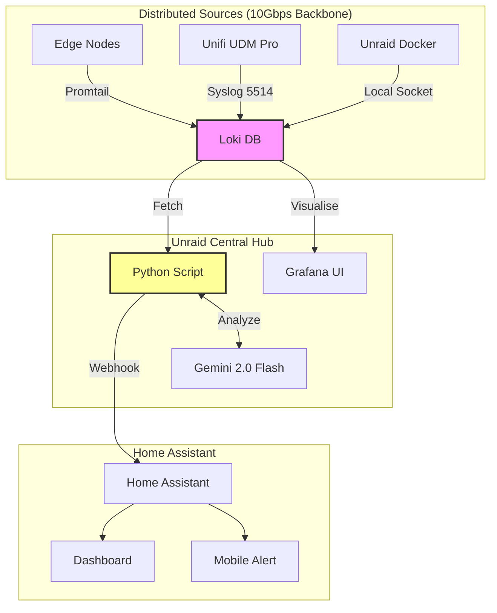

# AI Log Summary: Turning Noise into Insights

**Project Status:** ✅ Operational  
**Components:** Grafana, Loki, Promtail, Google Gemini 2.0 Flash, Home Assistant, Unraid, Python

### 1. The Problem: Log Fatigue
In a distributed homelab (Unraid, Proxmox VE, Edge Servers, DNS, Traefik, UniFi Network), logs are scattered everywhere.

* **Volume:** My servers generate ~1GB of text logs daily.
* **Visibility:** I only looked at logs *after* I noticed something was broken.
* **Noise:** 99% of logs are "Info", masking the 1% "Critical" errors.

I needed a system that wouldn't just *store* logs, but actively *analyze* them and tap me on the shoulder only when it found something I actually needed to see.

### 2. The Solution
I built a centralized logging pipeline using **Grafana** and **Loki** (for storage) and a custom **Python + Gemini** script (for analysis).

Instead of feeding raw logs to an LLM (which is slow and "expensive"), I implemented a **"Pre-processing Engine"** that:

1.  **Fetches** the last 24 hours of history, in 6 hour patches.
2.  **Deduplicates** repetitive errors (e.g., compressing 5,000 "Connection Refused" lines into 1 line).
3.  **Summarizes** the context using Google Gemini 2.0 Flash.
4.  **Reports** actionable findings to my Home Assistant.

<a href="../ai-log-summary/ai-home-assistant-dashboard.mp4" class="glightbox" data-width="100%" data-height="auto">
    <video width="100%" autoplay loop muted playsinline style="cursor: pointer;">
        <source src="../ai-log-summary/ai-home-assistant-dashboard.mp4" type="video/mp4">
    </video>
</a>


### 3. Architecture Diagram



*Logs are aggregated from distributed collectors via Promtail and centralized in a Loki instance on Unraid. This data feeds two parallel consumers: Grafana for visualization and a Python-based automation loop. The Python script queries Loki, processes logs through Google Gemini for anomaly detection, and forwards actionable insights to Home Assistant via Webhooks.*

<br/>

### 4. Key Features
* **Cost Efficient:** Uses client-side deduplication to reduce token usage by ~95%.
* **Massive Context:** Can analyze up to 50,000 log lines per run.
* **Self-Healing:** If the report fails, Home Assistant retains the last known state.
* **Privacy:** Only anonymized/filtered error logs are sent to the AI; raw logs stay local.

***
<!--
### File 2: `02-implementation.md`
*Use this file for the technical setup steps and code.*
-->

<br>
<br>


## Implementation Guide

This guide details how to reproduce the "AI Log SRE" stack.

### Prerequisites
* **Unraid Server** (or any Docker host).
* **Google Gemini API Key** (Free tier is sufficient, Paid recommended for high limits).
* **Home Assistant** (for notifications).

---

### Step 1: Central Server (Unraid)
We run the `loki` database, ` Promtail`, `Grafana`, and the `ai-reporter` script in a single stack. Using Unraid Compose Manager plugin. 

#### Docker Compose

*monitoring-stack.yml*

```yaml
services:

  loki:
    image: grafana/loki:3.1.0
    container_name: loki
    user: "0:0"  # This runs Loki as root to bypass permission issues on Unraid
    volumes:
      - /mnt/docker/appdata/loki:/loki
      - /etc/localtime:/etc/localtime:ro
    command: -config.file=/loki/local-config.yaml
    environment:
      - TZ=Europe/Helsinki
    network_mode: host
    restart: unless-stopped


  promtail:
    image: grafana/promtail:latest
    container_name: promtail
    volumes:
      - /mnt/docker/appdata/promtail/config.yaml:/etc/promtail/config.yaml
      - /var/log:/var/log:ro            # Reads Unraid OS logs
      - /var/run/docker.sock:/var/run/docker.sock # Reads Docker names
      - /etc/localtime:/etc/localtime:ro
    command: -config.file=/etc/promtail/config.yaml
    environment:
      - TZ=Europe/Helsinki
    network_mode: host  # Must be host mode for UDP 5514 listener
    restart: unless-stopped


  grafana:
    image: grafana/grafana:latest
    container_name: grafana
    restart: unless-stopped
    environment:
      - TZ=Europe/Helsinki
    ports:
      - "3000:3000"
    volumes:
      - /mnt/docker/appdata/grafana:/var/lib/grafana
      - /etc/localtime:/etc/localtime:ro
 

  ai-log-reporter:
    image: python:3.11-slim
    container_name: ai-log-reporter
    volumes:
      - /mnt/docker/appdata/ai-reporter:/app
      - /etc/localtime:/etc/localtime:ro
    environment:
      - TZ=Europe/Helsinki
      - LOKI_URL=http://localhost:3100
      - GEMINI_API_KEY=[GEMINI-API-KEY]
      - HA_URL=http://[HA-IP]:8123
      - HA_TOKEN=[HA-LONG-LIVED-TOKEN]
    command: >
      sh -c "pip install requests google-genai && 
      python /app/reporter.py && 
      tail -f /dev/null"
    restart: unless-stopped
    network_mode: host

```

<br>

#### Loki Configuration (local-config.yaml)
*Critical:* The `max_entries_limit_per_query` must be increased to allow the AI to see full history.

Adding this in Unraid terminal:

```bash
nano /mnt/docker/appdata/loki/local-config.yaml
```

```yaml
auth_enabled: false

server:
  http_listen_port: 3100

common:
  instance_addr: 0.0.0.0
  path_prefix: /loki
  storage:
    filesystem:
      chunks_directory: /loki/chunks
      rules_directory: /loki/rules
  replication_factor: 1
  ring:
    kvstore:
      store: inmemory

schema_config:
  configs:
    - from: 2024-04-01
      store: tsdb
      object_store: filesystem
      schema: v13
      index:
        prefix: index_
        period: 24h

# SECTION 1: ENABLE THE CLEANER (COMPACTOR)
compactor:
  working_directory: /loki/boltdb-shipper-compactor
  retention_enabled: true
  delete_request_store: filesystem

limits_config:
  retention_period: 720h # 30days | 720h
  allow_structured_metadata: true

  max_global_streams_per_user: 10000    # Increase from default 5000
  ingestion_rate_strategy: global       # Treat limits across the whole cluster
  max_streams_per_user: 10000           # Increase per-tenant limit

  # --- Rate Limiting (The Fix) ---
  reject_old_samples: true
  reject_old_samples_max_age: 168h
  ingestion_rate_mb: 20
  ingestion_burst_size_mb: 40
  per_stream_rate_limit: 20MB
  per_stream_rate_limit_burst: 40MB

# --- Query Limiting (The Unlock) ---
  max_entries_limit_per_query: 50000  # ALLOWS YOUR SCRIPT TO READ MORE

analytics:
  reporting_enabled: false
```

#### Promtail config on Unraid
The Promtail instance on Unraid has more roles than on the edge nodes, so the config is a bit different. It doesn't just watch local files; it acts as a network gateway for hardware that can't run its own agent (like your UDM-Pro and Proxmox hosts).

* Docker Socket: Directly scrapes all Unraid container logs.
* Syslog Server: Listens on port 5514 for incoming UDP/TCP syslog traffic from UniFi and Proxmox.
* System Logs: Monitors the Unraid OS kernel and array logs.

In Unraid terminal:

```bash
nano /mnt/docker/appdata/promtail/config.yaml
```

```yaml
server:
  http_listen_port: 9080
  grpc_listen_port: 0

positions:
  filename: /tmp/positions.yaml

clients:
  - url: http://localhost:3100/loki/api/v1/push

scrape_configs:
# -----------------------------------------------------------
# 1. LOCAL DOCKER (Unraid) -> job="docker"
# -----------------------------------------------------------
  - job_name: docker
    docker_sd_configs:
      - host: unix:///var/run/docker.sock
        refresh_interval: 5s
    relabel_configs:
      - source_labels: ['__meta_docker_container_name']
        regex: '/(.*)'
        target_label: 'container_name'
      - target_label: 'host'
        replacement: 'unraid'

# -----------------------------------------------------------
# 2. LOCAL SYSLOG (Unraid OS) -> job="syslog"
# -----------------------------------------------------------
  - job_name: system
    static_configs:
      - targets:
          - localhost
        labels:
          job: syslog
          host: unraid
          __path__: /var/log/syslog

# -----------------------------------------------------------
# 3. NETWORK SYSLOG (UniFi & Proxmox) -> job="unifi" / "proxmox"
# -----------------------------------------------------------
  - job_name: syslog-network
    syslog:
      listen_address: 0.0.0.0:5514
      listen_protocol: udp
      idle_timeout: 60s
      label_structured_data: yes
      labels:
        job: syslog_network
    relabel_configs:
      # Map hostname
      - source_labels: ['__syslog_message_hostname']
        target_label: 'host'

      # Role-Based Tagging: UniFi
      - source_labels: ['host']
        regex: '(UDM-Pro|U6-Lite|USW-Flex|Unifi-Dream-Machine)'
        target_label: 'job'
        replacement: 'unifi'

      # Role-Based Tagging: Proxmox
      - source_labels: ['host']
        regex: '(halo|edge)'
        target_label: 'job'
        replacement: 'proxmox'
```


##Step 2: Log Collection on Edge Nodes
On every other server (Proxmox VM Edge, Pi), we run **Promtail** to ship logs to Unraid.

#### Docker Compose

```yaml
networks:
  socket-proxy:
    external: true

services:
  promtail:
    image: grafana/promtail:latest
    container_name: promtail_log_shipper
    command: -config.file=/etc/promtail/config.yml
    volumes:
      - /docker/promtail/config.yml:/etc/promtail/config.yml
      - /var/log:/var/log:ro
    networks:
      - socket-proxy
    restart: unless-stopped
```

#### Promtail Config

```bash
nano /docker/promtail/config.yaml
```

**Promtail Config** (config.yml)
```yaml
server:
  http_listen_port: 9080
  grpc_listen_port: 0

positions:
  filename: /tmp/positions.yaml

clients:
  - url: http://10.0.0.23:3100/loki/api/v1/push

scrape_configs:
  # --- SYSTEM LOGS (Aligned with Unraid) ---
  - job_name: system
    static_configs:
    - targets:
        - localhost
      labels:
        host: [YOUR-HOSTNAME]
        job: syslog
        __path__: /var/log/*.log

  # --- DOCKER LOGS ---
  - job_name: docker
    docker_sd_configs:
      - host: tcp://docker-socket-proxy:2375
        refresh_interval: 5s

    relabel_configs:
      - source_labels: ['__meta_docker_container_name']
        regex: '/(.*)'
        target_label: 'container_name'

      - target_label: 'host'
        replacement: '[YOUR-HOSTNAME]'

      - target_label: 'job'
        replacement: 'docker'

    pipeline_stages:
      - docker: {}
      # ... Keep your existing Socket Proxy and Level Detection stages below ...
      - match:
          selector: '{container_name="docker-socket-proxy"}'
          stages:
            - regex:
                expression: '\s\d+/\d+/\d+/\d+/\d+\s+(?P<status_code>\d{3})\s'
            - template:
                source: level
                template: '{{ if hasPrefix "2" .status_code }}info{{ else if hasPrefix "3" .status_code }}info{{ else if hasPrefix "4" .status_code }}warn{{ else if hasPrefix "5" .status_code }}error{{ else }}unknown{{ end }}'
            - labels:
                level:
      - regex:
          expression: '(?i)(?:level|lvl|severity)=(?P<level>\w+)|\[(?P<level>\w+)\]'
      - labels:
          level:

```

#### Step 3: The Intelligence (Python Script)
This script runs inside the `ai-log-reporter` container.

**Key Logic:**

1. Fetches last 24h of logs (level=error or warn).
2. Uses a defaultdict to count duplicates.
3. Truncates output if > 90k chars.

(See repository for full reporter.py source code)

***

Step 4: Home Assistant Package
The automation that triggers the report and displays it.

```yaml
shell_command:
  generate_ai_log_summary: >
    ssh -i /config/.ssh/id_rsa -o StrictHostKeyChecking=no root@[UNRAID-IP] 'docker exec ai-log-reporter python /app/reporter.py'

automation:
  - alias: "Daily AI System Summary"
    trigger:
      - platform: time
        at: "07:00:00"
      - platform: homeassistant
        event: start
    action:
      - delay: "00:01:00"
      - action: script.run_ai_summary_now
```

***

<!--
### File 3: `03-user-manual.md`
*Use this file to explain how to interpret the results.*
-->

<br>
<br>


## User Manual & Operations

### How to Read the Daily Report
The AI Summary appears in Home Assistant every morning at 07:00.

#### The Iconography
* 🔴 **CRITICAL:** Immediate action required.
    * *Examples:* Database corruption, Disk failure (SMART), Service boot loops.
    * *Action:* Check Grafana immediately.
* 🛡️ **SECURITY:** Passive protection info.
    * *Examples:* "CrowdSec blocked 50 IPs", "Brute force attempt on SSH".
    * *Action:* None (System is doing its job).
* 🟡 **WARNING:** Non-critical noise.
    * *Examples:* Timeouts, configuration deprecation warnings.
    * *Action:* Add to "Technical Debt" to-do list.

### Troubleshooting
**"Report says: No critical errors found."**
* **Good News:** Your system is healthy!
* **Verification:** Check the `ai-log-reporter` container logs to ensure it actually ran and didn't just fail to fetch data.

**"Report is Empty or Unknown"**
* Check Home Assistant logs for `Shell Command` errors.
* Ensure the SSH key in Home Assistant allows connection to Unraid without a password.

### Grafana Deep Dive
When the AI reports a "Critical" error, use Grafana to investigate.

**Recommended LogQL Query:**
To see the raw data the AI analyzed:
```logql
{job=~".+"} != "docker-socket-proxy" |= "error"
```
*shows all logs from the edge host but removes the noisy traefik and crowdsec logs so you can see system issues*

```logql
{host="edge"} != "traefik" != "crowdsec"
```
*shows all logs from the edge host but removes the noisy traefik and crowdsec logs so you can see system issues*

```logql
sum by (container_name) (count_over_time({job="docker"} |= "error" [1m]))
```
*counts the number of errors per container over the last minute*

| Source   | Goal              | Query                                           |
|----------|-------------------|--------------------------------------------------|
| Docker   | See Raw AI Data   | `{job=~".+"} != "docker-socket-proxy"`          |
| Docker   | Filter Noise      | `{host="edge"} != "traefik" != "crowdsec"`      |
| Hardware | Search Unifi Logs | `{job="syslog"}`                                |
| Metrics  | Live Error Count  | `sum(count_over_time({job="docker"}))`          |

