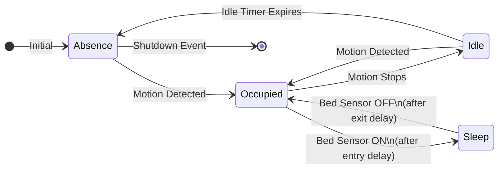

# Area Management & Automation

This article documents the complete Area Management & Automation system, which enables intelligent presence-based control of lights, climate, and other devices throughout the home.

## Overview

The system consists of two main components:

1. **Area Manager** (`area_manager.yaml`) — Dynamically creates and manages area entities via MQTT
2. **Area Logic** (`pyscript/area_logic.py`) — State machine that processes occupancy changes
3. **Area Automations** (`area_automations.yaml`) — Executes actions based on state transitions *(planned)*

---

## Automation Modes

Each area can operate in one of four modes, controlling how the system responds to presence:

| Mode | Description |
|------|-------------|
| `presence-control` | Full automation: responds to all state changes (occupied, idle, absence, sleep) |
| `absence-detection` | Only responds to absence — useful for "turn off when empty" without auto-on |
| `manual-control` | No automatic actions — area state still tracked but no automations fire |
| `schedule-mode` | Actions based on time schedule rather than presence *(future)* |

---

## Mode-Based Filtering

The automation mode controls which state transitions trigger actions:

| Mode | Occupied | Idle | Absence | Sleep |
|------|:--------:|:----:|:-------:|:-----:|
| `presence-control` | ✅ | ✅ | ✅ | ✅ |
| `absence-detection` | ❌ | ❌ | ✅ | ❌ |
| `schedule-mode` | ⏰ | ⏰ | ⏰ | ⏰ |
| `manual-control` | ❌ | ❌ | ❌ | ❌ |

> [!NOTE]
> The `schedule-mode` uses time-based rules instead of presence triggers.

---

## State Machine Flow

When presence is detected, areas transition through the following states:



### State Descriptions

| State | Description | Triggered By |
|-------|-------------|--------------|
| **Occupied** | Active presence detected | Occupancy sensor turns ON |
| **Idle** | No motion but grace period active | Occupancy sensor turns OFF |
| **Absence** | Area confirmed empty | Idle timer expires |
| **Sleep** | Occupant is sleeping | Bed sensor ON + entry delay |
| **DND** | Do Not Disturb (manual override) | User sets manually |

---

## Key Entities

When an area is initialized, the following entities are created via MQTT discovery:

### Configuration Entities

| Entity Pattern | Type | Purpose |
|----------------|------|---------|
| `select.area_{slug}_automation_mode` | Select | Sets the automation mode |
| `select.area_{slug}_occupancy_source` | Select | Physical sensor for presence |
| `select.area_{slug}_bed_sensor` | Select | Physical sensor for sleep detection |
| `switch.area_{slug}_automation` | Switch | Master enable/disable for this area |

### Timer Settings

| Entity Pattern | Type | Default | Purpose |
|----------------|------|---------|---------|
| `number.area_{slug}_presence_idle_time` | Number | 15s | Time before Occupied → Idle |
| `number.area_{slug}_lights_presence_delay` | Number | 120s | Time before Idle → Absence (shutdown) |
| `number.area_{slug}_sleep_entry_delay` | Number | 300s | Time in bed before Sleep state |
| `number.area_{slug}_sleep_exit_delay` | Number | 60s | Time out of bed before leaving Sleep |

### State Entities

| Entity Pattern | Type | Purpose |
|----------------|------|---------|
| `select.area_{slug}_state` | Select | Current area state (Occupied/Idle/Absence/Sleep/DND) |
| `binary_sensor.area_{slug}_occupancy` | Binary Sensor | Computed occupancy (ON when state is not Absence) |
| `sensor.area_{slug}_timer` | Sensor | Countdown timer display |

---

## Events Fired

The system fires events that automations can listen to:

| Event | When Fired | Data |
|-------|------------|------|
| `event_area_{slug}_wakeup` | Area transitions TO "Occupied" | `area: {slug}` |
| `event_area_{slug}_shutdown` | Absence delay timer expires | `area: {slug}` |

### Example Automation Trigger

```yaml
automation:
  - alias: "Office: Turn off lights on shutdown"
    trigger:
      - platform: event
        event_type: event_area_office_shutdown
    action:
      - service: light.turn_off
        target:
          area_id: office
```

---

## Time-Based Actions (Planned)

Area automations will support different actions based on time of day using the [Home Time Modes](../packages/home_time_modes.md) package:

| Time Mode | Typical Use |
|-----------|-------------|
| `Morning` | Bright, energizing lights |
| `Day` | Full brightness, productivity focus |
| `Evening` | Warm, relaxed lighting |
| `Night` | Minimal lighting, sleep-friendly |

### Example Configuration

```yaml
occupied:
  - when: [morning, evening]
    action: turn_on
    scene: cozy
  - when: [day]
    action: turn_on
    scene: bright
  - when: [night]
    action: turn_on
    scene: dim

absence:
  - when: [always]
    action: turn_off
```

---

## Related Documentation

- [Area Manager Package](../packages/area_manager.md) — Technical YAML configuration
- [Home Time Modes](../packages/home_time_modes.md) — Time-of-day scheduling
- [Area Occupancy Sensor](area-occupancy-sensor.md) — Physical presence sensors
