# DNS: The AdGuard Home & Unbound Stack
In this section, we break down the DNS architecture of the Homelab.

The goal is simple: Eliminate reliance on third parties. By coupling AdGuard Home (The Network Shield) with Unbound (The Recursive Resolver), we stop "asking" Google or our ISP for website addresses and start finding them ourselves directly from the global Root Servers.

<br/>


**Key Takeaways**

* What this HIDES: Your full DNS query log from Google, Cloudflare, and your ISP's DNS Server. (Unless Unbound fails to respond for 10 seconds, it will use the Emergency Fallback)

* What this DOES NOT HIDE: Your IP traffic from your ISP. (You would need a VPN for that).

* What this PROTECTS: You are protected from DNS Censorship, DNS Spoofing, and "Typo-Squatting" ads often injected by ISPs.

<br>


## 1. Architecture Overview

### The "Split-Brain" DNS Model

This system relies on a Decoupled Architecture:

1. The Shield (AdGuard Home): Handles request filtering, blocklists, and client management. It acts as the "doorman."

2. The Resolver (Unbound): Handles the actual "phone book" lookup. It talks directly to the global Root Servers, avoiding the use of Google (8.8.8.8) or your ISP's DNS servers for resolution.

### Visual Diagram

```mermaid
flowchart TD
    %% -- Subgraph: The Network Clients --
    subgraph LAN ["🏠 Home Network (VLANs)"]
        Client1[("📱 Phone / PC")]
        Client2[("📺 IoT / TV")]
    end

    %% -- Subgraph: The Router --
    subgraph Router ["UniFi Dream Machine (UDM Pro)"]
        DHCP[(" DHCP Server ")]
    end

    %% -- Subgraph: High Availability Cluster --
    subgraph DNS_Cluster ["⚡ DNS High Availability Cluster"]
        direction TB
        
        subgraph Node1 ["Raspberry Pi 63 (Primary)"]
            AGH1["🛡️ AdGuard Home (:53)"]
            Unbound1["🧠 Unbound (:5335)"]
            AGH1 -->|Recursive Query| Unbound1
        end

        subgraph Node2 ["Raspberry Pi 62 (Secondary)"]
            AGH2["🛡️ AdGuard Home (:53)"]
            Unbound2["🧠 Unbound (:5335)"]
            AGH2 -->|Recursive Query| Unbound2
        end
    end

    %% -- Subgraph: The Internet --
    subgraph Internet ["🌍 The Internet"]
        RootServers["ROOT Servers <br> (ICANN / Verisign)"]
        Quad9["🚑 Public Servers <br> (Emergency Fallback)"]
    end

    %% -- Connections --
    %% 1. DHCP Assignment
    DHCP -- "Assigns DNS 1: Pi 63 <br> Assigns DNS 2: Pi 62" --> LAN

    %% 2. Client Requests (Load Balanced by Client OS)
    LAN -- "DNS Query (Primary)" --> AGH1
    LAN -- "DNS Query (Backup)" --> AGH2

    %% 3. Unbound Recursive Lookup (Privacy Path)
    Unbound1 -- "Direct Recursive Lookup <br> (No Middleman)" --> RootServers
    Unbound2 -- "Direct Recursive Lookup <br> (No Middleman)" --> RootServers

    %% 4. The Safety Net (Fail-Safe) - FIXED QUOTES BELOW
    AGH1 -.->|"Timeout > Safety Net"| Quad9
    AGH2 -.->|"Timeout > Safety Net"| Quad9

    %% Styling
    
    style DNS_Cluster fill:#2deb49,stroke:#01579b,stroke-width:2px
    style Node1 fill:#111111,stroke:#01579b,stroke-width:2px
    style Node2 fill:#111111,stroke:#01579b,stroke-width:2px
    style Quad9 fill:#610c06,stroke:#b71c1c,stroke-dasharray: 5 5
    style RootServers fill:#066114,stroke:#2e7d32
```


<br/>
<br/>

## 2. Component Breakdown

### A. The Hardware Level (High Availability)

We utilize **two physical Raspberry Pis** (10.0.0.63 and 10.0.0.62).

* Why: If one Pi crashes, updates, or needs a reboot, the internet does not stop.

* Distribution: The UniFi UDM Pro is configured via DHCP to hand out both IP addresses to every device on the network.

* Client Logic: Modern devices automatically failover to the second IP if the first one doesn't answer (~1000ms), ensuring seamless uptime.

### B. The Software Stack
Each Pi runs an identical Docker stack:

**1. AdGuard Home (The Frontend)**

* Role: Blocks Ads, Trackers, and Malware.

* Load Balancing: Functionally sends 100% of traffic to the local Unbound container (via "Load Balance" mode).

* Safety Net: Configured with an Emergency Fallback (9.9.9.9) that activates only if Unbound fails to respond for 10 seconds.

**2. Unbound (The Backend)**

* Role: Recursive Resolver.

* Privacy: It bypasses Centralized DNS Loggers (like Google or Cloudflare). No single company creates a profile of your DNS history.

* Nuance: Your ISP can still see the destination IPs and SNI (Server Name Indication) of sites you visit, but they cannot manipulate or spoof your DNS results.

* Security: Handles DNSSEC validation locally. If a site signature is fake, Unbound returns SERVFAIL before AdGuard even sees the IP.

### C. The "Boot-Loop" Protection (NTP)

* **Problem:** Pis lack an RTC battery. If they reboot without internet, they revert to 1970, breaking DNSSEC validation (deadlock).

* **Solution:** Chrony is configured to use Raw IP Addresses (Google/Cloudflare NTP) instead of hostnames. This ensures the Pi gets the correct time immediately at boot, allowing Unbound to start securely.

<br/>
<br/>

## Preparing the Ubuntu Server

If you just try to start the Adguard docker container you will probably run in to few problems:


!!! warning
    Failed to bind port 0.0.0.0:53/tcp: Error starting userland proxy: listen tcp4 0.0.0.0:53: bind: address already in use

!!! danger
    DNS Port 53 being already in use. This is because the operating system has it reserved.

**Edit etc/systemd/resolved.conf**
```bash
sudo nano /etc/systemd/resolved.conf

# Uncomment DNSStubListener and set it to no
DNSStubListener=no
```
Press CTRL + x and then press y to save the changes

```bash
sudo ln -sf /run/systemd/resolve/stub-resolv.conf /etc/resolv.conf
sudo systemctl restart systemd-resolved
```

## Prepare Docker Directories

!!! warning
    Make sure the directory mapped to /opt/adguardhome/work\ has rights 0700 | Otherwise your settings are not stored, and when restarted you need to reconfigure.

```bash
cd ..
cd docker
sudo mkdir adguard

sudo mkdir adguard/conf
sudo mkdir adguard/work

#sudo touch adguard/confdir/AdGuardHome.yaml
sudo chmod -R 0700 adguard/work
sudo chmod -R 0700 adguard/conf

sudo chown -R evis:docker adguard/work
sudo chown -R evis:docker adguard/conf
```

<br/>
<br/>

## Prepare Docker Networks (in Portainer)

Create the Networks in Portainer

* dns_net | will used to put Adguard Home and Unbound DNS server to same network so they can connect. When Adguard is using Unbound as the DNS server.
* proxy | this can be used with Traefik Reverse Proxy (if using Traefik)

**dns_net Network**


<br/>
<br/>


## Prepare Unbound Configuration

```bash
sudo nano /docker/unbound/unbound.conf
```


```bash
server:
    ###########################################################################
    # BASIC SETTINGS
    ###########################################################################
    # Standard Port 53 (Mapped to 5053 via Docker Compose)
    interface: 0.0.0.0@53
    port: 53

    # Protocol Support
    do-ip4: yes
    do-ip6: yes
    do-tcp: yes
    do-udp: yes
    prefer-ip6: no

    # Optimization
    edns-buffer-size: 1232
    rrset-roundrobin: yes
    username: "_unbound"

    # Directory
    directory: "/opt/unbound/etc/unbound"
    cache-max-ttl: 86400
    cache-min-ttl: 300

    ###########################################################################
    # LOGGING (Promtail Ready)
    ###########################################################################
    # Disable internal file logging -> Send to Stdout for Docker/Promtail
    log-local-actions: no
    log-queries: no
    log-replies: no
    log-servfail: no

    logfile: ""        # Force stdout
    use-syslog: no
    verbosity: 2       # Level 2 gives us the stats we need for Grafana

    ###########################################################################
    # PERFORMANCE (Tuned for 8GB Raspberry Pi)
    ###########################################################################
    # Use all 4 cores
    num-threads: 4

    # Slabs (Must be power of 2)
    infra-cache-slabs: 4
    key-cache-slabs: 4
    msg-cache-slabs: 4
    rrset-cache-slabs: 4

    # Cache Sizes (High Performance - Uses ~2GB RAM total)
    msg-cache-size: 256m
    rrset-cache-size: 512m

    # TCP & Queries
    outgoing-range: 8192
    num-queries-per-thread: 4096
    incoming-num-tcp: 10

    # Speed Tweaks
    minimal-responses: yes
    prefetch: yes
    prefetch-key: yes
    serve-expired: yes
    so-reuseport: yes

    ###########################################################################
    # SECURITY & PRIVACY
    ###########################################################################
    # Access Control (Allow Local Network)
    access-control: 127.0.0.1/32 allow
    access-control: 192.168.0.0/16 allow
    access-control: 172.16.0.0/12 allow
    access-control: 10.0.0.0/8 allow
    access-control: fc00::/7 allow
    access-control: ::1/128 allow

    # Privacy
    hide-identity: yes
    hide-version: yes
    identity: "DNS"
    http-user-agent: "DNS"
    qname-minimisation: yes
    aggressive-nsec: yes

    # Hardening
    harden-algo-downgrade: yes
    harden-below-nxdomain: yes
    harden-dnssec-stripped: yes
    harden-glue: yes
    harden-large-queries: yes
    harden-short-bufsize: yes
    use-caps-for-id: yes

    # Private Addresses (Rebinding Protection)
    private-address: 10.0.0.0/8
    private-address: 172.16.0.0/12
    private-address: 192.168.0.0/16
    private-address: 169.254.0.0/16
    private-address: fd00::/8
    private-address: fe80::/10

    # Certificates
    tls-cert-bundle: /etc/ssl/certs/ca-certificates.crt

    ###########################################################################
    # INCLUDES
    ###########################################################################
    # Only include custom conf files if you create them manually
    #include: "*.conf"

    domain-insecure: "valoo.fi"

remote-control:
    control-enable: no


# Forward Zone for Valoo (Bypass local validation)
forward-zone:
    name: "valoo.fi"
    forward-dnssec: no
    forward-addr: 9.9.9.9
    forward-addr: 1.1.1.1

```

<br/>
<br/>

## Unbound Portainer Stack

```yaml
## NETWORKS ##
networks:
  ## dns_net network between Adguard Home and Unbound
  dns_net:
    external:
      name: dns_net
    driver: bridge # Using bridge driver for possible VPN solution
    ipam:
      config:
        - subnet: 172.23.0.0/16


## SERVICES ##
services:

  unbound:
    container_name: unbound
    image: mvance/unbound-rpi:latest # Raspberry Pi version
    #image: mvance/unbound:latest # Non ARM version
    networks:
      dns_net:
        ipv4_address: 172.23.0.8
    environment:
      - TZ=Europe/Helsinki
    volumes:
      - /docker/unbound:/opt/unbound/etc/unbound
    ports:
      - 5053:53/tcp
      - 5053:53/udp
    healthcheck:
      test: ["NONE"]
    restart: unless-stopped
```


<br/>
<br/>


## Adguard Portainer Stack

```yaml
networks:
  dns_net:
    name: dns_net
    external: true
    driver: bridge
    ipam:
        config:
        - subnet: 172.23.0.0/16
  proxy:
    external: true


services:

  adguardhome:
    image: adguard/adguardhome
    container_name: adguard-home
    security_opt:
      - no-new-privileges:true
    networks:
      dns_net:
        ipv4_address: 172.23.0.7
      proxy:
    ports:
      # DNScrypt:
      - 5443:5443/udp
      - 5443:5443/tcp
      # DNS-over-QUIC:
      - 8853:8853/udp
      - 853:853/udp
      - 784:784/udp
      # DNS-over-TLS
      - 853:853/tcp
      # Home Admin Panel & HTTPS/DNS-over-HTTPS:
      - 3000:3000/tcp
      - 443:443/udp
      #- 443:443/tcp
      - 8080:8080/tcp
      # DHCP server:
      #- 68:68/udp
      #- 67:67/udp
      # Plain DNS:
      - 53:53/udp
      - 53:53/tcp
    environment:
      - TZ=Europe/Helsinki
    restart: always
    volumes:
      - /docker/adguard/conf:/opt/adguardhome/conf
      - /docker/adguard/work:/opt/adguardhome/work

```
<br/>
<br/>

## AdGuard Home settings

### DNS Settings


| Feature                | Setting                                           | Status / Comment |
|------------------------|---------------------------------------------------|------------------|
| **Upstream DNS Servers**              |                                          |  |
| <br/>              |                                          |  |
| Upstream DNS Servers   | [/10.in-addr.arpa/]10.0.0.1<br> unbound:53        | Rule: force local names to Router. <br> Everything else to Unbound. |
| Upstream Mode          | Load Balancing                                    | Using Load-balancing instead of "Parallel requests." Parallel requests would be useless with a single Unbound instance. Functionally is zero right now.
| Fallback DNS servers   | https://dns.quad9.net/dns-query <br> https://dns.google/dns-query    | Encrypted (DoH) safety net. If Unbound dies, these keep internet alive if Unbound crashes. Unbound times out, AdGuard immediately routes traffic to public DNS servers |
| Bootstrap DNS          | 127.0.0.11 <br> 9.9.9.9 <br> 1.1.1.1 <br> 8.8.8.8 | Configuration Safety. Essential for startup connectivity. With current setup only 127.0.0.11 is used for local Docker container lookups |
| Private DNS Servers        | 10.0.0.1                                      | Pointing to Router (UDM Pro). AdGuard explicitly asks the UDM Pro for local lookups |
| Use Private DNS Resolvers  | ✅ Checked                                    | Crucial. Tells AdGuard to actually use the Router (UDM Pro) IP above for the lookups. |
| Enable Reverse Resolving of clients' IP addresses| ✅ Checked                                  | Allows you to see names in logs (from UDM Pro). |
| Upstream timeout       | 10                                            | Crucial for Unbound. Recursive lookups take longer (walking the chain from Root servers). 10s prevents AdGuard from giving up prematurely on "cold" queries. |
|  <br/>                  |                                                      |  |
|  **DNS Sserver configuration**              |                                          |  |
| | <br/>                 |                                                    |
| Rate Limit             | 0                                                 | Crucial. Unchecks the “limit” to prevent lag on heavy sites. |
| Enable DNSSEC          | ❌ Unchecked                                      | DNSSEC is handled by Unbound. Prevents packet fragmentation errors. |
| EDNS Client Subnet     | ❌ Unchecked                                      | Prevents “buffer size” errors. |
| Disable resolving of IPv6 addresses           | ✅ Check this box                                 | (Missed in Screenshot) Forces IPv4 for snappier browsing. |
| Blocking Mode          | Null IP                                         | Returns 0.0.0.0 for ads (Safest method). |
|  <br/>                  |                                                      |  |
|  **DNS cache configuration**              |                                          |  |
| | <br/>                |                                                    |
| Enable Cache           | ✅ Enabled                                        | Enabled for speed. |
| Cache size             | 10000000                                       | Set size to 10MB for speed. |
| Override minimum TTL   | 300                                              | Tells AdGuard: "If a site says 'Ask me again in 30 seconds', ignore it and remember the answer for 5 minutes." This drastically quiets down your network traffic. |
| Override maximum TTL   | 86400                                              | (86400s = 1 day) Refreshes data every day. |
| Optimistic Cache       | ❌ Disabled                                       | Ensures data freshness. |

<br/>
<br/>

## Unifi Network DNS Configurations

!!! info
    When changing DNS servers remember to check the following settings from Unifi Network Settings

!!! Success
    Network DHCP clients should use the router (UDM) as the DNS server and then the below settings are applied in all cases.

#### Differences between the DNS settings

* Internet - DNS server(s) that UDM or other gateway reaches out to for DNS results
* Network - DNS server(s) that the DHCP server hands out to the clients on that network
* IP Group - DNS server(s) used in the firewall rules

### Unifi Internet DNS

!!! info
    Internet DNS is used for all outbound traffic


### Unifi Network DNS

!!! info
    Network DNS is used for all DHCP clients on the network

!!! warning
    Only LAN network is using the Local DNS server, other networks like IoT and Company network are using public networks to avoid any blocking. Using AdGuard with some IoT devices like TV has created outage on some streaming applications e.g. Viaplay.


### Unifi IP Group DNS
!!! info
    IP Group DNS is used for all firewall rules

!!! warning
    IP Group DNS is not used for DHCP clients on the network


<br/>
<br/>


## Performance

Because Unbound does the heavy lifting of traversing the DNS tree itself (instead of offloading it to a giant like Google), the performance metrics look different than a standard ISP setup.

| Metric | Target Value | Comment |
| --- | --- | --- |
| Average Processing Time | ~40–60 ms | This is the "Privacy Tax." It is slightly higher than using Cloudflare directly (20ms), but it means you own the data. |
| Cache Hit Speed | < 1 ms | Once a site is visited, AdGuard/Unbound serves it instantly from RAM. |
| Cold Lookup (New Site) | 100–200 ms | The first time you visit a rare site, Unbound must query the Root Servers. This happens once, then it is cached. |

<br/>
<br/>

## Troubleshooting & Testing

### The "Client Name" Test
We ran this command to confirm the UDM Pro was correctly resolving local names:

```bash
dig -x 10.0.0.189 @10.0.0.63

```

### Domain fails

Check that the domain actually exists:

```bash
nslookup oma.valoo.fi 8.8.8.8
```

If it does exist, you can add it to the **unbound.conf** on all DNS servers.

Edit **unbound.conf** on all DNS servers
```bash
sudo nano /docker/unbound/unbound.conf
```

add to the bottom of the **server:** block

```yaml
server:
    # ... other settings ...
    domain-insecure: "valoo.fi"


# add to the bottom of the file
forward-zone:
    name: "valoo.fi."
    forward-addr: 8.8.8.8
    forward-addr: 1.1.1.1
```

Restart Unbound:
```bash
docker restart unbound
```

Test with:
```bash
docker exec -it adguard-home nslookup oma.valoo.fi 127.0.0.1
```