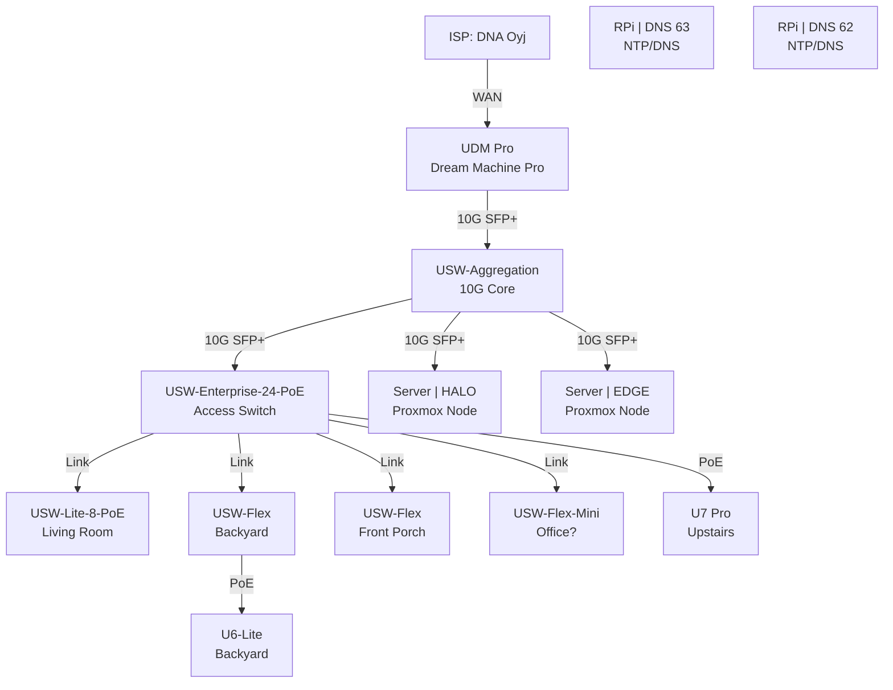

---
tags:
  - homelab
  - network
  - manual
---

# Network Topology

This page documents the physical and logical layout of the EvisHomeLab network.

## 1. Physical Topology

The core network is built on Ubiquiti UniFi gear, interconnected via 10Gbps SFP+ DACs and fiber where possible.

### Network Map

> [!INFO]
> **Visualization:** This diagram represents the physical cabling hierarchy.

### Device Hierachy

| Tier | Device | Role | Connection |
| :--- | :--- | :--- | :--- |
| **Core** | **UDM Pro** | Gateway / Router | WAN (ISP) |
| **Core** | **USW-Aggregation** | Layer 2 Aggregation | 10G SFP+ to UDM |
| **Access** | **USW-Enterprise-24-PoE** | Main Switch | 10G SFP+ to Agg |
| **Edge** | **USW-Lite-8-PoE** | Living Room Media | Uplink to Ent |
| **Edge** | **USW-Flex (Backyard)** | Outdoor PoE | Uplink to Ent |
| **Edge** | **USW-Flex (Front Porch)** | Outdoor PoE | Uplink to Ent |
| **Edge** | **USW-Flex-Mini** | Desktop/Misc | Uplink to Ent |

---

## 2. Logical Topology (VLANs)

*Defined network segments for isolation and security.*

| VLAN ID | Subnet | Name | Purpose |
| :--- | :--- | :--- | :--- |
| **1** | `10.0.1.0/24` | **Management** | Network Gear & Core Infra |
| **TBD** | `TBD` | **IoT** | Untrusted Smart Devices |
| **TBD** | `TBD` | **Servers** | Proxmox, NAS, Docker |
| **TBD** | `TBD` | **Users** | Trusted Phones/Laptops |
| **TBD** | `TBD` | **Guest** | Visitors (Client Isolation) |

> [!WARNING]
> VLAN IDs and Subnets need to be verified against the UDM Pro configuration.

---

## 3. Addressing

### Key Gateways
*   **UDM Pro:** `10.0.1.1` (Default Gateway)
*   **DNS 1 (Pi-hole/AdGuard):** `10.0.x.63`
*   **DNS 2 (Pi-hole/AdGuard):** `10.0.x.62`
