---
tags:
  - homelab
  - services
  - manual
---

# Service Architecture

This page maps the abstract "Software" layer to the physical "Hardware" layer. It answers the question: *"Where is this service actually running?"*

## 1. Hierarchy Visualization

The Homelab service stack follows this nesting structure: `Cluster -> Node -> Virtualization (VM/LXC) -> Application`.

```mermaid
graph TD
    classDef phy fill:#2a2a2a,stroke:#333,stroke-width:2px;
    classDef vm fill:#1f425f,stroke:#333,stroke-width:1px;
    classDef svc fill:#1a5c20,stroke:#333,stroke-width:1px;

    subgraph Proxmox_Cluster [Proxmox Cluster]
        
        subgraph Node_HALO [Node: HALO]
            VM_H1[VM: Home Assistant]:::vm
            LXC_H1[LXC: Tailscale VPN]:::vm
            VM_H1 --> SVC_HA(Home Assistant Core):::svc
            LXC_H1 --> SVC_TS(Tailscale):::svc
        end

        subgraph Node_EDGE [Node: EDGE]
            VM_E1[VM: Docker Host]:::vm
            VM_E1 --> CNT_Plex(Container: Plex):::svc
            VM_E1 --> CNT_Arr(Container: Arr Stack):::svc
        end
    end
    
    subgraph Raspberries
        Pi_63[RPi: DNS 63]
        Pi_63 --> SVC_DNS1(AdGuard/PiHole):::svc
    end

    class Node_HALO,Node_EDGE,Pi_63 phy
```

---

## 2. Service Catalog

A directory of all major self-hosted services.

### Infrastructure Services
| Service | Type | Host Node | URL / Port | Description |
| :--- | :--- | :--- | :--- | :--- |
| **Proxmox Virtual Environment** | OS | HALO / EDGE | `https://10.0.x.x:8006` | Hypervisor management interface. |
| **Tailscale** | LXC | HALO | - | Mesh VPN for remote access. |
| **MQTT Broker** | Add-on | HA VM | `1883` | Zigbee2MQTT communication. |

### Media & Entertainment
| Service | Type | Host Node | URL / Port | Description |
| :--- | :--- | :--- | :--- | :--- |
| **Plex** | Docker | EDGE | `32400` | Media Server. |
| **Arr Stack** | Docker | EDGE | Various | Media acquisition automation. |

### Smart Home
| Service | Type | Host Node | URL / Port | Description |
| :--- | :--- | :--- | :--- | :--- |
| **Home Assistant** | VM | HALO | `https://ha.evishome.com` | Main automation controller. |
| **Zigbee2MQTT** | Add-on | HA VM | `8080` | Zigbee bridge. |

---

## 3. Notes
*   **Backups:** All VMs are backed up nightly to `[NAS Location]`.
*   **Updates:** Docker containers are managed via `[Portainer/Watchtower/Manual]`.
