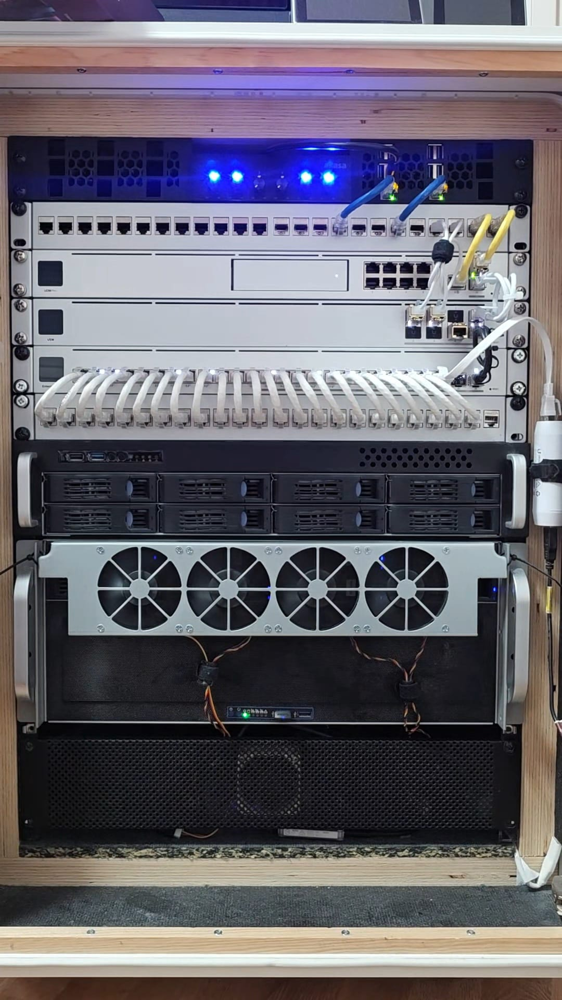

    

        {# {{ hero_overlay("Virtual Fireplace", "Featured Project", "articles/virtual-fireplace/") }} #}
        <video autoplay loop muted playsinline style="cursor: default;">
            <source src="assets/images/intro-1080-2000.mp4" type="video/mp4">
        </video>
    

    <a href="articles/" class="content-card">
        <h3>Articles</h3>
        
Collection of articles and guides.

    </a>
    <a href="home-lab/" class="content-card">
        <h3>Home Lab</h3>
        
Networking, Server Infrastructure, VMs, and containers.

    </a>
    <a href="smart-home/" class="content-card">
        <h3>Smart Home</h3>
        
Home Assistant configuration, automations, and dashboards.

    </a>
    <a href="tags/" class="content-card">
        <h3>Tags</h3>
        
Browse the content by tags.

    </a>

## Featured

    <a href="workflow/" class="feature-card">
        Documentation
        <h4>Architecture & Workflow</h4>
        
See how the Home Assistant documentation is managed via an Agentic Documentation Workflow.

    </a>
    <a href="smart-home/dashboards/" class="feature-card">
        Home Assistant
        <h4>Dashboards</h4>
        
Check the dashboards for the Home Assistant

    </a>
    <a href="smart-home/packages" class="feature-card">
        Home Assistant
        <h4>Automations</h4>
        
Deep dive into the Home Assistant automations and dashboards.

    </a>

## The Lab

    
    <a href="articles/articles/the-rack/the-rack.mp4" class="glightbox" data-width="100%" data-height="auto">
        <video width="100%" autoplay loop muted playsinline style="cursor: pointer;">
            <source src="articles/articles/the-rack/the-rack.mp4" type="video/mp4">
        </video>
    </a>
    
    
    
    

## About Me

I've had a passion for home automation, DIY, self-hosting for a while now. I'm a big fan of Home Assistant and have been using it for since 2019-2020. I have documented my journey on various platforms, but I've always wanted to have a single place to keep everything in one place. Now with the help of Google Antigravity and the MkDocs Material theme, I've been able to create a single place to keep everything in one place. And the speed of creating everything into this site has been just amazing. Withing just few weekends I was able to create this site automate the documentation process convert some of my older articles and make them into markdown files and add them to the site.

My Smart Home journey started along time ago I think somewhere around 2005with having too many remote controllers for my home theater system. I started with a basic setup using a Raspberry Pi and a few scripts to control the system. Over time, I added more and more features, such as voice control, scene management, and more.

Before I moved to Home Assistant I used SmartThings with Webcore, SmartApps and Device Handlers (DTHs), which ran in the Groovy IDE. For some years I was using this setup, with a lot of custom code and a lot of time spent on debugging and just maintaining the system.

Ever since I fully moved to Home Assistant things have been much easier and I've been able to focus on actual home automation, and making things smarter.

