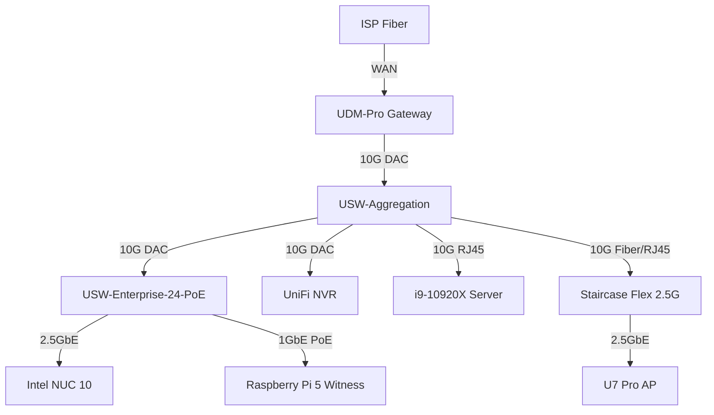

# Welcome to EvisHomeLab

```mermaid
graph TD
    %% Nodes
    ISP[ISP Fiber]
    UDM[UDM-Pro Gateway]
    AGG[USW-Aggregation]
    ENT[USW-Enterprise-24-PoE]
    UNVR[UniFi NVR]
    SERVER[i9-10920X Server]
    NUC[Intel NUC 10]
    PI[Raspberry Pi 5 Witness]
    
    %% Links
    ISP -->|WAN| UDM
    UDM -->|10G DAC| AGG
    AGG -->|10G DAC| ENT
    AGG -->|10G DAC| UNVR
    AGG -->|10G RJ45| SERVER
    
    ENT -->|2.5GbE| NUC
    ENT -->|1GbE PoE| PI
    
    %% Staircase Link
    AGG -->|10G Fiber/RJ45| STAIR[Staircase Flex 2.5G]
    STAIR -->|2.5GbE| U7[U7 Pro AP]
```

# 🏢 Office Rack Equipment

Here is everything physically located in the main rack.


### {{ device.name }}
- **Type:** {{ device.type }}
- **Model:** {{ device.model }}
- **IP:** {{ device.ip }}
---

