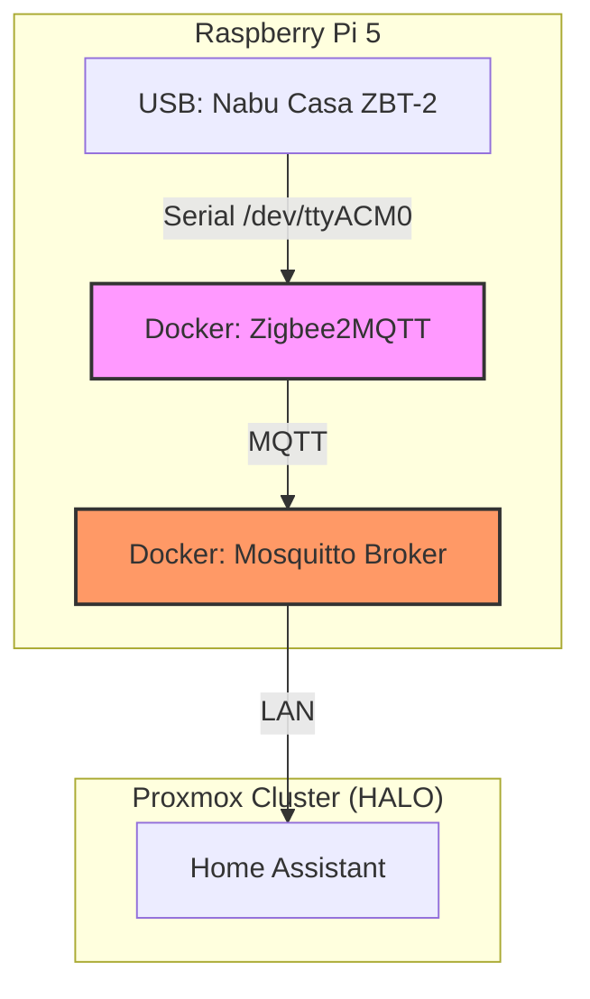

---
tags:
  - zigbee
  - mqtt
  - infrastructure
  - manual
  - network
version: 1.0.0
---

# Zigbee & MQTT

## System Documentation

**Version:** 1.1.0 (Combined Stack)
**Source:** External Raspberry Pi 5 (Portainer Stack)
**Description:** Documentation of the external Zigbee2MQTT and Mosquitto instances running on a dedicated Raspberry Pi 5.

## Executive Summary

This document covers the entire **Zigbee & MQTT Infrastructure** stack.

*   **Zigbee2MQTT (Z2M):** The bridge between Zigbee devices and the MQTT broker.
*   **Mosquitto:** The central Message Broker that handles communication between Z2M, Home Assistant, and other devices.

Both services run externally on a **Raspberry Pi 5** (`10.0.0.10`) to ensure stability and decouple the critical mesh network from the main Home Assistant host (HALO).

*   **Host:** Raspberry Pi 5
*   **Coordinator:** Nabu Casa ZBT-2 (SkyConnect)
*   **Management:** Portainer (Docker Compose)

## Architecture



## Infrastructure Configuration (Portainer Stack)

The system runs as a Docker Compose stack managed via Portainer.

```yaml
services:
  mqtt:
    image: eclipse-mosquitto:latest
    container_name: mosquitto
    restart: unless-stopped
    ports:
      - 1883:1883 # MQTT Port
      - 9001:9001 # Websocket
    volumes:
      - /docker/mosquitto/config:/mosquitto/config
      - /docker/mosquitto/data:/mosquitto/data
      - /docker/mosquitto/log:/mosquitto/log

  zigbee2mqtt:
    container_name: zigbee2mqtt
    image: koenkk/zigbee2mqtt
    restart: unless-stopped
    network_mode: host
    depends_on:
      - mqtt
    volumes:
      - /docker/zigbee2mqtt/data:/app/data
      - /run/udev:/run/udev:ro
    environment:
      - TZ=Europe/Helsinki
    devices:
      # Nabu Casa ZBT-2 mapped to ttyACM0
      - /dev/serial/by-id/usb-Nabu_Casa_ZBT-2_DCB4D90BC65C-if00:/dev/ttyACM0
```

## Mosquitto Broker Configuration

The **Mosquitto** broker handles all MQTT traffic.

### Configuration (`mosquitto.conf`)

Located at `/docker/mosquitto/config/mosquitto.conf`.

```properties
log_dest file /mosquitto/log/mosquitto.log

# Listen on all interfaces (Port 1883)
listener 1883

# Security: Disable anonymous access
allow_anonymous false

# Authentication: Password file source
password_file /mosquitto/config/passwd
```

### File Permissions (Critical)

Mosquitto runs as a non-root user (UID 1883) inside the container. You **must** ensure the host folders have the correct permissions, otherwise the container will fail to start or save data.

```bash
# Run these commands on the Raspberry Pi
sudo chown -R 1883:1883 /docker/mosquitto
sudo chmod 0700 /docker/mosquitto/config/passwd
```

## Zigbee2MQTT Configuration

The internal configuration (`configuration.yaml`) defines the network parameters and device mappings.

```yaml
version: 4
mqtt:
  base_topic: zigbee2mqtt
  server: mqtt://10.0.0.10:1883
  user: homeassistant
  password: "!secret mqtt_password" # [REDACTED]
serial:
  port: /dev/ttyACM0
  adapter: ember
  baudrate: 460800
  rtscts: true
advanced:
  log_level: info
  log_output:
    - console
    - file
  channel: 15
  network_key: "!secret network_key" # [REDACTED]
  pan_id: "!secret pan_id" # [REDACTED]
  ext_pan_id: "!secret ext_pan_id" # [REDACTED]
frontend:
  enabled: true
  port: 8089
  network_map: true
homeassistant:
  enabled: true
  legacy_action_sensor: true
  legacy_triggers: true
  legacy_entity_attributes: true
onboarding: false
device_defaults:
  hue_dimmer_defaults:
    force_update: false
    availability: false
    legacy: true
  hue_tap_dial_defaults:
    debounce: 0
    legacy: false
    force_update: false
    availability: false
  hue_motion_sensors:
    occupancy_timeout: 15
    debounce: 0
    force_update: false
    availability: false
  smartthings_multi_sensors:
    debounce: 0
    force_update: false
    availability: false

# ------------------------------------------------------------------------------
# DEVICES (User Friendly Names)
# ------------------------------------------------------------------------------
devices:
  '0x001788010dd176b5':
    friendly_name: Bedroom Wall Tap Dial Switch
    debounce: 0
    legacy: false
    force_update: false
    availability: false
  '0x001788010d7c32e3':
    friendly_name: Bedroom Tap Dial Switch
    debounce: 0
    legacy: false
    force_update: false
    availability: false
  '0x0017880103f64f9f':
    friendly_name: Office Desk Wall Light
  '0x0017880101214941':
    friendly_name: Bedroom Bed Light
  '0x54ef4410006b9cc0':
    friendly_name: Bedroom Window Roller Cover
  '0x001788010947ba24':
    friendly_name: Server Cabinet Light
  '0xec1bbdfffe91efea':
    friendly_name: Guest-3 Window Light
  '0x54ef4410010f4051':
    friendly_name: Bathroom Wall Box Switch
  '0x842e14fffe117029':
    friendly_name: Bathroom Lightstrip
  '0x54ef44100117c6c2':
    friendly_name: Toilet Wall Box Switch
  '0x00158d0002583e5c':
    friendly_name: Guest Room Ceiling Light
  '0x54ef4410011614ab':
    friendly_name: Kitchen Wall Box Switch
  '0x0017880103f65665':
    friendly_name: Kitchen Sink Light
  '0x00178801048c6c3c':
    friendly_name: Floor Light
  '0x0017880110487624':
    friendly_name: Hallway Wall Dimmer Switch
    force_update: false
    availability: false
    legacy: true
  '0x286d970001081c3f':
    friendly_name: Hallway Closet Door Right
  '0x0017880109183abe':
    friendly_name: Living Room Cabinet Motion
    occupancy_timeout: 15
    debounce: 0
    force_update: false
    availability: false
  '0x286d97000107df11':
    friendly_name: 0x286d97000107df11-OLD
    debounce: 0
    force_update: false
    availability: false
  '0xf0d1b800001dab89':
    friendly_name: Front Door Rail Light
  '0x7cb03eaa00af33c9':
    friendly_name: Backyard Plug
  '0x001788010d7d741d':
    friendly_name: Living Room Tap Dial Switch
    debounce: 0
    legacy: false
    force_update: false
    availability: false
  '0x0017880103cd7947':
    friendly_name: Living Room Ceiling Light
  '0x24fd5b00010cdc13':
    friendly_name: Washing Machine Plug
  '0x0000000000000000':
    friendly_name: '0x0000000000000000'
  '0x0017880104f69f58':
    friendly_name: Bedroom Window Dimmer Switch
    force_update: false
    availability: false
    legacy: true
  '0x54ef441001354aa4':
    friendly_name: Aqara W500
    debounce: 10
    throttle: 30
    debounce_ignore:
      - linkquality
  '0x54ef44100132b23e':
    friendly_name: Hallway Ceiling Light 2
  '0x54ef44100132ac5a':
    friendly_name: Hallway Ceiling Light 1
  '0x54ef4410012cd400':
    friendly_name: Mud Room Motion Sensor
  '0x00158d008bbf811e':
    friendly_name: Kitchen Fridge Door
  '0x00158d008bbf8141':
    friendly_name: Backyard Door Sensor
  '0x54ef4410012e91a8':
    friendly_name: Guest-3 Ceiling Light 2
  '0x54ef4410012e903a':
    friendly_name: Guest-3 Ceiling Light 1
  '0x0017880104917d81':
    friendly_name: Guest-3 Desk Light
  '0x00178801060654e9':
    friendly_name: Office Button
  '0x00158d008b8af842':
    friendly_name: Kitchen Dishwasher Leak Sensor
  '0x00158d008b8af68d':
    friendly_name: Kitchen Fridge Leak Sensor
  '0x54ef4410012e8a41':
    friendly_name: Mud Room Ceiling Light
  '0x00158d008b77be19':
    friendly_name: Inner Back Door
  '0x54ef4410012e7e4f':
    friendly_name: Lobby Ceiling Light
  '0x286d97000107cc77':
    friendly_name: '0x286d97000107cc77'
  '0x001788010634d1fb':
    friendly_name: Guest-2 Wall Dimmer Switch
    force_update: false
    availability: false
    legacy: true
  '0x286d9700011129d5':
    friendly_name: '0x286d9700011129d5'
  '0x00158d008b8af697':
    friendly_name: '0x00158d008b8af697'
  '0x00158d008b77bdff':
    friendly_name: Mud Room Door Sensor
  '0x54ef4410011ebbe7':
    friendly_name: Bedroom Ceiling Light 1
  '0x54ef4410011a464d':
    friendly_name: Bedroom Ceiling Light 2
  '0x54ef4410011a6cdd':
    friendly_name: Bedroom Ceiling Light 3
  '0x84182600000c2712':
    friendly_name: Christmas Tree Plug
  '0x0017880106367f93':
    friendly_name: Guest-3 Wall Dimmer Switch
    force_update: false
    availability: false
    legacy: true
  '0x0017880102069053':
    friendly_name: Kitchen Ceiling Light 1
  '0x0017880106065473':
    friendly_name: Guest-3 Desk Button
  '0x001788011048b06e':
    friendly_name: Lobby Wall Dimmer Switch
    force_update: false
    availability: false
    legacy: true
  '0x00158d008bc17e07':
    friendly_name: Sauna Door
  '0x0017880103caefe5':
    friendly_name: Kitchen Wall Dimmer Switch
  '0x00178801087041b8':
    friendly_name: Guest Room Wall Dimmer Switch
  '0x54ef44100132afb0':
    friendly_name: Guest-2 Ceiling Light 1
  '0x54ef44100132bda7':
    friendly_name: Guest-2 Ceiling Light 2
```

## Management & Access

Since the container runs in `network_mode: host`, the services are accessible directly on the Raspberry Pi's IP address.

*   **Zigbee2MQTT Frontend:** `http://10.0.0.10:8089` (Manage devices, OTA updates, Network Map)
*   **Portainer (Infrastructure):** `http://10.0.0.10:9443` (Manage containers/stack)

## Maintenance

### Backups
The Raspberry Pi is **NOT** included in the standard Proxmox Backup strategy.
*   **Critical Data:** `/docker/zigbee2mqtt/data/` (Includes `coordinator_backup.json` and `configuration.yaml`).
*   **Recommendation:** Periodically back up the `data` folder manually or setup a remote copy job.

### Updates
*   **Frontend:** OTA updates for devices can be triggered via the Z2M WebUI.
*   **System:** Update the Docker container via Portainer (Re-pull image and Redeploy stack).
