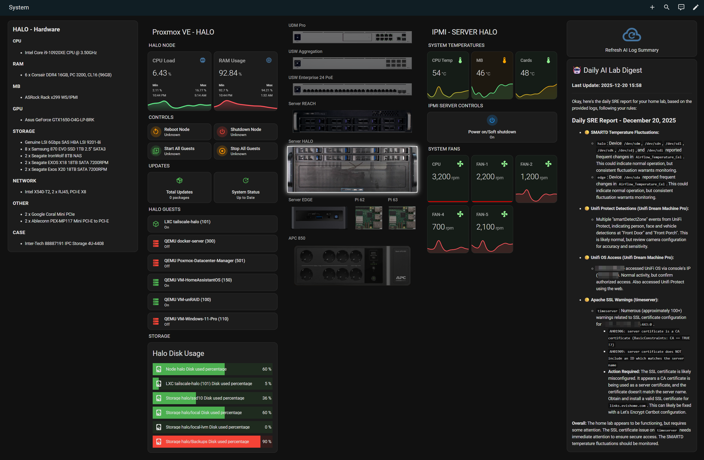

---
tags:
  - dashboard
  - view
  - automated
---

# System

**Dashboard:** Admin System  
**Path:** `system`

<!-- START_DESCRIPTION -->
Advanced system monitoring and control for the Proxmox 'Halo' node, including resource usage, power management, and guest orchestration.
<!-- END_DESCRIPTION -->



## Summary
<!-- START_SUMMARY -->
This view provides deep insights into the Proxmox 'Halo' virtualization node. It features real-time resource monitoring (CPU, RAM) using `mini-graph-card`, and critical power controls (Reboot, Shutdown) protected by confirmation dialogs. It also offers bulk management for guest VMs/containers and tracks system update status, ensuring the infrastructure host is healthy and up-to-date.
<!-- END_SUMMARY -->

## Configuration
```yaml
title: System
path: system
cards: []
type: sections
max_columns: 6
sections:
  - type: grid
    cards:
      - type: markdown
        content: |
          ## HALO - Hardware

          #### CPU
          * Intel Core i9-10920XE CPU @ 3.50GHz

          ### RAM
          * 6 x Corsair DDR4 16GB, PC 3200, CL16 (96GB)

          ### MB
          * ASRock Rack x299 WS/IPMI

          ### GPU
          * Asus GeForce GTX1650-O4G-LP-BRK

          ### STORAGE

          * Genuine LSI 6Gbps SAS HBA LSI 9201-8i
          * 8 x Samsung 870 EVO SSD 1TB 2.5" SATA3
          * 2 x Seagate IronWolf 8TB NAS
          * 2 x Seagate EXOS X18 18TB SATA 7200RPM
          * 2 x Seagate Exos X20 18TB SATA 7200RPM

          ### NETWORK

          * Intel X540-T2, 2 x RJ45, PCI-E X8

          ### OTHER

          * 2 x Google Coral Mini PCIe
          * 2 x Ableconn PEX-MP117 Mini PCI-E to PCI-E

          ### CASE

          * Inter-Tech 88887191 IPC Storage 4U-4408
        visibility:
          - condition: state
            entity: input_select.rack_selected_device
            state: server-halo
      - type: markdown
        content: |-
          ## RPi5 62

          ### Board
          * Raspberry Pi5 8 GB

          ### HATS & Accessories

          * Samsung SSD 256GB PM991 M.2 2242 PCIe 3.0 x4 NVMe
          * Waveshare PCIe to M.2 Adapter for Raspberry Pi 5
          * Waveshare PoE Power Over Ethernet
        visibility:
          - condition: state
            entity: input_select.rack_selected_device
            state: pi5-62
      - type: markdown
        content: |-
          ## RPi5 63

          ### Board
          * Raspberry Pi5 8 GB

          ### HATS & Accessories

          * Samsung SSD 256GB PM991 M.2 2242 PCIe 3.0 x4 NVMe
          * Waveshare PCIe to M.2 Adapter for Raspberry Pi 5
          * Waveshare PoE Power Over Ethernet
        visibility:
          - condition: state
            entity: input_select.rack_selected_device
            state: pi5-63
      - type: markdown
        content: |+
          ## Server Edge

          #### CPU
          * Intel Core i7-10710U CPU @ 1.10GHz

          ### RAM
          * 2 x DDR4 16GB, PC 3200, CL16 (32GB)

          ### MB
          * Intel NUC10I7FNHN2 Frost Canyon

          ### GPU
          *  integrated Intel UHD graphics card

          ### STORAGE


          ### NETWORK

          * 1Gbs Integrated
          * Intel Wireless-AX MAC 802.11ax

          ### OTHER

        visibility:
          - condition: state
            entity: input_select.rack_selected_device
            state: server-edge
      - type: markdown
        content: |-
          ## APC Back-UPS BE850G2-GR

          ### Features
          * Max Time (Full Load): 2.3 minutes

          * Max Power (W): 520W
          * Max Power (VA): 850 VA
          * Changable Battery (RBC17)

          ### Outlets
          * 6 x Schuko CEE 7 (Battery Backup)
          * 2 x Schuko CEE 7 (Surge Protection)
          * 1 x RJ-45

          ### Weight

          * 4.5 kg

          ### Dimensions

          * 120 x 120 x 365 mm
        visibility:
          - condition: state
            entity: input_select.rack_selected_device
            state: apc-bubs-850
  - type: grid
    cards:
      - type: vertical-stack
        cards:
          - type: heading
            heading: HALO NODE
            heading_style: title
          - type: custom:auto-entities
            card:
              type: grid
              columns: 2
              square: false
            card_param: cards
            filter:
              include:
                - options:
                    type: custom:mini-graph-card
                    entities:
                      - entity: this.entity_id
                    name: CPU Load
                    line_width: 8
                    font_size: 75
                    height: 100
                    show:
                      fill: fade
                      extrema: true
                    color_thresholds:
                      - value: 50
                        color: '#5FE787'
                      - value: 80
                        color: '#FF9800'
                      - value: 90
                        color: '#FF535B'
                  integration: proxmoxve
                  entity_id: '*node_halo*cpu_used'
                - options:
                    type: custom:mini-graph-card
                    entities:
                      - entity: this.entity_id
                    name: RAM Usage
                    line_width: 8
                    font_size: 75
                    height: 100
                    show:
                      fill: fade
                      extrema: true
                    color_thresholds:
                      - value: 60
                        color: '#5FE787'
                      - value: 80
                        color: '#FF9800'
                      - value: 90
                        color: '#FF535B'
                  integration: proxmoxve
                  entity_id: '*node_halo*memory_used_percentage'
              exclude:
                - options: {}
                  state: unavailable
          - type: heading
            heading: CONTROLS
            heading_style: title
          - type: grid
            columns: 2
            square: false
            cards:
              - type: custom:mushroom-entity-card
                entity: button.node_halo_reboot
                name: Reboot Node
                icon: mdi:restart
                icon_color: orange
                layout: horizontal
                tap_action:
                  action: perform-action
                  perform_action: button.press
                  target:
                    entity_id: button.node_halo_reboot
                  confirmation:
                    text: ⚠️ Are you sure you want to REBOOT the physical Halo Node?
              - type: custom:mushroom-entity-card
                entity: button.node_halo_shutdown
                name: Shutdown Node
                icon: mdi:power
                icon_color: red
                layout: horizontal
                tap_action:
                  action: perform-action
                  perform_action: button.press
                  target:
                    entity_id: button.node_halo_shutdown
                  confirmation:
                    text: '⛔ DANGER: Are you sure you want to SHUTDOWN the physical Halo Node?'
              - type: custom:mushroom-entity-card
                entity: button.node_halo_start_all
                name: Start All Guests
                icon: mdi:play-box-multiple-outline
                icon_color: green
                layout: horizontal
                tap_action:
                  action: perform-action
                  perform_action: button.press
                  target:
                    entity_id: button.node_halo_start_all
                  confirmation:
                    text: Start all VMs and Containers on Halo?
              - type: custom:mushroom-entity-card
                entity: button.node_halo_stop_all
                name: Stop All Guests
                icon: mdi:stop-circle-outline
                icon_color: orange
                layout: horizontal
                tap_action:
                  action: perform-action
                  perform_action: button.press
                  target:
                    entity_id: button.node_halo_stop_all
                  confirmation:
                    text: ⚠️ Are you sure you want to STOP ALL guests on Halo?
          - type: heading
            heading: UPDATES
            heading_style: title
          - type: grid
            columns: 2
            square: false
            cards:
              - type: custom:mushroom-template-card
                entity: sensor.node_halo_total_updates
                primary: Total Updates
                secondary: '{{ states(entity) }} packages'
                icon: mdi:package-variant
                tap_action:
                  action: more-info
                color: '{{ ''green'' if states(entity)|int == 0 else ''orange'' }}'
                vertical: true
                features_position: bottom
              - type: custom:mushroom-template-card
                entity: binary_sensor.node_halo_updates_packages
                primary: System Status
                secondary: '{{ ''Up to Date'' if is_state(entity, ''off'') else ''Updates Available'' }}'
                icon: mdi:update
                tap_action:
                  action: more-info
                color: '{{ ''green'' if is_state(entity, ''off'') else ''orange'' }}'
                vertical: true
                features_position: bottom
          - type: heading
            heading: HALO GUESTS
            heading_style: title
          - type: custom:auto-entities
            card:
              type: grid
              columns: 1
              square: false
            card_param: cards
            sort:
              method: name
            filter:
              template: " \n\n\n\n  \n  {# 1. Strict Name Check #}\n  \n    \n    {# 2. Connected Via Check #}\n    \n    \n    \n    \n    \n    \n         {# --- 3. CALCULATE IDs --- #}\n         \n         \n         \n         {# Sensors #}\n         \n         \n         \n         \n         \n         {# Disk Sensors #}\n         \n         \n         \n         {# Buttons #}\n         \n         \n         \n         \n         \n         \n         {# --- 4. BUILD CARD --- #}\n         {% set card = {\n            \"type\": \"custom:mushroom-template-card\",\n            \"entity\": state.entity_id,\n            \"layout\": \"horizontal\",\n            \"fill_container\": true,\n            \"primary\": friendly_name,\n            \"secondary\": state.state | title,\n            \"icon\": 'mdi:cube-outline' if 'lxc' in\
                \ state.entity_id else 'mdi:server',\n            \"icon_color\": 'green' if state.state == 'on' else 'red',\n            \"tap_action\": {\n               \"action\": \"fire-dom-event\",\n               \"browser_mod\": {\n                  \"service\": \"browser_mod.popup\",\n                  \"data\": {\n                     \"title\": friendly_name,\n                     \"size\": \"normal\",\n                     \"content\": {\n                        \"type\": \"vertical-stack\",\n                        \"cards\": [\n                           {\n                              \"type\": \"horizontal-stack\",\n                              \"cards\": [\n                                 {\n                                    \"type\": \"custom:mini-graph-card\",\n                                    \"entities\": [ {\"entity\": s_cpu, \"name\": \"CPU\"} ],\n                                    \"line_width\": 4, \"font_size\": 60, \"height\": 80,\n                   \
                \                 \"show\": { \"graph\": \"line\", \"fill\": \"fade\" },\n                                    \"color_thresholds\": [ {\"value\": 50, \"color\": \"#5FE787\"}, {\"value\": 80, \"color\": \"#FF9800\"}, {\"value\": 90, \"color\": \"#FF535B\"} ]\n                                 },\n                                 {\n                                    \"type\": \"custom:mini-graph-card\",\n                                    \"entities\": [ {\"entity\": s_mem, \"name\": \"RAM\"} ],\n                                    \"line_width\": 4, \"font_size\": 60, \"height\": 80,\n                                    \"show\": { \"graph\": \"line\", \"fill\": \"fade\" },\n                                    \"color_thresholds\": [ {\"value\": 50, \"color\": \"#5FE787\"}, {\"value\": 80, \"color\": \"#FF9800\"}, {\"value\": 90, \"color\": \"#FF535B\"} ]\n                                 }\n                              ]\n                           },\n               \
                \            {\n                              \"type\": \"horizontal-stack\",\n                              \"cards\": [\n                                 {\n                                    \"type\": \"custom:apexcharts-card\",\n                                    \"chart_type\": \"donut\",\n                                    \"header\": { \"show\": true, \"title\": \"Disk Space\", \"show_states\": false },\n                                    \"series\": [\n                                        { \"entity\": s_disk_used, \"name\": \"Used\", \"color\": \"#FF535B\" },\n                                        { \"entity\": s_disk_free, \"name\": \"Free\", \"color\": \"#5FE787\" }\n                                    ],\n                                    \"donut\": { \"total\": { \"show\": true, \"show_always\": true } },\n                                    \"layout\": \"minimal\",\n                                    \"style\": \"ha-card { height: 100%; }\" \n  \
                \                               },\n                                 {\n                                    \"type\": \"custom:mini-graph-card\",\n                                    \"entities\": [ {\"entity\": s_net_in, \"name\": \"Net In\"}, {\"entity\": s_net_out, \"name\": \"Net Out\", \"color\": \"#00b4f0\"} ],\n                                    \"line_width\": 2, \"height\": 130,\n                                    \"show\": { \"graph\": \"line\", \"fill\": false, \"legend\": true }\n                                 }\n                              ]\n                           },\n                           {\n                              \"type\": \"grid\",\n                              \"columns\": 2, \"square\": false, \"title\": \"Controls\",\n                              \"cards\": [\n                                 {\n                                    \"type\": \"custom:mushroom-entity-card\", \"entity\": b_start, \"name\": \"Start\",\n            \
                \                        \"icon\": \"mdi:play\", \"icon_color\": \"green\", \"layout\": \"horizontal\", \"tap_action\": {\"action\": \"toggle\"}\n                                 },\n                                 {\n                                    \"type\": \"custom:mushroom-entity-card\", \"entity\": b_stop, \"name\": \"Shutdown\",\n                                    \"icon\": \"mdi:power\", \"icon_color\": \"red\", \"layout\": \"horizontal\", \"tap_action\": {\"action\": \"toggle\", \"confirmation\": {\"text\": \"Graceful Shutdown?\"}}\n                                 },\n                                 {\n                                    \"type\": \"custom:mushroom-entity-card\", \"entity\": b_reboot, \"name\": \"Reboot\",\n                                    \"icon\": \"mdi:restart\", \"icon_color\": \"orange\", \"layout\": \"horizontal\", \"tap_action\": {\"action\": \"toggle\", \"confirmation\": {\"text\": \"Reboot?\"}}\n                               \
                \  },\n                                 {\n                                    \"type\": \"custom:mushroom-entity-card\", \"entity\": b_kill, \"name\": \"Kill\",\n                                    \"icon\": \"mdi:stop-circle\", \"icon_color\": \"grey\", \"layout\": \"horizontal\", \"tap_action\": {\"action\": \"toggle\", \"confirmation\": {\"text\": \"⚠️ Force Kill?\"}}\n                                 }\n                              ]\n                           }\n                        ]\n                     }\n                  }\n               }\n            }\n         } %}\n         \n    \n  \n\n{{ ns.cards }}\n"
          - type: heading
            heading: STORAGE
            heading_style: title
          - type: custom:auto-entities
            card:
              type: custom:bar-card
              title: Halo Disk Usage
              height: 40px
              columns: 1
              decimal: 0
              positions:
                icon: inside
                name: inside
                value: inside
              severity:
                - color: '#4caf50'
                  from: 0
                  to: 75
                - color: '#ff9800'
                  from: 75
                  to: 90
                - color: '#f44336'
                  from: 90
                  to: 100
            filter:
              include:
                - entity_id: '*halo*disk_used_percentage'
              exclude:
                - state: unavailable
        visibility:
          - condition: state
            entity: input_select.rack_selected_device
            state: server-halo
        title: Proxmox VE - HALO
      - type: vertical-stack
        cards:
          - type: custom:mushroom-title-card
            title: Rack Power Topology
          - type: picture
            image: /local/rack/power-distribution-2.png
            tap_action:
              action: fire-dom-event
              browser_mod:
                service: browser_mod.popup
                data:
                  title: Power Distribution
                  size: wide
                  content:
                    type: picture
                    image: /local/rack/power-distribution-2.png
            hold_action:
              action: none
        visibility:
          - condition: state
            entity: input_select.rack_selected_device
            state: apc-bubs-850
      - type: vertical-stack
        cards:
          - type: heading
            heading: EDGE NODE
            heading_style: title
          - type: custom:auto-entities
            card:
              type: grid
              columns: 2
              square: false
            card_param: cards
            filter:
              include:
                - options:
                    type: custom:mini-graph-card
                    entities:
                      - entity: this.entity_id
                    name: CPU Load
                    line_width: 8
                    font_size: 75
                    height: 100
                    show:
                      fill: fade
                      extrema: true
                    color_thresholds:
                      - value: 50
                        color: '#5FE787'
                      - value: 80
                        color: '#FF9800'
                      - value: 90
                        color: '#FF535B'
                  integration: proxmoxve
                  entity_id: '*node_edge*cpu_used'
                - options:
                    type: custom:mini-graph-card
                    entities:
                      - entity: this.entity_id
                    name: RAM Usage
                    line_width: 8
                    font_size: 75
                    height: 100
                    show:
                      fill: fade
                      extrema: true
                    color_thresholds:
                      - value: 60
                        color: '#5FE787'
                      - value: 80
                        color: '#FF9800'
                      - value: 90
                        color: '#FF535B'
                  integration: proxmoxve
                  entity_id: '*node_edge*memory_used_percentage'
              exclude:
                - options: {}
                  state: unavailable
          - type: heading
            heading: CONTROLS
            heading_style: title
          - type: grid
            columns: 2
            square: false
            cards:
              - type: custom:mushroom-entity-card
                entity: button.node_edge_reboot
                name: Reboot Node
                icon: mdi:restart
                icon_color: orange
                layout: horizontal
                tap_action:
                  action: perform-action
                  perform_action: button.press
                  target:
                    entity_id: button.node_edge_reboot
                  confirmation:
                    text: ⚠️ Are you sure you want to REBOOT the physical Edge Node?
              - type: custom:mushroom-entity-card
                entity: button.node_edge_shutdown
                name: Shutdown Node
                icon: mdi:power
                icon_color: red
                layout: horizontal
                tap_action:
                  action: perform-action
                  perform_action: button.press
                  target:
                    entity_id: button.node_edge_shutdown
                  confirmation:
                    text: '⛔ DANGER: Are you sure you want to SHUTDOWN the physical Edge Node?'
              - type: custom:mushroom-entity-card
                entity: button.node_edge_start_all
                name: Start All Guests
                icon: mdi:play-box-multiple-outline
                icon_color: green
                layout: horizontal
                tap_action:
                  action: perform-action
                  perform_action: button.press
                  target:
                    entity_id: button.node_edge_start_all
                  confirmation:
                    text: Start all VMs and Containers on Edge?
              - type: custom:mushroom-entity-card
                entity: button.node_edge_stop_all
                name: Stop All Guests
                icon: mdi:stop-circle-outline
                icon_color: orange
                layout: horizontal
                tap_action:
                  action: perform-action
                  perform_action: button.press
                  target:
                    entity_id: button.node_edge_stop_all
                  confirmation:
                    text: ⚠️ Are you sure you want to STOP ALL guests on Edge?
          - type: heading
            heading: UPDATES
            heading_style: title
          - type: grid
            columns: 2
            square: false
            cards:
              - type: custom:mushroom-template-card
                entity: sensor.node_edge_total_updates
                primary: Total Updates
                secondary: '{{ states(entity) }} packages'
                icon: mdi:package-variant
                tap_action:
                  action: more-info
                color: '{{ ''green'' if states(entity)|int == 0 else ''orange'' }}'
                vertical: true
                features_position: bottom
              - type: custom:mushroom-template-card
                entity: binary_sensor.node_edge_updates_packages
                primary: System Status
                secondary: '{{ ''Up to Date'' if is_state(entity, ''off'') else ''Updates Available'' }}'
                icon: mdi:update
                tap_action:
                  action: more-info
                color: '{{ ''green'' if is_state(entity, ''off'') else ''orange'' }}'
                vertical: true
                features_position: bottom
          - type: heading
            heading: EDGE GUESTS
            heading_style: title
          - type: custom:auto-entities
            card:
              type: grid
              columns: 1
              square: false
            card_param: cards
            sort:
              method: name
            filter:
              template: " \n\n\n\n  \n  {# 1. Strict Name Check #}\n  \n    \n    {# 2. Connected Via Check #}\n    \n    \n    \n    \n    \n    \n         {# --- 3. CALCULATE IDs --- #}\n         \n         \n         \n         {# Sensors #}\n         \n         \n         \n         \n         \n         {# Disk Sensors #}\n         \n         \n         \n         {# Buttons #}\n         \n         \n         \n         \n         \n         \n         {# --- 4. BUILD CARD --- #}\n         {% set card = {\n            \"type\": \"custom:mushroom-template-card\",\n            \"entity\": state.entity_id,\n            \"layout\": \"horizontal\",\n            \"fill_container\": true,\n            \"primary\": friendly_name,\n            \"secondary\": state.state | title,\n            \"icon\": 'mdi:cube-outline' if 'lxc' in\
                \ state.entity_id else 'mdi:server',\n            \"icon_color\": 'green' if state.state == 'on' else 'red',\n            \"tap_action\": {\n               \"action\": \"fire-dom-event\",\n               \"browser_mod\": {\n                  \"service\": \"browser_mod.popup\",\n                  \"data\": {\n                     \"title\": friendly_name,\n                     \"size\": \"normal\",\n                     \"content\": {\n                        \"type\": \"vertical-stack\",\n                        \"cards\": [\n                           {\n                              \"type\": \"horizontal-stack\",\n                              \"cards\": [\n                                 {\n                                    \"type\": \"custom:mini-graph-card\",\n                                    \"entities\": [ {\"entity\": s_cpu, \"name\": \"CPU\"} ],\n                                    \"line_width\": 4, \"font_size\": 60, \"height\": 80,\n                   \
                \                 \"show\": { \"graph\": \"line\", \"fill\": \"fade\" },\n                                    \"color_thresholds\": [ {\"value\": 50, \"color\": \"#5FE787\"}, {\"value\": 80, \"color\": \"#FF9800\"}, {\"value\": 90, \"color\": \"#FF535B\"} ]\n                                 },\n                                 {\n                                    \"type\": \"custom:mini-graph-card\",\n                                    \"entities\": [ {\"entity\": s_mem, \"name\": \"RAM\"} ],\n                                    \"line_width\": 4, \"font_size\": 60, \"height\": 80,\n                                    \"show\": { \"graph\": \"line\", \"fill\": \"fade\" },\n                                    \"color_thresholds\": [ {\"value\": 50, \"color\": \"#5FE787\"}, {\"value\": 80, \"color\": \"#FF9800\"}, {\"value\": 90, \"color\": \"#FF535B\"} ]\n                                 }\n                              ]\n                           },\n               \
                \            {\n                              \"type\": \"horizontal-stack\",\n                              \"cards\": [\n                                 {\n                                    \"type\": \"custom:apexcharts-card\",\n                                    \"chart_type\": \"donut\",\n                                    \"header\": { \"show\": true, \"title\": \"Disk Space\", \"show_states\": false },\n                                    \"series\": [\n                                        { \"entity\": s_disk_used, \"name\": \"Used\", \"color\": \"#FF535B\" },\n                                        { \"entity\": s_disk_free, \"name\": \"Free\", \"color\": \"#5FE787\" }\n                                    ],\n                                    \"donut\": { \"total\": { \"show\": true, \"show_always\": true } },\n                                    \"layout\": \"minimal\",\n                                    \"style\": \"ha-card { height: 100%; }\" \n  \
                \                               },\n                                 {\n                                    \"type\": \"custom:mini-graph-card\",\n                                    \"entities\": [ {\"entity\": s_net_in, \"name\": \"Net In\"}, {\"entity\": s_net_out, \"name\": \"Net Out\", \"color\": \"#00b4f0\"} ],\n                                    \"line_width\": 2, \"height\": 130,\n                                    \"show\": { \"graph\": \"line\", \"fill\": false, \"legend\": true }\n                                 }\n                              ]\n                           },\n                           {\n                              \"type\": \"grid\",\n                              \"columns\": 2, \"square\": false, \"title\": \"Controls\",\n                              \"cards\": [\n                                 {\n                                    \"type\": \"custom:mushroom-entity-card\", \"entity\": b_start, \"name\": \"Start\",\n            \
                \                        \"icon\": \"mdi:play\", \"icon_color\": \"green\", \"layout\": \"horizontal\", \"tap_action\": {\"action\": \"toggle\"}\n                                 },\n                                 {\n                                    \"type\": \"custom:mushroom-entity-card\", \"entity\": b_stop, \"name\": \"Shutdown\",\n                                    \"icon\": \"mdi:power\", \"icon_color\": \"red\", \"layout\": \"horizontal\", \"tap_action\": {\"action\": \"toggle\", \"confirmation\": {\"text\": \"Graceful Shutdown?\"}}\n                                 },\n                                 {\n                                    \"type\": \"custom:mushroom-entity-card\", \"entity\": b_reboot, \"name\": \"Reboot\",\n                                    \"icon\": \"mdi:restart\", \"icon_color\": \"orange\", \"layout\": \"horizontal\", \"tap_action\": {\"action\": \"toggle\", \"confirmation\": {\"text\": \"Reboot?\"}}\n                               \
                \  },\n                                 {\n                                    \"type\": \"custom:mushroom-entity-card\", \"entity\": b_kill, \"name\": \"Kill\",\n                                    \"icon\": \"mdi:stop-circle\", \"icon_color\": \"grey\", \"layout\": \"horizontal\", \"tap_action\": {\"action\": \"toggle\", \"confirmation\": {\"text\": \"⚠️ Force Kill?\"}}\n                                 }\n                              ]\n                           }\n                        ]\n                     }\n                  }\n               }\n            }\n         } %}\n         \n    \n  \n\n{{ ns.cards }}\n"
          - type: heading
            heading: STORAGE
            heading_style: title
          - type: custom:auto-entities
            card:
              type: custom:bar-card
              title: Edge Disk Usage
              height: 40px
              columns: 1
              decimal: 0
              positions:
                icon: inside
                name: inside
                value: inside
              severity:
                - color: '#4caf50'
                  from: 0
                  to: 75
                - color: '#ff9800'
                  from: 75
                  to: 90
                - color: '#f44336'
                  from: 90
                  to: 100
            filter:
              include:
                - entity_id: '*edge*disk_used_percentage'
              exclude:
                - state: unavailable
        visibility:
          - condition: state
            entity: input_select.rack_selected_device
            state: server-edge
        title: Proxmox VE - EDGE
  - type: grid
    cards:
      - type: heading
        heading: UDM Pro
        heading_style: subtitle
      - type: picture
        image: /local/rack/udm_pro2.png
        tap_action:
          action: perform-action
          perform_action: input_select.select_option
          target:
            entity_id: input_select.rack_selected_device
          data:
            option: udm-pro
        card_mod:
          style: "ha-card {\n  background: none !important;\n  box-shadow: none !important;\n  border-radius: 0px !important;\n  transition: transform 0.3s ease-in-out, filter 0.3s ease-in-out, border-color 0.3s ease-in-out;\n  border: 2px solid transparent !important;\n\n  /* --- STATE LOGIC --- */\n  \n    /* SELECTED: Full Size, Bright, Cyan Glow */\n    transform: scale(1.0);\n    filter: brightness(1.0) drop-shadow(0 0 8px white);\n    border-color: white !important;\n    z-index: 2;\n  \n    /* NOT SELECTED: Shrunk, Darker */\n    transform: scale(0.92);\n    filter: brightness(0.5);\n    z-index: 1;\n  \n}\n\n/* --- HOVER LOGIC --- */\nha-card:hover {\n  transform: scale(1.0); /* Always pop to full size on hover */\n  \n  /* If unselected, brighten slightly on hover so it feels interactive,\n     but don't make it fully bright (reserved for selection) */\n  \n    filter: brightness(0.8);\n  \n}\n"
      - type: heading
        heading: USW Aggregation
        heading_style: subtitle
      - type: picture
        image: /local/rack/usw_aggregate.png
        tap_action:
          action: perform-action
          perform_action: input_select.select_option
          target:
            entity_id: input_select.rack_selected_device
          data:
            option: usw-aggregate
        card_mod:
          style: "ha-card {\n  background: none !important;\n  box-shadow: none !important;\n  border-radius: 0px !important;\n  transition: transform 0.3s ease-in-out, filter 0.3s ease-in-out, border-color 0.3s ease-in-out;\n  border: 2px solid transparent !important;\n\n  /* --- STATE LOGIC --- */\n  \n    /* SELECTED: Full Size, Bright, Cyan Glow */\n    transform: scale(1.0);\n    filter: brightness(1.0) drop-shadow(0 0 8px white);\n    border-color: white !important;\n    z-index: 2;\n  \n    /* NOT SELECTED: Shrunk, Darker */\n    transform: scale(0.92);\n    filter: brightness(0.5);\n    z-index: 1;\n  \n}\n\n/* --- HOVER LOGIC --- */\nha-card:hover {\n  transform: scale(1.0); /* Always pop to full size on hover */\n  \n  /* If unselected, brighten slightly on hover so it feels interactive,\n     but don't make it fully bright (reserved for selection) */\n  \n    filter: brightness(0.8);\n  \n}\n"
      - type: heading
        heading: USW Enterprise 24 PoE
        heading_style: subtitle
      - type: picture
        image: /local/rack/usw_enterprise_24_poe.png
        tap_action:
          action: perform-action
          perform_action: input_select.select_option
          target:
            entity_id: input_select.rack_selected_device
          data:
            option: usw-enterprise-24-poe
        card_mod:
          style: "ha-card {\n  background: none !important;\n  box-shadow: none !important;\n  border-radius: 0px !important;\n  transition: transform 0.3s ease-in-out, filter 0.3s ease-in-out, border-color 0.3s ease-in-out;\n  border: 2px solid transparent !important;\n\n  /* --- STATE LOGIC --- */\n  \n    /* SELECTED: Full Size, Bright, Cyan Glow */\n    transform: scale(1.0);\n    filter: brightness(1.0) drop-shadow(0 0 8px white);\n    border-color: white !important;\n    z-index: 2;\n  \n    /* NOT SELECTED: Shrunk, Darker */\n    transform: scale(0.92);\n    filter: brightness(0.5);\n    z-index: 1;\n  \n}\n\n/* --- HOVER LOGIC --- */\nha-card:hover {\n  transform: scale(1.0); /* Always pop to full size on hover */\n  \n  /* If unselected, brighten slightly on hover so it feels interactive,\n     but don't make it fully bright (reserved for selection) */\n  \n    filter: brightness(0.8);\n  \n}\n"
      - type: heading
        heading: Server REACH
        heading_style: subtitle
      - type: picture
        image: /local/rack/server_reach.png
        tap_action:
          action: perform-action
          perform_action: input_select.select_option
          target:
            entity_id: input_select.rack_selected_device
          data:
            option: server-reach
        card_mod:
          style: "ha-card {\n  background: none !important;\n  box-shadow: none !important;\n  border-radius: 0px !important;\n  transition: transform 0.3s ease-in-out, filter 0.3s ease-in-out, border-color 0.3s ease-in-out;\n  border: 2px solid transparent !important;\n\n  /* --- STATE LOGIC --- */\n  \n    /* SELECTED: Full Size, Bright, Cyan Glow */\n    transform: scale(1.0);\n    filter: brightness(1.0) drop-shadow(0 0 8px white);\n    border-color: white !important;\n    z-index: 2;\n  \n    /* NOT SELECTED: Shrunk, Darker */\n    transform: scale(0.92);\n    filter: brightness(0.5);\n    z-index: 1;\n  \n}\n\n/* --- HOVER LOGIC --- */\nha-card:hover {\n  transform: scale(1.0); /* Always pop to full size on hover */\n  \n  /* If unselected, brighten slightly on hover so it feels interactive,\n     but don't make it fully bright (reserved for selection) */\n  \n    filter: brightness(0.8);\n  \n}\n"
      - type: heading
        heading: Server HALO
        heading_style: subtitle
      - type: picture
        image: /local/rack/server_halo.png?new=1
        tap_action:
          action: perform-action
          perform_action: input_select.select_option
          target:
            entity_id: input_select.rack_selected_device
          data:
            option: server-halo
        card_mod:
          style: "ha-card {\n  background: none !important;\n  box-shadow: none !important;\n  border-radius: 0px !important;\n  transition: transform 0.3s ease-in-out, filter 0.3s ease-in-out, border-color 0.3s ease-in-out;\n  border: 2px solid transparent !important;\n\n  /* --- STATE LOGIC --- */\n  \n    /* SELECTED: Full Size, Bright, Cyan Glow */\n    transform: scale(1.0);\n    filter: brightness(1.0) drop-shadow(0 0 8px white);\n    border-color: white !important;\n    z-index: 2;\n  \n    /* NOT SELECTED: Shrunk, Darker */\n    transform: scale(0.90);\n    filter: brightness(0.5);\n    z-index: 1;\n  \n}\n\n/* --- HOVER LOGIC --- */\nha-card:hover {\n  transform: scale(1.0); /* Always pop to full size on hover */\n  \n  /* If unselected, brighten slightly on hover so it feels interactive,\n     but don't make it fully bright (reserved for selection) */\n  \n    filter: brightness(0.8);\n  \n}\n"
      - type: heading
        heading: Server EDGE
        heading_style: subtitle
        grid_options:
          columns: 6
      - type: heading
        heading: Pi 62
        heading_style: subtitle
        grid_options:
          columns: 3
      - type: heading
        heading: Pi 63
        heading_style: subtitle
        grid_options:
          columns: 3
      - type: picture
        image: /local/rack/server_edge.png?new=1
        tap_action:
          action: perform-action
          perform_action: input_select.select_option
          target:
            entity_id: input_select.rack_selected_device
          data:
            option: server-edge
        card_mod:
          style: "ha-card {\n  background: none !important;\n  box-shadow: none !important;\n  border-radius: 0px !important;\n  transition: transform 0.3s ease-in-out, filter 0.3s ease-in-out, border-color 0.3s ease-in-out;\n  border: 2px solid transparent !important;\n\n  /* --- STATE LOGIC --- */\n  \n    /* SELECTED: Full Size, Bright, Cyan Glow */\n    transform: scale(1.0);\n    filter: brightness(1.0) drop-shadow(0 0 8px white);\n    border-color: white !important;\n    z-index: 2;\n  \n    /* NOT SELECTED: Shrunk, Darker */\n    transform: scale(0.90);\n    filter: brightness(0.5);\n    z-index: 1;\n  \n}\n\n/* --- HOVER LOGIC --- */\nha-card:hover {\n  transform: scale(1.0); /* Always pop to full size on hover */\n  \n  /* If unselected, brighten slightly on hover so it feels interactive,\n     but don't make it fully bright (reserved for selection) */\n  \n    filter: brightness(0.8);\n  \n}\n"
        grid_options:
          columns: 6
      - type: picture
        image: /local/rack/pi5-side.png?
        tap_action:
          action: perform-action
          perform_action: input_select.select_option
          target:
            entity_id: input_select.rack_selected_device
          data:
            option: pi5-62
        card_mod:
          style: "ha-card {\n  background: none !important;\n  box-shadow: none !important;\n  border-radius: 0px !important;\n  transition: transform 0.3s ease-in-out, filter 0.3s ease-in-out, border-color 0.3s ease-in-out;\n  border: 2px solid transparent !important;\n  \n  /* 1. Force the card container to fill the grid cell height */\n  height: 100% !important;\n\n  /* --- STATE LOGIC --- */\n  \n    transform: scale(1.0);\n    filter: brightness(1.0) drop-shadow(0 0 8px white);\n    border-color: white !important;\n    z-index: 2;\n  \n    transform: scale(0.90);\n    filter: brightness(0.5);\n    z-index: 1;\n  \n}\n\n/* --- HOVER LOGIC --- */\nha-card:hover {\n  transform: scale(1.0);\n  \n    filter: brightness(0.8);\n  \n}\n\n/* 2. FORCE IMAGE TO FILL & CLIP */\n/* This targets the  tag inside the card */\nimg {\n\
            \  object-fit: cover !important;\n  object-position: right center !important;  /* <--- CHANGED HERE */\n  height: 100% !important;\n  width: 100% !important;\n}\n"
        grid_options:
          columns: 3
      - type: picture
        image: /local/rack/pi5-side.png?
        tap_action:
          action: perform-action
          perform_action: input_select.select_option
          target:
            entity_id: input_select.rack_selected_device
          data:
            option: pi5-63
        card_mod:
          style: "ha-card {\n  background: none !important;\n  box-shadow: none !important;\n  border-radius: 0px !important;\n  transition: transform 0.3s ease-in-out, filter 0.3s ease-in-out, border-color 0.3s ease-in-out;\n  border: 2px solid transparent !important;\n  \n  /* 1. Force the card container to fill the grid cell height */\n  height: 100% !important;\n\n  /* --- STATE LOGIC --- */\n  \n    transform: scale(1.0);\n    filter: brightness(1.0) drop-shadow(0 0 8px white);\n    border-color: white !important;\n    z-index: 2;\n  \n    transform: scale(0.90);\n    filter: brightness(0.5);\n    z-index: 1;\n  \n}\n\n/* --- HOVER LOGIC --- */\nha-card:hover {\n  transform: scale(1.0);\n  \n    filter: brightness(0.8);\n  \n}\n\n/* 2. FORCE IMAGE TO FILL & CLIP */\n/* This targets the  tag inside the card */\nimg {\n\
            \  object-fit: cover !important;\n  object-position: right center !important;  /* <--- CHANGED HERE */\n  height: 100% !important;\n  width: 100% !important;\n}\n"
        grid_options:
          columns: 3
      - type: heading
        heading: APC 850
        heading_style: subtitle
      - type: picture
        image: /local/rack/apc_bubs_850.png
        tap_action:
          action: perform-action
          perform_action: input_select.select_option
          target:
            entity_id: input_select.rack_selected_device
          data:
            option: apc-bubs-850
        card_mod:
          style: "ha-card {\n  background: none !important;\n  box-shadow: none !important;\n  border-radius: 0px !important;\n  transition: transform 0.3s ease-in-out, filter 0.3s ease-in-out, border-color 0.3s ease-in-out;\n  border: 2px solid transparent !important;\n\n  /* --- STATE LOGIC --- */\n  \n    /* SELECTED: Full Size, Bright, Cyan Glow */\n    transform: scale(1.0);\n    filter: brightness(1.0) drop-shadow(0 0 8px white);\n    border-color: white !important;\n    z-index: 2;\n  \n    /* NOT SELECTED: Shrunk, Darker */\n    transform: scale(0.90);\n    filter: brightness(0.5);\n    z-index: 1;\n  \n}\n\n/* --- HOVER LOGIC --- */\nha-card:hover {\n  transform: scale(1.0); /* Always pop to full size on hover */\n  \n  /* If unselected, brighten slightly on hover so it feels interactive,\n     but don't make it fully bright (reserved for selection) */\n  \n    filter: brightness(0.8);\n  \n}\n"
  - type: grid
    cards:
      - type: vertical-stack
        title: UNIFI DREAM MACHINE PRO
        cards:
          - type: heading
            heading: SYSTEM
            heading_style: title
          - type: grid
            cards:
              - type: custom:mini-graph-card
                entities:
                  - entity: sensor.unifi_dream_machine_pro_cpu_temperature
                    name: Temp
                font_size_header: 12
                font_size: 75
                line_width: 8
                height: 200
                animate: true
                hours_to_show: 24
                show:
                  points: false
                color_thresholds:
                  - value: 45
                    color: '#5FE787'
                  - value: 55
                    color: '#FF9800'
                  - value: 65
                    color: '#FF535B'
                card_mod:
                  style: |
                    .header.flex .icon {
                    
                      
                        color: red;
                      
                        color: orange;
                      
                        color: lightgreen;
                       }
                    ha-card {
                      
                        --ha-card-background: rgba(255, 83, 91,0.05);
                      
                        --ha-card-background: rgba(255, 152, 0,0.05);
                      
                        --ha-card-background: rgba(95, 231, 135,0.05);
                       }
                    }
              - type: custom:mini-graph-card
                entities:
                  - entity: sensor.unifi_dream_machine_pro_memory_utilization
                    name: MEM
                font_size_header: 12
                font_size: 75
                line_width: 8
                height: 200
                animate: true
                hours_to_show: 24
                decimals: 0
                show:
                  points: false
                color_thresholds:
                  - value: 70
                    color: '#5FE787'
                  - value: 80
                    color: '#FF9800'
                  - value: 90
                    color: '#FF535B'
                card_mod:
                  style: |
                    .header.flex .icon {
                    
                      
                        color: red;
                      
                        color: orange;
                      
                        color: lightgreen;
                       }
                    ha-card {
                      
                        --ha-card-background: rgba(255, 83, 91,0.05);
                      
                        --ha-card-background: rgba(255, 152, 0,0.05);
                      
                        --ha-card-background: rgba(95, 231, 135,0.05);
                       }
                    }
              - type: custom:mini-graph-card
                entities:
                  - entity: sensor.unifi_dream_machine_pro_cpu_utilization
                    name: CPU
                font_size_header: 12
                font_size: 75
                line_width: 8
                height: 200
                animate: true
                hours_to_show: 24
                decimals: 0
                show:
                  points: false
                color_thresholds:
                  - value: 25
                    color: '#5FE787'
                  - value: 50
                    color: '#FF9800'
                  - value: 75
                    color: '#FF535B'
                card_mod:
                  style: |
                    .header.flex .icon {
                    
                      
                        color: red;
                      
                        color: orange;
                      
                        color: lightgreen;
                       }
                    ha-card {
                      
                        --ha-card-background: rgba(255, 83, 91,0.05);
                      
                        --ha-card-background: rgba(255, 152, 0,0.05);
                      
                        --ha-card-background: rgba(95, 231, 135,0.05);
                       }
                    }
          - square: false
            type: grid
            cards:
              - type: heading
                heading: HARD DRIVE
                heading_style: title
              - type: heading
                heading: UPDATES
                heading_style: title
              - type: custom:mushroom-template-card
                entity: binary_sensor.unifi_dream_machine_pro_hdd_1
                primary: HDD
                secondary: '{{ ''OK'' if is_state(entity, ''off'') else ''Problem Detected'' }}'
                icon: mdi:harddisk
                color: '{{ ''red'' if is_state(entity, ''on'') else ''green'' }}'
                features_position: bottom
                vertical: true
              - type: custom:mushroom-update-card
                entity: update.unifi_dream_machine_pro
                fill_container: true
                layout: vertical
                name: Updates
            columns: 2
          - type: heading
            heading: WAN
            heading_style: title
          - type: entities
            entities:
              - entity: binary_sensor.unifi_dream_machine_wan_status
                icon: mdi:wan
                card_mod:
                  style: |
                    :host {
                      --card-mod-icon-color: {{ 'lightgreen' if states(config.entity) == 'on' else 'red' }};
                    }
              - entity: sensor.unifi_dream_machine_external_ip
                icon: mdi:ip-outline
                card_mod:
                  style: ":host {\n  --card-mod-icon-color:lightgreen; \n}\n"
              - entity: sensor.unifi_google_wan_latency
                name: UDM Pro - WAN 1
                icon: mdi:pulse
                card_mod:
                  style: ":host {\n  --card-mod-icon-color: \n    \n     \n      red\n     \n      lightgreen\n     \n      orange\n    ;\n}\n"
              - entity: sensor.unifi_google_wan2_latency
                name: UDM Pro - WAN 2
                icon: mdi:pulse
                card_mod:
                  style: ":host {\n  --card-mod-icon-color: \n    \n     \n      red\n     \n      lightgreen\n     \n      orange\n    ;\n}\n"
          - type: custom:mini-graph-card
            icon: mdi:web
            height: 30
            hours_to_show: 24
            points_per_hour: 5
            line_width: 2
            font_size_header: 10
            font_size: 75
            decimals: 0
            show:
              fill: fade
              extrema: false
              name: true
              icon: true
              points: false
            entities:
              - entity: sensor.unifi_google_wan2_latency
                name: WAN Latency
                label: test
                show_state: true
                unit: ms
            color_thresholds:
              - value: 10
                color: '#5FE787'
              - value: 15
                color: '#FF9800'
              - value: 20
                color: '#FF535B'
            card_mod:
              style: |
                .header.flex .icon { 
                  
                    color: red;
                  
                    color: orange;
                  
                    color: lightgreen;
                   }
                ha-card {
                  
                    --ha-card-background: rgba(255, 83, 91,0.05);
                  
                    --ha-card-background: rgba(255, 152, 0,0.05);
                  
                    --ha-card-background: rgba(95, 231, 135,0.05);
                   }
                }
          - type: heading
            heading: NETWORKS
            heading_style: title
          - type: custom:auto-entities
            card:
              type: grid
              columns: 3
              square: false
            card_param: cards
            sort:
              method: name
            filter:
              include:
                - options:
                    type: custom:mushroom-template-card
                    primary: "\n\n{{ name }} "
                    secondary: |-
                       
                      
                      
                      {{ clients }} clients
                    icon: mdi:qrcode-scan
                    icon_color: |-
                      
                      
                        green
                      
                        red
                      
                    layout: vertical
                    multiline_secondary: false
                    tap_action:
                      action: fire-dom-event
                      browser_mod:
                        service: browser_mod.popup
                        data:
                          title: ' '
                          content:
                            type: vertical-stack
                            cards:
                              - type: custom:hui-element
                                card_type: markdown
                                card_mod:
                                  style: |
                                    ha-card {
                                      background: none !important;
                                      border: none !important;
                                      box-shadow: none !important;
                                      padding: 0px !important;
                                    }
                                content: |-
                                  {# 1. Auto-entities replaces 'this.entity_id' with the actual switch ID #} 
                                  {# 2. Calculate the QR Image ID #} 
                                  ### <center>Scan Network QR</center>
                                  {# 3. Check if image exists and show it #} 
                                  
                                    <center>
                                      
                                    </center>
                                  
                                    <center>
                                      <font color="orange">
                                        <ha-icon icon="mdi:image-broken"></ha-icon><br>
                                        <b>No QR image available</b>
                                      </font><br>
                                      <small>`{{ qr_id }}`</small>
                                    </center>
                                  
                              - type: entities
                                entities:
                                  - entity: this.entity_id
                                    icon: mdi:wifi
                  integration: unifi
                  area: Home
                  domain: switch
              exclude:
                - options: {}
                  state: unavailable
        visibility:
          - condition: state
            entity: input_select.rack_selected_device
            state: udm-pro
      - type: vertical-stack
        title: USW AGGREGATION
        cards:
          - type: heading
            heading: SYSTEM
            heading_style: title
          - square: false
            type: grid
            cards:
              - type: custom:mini-graph-card
                entities:
                  - entity: sensor.usw_aggregation_memory_utilization
                    name: MEM
                font_size_header: 12
                font_size: 75
                line_width: 8
                height: 200
                animate: true
                hours_to_show: 24
                decimals: 0
                show:
                  points: false
                color_thresholds:
                  - value: 70
                    color: '#5FE787'
                  - value: 80
                    color: '#FF9800'
                  - value: 90
                    color: '#FF535B'
                card_mod:
                  style: |
                    .header.flex .icon {
                    
                      
                        color: red;
                      
                        color: orange;
                      
                        color: lightgreen;
                       }
                    ha-card {
                      
                        --ha-card-background: rgba(255, 83, 91,0.05);
                      
                        --ha-card-background: rgba(255, 152, 0,0.05);
                      
                        --ha-card-background: rgba(95, 231, 135,0.05);
                       }
                    }
              - type: custom:mini-graph-card
                entities:
                  - entity: sensor.usw_aggregation_cpu_utilization
                    name: CPU
                font_size_header: 12
                font_size: 75
                line_width: 8
                height: 200
                animate: true
                hours_to_show: 24
                decimals: 0
                show:
                  points: false
                color_thresholds:
                  - value: 25
                    color: '#5FE787'
                  - value: 50
                    color: '#FF9800'
                  - value: 75
                    color: '#FF535B'
                card_mod:
                  style: |
                    .header.flex .icon {
                    
                      
                        color: red;
                      
                        color: orange;
                      
                        color: lightgreen;
                       }
                    ha-card {
                      
                        --ha-card-background: rgba(255, 83, 91,0.05);
                      
                        --ha-card-background: rgba(255, 152, 0,0.05);
                      
                        --ha-card-background: rgba(95, 231, 135,0.05);
                       }
                    }
            columns: 2
          - type: heading
            heading: UPDATES
            heading_style: title
          - type: custom:mushroom-update-card
            entity: update.usw_aggregation
            fill_container: true
            layout: vertical
            name: Updates
          - type: heading
            heading: PORTS
            heading_style: title
          - type: custom:auto-entities
            card:
              type: grid
              columns: 4
              square: false
            card_param: cards
            sort:
              method: name
            filter:
              include:
                - entity_id: switch.usw_aggregation*
                  options:
                    type: custom:mushroom-template-card
                    entity: this.entity_id
                    layout: vertical
                    fill_container: true
                    primary: |-
                      
                      
                      {{ name[:6] }}
                    secondary: '{{ states(config.entity) | title }}'
                    icon: mdi:ethernet
                    icon_color: |-
                      
                        green
                      
                        red
                      
        visibility:
          - condition: state
            entity: input_select.rack_selected_device
            state: usw-aggregate
      - type: vertical-stack
        cards:
          - type: heading
            heading: USW Enterprise 24 PoE
            heading_style: title
          - type: grid
            cards:
              - type: custom:mini-graph-card
                entities:
                  - entity: sensor.unifi_switch_enterprise_memory_utilization
                    name: MEM
                font_size_header: 12
                font_size: 75
                line_width: 8
                height: 200
                animate: true
                hours_to_show: 24
                decimals: 0
                show:
                  points: false
                color_thresholds:
                  - value: 70
                    color: '#5FE787'
                  - value: 80
                    color: '#FF9800'
                  - value: 90
                    color: '#FF535B'
                card_mod:
                  style: |
                    .header.flex .icon {
                    
                      
                        color: red;
                      
                        color: orange;
                      
                        color: lightgreen;
                       }
                    ha-card {
                      
                        --ha-card-background: rgba(255, 83, 91,0.05);
                      
                        --ha-card-background: rgba(255, 152, 0,0.05);
                      
                        --ha-card-background: rgba(95, 231, 135,0.05);
                       }
                    }
              - type: custom:mini-graph-card
                entities:
                  - entity: sensor.unifi_switch_enterprise_cpu_utilization
                    name: CPU
                font_size_header: 12
                font_size: 75
                line_width: 8
                height: 200
                animate: true
                hours_to_show: 24
                decimals: 0
                show:
                  points: false
                color_thresholds:
                  - value: 25
                    color: '#5FE787'
                  - value: 50
                    color: '#FF9800'
                  - value: 75
                    color: '#FF535B'
                card_mod:
                  style: |
                    .header.flex .icon {
                    
                      
                        color: red;
                      
                        color: orange;
                      
                        color: lightgreen;
                       }
                    ha-card {
                      
                        --ha-card-background: rgba(255, 83, 91,0.05);
                      
                        --ha-card-background: rgba(255, 152, 0,0.05);
                      
                        --ha-card-background: rgba(95, 231, 135,0.05);
                       }
                    }
              - type: custom:mini-graph-card
                entities:
                  - entity: sensor.unifi_switch_enterprise_temperature
                    name: Temp
                font_size_header: 12
                font_size: 75
                line_width: 8
                height: 200
                animate: true
                hours_to_show: 24
                show:
                  points: false
                color_thresholds:
                  - value: 45
                    color: '#5FE787'
                  - value: 55
                    color: '#FF9800'
                  - value: 65
                    color: '#FF535B'
                card_mod:
                  style: |
                    .header.flex .icon {
                    
                      
                        color: red;
                      
                        color: orange;
                      
                        color: lightgreen;
                       }
                    ha-card {
                      
                        --ha-card-background: rgba(255, 83, 91,0.05);
                      
                        --ha-card-background: rgba(255, 152, 0,0.05);
                      
                        --ha-card-background: rgba(95, 231, 135,0.05);
                       }
                    }
          - type: heading
            heading: UPDATES
            heading_style: title
          - type: custom:mushroom-update-card
            entity: update.usw_aggregation
            fill_container: true
            layout: vertical
            name: Updates
          - type: heading
            heading: PORTS
            heading_style: subtitle
          - type: custom:auto-entities
            card:
              type: grid
              columns: 6
              square: false
            card_param: cards
            sort:
              method: name
            filter:
              include:
                - entity_id: sensor.unifi_switch_enterprise*poe*
                  options:
                    type: custom:mushroom-template-card
                    primary: |-
                      
                      
                      
                      {{ port }}
                    secondary: |-
                      
                      
                      
                      
                      
                      
                        {{ name }}
                      
                        Port
                      
                    icon: mdi:ethernet
                    icon_color: |-
                      
                      
                      
                      
                        green
                      
                        red
                      
                    layout: vertical
                    multiline_secondary: false
                    fill_container: true
                    card_mod:
                      style: |
                        ha-card {
                          
                          
                            background-color: rgba(153, 255, 102, 0.3);
                          
                            background-color: rgba(153, 255, 102, 0.2);
                          
                            background-color: rgba(153, 255, 102, 0.1);
                          
                    tap_action:
                      action: fire-dom-event
                      browser_mod:
                        service: browser_mod.popup
                        data:
                          title: Port
                          content:
                            type: vertical-stack
                            cards:
                              - type: history-graph
                                entities:
                                  - entity: this.entity_id
                              - type: entities
                                entities:
                                  - entity: this.entity_id
                                    name: Current Power Usage
                              - type: custom:button-card
                                entity: |
                                  [[[
                                    var new_id = 'this.entity_id'.replace("sensor.", "switch.");
                                    new_id = new_id.replace("_power", "")
                                    return new_id
                                  ]]]
                                name: Port PoE Switch
                                layout: icon_name
                                show_state: true
                                tap_action:
                                  action: toggle
                                  confirmation:
                                    text: Switching Port PoE Power will take a short time to take an effect
                                state:
                                  - value: 'on'
                                    styles:
                                      icon:
                                        - color: lightgreen
                                  - value: 'off'
                                    styles:
                                      icon:
                                        - color: red
                                styles:
                                  name:
                                    - position: absolute
                                    - left: 74px
                                    - margin: 0px
                                    - padding: 0px
                                    - font-size: 14px
                                  state:
                                    - position: absolute
                                    - right: 20px
                                    - margin: 0px
                                    - padding: 0px
                                    - font-size: 14px
                                  icon:
                                    - position: absolute
                                    - left: 15px
                                    - margin: 0px
                                    - padding: 0px
                                    - width: 40px
                                    - height: 25px
                                  card:
                                    - height: 60px
                                    - margin: 0px
                                    - padding: 0px
        visibility:
          - condition: state
            entity: input_select.rack_selected_device
            state: usw-enterprise-24-poe
      - type: vertical-stack
        title: IPMI - SERVER HALO
        cards:
          - type: heading
            heading: SYSTEM TEMPERATURES
            heading_style: title
          - type: grid
            cards:
              - type: custom:mini-graph-card
                entities:
                  - entity: sensor.halo_server_cpu1_temp
                    name: CPU Temp
                font_size_header: 12
                font_size: 75
                line_width: 8
                height: 200
                animate: true
                hours_to_show: 24
                show:
                  points: false
                color_thresholds:
                  - value: 45
                    color: '#5FE787'
                  - value: 55
                    color: '#FF9800'
                  - value: 65
                    color: '#FF535B'
                card_mod:
                  style: |
                    .header.flex .icon {
                    
                      
                        color: red;
                      
                        color: orange;
                      
                        color: lightgreen;
                       }
                    ha-card {
                      
                        --ha-card-background: rgba(255, 83, 91,0.05);
                      
                        --ha-card-background: rgba(255, 152, 0,0.05);
                      
                        --ha-card-background: rgba(95, 231, 135,0.05);
                       }
                    }
              - type: custom:mini-graph-card
                entities:
                  - entity: sensor.halo_server_mb_temp
                    name: MB
                font_size_header: 12
                font_size: 75
                line_width: 8
                height: 200
                animate: true
                hours_to_show: 24
                decimals: 0
                show:
                  points: false
                color_thresholds:
                  - value: 70
                    color: '#5FE787'
                  - value: 80
                    color: '#FF9800'
                  - value: 90
                    color: '#FF535B'
                card_mod:
                  style: |
                    .header.flex .icon {
                    
                      
                        color: red;
                      
                        color: orange;
                      
                        color: lightgreen;
                       }
                    ha-card {
                      
                        --ha-card-background: rgba(255, 83, 91,0.05);
                      
                        --ha-card-background: rgba(255, 152, 0,0.05);
                      
                        --ha-card-background: rgba(95, 231, 135,0.05);
                       }
                    }
              - type: custom:mini-graph-card
                entities:
                  - entity: sensor.halo_server_card_side_temp
                    name: Cards
                font_size_header: 12
                font_size: 75
                line_width: 8
                height: 200
                animate: true
                hours_to_show: 24
                decimals: 0
                show:
                  points: false
                color_thresholds:
                  - value: 25
                    color: '#5FE787'
                  - value: 50
                    color: '#FF9800'
                  - value: 75
                    color: '#FF535B'
                card_mod:
                  style: |
                    .header.flex .icon {
                    
                      
                        color: red;
                      
                        color: orange;
                      
                        color: lightgreen;
                       }
                    ha-card {
                      
                        --ha-card-background: rgba(255, 83, 91,0.05);
                      
                        --ha-card-background: rgba(255, 152, 0,0.05);
                      
                        --ha-card-background: rgba(95, 231, 135,0.05);
                       }
                    }
          - square: false
            type: grid
            cards:
              - type: heading
                heading: IPMI SERVER CONTROLS
                heading_style: title
              - type: custom:mushroom-entity-card
                entity: switch.halo_server_chassis
                layout: vertical
                fill_container: false
            columns: 1
          - type: heading
            heading: SYSTEM FANS
            heading_style: title
          - type: grid
            cards:
              - type: custom:mini-graph-card
                entities:
                  - entity: sensor.halo_server_cpu1_fan1
                    name: CPU
                font_size_header: 12
                font_size: 75
                line_width: 8
                height: 200
                animate: true
                hours_to_show: 24
                decimals: 0
                show:
                  points: false
                color_thresholds:
                  - value: 25
                    color: '#5FE787'
                  - value: 50
                    color: '#FF9800'
                  - value: 75
                    color: '#FF535B'
                card_mod:
                  style: |
                    .header.flex .icon {
                    
                      
                        color: red;
                      
                        color: orange;
                      
                        color: lightgreen;
                       }
                    ha-card {
                      
                        --ha-card-background: rgba(255, 83, 91,0.05);
                      
                        --ha-card-background: rgba(255, 152, 0,0.05);
                      
                        --ha-card-background: rgba(95, 231, 135,0.05);
                       }
                    }
              - type: custom:mini-graph-card
                entities:
                  - entity: sensor.halo_server_frnt_fan1
                    name: FAN-1
                font_size_header: 12
                font_size: 75
                line_width: 8
                height: 200
                animate: true
                hours_to_show: 24
                decimals: 0
                show:
                  points: false
                color_thresholds:
                  - value: 25
                    color: '#5FE787'
                  - value: 50
                    color: '#FF9800'
                  - value: 75
                    color: '#FF535B'
                card_mod:
                  style: |
                    .header.flex .icon {
                    
                      
                        color: red;
                      
                        color: orange;
                      
                        color: lightgreen;
                       }
                    ha-card {
                      
                        --ha-card-background: rgba(255, 83, 91,0.05);
                      
                        --ha-card-background: rgba(255, 152, 0,0.05);
                      
                        --ha-card-background: rgba(95, 231, 135,0.05);
                       }
                    }
              - type: custom:mini-graph-card
                entities:
                  - entity: sensor.halo_server_frnt_fan2
                    name: FAN-2
                font_size_header: 12
                font_size: 75
                line_width: 8
                height: 200
                animate: true
                hours_to_show: 24
                decimals: 0
                show:
                  points: false
                color_thresholds:
                  - value: 25
                    color: '#5FE787'
                  - value: 50
                    color: '#FF9800'
                  - value: 75
                    color: '#FF535B'
                card_mod:
                  style: |
                    .header.flex .icon {
                    
                      
                        color: red;
                      
                        color: orange;
                      
                        color: lightgreen;
                       }
                    ha-card {
                      
                        --ha-card-background: rgba(255, 83, 91,0.05);
                      
                        --ha-card-background: rgba(255, 152, 0,0.05);
                      
                        --ha-card-background: rgba(95, 231, 135,0.05);
                       }
                    }
              - type: custom:mini-graph-card
                entities:
                  - entity: sensor.halo_server_frnt_fan4
                    name: FAN-4
                font_size_header: 12
                font_size: 75
                line_width: 8
                height: 200
                animate: true
                hours_to_show: 24
                decimals: 0
                show:
                  points: false
                color_thresholds:
                  - value: 25
                    color: '#5FE787'
                  - value: 50
                    color: '#FF9800'
                  - value: 75
                    color: '#FF535B'
                card_mod:
                  style: |
                    .header.flex .icon {
                    
                      
                        color: red;
                      
                        color: orange;
                      
                        color: lightgreen;
                       }
                    ha-card {
                      
                        --ha-card-background: rgba(255, 83, 91,0.05);
                      
                        --ha-card-background: rgba(255, 152, 0,0.05);
                      
                        --ha-card-background: rgba(95, 231, 135,0.05);
                       }
                    }
              - type: custom:mini-graph-card
                entities:
                  - entity: sensor.halo_server_frnt_fan5
                    name: FAN-5
                font_size_header: 12
                font_size: 75
                line_width: 8
                height: 200
                animate: true
                hours_to_show: 24
                decimals: 0
                show:
                  points: false
                color_thresholds:
                  - value: 25
                    color: '#5FE787'
                  - value: 50
                    color: '#FF9800'
                  - value: 75
                    color: '#FF535B'
                card_mod:
                  style: |
                    .header.flex .icon {
                    
                      
                        color: red;
                      
                        color: orange;
                      
                        color: lightgreen;
                       }
                    ha-card {
                      
                        --ha-card-background: rgba(255, 83, 91,0.05);
                      
                        --ha-card-background: rgba(255, 152, 0,0.05);
                      
                        --ha-card-background: rgba(95, 231, 135,0.05);
                       }
                    }
        visibility:
          - condition: state
            entity: input_select.rack_selected_device
            state: server-halo
  - type: grid
    cards:
      - show_name: true
        show_icon: true
        type: button
        name: Refresh AI Log Summary
        icon: mdi:cloud-refresh-variant-outline
        tap_action:
          action: perform-action
          perform_action: script.run_ai_summary_now
        grid_options:
          columns: 12
          rows: 2
      - type: markdown
        title: 🤖 Daily AI Lab Digest
        content: |
          ### Last Update: {{ states('sensor.daily_system_summary') }}
          ---
          {{ state_attr('sensor.daily_system_summary', 'summary') }}

```
