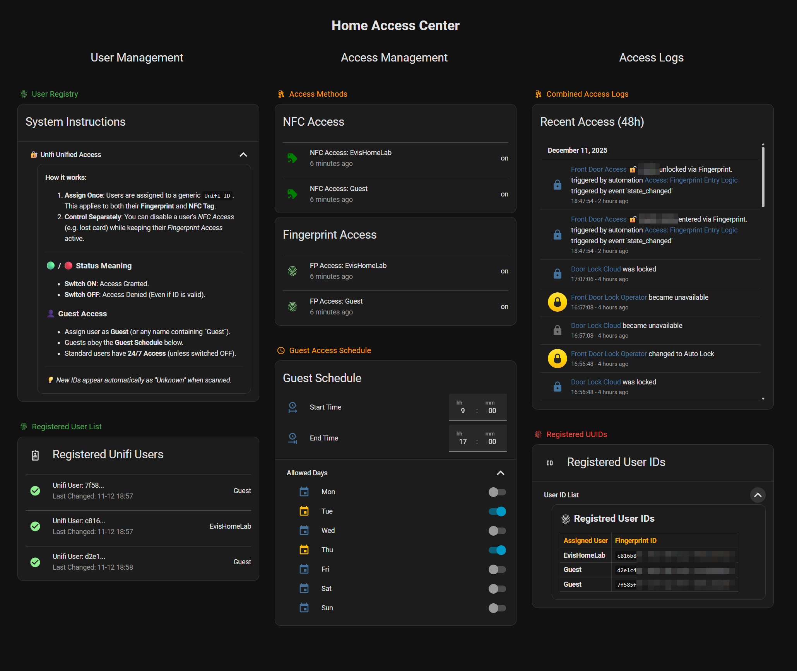

---
tags:
  - dashboard
  - view
  - automated
---

# Home Access Center

**Dashboard:** Home Access  
**Path:** `home-access-center`

<!-- START_DESCRIPTION -->
Centralized management interface for Unifi Access users, credentials, and guest schedules.
<!-- END_DESCRIPTION -->



## Summary
<!-- START_SUMMARY -->
The **Home Access Center** serves as the central administrative hub for managing physical security and entry credentials. Its primary function is to maintain a unified user registry where distinct hardware identifiers—such as Fingerprints and NFC tags—are mapped to specific individuals. This abstraction allows homeowners to easily enroll new keys, assign them to family members or guests, and instantly revoke permissions if a credential is lost or compromised.

In day-to-day use, this dashboard provides granular control over access logic. Administrators can toggle specific access methods on or off per user (e.g., disabling NFC while keeping Fingerprint active) and configure a strict **Guest Access Schedule** to limit entry to specific days and hours. Real-time audit logs provide immediate feedback on entry attempts, differentiating between successful unlocks, denied attempts due to schedule restrictions, and disabled credentials, ensuring complete visibility into the home's security status.
<!-- END_SUMMARY -->

## Related Packages
This view contains entities managed by:

* [Unifi Access](../../packages/unifi_access.md)


## Dependencies (Custom Cards)
Required HACS frontend resources:

* `custom:auto-entities`
* `custom:card-mod`
* `custom:fold-entity-row`
* `custom:hui-element`
* `custom:mushroom-title-card`
* `custom:template-entity-row`


## Configuration
```yaml
title: Home Access Center
icon: mdi:key-chain
type: sections
sections:
- type: grid
  cards:
  - type: custom:mushroom-title-card
    title: User Management
    alignment: center
    title_tap_action:
      action: none
    subtitle_tap_action:
      action: none
  - type: heading
    heading: User Registry
    icon: mdi:fingerprint
    heading_style: title
    card_mod:
      style: "ha-card {\n  border: none;\n  --primary-text-color: var(--green-color);\n\
        \  --secondary-text-color: var(--green-color);\n  --card-mod-icon-color: var(--green-color);\n\
        }\n"
  - type: entities
    title: System Instructions
    entities:
    - type: custom:fold-entity-row
      head:
        type: section
        label: 🔐 Unifi Unified Access
      entities:
      - type: custom:hui-element
        card_type: markdown
        content: '## UniFi Configuration

          1. Create User: Ensure a local user exists in the UniFi Console (e.g., "Guest").


          2. Enroll: Go to G4 Doorbell Settings > NFC/Fingerprints > Add New. Scan
          your finger or card and assign it to the UniFi user.


          3. Test: Scan the credential at the doorbell to verify it is accepted.

          ---

          ## Home Assistant Setup

          * New Credentials: Wait for the "New NFC ID" notification. Open Home Access
          Center and map the new ID to a Home Assistant user to enable permissions.


          * Existing Credentials: No action required; the credential will immediately
          inherit the user''s existing access rules.


          ---


          ### Access Status


          * 🟢 Green: Access Granted (Fingerprint AND NFC enabled).

          * 🟠 Orange: Partial Access (Fingerprint OR NFC enabled) - "Access still
          granted".

          * 🔴 Red: Access Denied (Fingerprint AND NFC disabled).

          ---

          ### 👤 Guest Access

          - Assign user as **Guest** (or any name containing "Guest").

          - Guests obey the **Guest Schedule** below.

          - Standard users have **24/7 Access** (unless switched OFF).


          ---


          *💡 New IDs appear automatically as "Unknown" when scanned.*

          '
  - type: heading
    heading: Registered User List
    icon: mdi:fingerprint
    heading_style: title
    card_mod:
      style: "ha-card {\n  border: none;\n  --primary-text-color: var(--green-color);\n\
        \  --secondary-text-color: var(--green-color);\n  --card-mod-icon-color: var(--green-color);\n\
        }\n"
  - type: custom:auto-entities
    card:
      type: entities
      title: Registered Unifi Users
      icon: mdi:badge-account-outline
    filter:
      include:
      - entity_id: select.unifi_user_*
        options:
          type: custom:template-entity-row
          entity: this.entity_id
          name: '{{ state_attr(config.entity, ''friendly_name'') | regex_replace(''(?i)unifi
            access db unifi user'', ''Unifi User:'') }}

            '
          secondary: 'Last Changed: {{ states[config.entity].last_changed.strftime(''%d-%m
            %H:%M'') }}'
          icon: '   {{ ''mdi:check-circle'' if (fp or nfc) else ''mdi:alert-circle''
            }}'
          card_mod:
            style: ":host::before {\n  content: \"\";\n  display: block;\n  height:\
              \ 1px;\n  background-color: #dddddd;\n  opacity: 0.2;\n  margin-top:\
              \ 10px;\n  margin-bottom: 10px;\n}\nstate-badge {\n  color: \n         \n         \n         \n           lightgreen\n\
              \         \n           orange\n         \n           #FB6464\n          !important;\n}\n"
      exclude: []
    sort:
      method: name
- type: grid
  cards:
  - type: custom:mushroom-title-card
    title: Access Management
    alignment: center
    title_tap_action:
      action: none
    subtitle_tap_action:
      action: none
  - type: heading
    heading: Access Methods
    icon: mdi:key-chain
    heading_style: title
    card_mod:
      style: "ha-card {\n  border: none;\n  --primary-text-color: var(--orange-color);\n\
        \  --secondary-text-color: var(--orange-color);\n  --card-mod-icon-color:\
        \ var(--orange-color);\n}\n"
  - type: custom:auto-entities
    card:
      type: entities
      title: NFC Access
      show_header_toggle: false
    filter:
      include:
      - options:
          type: custom:template-entity-row
          entity: this.entity_id
          name: '{{ state_attr(config.entity, ''friendly_name'') | replace(''Unifi
            Access DB '', '''') }}

            '
          secondary: '{{ relative_time(states[config.entity].last_changed) }} ago

            '
          card_mod:
            style: ":host::before {\n  content: \"\";\n  display: block;\n  height:\
              \ 1px;\n  background-color: #dddddd;\n  opacity: 0.2;\n  margin-top:\
              \ 10px;\n  margin-bottom: 10px;\n}\nstate-badge {\n  color: {{ 'green'\
              \ if is_state(config.entity, 'on') else '#fb6464' }} !important;\n}\n"
        entity_id: switch.nfc_access_*
      exclude:
      - options: {}
        state: unavailable
    sort:
      method: name
  - type: custom:auto-entities
    card:
      type: entities
      title: Fingerprint Access
      show_header_toggle: false
    filter:
      include:
      - options:
          type: custom:template-entity-row
          entity: this.entity_id
          name: '{{ state_attr(config.entity, ''friendly_name'') | replace(''Unifi
            Access DB '', '''') }}

            '
          secondary: '{{ relative_time(states[config.entity].last_changed) }} ago

            '
          card_mod:
            style: ":host::before {\n  content: \"\";\n  display: block;\n  height:\
              \ 1px;\n  background-color: #dddddd;\n  opacity: 0.2;\n  margin-top:\
              \ 10px;\n  margin-bottom: 10px;\n}\nstate-badge {\n  color: {{ 'lightgreen'\
              \ if is_state(config.entity, 'on') else '#fb6464' }} !important;\n}\n"
        entity_id: switch.fp_access_*
      exclude:
      - options: {}
        state: unavailable
    sort:
      method: name
  - type: heading
    heading: Guest Access Schedule
    icon: mdi:clock-outline
    heading_style: title
    card_mod:
      style: "ha-card {\n  border: none;\n  --primary-text-color: var(--orange-color);\n\
        \  --secondary-text-color: var(--orange-color);\n  --card-mod-icon-color:\
        \ var(--orange-color);\n}\n"
  - type: entities
    title: Guest Schedule
    show_header_toggle: false
    state_color: true
    entities:
    - entity: input_datetime.guest_access_start
      name: Start Time
    - entity: input_datetime.guest_access_end
      name: End Time
    - type: custom:fold-entity-row
      head:
        type: section
        label: Allowed Days
      entities:
      - input_boolean.guest_access_mon
      - input_boolean.guest_access_tue
      - input_boolean.guest_access_wed
      - input_boolean.guest_access_thu
      - input_boolean.guest_access_fri
      - input_boolean.guest_access_sat
      - input_boolean.guest_access_sun
- type: grid
  cards:
  - type: custom:mushroom-title-card
    title: Access Logs
    alignment: center
    title_tap_action:
      action: none
    subtitle_tap_action:
      action: none
  - type: heading
    heading: Combined Access Logs
    icon: mdi:key-chain
    heading_style: title
    card_mod:
      style: "ha-card {\n  border: none;\n  --primary-text-color: var(--orange-color);\n\
        \  --secondary-text-color: var(--orange-color);\n  --card-mod-icon-color:\
        \ var(--orange-color);\n}\n"
  - type: logbook
    title: Recent Access (48h)
    hours_to_show: 48
    entities:
    - lock.front_door_lock_cloud
    - sensor.front_door_lock_operator
    grid_options:
      columns: 12
      rows: 10
  - type: heading
    heading: Registered UUIDs
    icon: mdi:fingerprint
    heading_style: title
    card_mod:
      style: "ha-card {\n  border: none;\n  --primary-text-color: var(--red-color);\n\
        \  --secondary-text-color: var(--red-color);\n  --card-mod-icon-color: var(--red-color);\n\
        }\n"
  - type: entities
    title: Registered User IDs
    icon: mdi:identifier
    entities:
    - type: custom:fold-entity-row
      head:
        type: section
        label: User ID List
      entities:
      - type: custom:hui-element
        card_type: markdown
        content: '## <ha-icon icon="mdi:fingerprint"></ha-icon> Registred User IDs


          | <font color=orange>Assigned User</font> | <font color=orange>Fingerprint
          ID</font> |

          | :--- | :--- |

          

          

          

          

          | **{{ assigned }}** | `{{ (state.attributes.ulp_id | default(''unknown'')).strip()
          }}` |

          

          

          

          

          

          

          

          

          | **{{ display_name }}** | `{{ (state.attributes.ulp_id | default(''unknown'')).strip()
          }}` |

          

          

          | No fingerprints | found yet |

          

          '
header:
  card:
    type: markdown
    text_only: true
    content: '# Home Access Center'
max_columns: 4
cards: []
path: home-access-center
top_margin: false

```
