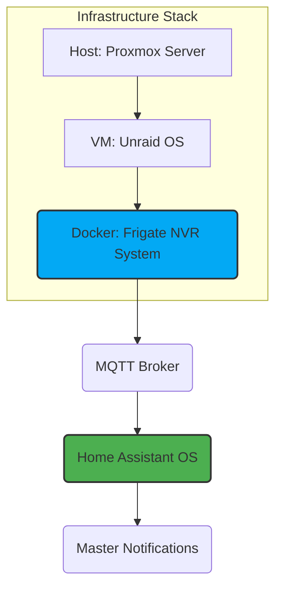

---
tags:
- security
- network
- frigate
- infrastructure
- manual
version: 1.0.1
---

# Frigate NVR System Documentation

**Version:** 1.0.4 (Unifi Source and Device Details Added)
**Source:** External `config.yml` running on Unraid.
**Description:** Documentation of the external Frigate NVR instance (running on Unraid/Docker) and its connection to Home Assistant for critical notifications.

## Executive Summary

Frigate is the critical component responsible for local object detection and event management for all security cameras. It runs externally on the Unraid VM within the HALO Proxmox server stack.

Source NVR: All camera feeds originate from the Unifi Protect NVR (Dream Machine Pro). The specific camera models and locations are:

* Backyard: G5 Turret Ultra
* Front Door: G4 Doorbell Pro PoE
* Front Porch: G5 Turret Ultra
* Storage Cam: G3 Instant

**Management Note**: Accessing the Frigate WebUI and API is facilitated by the Frigate Proxy Add-on within Home Assistant, which simplifies network configuration and authentication.

This configuration is optimized for high-performance detection using two Coral Edge TPUs and NVIDIA hardware acceleration (H.264) for video decoding. Video streams are managed centrally by Go2RTC and then sent internally to Frigate for detection/recording roles.

**Detection Focus**: Tracking is focused solely on person objects (min score 0.7).

**Recording**: Clips and recordings are enabled for all cameras.

**Retention Policy**: Clips/Detections are kept for 10 days, general recordings for 4 days.

## Architecture & Data Flow

This diagram illustrates how the infrastructure layers feed data to Home Assistant. The health check sensor monitors if the final MQTT output is running.



## Configuration

The configuration is managed via the external `config.yml` file running on Unraid. The configuration is detailed in the [Frigate documentation](https://docs.frigate.video/).

```yaml
# ------------------------------------------------------------------------------
# 2. EXTERNAL CONFIGURATION DOCUMENTATION
# ------------------------------------------------------------------------------
mqtt:
  host: [IP REDACTED] # Central MQTT Broker IP
  user: !secret mqtt_user # MQTT Login (Secret in HA secrets.yaml)
  password: !secret mqtt_password

detectors:
  # Using two Coral devices assigned via PCI passthrough (pci:0 and pci:1)
  # This provides high throughput for simultaneous detection across multiple cameras.
  coral1:
    type: edgetpu
    device: pci:0
  coral2:
    type: edgetpu
    device: pci:1

ffmpeg:
  # Uses the preset for NVIDIA hardware acceleration to decode H.264 streams.
  # This significantly reduces CPU load, offloading heavy processing to the GPU.
  hwaccel_args: preset-nvidia-h264

# GLOBAL DETECT SETTINGS
detect:
  # Detection frame rate set to 5 FPS to reduce load while maintaining accuracy.
  fps: 5
  enabled: true

objects:
  # Only tracking humans to minimize false positives from animals/vehicles.
  track:
    - person
  filters:
    person:
      min_area: 5000 # Minimum size of object in image to trigger detection.
      min_score: 0.5 # Minimum score to begin tracking an object.
      threshold: 0.7 # Minimum score to declare a true positive detection (for alerts).


record:
  enabled: true
  expire_interval: 60 # Check for old files every 60 minutes.
  retain:
    days: 4 # General recording retention period.
    mode: all
  alerts:
    retain:
      days: 10 # Clips from alerts (events) are kept longer.
      mode: active_objects
    pre_capture: 5 # Record 5 seconds BEFORE event trigger.
    post_capture: 5 # Record 5 seconds AFTER event ends.
  detections:
    retain:
      days: 10
      mode: active_objects
    pre_capture: 5
    post_capture: 5


snapshots:
  enabled: true
  timestamp: true # Adds date/time to the image.
  bounding_box: true # Draws a box around the detected object.
  crop: false
  retain:
    default: 10 # Snapshots kept for 10 days.


# ---------------------------------------------------
# GO2RTC - THE HUB (Central Stream Management)
# ---------------------------------------------------
go2rtc:
  streams:
    # All streams are routed via go2rtc (rtsp://127.0.0.1:8554/...) 
    # This prevents Frigate from directly hitting the Unifi NVR, improving stability.

    # --- Front Doorbell ---
    frontdoor_doorbell_unifi_high: # High Res stream used for recording
      - rtsp://[IP REDACTED]:7447/[TOKEN REDACTED] # Input stream token
      - ffmpeg:frontdoor_doorbell_frigate#audio=opus # Output restream options
    frontdoor_doorbell_unifi_med: # Medium Res stream used for detection
      - rtsp://[IP REDACTED]:7447/[TOKEN REDACTED]

    # --- Front Porch ---
    front_porch_unifi_high: # High Res stream
      - rtsp://[IP REDACTED]:7447/[TOKEN REDACTED]
      - ffmpeg:front_porch_frigate#audio=opus
    front_porch_unifi_med: # Medium Res stream
      - rtsp://[IP REDACTED]:7447/[TOKEN REDACTED]

    # --- Backyard ---
    backyard_unifi_high: # High Res stream
      - rtsp://[IP REDACTED]:7447/[TOKEN REDACTED]
      - ffmpeg:backyard_high#audio=opus
    backyard_unifi_med: # Medium Res stream
      - rtsp://[IP REDACTED]:7447/[TOKEN REDACTED]
    
    # --- Storage ---
    storage_unifi_high: # High Res stream
      - rtsp://[IP REDACTED]:7447/[TOKEN REDACTED]
      - ffmpeg:storage_frigate#audio=opus
    storage_unifi_med: # Medium Res stream
      - rtsp://[IP REDACTED]:7447/[TOKEN REDACTED]
    storage_unifi_low: # Low Res stream (likely detection input)
      - rtsp://[IP REDACTED]:7447/[TOKEN REDACTED]

  webrtc:
    candidates:
      # WebRTC candidate IP/Port, necessary for low-latency streaming in dashboards
      - [IP REDACTED]:8555 
      - stun:8555


timestamp_style:
  position: br # Position timestamp Bottom Right
  format: '%Y-%m-%d %H:%M:%S'
  thickness: 2
  effect: solid 

# ---------------------------------------------------
# CAMERAS (Frigate Processing Definitions)
# ---------------------------------------------------
cameras:

  ## FRONTDOOR DOORBELL
  frontdoor_doorbell_frigate:
    enabled: true
    ffmpeg:
      output_args:
        record: preset-record-ubiquiti
      inputs:
        # Input 1: High Res stream used ONLY for recording clips (rtsp://127.0.0.1:8554/...)
        - path: rtsp://127.0.0.1:8554/frontdoor_doorbell_unifi_high?video&audio 
          roles:
            - record
        # Input 2: Low Res stream used ONLY for object detection (reduced processing load)
        - path: rtsp://127.0.0.1:8554/frontdoor_doorbell_unifi_med?video
          roles:
            - detect
    detect:
      width: 960
      height: 720
    motion:
      threshold: 20

  ## FRONT PORCH
  front_porch_frigate:
    enabled: true
    ffmpeg:
      output_args:
        record: preset-record-ubiquiti
      inputs:
        - path: rtsp://127.0.0.1:8554/front_porch_unifi_high?video&audio 
          input_args: preset-rtsp-restream
          roles:
            - record
        - path: rtsp://127.0.0.1:8554/front_porch_unifi_med?video
          roles:
            - detect
    detect:
      width: 1280
      height: 720

  ## BACKYARD CAMERA
  backyard_frigate:
    enabled: true
    ffmpeg:
      output_args:
        record: preset-record-ubiquiti
      inputs:
        - path: rtsp://127.0.0.1:8554/backyard_unifi_high?video&audio 
          input_args: preset-rtsp-restream
          roles:
            - record
        - path: rtsp://127.0.0.1:8554/backyard_unifi_med?video
          roles:
            - detect 
    detect:
      width: 1280
      height: 720
    objects:
      filters:
        person:
          # Detection mask to ignore certain areas of the frame (e.g., inside the house, trees, road).
          mask: 0.733,0.989,0.875,0.582,0.996,0.215,0.998,0.993

  ## STORAGE CAMERA
  storage_frigate:
    enabled: true
    ffmpeg:
      output_args:
        record: preset-record-ubiquiti
      inputs:
        - path: rtsp://127.0.0.1:8554/storage_unifi_high?video&audio 
          input_args: preset-rtsp-restream
          roles:
            - record
        - path: rtsp://127.0.0.1:8554/storage_unifi_low?video
          roles:
            - detect 
    detect:
      width: 640
      height: 360


version: 0.16-0
camera_groups:
  Outdoors:
    order: 1
    icon: LuSprout
    cameras:
      - frontdoor_doorbell_frigate
      - backyard_frigate
      - front_porch_frigate
      - storage_frigate
```

## Health Checks

The system includes health checks for the Frigate NVR system. These checks are detailed in the [Frigate documentation](https://docs.frigate.video/).
