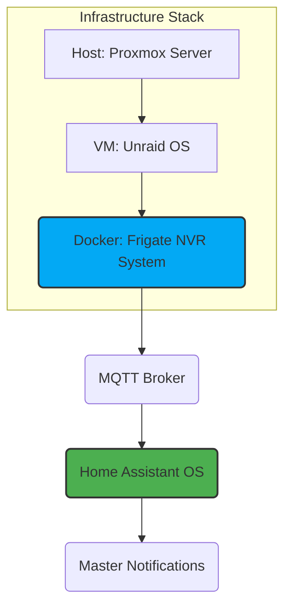

---
tags:
- security
- network
- frigate
- infrastructure
- manual
version: 1.0.1
---

# Frigate NVR System Documentation

**Version:** 1.0.1 (Documentation Only)
**Source:** External `config.yml` running on Unraid.
**Description:** Documentation of the external Frigate NVR instance (running on Unraid/Docker) and its connection to Home Assistant for critical notifications.

## Executive Summary

Frigate is the critical component responsible for local object detection and event management for all security cameras. It runs externally on the Unraid VM within the HALO Proxmox server stack.

This configuration is optimized for high-performance detection using two Coral Edge TPUs and NVIDIA hardware acceleration (H.264) for video decoding. Video streams are managed centrally by Go2RTC and then sent internally to Frigate for detection/recording roles.

* Detection Focus: Tracking is focused solely on person objects (min score 0.7).
* Recording: Clips and recordings are enabled for all cameras.
* Retention Policy: Clips/Detections are kept for 10 days, general recordings for 4 days.

## Architecture & Data Flow

This diagram illustrates how the infrastructure layers feed data to Home Assistant. The health check sensor monitors if the final MQTT output is running.



## Configuration

The configuration is managed via the external `config.yml` file running on Unraid. The configuration is detailed in the [Frigate documentation](https://docs.frigate.video/).

```yaml
# ------------------------------------------------------------------------------
# 2. EXTERNAL CONFIGURATION DOCUMENTATION
# ------------------------------------------------------------------------------
mqtt:
  host: [IP REDACTED]
  user: !secret mqtt_user
  password: !secret mqtt_password

detectors:
  coral1:
    type: edgetpu
    device: pci:0
  coral2:
    type: edgetpu
    device: pci:1

ffmpeg:
  hwaccel_args: preset-nvidia-h264

# GLOBAL DETECT SETTINGS
detect:
  fps: 5
  enabled: true

objects:
  track:
    - person
  filters:
    person:
      min_area: 5000
      min_score: 0.5 # start tracking
      threshold: 0.7 # true positive detection

record:
  enabled: true
  expire_interval: 60 # number of minutes to wait between cleanup runs
  retain:
    days: 4
    mode: all
  alerts:
    retain:
      days: 10
      mode: active_objects
    pre_capture: 5
    post_capture: 5
  detections:
    retain:
      days: 10
      mode: active_objects
    pre_capture: 5
    post_capture: 5

snapshots:
  enabled: true
  timestamp: true # print a timestamp on the snapshots
  bounding_box: true # draw bounding box on the snapshot
  crop: false # crop the snapshot
  retain:
    default: 10

# ---------------------------------------------------
# GO2RTC - THE HUB
# ---------------------------------------------------
go2rtc:
  streams:

    # --- Front Doorbell ---
    frontdoor_doorbell_unifi_high: # 1600 x 1200
      - rtsp://[IP REDACTED]:7447/[TOKEN REDACTED]
      - ffmpeg:frontdoor_doorbell_frigate#audio=opus
    frontdoor_doorbell_unifi_med: # 960 x 720
      - rtsp://[IP REDACTED]:7447/[TOKEN REDACTED]

    # --- Front Porch ---
    front_porch_unifi_high: # 2688 x 1512
      - rtsp://[IP REDACTED]:7447/[TOKEN REDACTED]
      - ffmpeg:front_porch_frigate#audio=opus
    front_porch_unifi_med: # 1280 x 720
      - rtsp://[IP REDACTED]:7447/[TOKEN REDACTED]

    # --- Backyard ---
    backyard_unifi_high: # 2688 x 1512
      - rtsp://[IP REDACTED]:7447/[TOKEN REDACTED]
      - ffmpeg:backyard_high#audio=opus
    backyard_unifi_med: # 1280x720
      - rtsp://[IP REDACTED]:7447/[TOKEN REDACTED]
    
    # --- Storage ---
    storage_unifi_high: # 1980 x 1080
      - rtsp://[IP REDACTED]:7447/[TOKEN REDACTED]
      - ffmpeg:storage_frigate#audio=opus
    storage_unifi_med: # 1024 x 576
      - rtsp://[IP REDACTED]:7447/[TOKEN REDACTED]
    storage_unifi_low: # 640 x 360
      - rtsp://[IP REDACTED]:7447/[TOKEN REDACTED]

  webrtc:
    candidates:
      - [IP REDACTED]:8555
      - stun:8555


timestamp_style:
  position: br
  format: '%Y-%m-%d %H:%M:%S'
  thickness: 2
  effect: solid 

cameras:

# ---------------------------------------------------
# CAMERAS
# ---------------------------------------------------
  ## FRONTDOOR DOORBELL
  frontdoor_doorbell_frigate:
    enabled: true
    ffmpeg:
      output_args:
        record: preset-record-ubiquiti
      inputs:
        # Input 1: High Res for Recording
        - path: rtsp://127.0.0.1:8554/frontdoor_doorbell_unifi_high?video&audio # go2rtc restream
          roles:
            - record
        # Input 2: Low Res for Detection
        - path: rtsp://127.0.0.1:8554/frontdoor_doorbell_unifi_med?video
          roles:
            - detect
    detect:
      width: 960
      height: 720
    motion:
      threshold: 20

  ## FRONT PORCH
  front_porch_frigate:
    enabled: true
    ffmpeg:
      output_args:
        record: preset-record-ubiquiti
      inputs:
        - path: rtsp://127.0.0.1:8554/front_porch_unifi_high?video&audio # go2rtc restream
          input_args: preset-rtsp-restream
          roles:
            - record
        - path: rtsp://127.0.0.1:8554/front_porch_unifi_med?video
          roles:
            - detect
    detect:
      width: 1280
      height: 720

  ## BACKYARD CAMERA
  backyard_frigate:
    enabled: true
    ffmpeg:
      output_args:
        record: preset-record-ubiquiti
      inputs:
        - path: rtsp://127.0.0.1:8554/backyard_unifi_high?video&audio # high resolution stream (1920x1080) # go2rtc restream
          input_args: preset-rtsp-restream
          roles:
            - record
        - path: rtsp://127.0.0.1:8554/backyard_unifi_med?video
          roles:
            - detect 
    detect:
      width: 1280
      height: 720
    objects:
      filters:
        person:
          mask: 0.733,0.989,0.875,0.582,0.996,0.215,0.998,0.993

  ## STORAGE CAMERA
  storage_frigate:
    enabled: true
    ffmpeg:
      output_args:
        record: preset-record-ubiquiti
      inputs:
        - path: rtsp://127.0.0.1:8554/storage_unifi_high?video&audio # go2rtc restream
          input_args: preset-rtsp-restream
          roles:
            - record
        - path: rtsp://127.0.0.1:8554/storage_unifi_low?video
          roles:
            - detect 
    detect:
      width: 640
      height: 360


version: 0.16-0
camera_groups:
  Outdoors:
    order: 1
    icon: LuSprout
    cameras:
      - frontdoor_doorbell_frigate
      - backyard_frigate
      - front_porch_frigate
      - storage_frigate
```

## Health Checks

The system includes health checks for the Frigate NVR system. These checks are detailed in the [Frigate documentation](https://docs.frigate.video/).
