---
tags:
  - integration
  - manual
  - ai
  - docker
---

# Integration: AI Log Reporter

**Type:** Remote Docker Container  
**Host:** `10.0.0.23`  
**Language:** Python 3.11  

## Overview
The **AI Log Reporter** is an external system designed to offload heavy log analysis from the Home Assistant host. It runs in a Docker container on a separate server, allowing it to process large datasets without impacting HA performance.

## Architecture

The system works via a "Pull & Push" mechanism:
1.  **Trigger:** Home Assistant opens a secure SSH tunnel to the host.
2.  **Execution:** HA executes the python script inside the running container.
3.  **Callback:** The script analyzes the data and pushes the result back to Home Assistant via the API.

```mermaid
sequenceDiagram
    participant HA as 🏠 Home Assistant
    participant SSH as 🔐 SSH Tunnel
    participant Docker as 🐳 Docker (ai-log-reporter)
    participant API as 📡 HA API

    HA->>SSH: Connect (Identity File)
    SSH->>Docker: exec python /app/reporter.py
    activate Docker
    Docker->>Docker: Analyze Logs & Generate Summary
    Docker->>API: POST /api/events/update_ai_summary
    deactivate Docker
```



## Deployment

### Docker Compose
The system is deployed using a standard `docker-compose.yml` file on the remote host.

```yaml
version: '3.8'
services:
  reporter:
    container_name: ai-log-reporter
    image: python:3.11-slim
    restart: unless-stopped
    volumes:
      - ./app:/app
      - ./logs:/logs:ro
    environment:
      - HA_URL=http://10.0.0.5:8123
      - HA_TOKEN=klsjdflkjsdf...
    command: tail -f /dev/null  # Keep alive for exec
```

### The Reporter Script
The core logic resides in `reporter.py`. It uses the Gemini API to summarize text.

```python
# /app/reporter.py (Simplified)
import requests
import os

def analyze_logs():
    # ... logic to read files ...
    summary = "System is stable. No critical errors found."
    
    # Send Event to HA
    url = f"{os.getenv('HA_URL')}/api/events/update_ai_summary"
    headers = {"Authorization": f"Bearer {os.getenv('HA_TOKEN')}"}
    requests.post(url, json={"summary": summary}, headers=headers)

if __name__ == "__main__":
    analyze_logs()
```

## Related Components
*   **[Ai Summary Package](../packages/ai_summary.md)**: The Home Assistant configuration that triggers this integration.
