---
tags:
  - integration
  - manual
  - ai
  - docker
  - monitoring
---

# Integration: AI Log Reporter

**Type:** Remote Monitoring Stack  
**Host:** Docker Capable Server (e.g., Unraid)  
**Language:** Python 3.11  

## Overview

The **AI Log Reporter** is part of a larger **Monitoring Stack** that aggregates logs from various services (proxmox, unifi, promtail, docker, etc.) into **Loki**. A custom Python container then queries Loki for errors, uses Google Gemini 2.0 Flash to summarize them, and reports the health status back to Home Assistant.

## Process Description (Non-Technical)

Think of this system as a **Digital Security Guard** that patrols your server logs every morning.

1.  **Collection:** All your servers (Unraid, Home Assistant, Routers) constantly write their specific "diaries" (logs) into a central safe, which we call **Loki**.
2.  **The Patrol:** Every morning, the Guard (our Python Script) wakes up and reads through the last 24 hours of diaries.
3.  **Filtering:** It ignores distinct "normal" events (like a door opening) and specifically hunts for "red ink" — words like *Error*, *Failure*, *Warning*, or *Unauthorized*.
4.  **Analysis:** It takes these scary-looking error messages and hands them to a **Forensic Expert** (Google Gemini AI). The Expert translates the technical gibberish into a simple English report, explaining what broke and why.
5.  **Reporting:** Finally, the Guard sends this simplified report directly to your phone (via Home Assistant), so you know if your system is healthy without ever looking at a line of code.

## Architecture

```mermaid
sequenceDiagram
    participant HA as 🏠 Home Assistant
    participant Docker as 🐳 Log Reporter
    participant Loki as 🦁 Loki
    participant Gemini as ✨ Gemini AI
    participant API as 📡 HA API

    HA->>Docker: Trigger Script (SSH)
    activate Docker
    Docker->>Loki: Query Logs (Last 24h)
    Loki-->>Docker: JSON Logs
    Docker->>Docker: Filter Errors (Regex)
    Docker->>Gemini: Analyze Context (AI)
    Gemini-->>Docker: "System Logic Failure in Disk 2"
    Docker->>API: POST /api/events/update_ai_summary
    deactivate Docker
```



## Deployment Setup

The monitoring stack is composed of multiple service layers. Follow the guide below to set up the file structure and containers.

### 1. Directory Structure

Create the following folder structure on your Host machine (e.g., `/mnt/docker/appdata/`). This ensures each service has a place to store its configuration.

```text
/mnt/docker/appdata/
├── loki/
│   └── local-config.yaml   # Configuration for the Log Database
├── otel-collector/
│   └── config.yaml         # Configuration for the Log Collector
├── grafana/                # Storage for Dashboards (Auto-created)
└── ai-reporter/
    └── reporter.py         # The Python Brain of the operation
```

### 2. The Log Database (Loki)

**File Path:** `/mnt/docker/appdata/loki/local-config.yaml`
**Purpose:** Configures Loki to listen for logs and store them efficiently in the filesystem.

```yaml
auth_enabled: false  # Disable authentication for local network simplicity

server:
  http_listen_port: 3100  # Default port for Loki API

common:
  instance_addr: 0.0.0.0
  path_prefix: /loki
  storage:
    filesystem:
      chunks_directory: /loki/chunks  # Store log chunks on disk
      rules_directory: /loki/rules
  replication_factor: 1  # Single node setup (no clustering)
  ring:
    kvstore:
      store: inmemory

schema_config:
  configs:
    - from: 2024-04-01
      store: tsdb  # Time Series Database format
      object_store: filesystem
      schema: v13
      index:
        prefix: index_
        period: 24h  # Create a new index file every day

limits_config:
  allow_structured_metadata: true  # Allow extra labels in logs
```

### 3. The Log Collector (OTel)

**File Path:** `/mnt/docker/appdata/otel-collector/config.yaml`
**Purpose:** Receives logs from various sources (standardizing them via OpenTelemetry) and pushes them to Loki.

```yaml
receivers:
  otlp:
    protocols:
      grpc:
      http:

processors:
  batch:  # Batches logs to reduce network calls

exporters:
  otlphttp:
    endpoint: "http://localhost:3100/otlp" # Sends to Loki
    tls:
      insecure: true

service:
  pipelines:
    logs:
      receivers: [otlp]
      processors: [batch]
      exporters: [otlphttp]
```

### 4. The Intelligence (Reporter Script)

**File Path:** `/mnt/docker/appdata/ai-reporter/reporter.py`
**Purpose:** This script connects the pieces. It fetches raw data from Loki, sends it to Gemini for reasoning, and notifies Home Assistant.

```python
import os
import requests
import datetime
import time
from google import genai

# --- CONFIGURATION ---
# Load secrets from Environment Variables (set in docker-compose)
LOKI_URL = os.getenv("LOKI_URL", "http://localhost:3100")
GEMINI_API_KEY = os.getenv("GEMINI_API_KEY")
HA_URL = os.getenv("HA_URL")
HA_TOKEN = os.getenv("HA_TOKEN")

# --- 1. FETCH LOGS (FULL CAPACITY) ---
def get_loki_logs():
    """Fetches logs from the last 24h, filtering for errors AND security events."""
    
    # Calculate nanosecond timestamps for Loki API
    end_time_ns = int(time.time() * 1e9)
    start_time_ns = end_time_ns - (24 * 60 * 60 * 1000000000) # 24 Hours ago

    # SMART QUERY:
    # 1. {job=~".+"} matches ALL jobs/containers
    # 2. |~ "(?i)..." is a Case-Insensitive Regex filter
    # 3. We catch: error, warn, fail, exception, timeout, blocked (firewall), 
    #    detected (security), smartd (disk health), accessed (auth)
    query = '{job=~".+"} |~ "(?i)error|warn|fail|exception|timeout|blocked|detected|smartd|accessed"'

    params = {
        'query': query,
        'limit': 5000,  # Grab up to 5000 lines (we will crop later if needed)
        'start': start_time_ns,
        'end': end_time_ns,
        'direction': 'backward' # Newest first
    }

    print(f"Querying Loki at {LOKI_URL}...")
    try:
        response = requests.get(f"{LOKI_URL}/loki/api/v1/query_range", params=params)
        response.raise_for_status()
        data = response.json()

        logs = []
        if 'data' in data and 'result' in data['data']:
            for stream in data['data']['result']:
                labels = stream.get('metric', {})
                # Extract the source name: clean up identifying labels
                source = labels.get('container_name') or labels.get('service_name') or 'unknown'

                for entry in stream['values']:
                    # Format: [ContainerName] Log Message
                    logs.append(f"[{source}] {entry[1]}")

        if not logs:
            return "No critical errors or security events found in the last 24 hours."

        print(f"Found {len(logs)} relevant log lines.")
        return "\n".join(logs)

    except Exception as e:
        return f"Error fetching logs: {str(e)}"

# --- 2. SUMMARIZE WITH GEMINI (PAID TIER) ---
def summarize_with_gemini(logs):
    """Sends logs to Gemini (Using Gemini 2.0 Flash for speed/cost balance)."""
    
    # Fail-fast if no logs
    if not logs or "Error fetching logs" in logs or "No critical errors" in logs:
        return logs

    client = genai.Client(api_key=GEMINI_API_KEY)

    # --- TOKEN LIMIT PROTECTION ---
    # Gemini 2.0 Flash has a huge context window, but we still cap it to be safe.
    # 75,000 chars is roughly 18k tokens.
    max_chars = 75000
    if len(logs) > max_chars:
        logs = logs[:max_chars] + "\n...[TRUNCATED TO 75k CHARS]..."

    prompt = (
        "You are a Senior Site Reliability Engineer (SRE) AI. Analyze these Home Lab logs (Docker, Proxmox, Unifi).\n"
        "Your goal is to provide a clean, actionable daily report.\n\n"
        "**ANALYSIS RULES:**\n"
        "1. **Group & Deduplicate:** If an error repeats, Do NOT list same error 50 times. Say 'Traefik Error on [ubuntu-vm] (x50)'. ALWAYS mention the source machine name.\n"
        "2. **Identify Root Causes:** If you see 'Connection Refused', identify *which* service is down.\n"
        "3. **Categorize with Emojis:**\n"
        "   - 🔴 **CRITICAL:** Data loss risk, disk failure (smartd), boot crashes, service death.\n"
        "   - 🛡️  **SECURITY:** Firewall blocks, failed login attempts (brute force).\n"
        "   - 🟡 **WARNING:** Timeouts, high latency, non-critical config errors.\n"
        "4. **Format:** Use a clean Markdown bullet list. Be concise.\n\n"
        f"LOGS TO ANALYZE:\n{logs}"
    )

    try:
        response = client.models.generate_content(
            model="gemini-2.0-flash",
            contents=prompt
        )
        return response.text
    except Exception as e:
        return f"Gemini API Error: {str(e)}"

# --- 3. POST TO HOME ASSISTANT ---
def post_to_home_assistant(summary):
    """Sends the summary back to Home Assistant."""
    headers = {
        "Authorization": f"Bearer {HA_TOKEN}",
        "Content-Type": "application/json",
    }

    # Endpoint 1: Persistent Notification (Popup in HA)
    url_notify = f"{HA_URL}/api/services/persistent_notification/create"
    payload_notify = {
        "message": summary,
        "title": f"🤖 Daily Lab Report ({datetime.datetime.now().strftime('%H:%M')})",
        "notification_id": "daily_ai_summary"
    }

    # Endpoint 2: Update Sensor State (For Dashboards)
    url_sensor = f"{HA_URL}/api/states/sensor.daily_system_summary"
    payload_sensor = {
        # The main state is just the timestamp
        "state": datetime.datetime.now().strftime('%Y-%m-%d %H:%M'),
        # The actual AI report lives in the attributes
        "attributes": {
            "summary": summary, 
            "friendly_name": "Daily System Summary",
            "icon": "mdi:robot"
        }
    }

    try:
        # Send Notification
        res1 = requests.post(url_notify, headers=headers, json=payload_notify)
        res1.raise_for_status()

        # Update Sensor
        res2 = requests.post(url_sensor, headers=headers, json=payload_sensor)
        res2.raise_for_status()

        print("Success: Notification sent and Dashboard sensor updated.")
    except Exception as e:
        print(f"HA Post Error: {str(e)}")

# --- MAIN EXECUTION ---
if __name__ == "__main__":
    print("Fetching logs...")
    logs = get_loki_logs()

    print(f"Summarizing {len(logs)} characters of data...")
    summary = summarize_with_gemini(logs)

    print("Posting to HA...")
    post_to_home_assistant(summary)
    print("Done.")
```

### 5. Orchestration (Docker Compose)

**File Path:** `/mnt/docker/appdata/docker-compose.yaml` (or run via Portainer stack)
**Purpose:** Defines and runs all the containers together.

```yaml
services:
  # --- LOG DATABASE ---
  loki:
    image: grafana/loki:3.1.0
    container_name: loki
    user: "0:0"  # CRITICAL: Runs as root to bypass Unraid/Linux permission issues with bind mounts
    volumes:
      - /mnt/docker/appdata/loki:/loki
      - /etc/localtime:/etc/localtime:ro
      - /etc/timezone:/etc/timezone:ro
    command: -config.file=/loki/local-config.yaml
    environment:
      - TZ=Europe/Helsinki
    network_mode: host # Uses host networking for max performance and easy discovery
    restart: unless-stopped

  # --- LOG INGESTION ---
  otel-collector:
    image: otel/opentelemetry-collector-contrib:0.98.0
    container_name: otel-collector
    user: "0:0"
    volumes:
      - /mnt/docker/appdata/otel-collector/config.yaml:/etc/otelcol-contrib/config.yaml:ro
      # Grants access to Docker logs on the host
      - /var/lib/docker/containers:/var/lib/docker/containers:ro 
      - /etc/localtime:/etc/localtime:ro
      - /etc/timezone:/etc/timezone:ro
    environment:
      - TZ=Europe/Helsinki
    restart: unless-stopped
    network_mode: host
    depends_on:
      - loki # Wait for database to start

  # --- VISUALIZATION (Optional) ---
  grafana:
    image: grafana/grafana:latest
    container_name: grafana
    restart: unless-stopped
    environment:
      - TZ=Europe/Helsinki
    ports:
      - "3000:3000" # Web UI Port
    volumes:
      - /mnt/docker/appdata/grafana:/var/lib/grafana
      - /etc/localtime:/etc/localtime:ro
      - /etc/timezone:/etc/timezone:ro

  # --- AI ANALYSIS ---
  ai-log-reporter:
    image: python:3.11-slim
    container_name: ai-log-reporter
    volumes:
      - /mnt/docker/appdata/ai-reporter:/app
      - /etc/localtime:/etc/localtime:ro
      - /etc/timezone:/etc/timezone:ro
    environment:
      - TZ=Europe/Helsinki
      - LOKI_URL=http://localhost:3100
      # REPLACE THESE WITH YOUR KEYS
      - GEMINI_API_KEY=YOUR_GEMINI_API_KEY_HERE
      - HA_URL=http://YOUR_HA_IP:8123
      - HA_TOKEN=YOUR_LONG_LIVED_ACCESS_TOKEN_HERE
    # This command installs dependencies, runs the script ONCE, and then sleeps forever.
    # This allows us to use 'docker exec' later to trigger runs on demand without restarting.
    command: >
      sh -c "pip install requests google-genai && 
      python /app/reporter.py && 
      tail -f /dev/null"
    restart: unless-stopped
    network_mode: host
```

## 🧩 Consumers

The following Home Assistant packages rely on this integration:

| Package | Description |
| :--- | :--- |
| **[AI Summary](../packages/ai_summary.md)** | Controls the scheduling (7:00 AM) of this reporter and exposes the results as a Sensor. |

