---
tags:
  - package
  - automated
version: 1.0.0
---

# Package: Ai Summary

**Version:** 1.0.0  
**Description:** Frontend controller for the remote AI Log Reporter integration.

<!-- START_IMAGE -->

<!-- END_IMAGE -->

## Executive Summary
<!-- START_SUMMARY -->
The **AI Summary** package serves as the Home Assistant-side controller for the **[AI Log Reporter Integration](../integrations/ai_reporter.md)**. It manages the scheduling, triggering, and data ingestion of daily system reports generated by a remote AI agent. This package ensures that the heavy lifting of log analysis is offloaded to a dedicated Docker container while keeping the results fully integrated into the Home Assistant dashboard via native sensors and notifications.
<!-- END_SUMMARY -->

## Process Description (Non-Technical)
<!-- START_DETAILED -->
This system runs automatically every morning at 7:00 AM.
1.  **Trigger:** The system wakes up and sends a "Start" command to a remote server.
2.  **Analysis:** The remote server (running a specialized AI Reporter) reads the logs from the past 24 hours. It looks for errors, warnings, and unusual patterns.
3.  **Reporting:** Once finished, the remote server sends a summary back to Home Assistant.
4.  **Notification:** You receive a notification on your phone (and a persistent message in the dashboard) summarizing the health of your smart home.
<!-- END_DETAILED -->

## Dashboard Connections
<!-- START_DASHBOARD -->
*No linked dashboard views found (Automatic Scan).*
<!-- END_DASHBOARD -->

## Architecture Diagram
<!-- START_MERMAID_DESC -->
The sequence diagram below details the interaction between the local Home Assistant instance and the remote **AI Log Reporter**. The process is initiated by a time-based trigger (7:00 AM) or a manual script invocation. Home Assistant opens a secure SSH tunnel to the remote host (`10.0.0.23`) and executes a Docker command (`docker exec`). The `ai-log-reporter` container processes the logs and, upon completion, fires an asynchronous event (`update_ai_summary`) back to the Home Assistant API. This event payload is captured by a Template Trigger, which updates the permanent `sensor.daily_system_summary`.

```mermaid
sequenceDiagram
    participant Sched as ⏰ Schedule
    participant Script as 📜 Script: run_ai_summary_now
    participant SSH as 🔐 SSH Tunnel
    participant Remote as 📦 Docker: ai-log-reporter
    participant API as 📡 HA API
    participant Sensor as 🧠 Sensor: daily_system_summary

    Sched->>Script: Trigger 7:00 AM
    Script->>SSH: ssh root@10.0.0.23 (Exec Reporter)
    activate SSH
    SSH->>Remote: docker exec python /app/reporter.py
    activate Remote
    Note right of Remote: Analyze Logs...
    Remote->>API: POST /api/events/update_ai_summary
    API->>Sensor: Event: update_ai_summary
    deactivate Remote
    SSH-->>Script: Exit Code 0
    deactivate SSH
```

<!-- END_MERMAID_DESC -->

<!-- START_MERMAID -->

<!-- END_MERMAID -->

## Configuration (Source Code)
```yaml
# /config/packages/ai_summary.yaml (Updated)

template:
  - trigger:
      # This trigger listens for a custom event we will send from the script
      - platform: event
        event_type: "update_ai_summary"
    sensor:
      - name: "Daily System Summary"
        unique_id: ai_daily_summary_permanent
        # The state is just the timestamp of the last update
        state: "{{ now().strftime('%Y-%m-%d %H:%M') }}"
        icon: mdi:robot
        attributes:
          # This pulls the 'summary' text from the event data sent by your script
          summary: "{{ trigger.event.data.summary }}"

shell_command:
  generate_ai_log_summary: >
    ssh -i /config/.ssh/id_rsa_new 
    -o StrictHostKeyChecking=no 
    -o UserKnownHostsFile=/dev/null 
    root@10.0.0.23 
    'docker exec ai-log-reporter python /app/reporter.py'

script:
  run_ai_summary_now:
    alias: "Run AI Log Summary Now"
    icon: mdi:robot
    sequence:
      - action: shell_command.generate_ai_log_summary # Service changed to Action in 2024.12+
      - action: notify.persistent_notification # Optional: popup in HA UI
        data:
          title: "AI Reporter"
          message: "Gemini is analyzing logs and updating your dashboard."

automation:
  - alias: "Daily AI System Summary"
    id: daily_ai_summary_automation
    trigger:
      - platform: time
        at: "07:00:00"
      - platform: homeassistant
        event: start # Triggers script whenever HA reboots
    action:
      - delay: "00:01:00" # Wait 1 min for network to be ready
      - action: script.run_ai_summary_now

  - alias: "Restore AI Notification on Startup"
    id: restore_ai_notification_on_startup
    trigger:
      - platform: homeassistant
        event: start
    action:
      - delay: "00:00:15" # Give the sensor a moment to restore its own state first
      - condition: template
        # Only restore if the sensor actually has a report saved
        value_template: "{{ state_attr('sensor.daily_system_summary', 'summary') not in [None, 'unknown', ''] }}"
      - action: persistent_notification.create
        data:
          title: "🤖 Daily Lab Report (Restored)"
          message: "{{ state_attr('sensor.daily_system_summary', 'summary') }}"
          notification_id: "daily_ai_summary"

```
