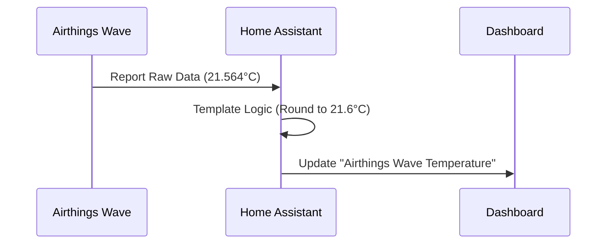

---
tags:
  - package
  - automated
version: 1.0.0
---

# Package: Airthings

**Version:** 1.0.0  
**Description:** Normalizes Airthings Wave sensors (Temp, Humidity, CO2)

<!-- START_IMAGE -->

<!-- END_IMAGE -->

## Executive Summary
<!-- START_SUMMARY -->
This package standardizes environmental data from the Airthings Wave sensor located in the living room. It takes raw source sensors (typically providing data with excess precision or varying attributes) and normalizes them into clean, rounded Template Sensors for Temperature, Humidity, and CO2, ensuring consistent display across dashboards.
<!-- END_SUMMARY -->

## Process Description (Non-Technical)
<!-- START_DETAILED -->
1.  **Read**: The system reads the raw data from the Airthings integration (e.g., `sensor.airthings_wave_living_room_temperature`).
2.  **Process**: It rounds the numbers to 1 decimal place for readability (e.g., 21.564°C becomes 21.6°C).
3.  **Publish**: It creates new "clean" sensors that are used in the Living Room dashboard.
<!-- END_DETAILED -->

## Integration Dependencies
<!-- START_DEPENDENCIES -->
*   **Airthings Wave**: The source integration providing the physical sensor data.
<!-- END_DEPENDENCIES -->

## Dashboard Connections
<!-- START_DASHBOARD -->
This package powers the following dashboard views:

* **[Living Room](../dashboards/main/living_room.md)** (Uses 3 entities)
<!-- END_DASHBOARD -->

## Architecture Diagram
<!-- START_MERMAID_DESC -->
Data flows unidirectionally from the physical Airthings device to Home Assistant. The raw sensor data is intercepted by the Template engine, which applies rounding logic. The resulting "Normalized Sensors" are the final output, providing clean data for the UI.
<!-- END_MERMAID_DESC -->

<!-- START_MERMAID -->

<!-- END_MERMAID -->

## Configuration (Source Code)
```yaml
# ------------------------------------------------------------------------------
# Package: Airthings
# Version: 1.0.0
# Description: Normalizes Airthings Wave sensors (Temp, Humidity, CO2)
# Dependencies: sensor.airthings_wave_living_room_temperature
# ------------------------------------------------------------------------------
template:
  - sensor:
      - name: "Airthings Wave Temperature"
        unique_id: airthings_wave_temperature
        unit_of_measurement: "°C"
        device_class: temperature
        state_class: measurement
        state: >
          
          {{ value | round(1) }}

      - name: "Airthings Wave Humidity"
        unique_id: airthings_wave_humidity
        unit_of_measurement: "%"
        device_class: humidity
        state_class: measurement
        state: >
          
          {{ value | round(1) }}

      - name: "Airthings Wave CO2"
        unique_id: airthings_wave_co2
        unit_of_measurement: "ppm"
        device_class: carbon_dioxide
        state_class: measurement
        state: >
          
          {{ value | round(1) }}

```
