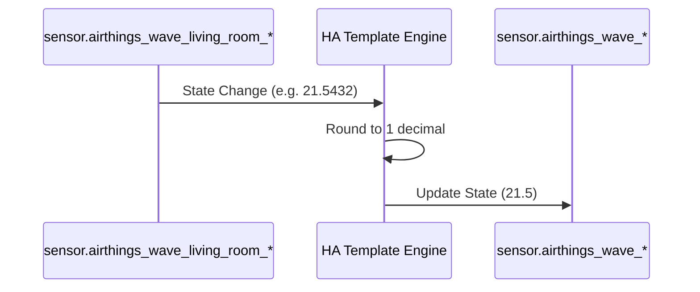

# Package: Airthings

## Executive Summary
This package normalizes data from the Airthings Wave Plus device (Living Room). It uses **Template Sensors** to extract and round temperature, humidity, and CO2 values from the raw Bluetooth/Cloud integration sensors, providing cleaner data for the frontend.

## Architecture


## Backend Configuration
```yaml
template:
  - sensor:
      - name: "Airthings Wave Temperature"
        unique_id: airthings_wave_temperature
        unit_of_measurement: "°C"
        device_class: temperature
        state_class: measurement
        state: >
          
          {{ value | round(1) }}

      - name: "Airthings Wave Humidity"
        unique_id: airthings_wave_humidity
        unit_of_measurement: "%"
        device_class: humidity
        state_class: measurement
        state: >
          
          {{ value | round(1) }}

      - name: "Airthings Wave CO2"
        unique_id: airthings_wave_co2
        unit_of_measurement: "ppm"
        device_class: carbon_dioxide
        state_class: measurement
        state: >
          
          {{ value | round(1) }}
```

## Frontend Connection
**Key Entities**:
- `sensor.airthings_wave_temperature`
- `sensor.airthings_wave_humidity`
- `sensor.airthings_wave_co2`

**Dashboard Usage**:
These sensors are used in `dashboard_demo` and `dashboard_dev2` within custom cards (likely `button-card` or composite cards).

**Card Configuration (Snippet)**:
```json
// From lovelace.dashboard_demo
{
  "type": "custom:button-card",
  "template": "card_generic_swap",
  "variables": {
    "temperature_sensor": "sensor.airthings_wave_temperature"
  }
}
```

### UI Simulation
<div style="border: 1px solid #444; border-radius: 12px; padding: 16px; width: 300px; background: #222; color: white; font-family: sans-serif;">
  <div style="display: flex; justify-content: space-between; align-items: center;">
    <div style="display: flex; align-items: center; gap: 8px;">
      <span style="font-size: 24px;">🌡️</span>
      <span style="font-weight: bold;">Living Room</span>
    </div>
    <span style="font-size: 1.5em; font-weight: bold;">21.5 °C</span>
  </div>
  <div style="margin-top: 12px; display: flex; gap: 16px; font-size: 0.9em; color: #aaa;">
    <span>💧 45.2 %</span>
    <span>☁️ 850 ppm</span>
  </div>
</div>
