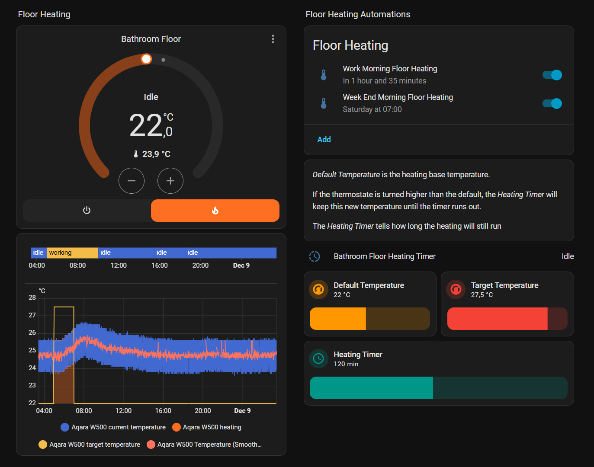

---
tags:
  - package
  - automated
version: 1.0.0
---

# Package: Aqara W500

**Version:** 1.0.0  
**Description:** Manages temperature settings and schedules for the Bathroom Floor Heat (Aqara W500 Climate). Includes logic for high electricity price reduction and shower occupancy boost.

<!-- START_IMAGE -->


<!-- END_IMAGE -->

## Executive Summary
<!-- START_SUMMARY -->
The Aqara W500 package manages the bathroom floor heating via a smart thermostat. It implements an advanced energy-saving strategy that balances comfort with cost. It features signal normalization for raw temperature data, an automated "Boost Mode" triggered by shower occupancy, and a "Peak Shaving" mechanism that reduces heating loads during high electricity price intervals.
<!-- END_SUMMARY -->

## Process Description (Non-Technical)
<!-- START_DETAILED -->
### How It Works
1.  **Smart Schedule**: The floor generally stays at a comfortable default temperature.
2.  **Shower Boost**: If the presence sensor detects you have been in the shower area for more than 30 minutes, it automatically raises the temperature to dry the floor and keep you warm.
3.  **Cost Protection**: If the electricity price spikes (goes above your set limit), the system will automatically lower the temperature to the default setting to save money, even if you had manually turned it up.
4.  **Manual Protection**: If you manually turn up the heat, a timer starts. Once the timer runs out, the temperature automatically resets to normal so you don't accidentally leave it running high all day.
<!-- END_DETAILED -->

## Architecture Diagram
<!-- START_MERMAID_DESC -->
The system prioritizes comfort during active usage while strictly enforcing energy economy during idle periods or price spikes. When the `Bathroom FP2` sensor identifies continuous occupancy in the shower zone for 30 minutes, the automation triggers a 'Comfort Boost', raising the floor temperature, provided electricity prices are within acceptable limits. Conversely, if electricity prices surge above the defined threshold, the automation logic intercepts the state and throttles the heating back to the default 'Eco' temperature, overriding any manual increases to prevent billing shock.

```mermaid
sequenceDiagram
    participant Sensor as FP2 Presence
    participant Price as Electricity Price
    participant HA as Automation Logic
    participant Thermostat as Aqara W500

    rect rgb(20, 50, 20)
    Note over HA: Shower Boost Logic
    Sensor->>HA: Shower Occupied > 30m
    HA->>Price: Check Price Level
    alt Price Low
        HA->>Thermostat: Set Temp (Target Boost)
    else Price High
        HA->>HA: Block Boost (Save Money)
    end
    end

    rect rgb(50, 20, 20)
    Note over HA: Price Protection logic
    Price->>HA: Price > Threshold
    HA->>Thermostat: Force Reset to Default Temp
    end

    rect rgb(20, 20, 50)
    Note over HA: Manual Override Logic
    Thermostat->>HA: User Increased Temp
    HA->>HA: Start Timer
    HA->>HA: Timer Finished
    HA->>Thermostat: Reset to Default Temp
    end
```

<!-- END_MERMAID_DESC -->

<!-- START_MERMAID -->

<!-- END_MERMAID -->

## Configuration (Source Code)
```yaml
# ------------------------------------------------------------------------------
# Package: Aqara W500 Floor Heating Control
# Version: 1.0.0
# Description: Manages temperature settings and schedules for the Bathroom Floor Heat (Aqara W500 Climate). Includes logic for high electricity price reduction and shower occupancy boost.
# Dependencies:
#   - Entities: climate.aqara_w500, binary_sensor.bathroom_fp2_shower_occupancy, sensor.electricity_price_cents
#   - Helpers: input_number.electricity_high_price_threshold, input_number.bathroom_floor_heat_target_temperature, input_number.bathroom_floor_heat_default_temperature, input_number.bathroom_floor_heat_override_duration, timer.bathroom_floor_heating_timer
# ------------------------------------------------------------------------------

# ==============================================================================
# 1. TEMPLATE SENSORS (Raw Data Normalization)
# ==============================================================================
template:
  - sensor:
      - name: "Aqara W500 Temperature (Raw)"
        unique_id: aqara_w500_temperature_raw
        unit_of_measurement: "°C"
        device_class: temperature
        state_class: measurement
        state: >
          
          
          {{ value | round(1) }}

      - name: "Aqara W500 Bathroom Heating HVAC"
        unique_id: aqara_w500_bathroom_heating_hvac
        state: "{{ state_attr('climate.aqara_w500', 'hvac_action') }}"
        icon: mdi:heating-coil

# ==============================================================================
# 2. FILTER SENSORS (Data Smoothing)
# ==============================================================================
sensor:
  - platform: filter
    name: "Aqara W500 Temperature (Smoothed)"
    entity_id: sensor.aqara_w500_temperature_raw
    unique_id: aqara_w500_temperature_smoothed
    filters:
      - filter: lowpass
        time_constant: 10
        precision: 1
      - filter: time_throttle
        window_size: 60

# ==============================================================================
# 3. AUTOMATION (Control Logic)
# ==============================================================================
automation:
  # ==============================================================================
  # 1. Automation: Bathroom Heating On when showering
  # ==============================================================================
  - alias: "Heating: Boost Heat on Shower Occupancy"
    id: heating_boost_on_shower
    description: "Sets the floor heating to target override temperature when prolonged shower occupancy is detected, provided electricity prices are below the high threshold."
    trigger:
      # If the bathroom is occupied for 30 minutes (suggesting a shower/bath is in progress)
      - platform: state
        entity_id: binary_sensor.bathroom_fp2_shower_occupancy
        from:
          - "off"
          - "on"
        to: "on"
        for:
          minutes: 30
    condition:
      # Condition 1: Electricity price is low enough to allow boosting
      - condition: numeric_state
        entity_id: sensor.electricity_price_cents
        below: input_number.electricity_high_price_threshold
      # Condition 2: Only boost if the current target is NOT already the override target
      - condition: template
        value_template: |
          {{ 
            state_attr('climate.aqara_w500', 'temperature') | float != 
            states('input_number.bathroom_floor_heat_target_temperature') | float
          }}
    action:
      - service: climate.set_temperature
        target:
          entity_id: climate.aqara_w500
        data:
          temperature: >-
            {{ states('input_number.bathroom_floor_heat_target_temperature') | float }}
    mode: single

  # ==============================================================================
  # 2. Automation: Manage Floor Heat Override Timer
  # ==============================================================================
  - alias: "Heating: Manage Floor Heat Override Timer"
    id: heating_manage_override_timer
    description: "Starts timer when manual temperature override is set; cancels timer if temperature is reset to default."
    trigger:
      # Trigger 1: User sets temp above default (Starts timer)
      - platform: numeric_state
        entity_id: climate.aqara_w500
        attribute: temperature
        above: input_number.bathroom_floor_heat_default_temperature
        id: start_timer
      # Trigger 2: User changes temp (Check if we need to cancel timer)
      - platform: state
        entity_id: climate.aqara_w500
        attribute: temperature
        id: cancel_check
    condition: []
    action:
      - choose:
          # Case 1: Start timer if temp is set above default
          - conditions:
              - condition: trigger
                id: start_timer
            sequence:
              - service: timer.start
                target:
                  entity_id: timer.bathroom_floor_heating_timer
                data:
                  duration: >-
                    {{ states('input_number.bathroom_floor_heat_override_duration') | int(0) * 60 }}
          # Case 2: Cancel timer if temp is set back to default or lower
          - conditions:
              - condition: trigger
                id: cancel_check
              - condition: template
                value_template: >
                  {# Check if the current set temperature is <= the default temperature #}
                  {{ state_attr('climate.aqara_w500', 'temperature') | float(0) <=  
                      states('input_number.bathroom_floor_heat_default_temperature') | float(0) }}
            sequence:
              - service: timer.cancel
                target:
                  entity_id: timer.bathroom_floor_heating_timer
    mode: single

  # ==============================================================================
  # 3. Automation: Reduce Floor Heat when Price is High
  # ==============================================================================
  - alias: "Heating: Reduce Floor Heat when Price is High"
    id: heating_price_reduce
    description: "Sets Aqara W500 to default temp when electricity price exceeds a set threshold, but only if temperature is currently higher than the default temp."
    trigger:
      - platform: numeric_state
        entity_id: sensor.electricity_prices
        above: input_number.electricity_high_price_threshold
    condition:
      - condition: state
        entity_id: climate.aqara_w500
        state: heat
      - condition: numeric_state
        entity_id: climate.aqara_w500
        attribute: temperature
        above: input_number.bathroom_floor_heat_default_temperature
    action:
      - service: climate.set_temperature
        target:
          entity_id: climate.aqara_w500
        data:
          temperature: >-
            {{ states('input_number.bathroom_floor_heat_default_temperature') | float(22) }}
    mode: single

  # ==============================================================================
  # 4. Automation: Reset Floor Heat on Timer Finish
  # ==============================================================================
  - alias: "Heating: Reset Floor Heat on Timer Finish"
    id: heating_reset_on_timer
    description: "Sets Aqara W500 back to the default temperature when the override timer expires."
    trigger:
      - platform: event
        event_type: timer.finished
        event_data:
          entity_id: timer.bathroom_floor_heating_timer
    condition: []
    action:
      - service: climate.set_temperature
        target:
          entity_id: climate.aqara_w500
        data:
          temperature: >-
            {{ states('input_number.bathroom_floor_heat_default_temperature') | float(22) }}
    mode: single
# ------------------------------------------------------------------------------
# Changelog
# ------------------------------------------------------------------------------
# 1.0.0 (2025-12-08): Initial package consolidation from multiple UI automations. Implemented logic for shower boost, high price reduction, and override timer management.
# ------------------------------------------------------------------------------

```

## Dashboard Connections
<!-- START_DASHBOARD -->
The following thermostat card is used in the Bathroom dashboard.

```yaml
type: thermostat
entity: climate.aqara_w500
name: Bathroom Floor
show_current_as_primary: false
features:
  - type: climate-hvac-modes
```
<!-- END_DASHBOARD -->
