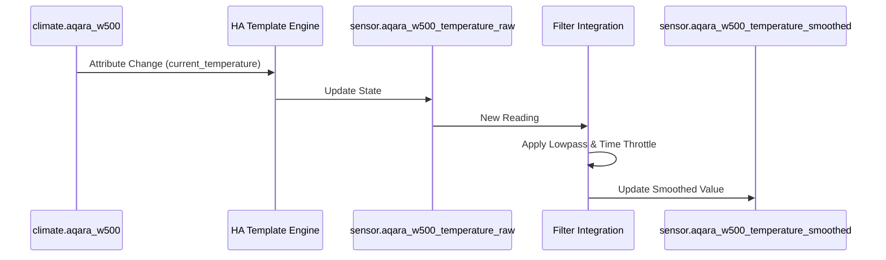

# Package: Aqara W500

## Executive Summary
This package integrates the Aqara W500 generic climate device. It creates individual **Template Sensors** for the raw temperature and HVAC action state, and a **Filter Sensor** to smooth the temperature readings over time (using a lowpass filter and throttle), likely to reduce noise or fluctuations in the heating logic.

## Architecture


## Backend Configuration
```yaml
template:
  - sensor:
      - name: "Aqara W500 Temperature (Raw)"
        unique_id: aqara_w500_temperature_raw
        unit_of_measurement: "°C"
        device_class: temperature
        state_class: measurement
        state: >
          
          
          {{ value | round(1) }}

  - sensor:
      - name: "Aqara W500 Bathroom Heating HVAC"
        unique_id: aqara_w500_bathroom_heating_hvac
        state: "{{ state_attr('climate.aqara_w500', 'hvac_action') }}"
        icon: mdi:heating-coil

sensor:
  - platform: filter
    name: "Aqara W500 Temperature (Smoothed)"
    entity_id: sensor.aqara_w500_temperature_raw
    unique_id: aqara_w500_temperature_smoothed
    filters:
      - filter: lowpass
        time_constant: 10
        precision: 1
      - filter: time_throttle
        window_size: 60
```

## Frontend Connection
**Key Entities**:
- `sensor.aqara_w500_temperature_raw`
- `sensor.aqara_w500_bathroom_heating_hvac`
- `sensor.aqara_w500_temperature_smoothed`

**Dashboard Usage**:
No specific dashboard card configuration was found for these entities in the generated dashboards. They might be used in auto-generated views or historical graphs.

### UI Simulation
<div style="border: 1px solid #444; border-radius: 12px; padding: 16px; width: 300px; background: #222; color: white; font-family: sans-serif;">
  <div style="display: flex; align-items: center; gap: 12px;">
    <div style="background: #e67e22; padding: 8px; border-radius: 50%;">
      <span style="font-size: 24px; color: white;">🔥</span>
    </div>
    <div>
      <div style="font-weight: bold;">Bathroom Heating</div>
      <div style="color: #aaa; font-size: 0.9em;">Heating</div>
    </div>
    <div style="margin-left: auto; font-size: 1.2em; font-weight: bold;">
      22.5 °C
    </div>
  </div>
</div>
