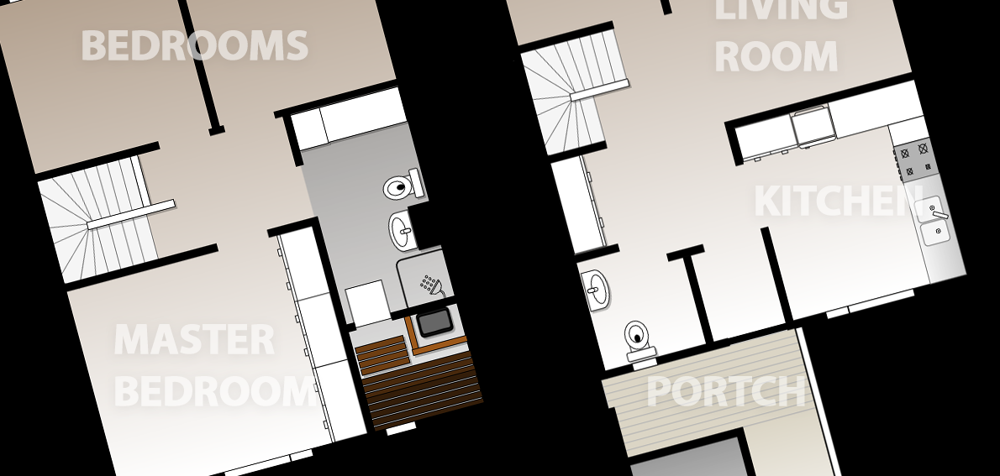
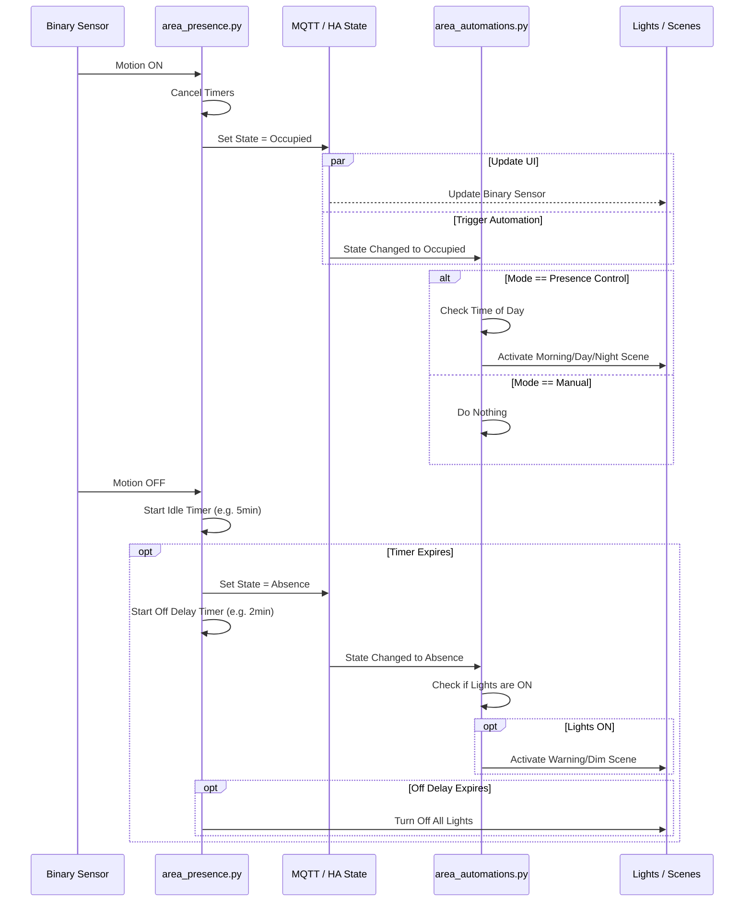

---
tags:
  - package
  - automated
version: 2.0.0 (Refactored from Room Manager)
---

# Package: Area Manager

**Version:** 2.0.0 (Refactored from Room Manager)  
**Description:** Dynamic creation of AREA settings via MQTT (Replaces Room Manager)

<!-- START_IMAGE -->

<!-- END_IMAGE -->

## Executive Summary
<!-- START_SUMMARY -->
The **Area Manager** is the central brain for room-level automation in EvisHomeLab. It completely replaces the legacy "Room Manager" with a dynamic, MQTT-backed architecture. It decouples **Presence Detection** (is someone here?) from **Action Logic** (what should I do?), allowing for sophisticated behaviors like "Manual Control" where presence is tracked but lights are not automated, or "Absence Detection" where lights turn off automatically but must be turned on manually. It utilizes **Pyscript** for complex state machine logic, offering millisecond-level responsiveness.
<!-- END_SUMMARY -->

## Process Description (Non-Technical)
<!-- START_DETAILED -->
### How it Works
The system treats every area (room) as a state machine that transitions between **Occupied**, **Idle**, **Absence**, **Sleep**, and **Do Not Disturb (DND)**.

#### 1. The Four Modes
You can independently configure how each room reacts to presence:
*   **Presence Control (Default):** Lights turn ON when you enter, and OFF when you leave.
*   **Absence Detection:** Lights will **never** turn ON automatically. However, if you turn them on manually, they will turn OFF automatically when you leave. Great for bedrooms or media rooms.
*   **Manual Control:** Full manual control. The system tracks occupancy for analytics but will **never** touch the lights.
*   **Schedule Mode:** (Future) Automated based on calendar events.

#### 2. Time-of-Day Logic
The system respects the time of day, automatically selecting the appropriate lighting scene:
*   **Morning:** Soft, warm light for waking up.
*   **Day:** Bright, cool light for focus.
*   **Evening:** Relaxing, warmer tones.
*   **Night:** Very dim, red-shifted light for minimal disruption.

#### 3. New "Off Delay" Feature
To prevent lights from turning off suddenly if you sit still too long:
1.  **Idle Warning:** When the presence timer expires, the system enters "Absence" state.
2.  **Off Action:** A "Warning" scene (e.g., Dim) activates for a configurable duration (e.g., 2 minutes).
    *   *Smart Check:* This ONLY happens if lights are currently ON.
3.  **Final Off:** If no motion is detected during the delay, the lights finally turn off.

### Python Logic (The Brain)
Unlike the old YAML-heavy version, V2 moves complex logic to Python (`pyscript/`):
*   **`area_presence.py`**: Handles the state machine, timers, and transitions (Occupied -> Idle -> Absence).
*   **`area_automations.py`**: Listens to state changes and triggers the actual scenes or actions based on the configured Mode.
<!-- END_DETAILED -->

## Dashboard Connections
<!-- START_DASHBOARD -->
This package powers the following dashboard views:

* **[Room Management](../dashboards/area-automations/room_management.md)** (Uses 7 entities)
* **[Room Management](../dashboards/area-manager/room_management.md)** (Uses 7 entities)
* **[Living Room](../dashboards/main/living_room.md)**: *The Living Room dashboard is a media and comfort hub. It features in-depth environmental monitoring (Radon, VOCs, CO2) via Airthings Wave, displaying historical trends. Entertainment controls are central, with remotes for the TV and Soundbar, plus power management for the media wall. The view also includes specific controls for the fireplace, air purifier modes, and various lighting scenes, alongside standard occupancy settings.* (Uses 1 entities)
* **[Notifications Management](../dashboards/notification-center/notifications_management.md)**: *The Notification Center dashboard provides a comprehensive interface for managing the smart home's notification system. Administrators can add or remove users for mobile app notifications and define notification categories (e.g., 'Garage', 'Electricity'). The view allows for granular control over subscriptions, enabling individual users to opt-in or out of specific notification types, and includes tools to map and monitor notification-related automations.* (Uses 1 entities)
* **[Room Management](../dashboards/room-management/room_management.md)**: *The Room Management dashboard serves as the administrative backend for the home's room logic. It allows users to initialize new rooms (creating necessary helper entities) or delete existing ones. It features a dynamic "Configured Rooms" section powered by `auto-entities`, which automatically lists all configured rooms and provides collapsible controls for their automation modes, occupancy sensors, and timeouts.* (Uses 7 entities)
<!-- END_DASHBOARD -->

## Architecture Diagram
<!-- START_MERMAID_DESC -->
The following diagram illustrates the decoupled flow. **Motion Sensors** trigger the **State Machine** in Python. The State Machine updates the **Area State** (Occupied/Idle). A separate **Automation Listener** watches this state and executes actions (Scenes) only if the **Mode** permits.
<!-- END_MERMAID_DESC -->

<!-- START_MERMAID -->

<!-- END_MERMAID -->

## Configuration (Source Code)
```yaml
# Package: Area Automation Manager
# Version: 2.0.0 (Refactored from Room Manager)
# Description: Dynamic creation of AREA settings via MQTT (Replaces Room Manager)
# ------------------------------------------------------------------------------

# ------------------------------------------------------------------------------
# 1. GLOBAL CUSTOMIZATION (Force Text Boxes)
# ------------------------------------------------------------------------------
homeassistant:
  customize_glob:
    "number.area_*_presence_idle_time":
      mode: box
    "number.area_*_lights_presence_delay":
      mode: box
    "number.area_*_sleep_entry_delay":
      mode: box
    "number.area_*_sleep_exit_delay":
      mode: box

# ------------------------------------------------------------------------------
# 2. HELPERS (Dashboard Inputs)
# ------------------------------------------------------------------------------
input_text:
  area_mgmt_name:
    name: "Area Name"
    icon: mdi:door-open
  area_mgmt_slug:
    name: "Area ID (slug)"
    icon: mdi:identifier

input_select:
  # SOURCE: Native Home Assistant Areas
  area_mgmt_create_select:
    name: "Select Area to Initialize"
    icon: mdi:map-plus
    options:
      - "unknown"

  # SOURCE: Existing Created Areas
  area_mgmt_delete_select:
    name: "Select Area to Delete"
    icon: mdi:delete-sweep
    options:
      - "unknown"

# ------------------------------------------------------------------------------
# 3. SCRIPTS
# ------------------------------------------------------------------------------
script:
  # --- REFRESH AREA OPTIONS ---
  refresh_area_options:
    alias: "System: Refresh Area Options"
    mode: single
    sequence:
      - service: automation.trigger
        target:
          entity_id: automation.system_populate_area_list

  # --- CREATE AREA SETTINGS ---
  create_area_settings:
    alias: "System: Create Area Settings"
    icon: mdi:home-plus
    mode: single
    sequence:
      - variables:
          raw_slug: "{{ area_slug if area_slug is defined else states('input_select.area_mgmt_create_select') }}"
          # Get Friendly Name from HA Area Registry or fallback to Title Case
          friendly_name: "{{ area_name(raw_slug) or raw_slug | replace('_', ' ') | title }}"

          # SANITIZATION: Strip 'area_' or '_area' to keep slugs clean
          # e.g. 'backyard_area' -> 'backyard', 'area_51' -> '51'
          sanitized: "{{ raw_slug | replace('area_', '') | replace('_area', '') }}"

          # Final Variables
          area_slug: "{{ sanitized }}"
          area_name: "{{ friendly_name }}"

          # Pre-calculate Occupancy Options
          occupancy_options: >-
            
            
            
            {{ (['-Select-'] + (all_sensors if all_sensors else [])) | to_json }}

          # Pre-calculate Bed Options
          # Logic: Must have 'bed' AND ('occupancy' OR 'presence')
          bed_options: >-
            
            
            {{ (['-Select-'] + (all_sensors if all_sensors else [])) | to_json }}

          # Pre-calculate Scene Options
          scene_options: >-
            
            {{ (['-Select-'] + scenes) | to_json }}

          # Pre-calculate Off Delay Options (scenes only, with "None" as first option)
          off_delay_options: >-
            
            {{ (['None'] + scenes) | to_json }}

      - service: system_log.write
        data:
          message: "Area Manager: Creating area '{{ area_slug }}'"
          level: warning

      # 1. Create Automation Mode Selector (Select)
      - service: mqtt.publish
        data:
          retain: true
          topic: "homeassistant/select/area_{{ area_slug }}_mode/config"
          payload: >-
            {
              "name": "{{ area_name }} Automation Mode",
              "default_entity_id": "select.area_{{ area_slug }}_automation_mode",
              "unique_id": "area_select_{{ area_slug }}_mode_v5",
              "icon": "mdi:home-lightning-bolt-outline",
              "options": ["presence-control", "absence-detection", "manual-control", "schedule-mode"],
              "command_topic": "area/{{ area_slug }}/mode/set",
              "state_topic": "area/{{ area_slug }}/mode/state",
              "availability_topic": "area/{{ area_slug }}/availability",
              "payload_available": "online",
              "device": {
                "identifiers": ["area_settings_{{ area_slug }}"],
                "name": "{{ area_name }} Settings",
                "manufacturer": "Home Assistant",
                "model": "Area Controller"
              }
            }
      # Set default
      - if:
          - condition: template
            value_template: "{{ states('select.area_' ~ area_slug ~ '_automation_mode') in ['unknown', 'unavailable', 'none'] }}"
        then:
          - service: mqtt.publish
            data:
              retain: true
              topic: "area/{{ area_slug }}/mode/state"
              payload: "presence-control"
      - delay: "00:00:00.050"

      # 2. Create Idle Time (Number)
      - service: mqtt.publish
        data:
          retain: true
          topic: "homeassistant/number/area_{{ area_slug }}_idle/config"
          payload: >-
            {
              "name": "{{ area_name }} Presence Idle Time",
              "default_entity_id": "number.area_{{ area_slug }}_presence_idle_time",
              "unique_id": "area_number_{{ area_slug }}_idle_v5",
              "device_class": "duration",
              "icon": "mdi:timer-sand",
              "min": 0,
              "max": 3600,
              "step": 1,
              "unit_of_measurement": "s",
              "command_topic": "area/{{ area_slug }}/idle/set",
              "state_topic": "area/{{ area_slug }}/idle/state",
              "availability_topic": "area/{{ area_slug }}/availability",
              "device": { "identifiers": ["area_settings_{{ area_slug }}"] }
            }
      - if:
          - condition: template
            value_template: "{{ states('number.area_' ~ area_slug ~ '_presence_idle_time') in ['unknown', 'unavailable', 'none'] }}"
        then:
          - service: mqtt.publish
            data:
              retain: true
              topic: "area/{{ area_slug }}/idle/state"
              payload: "15"
      - delay: "00:00:00.050"

      # 3. Create Delay Time (Number)
      - service: mqtt.publish
        data:
          retain: true
          topic: "homeassistant/number/area_{{ area_slug }}_delay/config"
          payload: >-
            {
              "name": "{{ area_name }} Lights Presence Delay",
              "default_entity_id": "number.area_{{ area_slug }}_lights_presence_delay",
              "unique_id": "area_number_{{ area_slug }}_delay_v5",
              "device_class": "duration",
              "icon": "mdi:lightbulb-clock",
              "min": 0,
              "max": 3600,
              "step": 1,
              "unit_of_measurement": "s",
              "command_topic": "area/{{ area_slug }}/delay/set",
              "state_topic": "area/{{ area_slug }}/delay/state",
              "availability_topic": "area/{{ area_slug }}/availability",
              "device": { "identifiers": ["area_settings_{{ area_slug }}"] }
            }
      - if:
          - condition: template
            value_template: "{{ states('number.area_' ~ area_slug ~ '_lights_presence_delay') in ['unknown', 'unavailable', 'none'] }}"
        then:
          - service: mqtt.publish
            data:
              retain: true
              topic: "area/{{ area_slug }}/delay/state"
              payload: "120"
      - delay: "00:00:00.050"

      # 4. Create Timer Display (Timestamp Sensor)
      - service: mqtt.publish
        data:
          retain: true
          topic: "homeassistant/sensor/area_{{ area_slug }}_timer/config"
          payload: >-
            {
              "name": "{{ area_name }} Timer",
              "default_entity_id": "sensor.area_{{ area_slug }}_timer",
              "unique_id": "area_sensor_{{ area_slug }}_timer_v5",
              "icon": "mdi:progress-clock",
              "device_class": "timestamp",
              "value_template": "{{ '{{' }} value if value not in ['unknown', 'unavailable', ''] else None {{ '}}' }}",
              "state_topic": "area/{{ area_slug }}/timer/state",
              "json_attributes_topic": "area/{{ area_slug }}/timer/attributes",
              "availability_topic": "area/{{ area_slug }}/availability",
              "device": { "identifiers": ["area_settings_{{ area_slug }}"] }
            }
      - delay: "00:00:00.050"
      # 5. Create Area State (Select)
      - service: mqtt.publish
        data:
          retain: true
          topic: "homeassistant/select/area_{{ area_slug }}_state/config"
          payload: >-
            {
              "name": "{{ area_name }} State",
              "default_entity_id": "select.area_{{ area_slug }}_state",
              "unique_id": "area_select_state_v5_{{ area_slug }}",
              "icon": "mdi:eye-outline",
              "options": ["Occupied", "Idle", "Absence", "Sleep", "DND"],
              "command_topic": "area/{{ area_slug }}/state/set",
              "state_topic": "area/{{ area_slug }}/state/state",
              "availability_topic": "area/{{ area_slug }}/availability",
              "payload_available": "online",
              "device": { "identifiers": ["area_settings_{{ area_slug }}"] }
            }
      - service: mqtt.publish
        data:
          retain: true
          topic: "area/{{ area_slug }}/state/state"
          payload: "Absence"
      - delay: "00:00:00.050"

      # 6. Create Occupancy (Binary Sensor)
      - service: mqtt.publish
        data:
          retain: true
          topic: "homeassistant/binary_sensor/area_{{ area_slug }}_occupancy/config"
          payload: >-
            {
              "name": "{{ area_name }} Occupancy",
              "default_entity_id": "binary_sensor.area_{{ area_slug }}_occupancy",
              "unique_id": "area_occupancy_v5_{{ area_slug }}",
              "icon": "mdi:motion-sensor",
              "device_class": "occupancy",
              "state_topic": "area/{{ area_slug }}/occupancy/state",
              "availability_topic": "area/{{ area_slug }}/availability",
              "device": { "identifiers": ["area_settings_{{ area_slug }}"] }
            }
      - delay: "00:00:00.050"
      # 7. Create Automation Switch
      - service: mqtt.publish
        data:
          retain: true
          topic: "homeassistant/switch/area_{{ area_slug }}_automation/config"
          payload: >-
            {
              "name": "{{ area_name }} Automation",
              "default_entity_id": "switch.area_{{ area_slug }}_automation",
              "unique_id": "area_switch_automation_v5_{{ area_slug }}",
              "icon": "mdi:robot",
              "command_topic": "area/{{ area_slug }}/automation/set",
              "state_topic": "area/{{ area_slug }}/automation/state",
              "availability_topic": "area/{{ area_slug }}/availability",
              "device": { "identifiers": ["area_settings_{{ area_slug }}"] }
            }
      - service: mqtt.publish
        data:
          retain: true
          topic: "area/{{ area_slug }}/automation/state"
          payload: "ON"
      - delay: "00:00:00.050"

      # 8. Create Bed Sensor (Select)
      - service: mqtt.publish
        data:
          retain: true
          topic: "homeassistant/select/area_{{ area_slug }}_bed_sensor/config"
          payload: >-
            {
              "name": "{{ area_name }} Bed Sensor",
              "default_entity_id": "select.area_{{ area_slug }}_bed_sensor",
              "unique_id": "area_select_bed_{{ area_slug }}_v5",
              "options": {{ bed_options }},
              "command_topic": "area/{{ area_slug }}/bed_sensor/set",
              "state_topic": "area/{{ area_slug }}/bed_sensor/state",
              "availability_topic": "area/{{ area_slug }}/availability",
              "device": { "identifiers": ["area_settings_{{ area_slug }}"] }
            }
      - delay: "00:00:00.050"
      # 9. Create Sleep ENTRY Delay (Number)
      - service: mqtt.publish
        data:
          retain: true
          topic: "homeassistant/number/area_{{ area_slug }}_sleep_entry_delay/config"
          payload: >-
            {
              "name": "{{ area_name }} Sleep Entry Delay",
              "default_entity_id": "number.area_{{ area_slug }}_sleep_entry_delay",
              "unique_id": "area_number_{{ area_slug }}_sleep_entry_v5",
              "device_class": "duration",
              "icon": "mdi:bed-clock",
              "min": 0,
              "max": 3600,
              "step": 1,
              "unit_of_measurement": "s",
              "command_topic": "area/{{ area_slug }}/sleep_entry_delay/set",
              "state_topic": "area/{{ area_slug }}/sleep_entry_delay/state",
              "availability_topic": "area/{{ area_slug }}/availability",
              "device": { "identifiers": ["area_settings_{{ area_slug }}"] }
            }
      - if:
          - condition: template
            value_template: "{{ states('number.area_' ~ area_slug ~ '_sleep_entry_delay') in ['unknown', 'unavailable', 'none'] }}"
        then:
          - service: mqtt.publish
            data:
              retain: true
              topic: "area/{{ area_slug }}/sleep_entry_delay/state"
              payload: "300"
      - delay: "00:00:00.050"

      # 10. Create Sleep EXIT Delay (Number)
      - service: mqtt.publish
        data:
          retain: true
          topic: "homeassistant/number/area_{{ area_slug }}_sleep_exit_delay/config"
          payload: >-
            {
              "name": "{{ area_name }} Sleep Exit Delay",
              "default_entity_id": "number.area_{{ area_slug }}_sleep_exit_delay",
              "unique_id": "area_number_{{ area_slug }}_sleep_exit_v5",
              "device_class": "duration",
              "icon": "mdi:run-fast",
              "min": 0,
              "max": 3600,
              "step": 1,
              "unit_of_measurement": "s",
              "command_topic": "area/{{ area_slug }}/sleep_exit_delay/set",
              "state_topic": "area/{{ area_slug }}/sleep_exit_delay/state",
              "availability_topic": "area/{{ area_slug }}/availability",
              "device": { "identifiers": ["area_settings_{{ area_slug }}"] }
            }
      - if:
          - condition: template
            value_template: "{{ states('number.area_' ~ area_slug ~ '_sleep_exit_delay') in ['unknown', 'unavailable', 'none'] }}"
        then:
          - service: mqtt.publish
            data:
              retain: true
              topic: "area/{{ area_slug }}/sleep_exit_delay/state"
              payload: "60"
      - delay: "00:00:00.050"

      # 11. Set Online
      - service: mqtt.publish
        data:
          retain: true
          topic: "area/{{ area_slug }}/availability"
          payload: "online"

      # 12. Create Occupancy Source (Select)
      - service: mqtt.publish
        data:
          retain: true
          topic: "homeassistant/select/area_{{ area_slug }}_occupancy_source/config"
          payload: >-
            {
              "name": "{{ area_name }} Occupancy Sensor",
              "default_entity_id": "select.area_{{ area_slug }}_occupancy_source",
              "unique_id": "area_select_occ_source_v5_{{ area_slug }}",
              "options": {{ occupancy_options }},
              "command_topic": "area/{{ area_slug }}/occupancy_source/set",
              "state_topic": "area/{{ area_slug }}/occupancy_source/state",
              "availability_topic": "area/{{ area_slug }}/availability",
              "device": { "identifiers": ["area_settings_{{ area_slug }}"] }
            }
      - delay: "00:00:00.050"
      # 13. Create DND Switch
      - service: mqtt.publish
        data:
          retain: true
          topic: "homeassistant/switch/area_{{ area_slug }}_dnd/config"
          payload: >-
            {
              "name": "{{ area_name }} Do Not Disturb",
              "default_entity_id": "switch.area_{{ area_slug }}_dnd",
              "unique_id": "area_switch_dnd_v5_{{ area_slug }}",
              "icon": "mdi:minus-circle-outline",
              "command_topic": "area/{{ area_slug }}/dnd/set",
              "state_topic": "area/{{ area_slug }}/dnd/state",
              "availability_topic": "area/{{ area_slug }}/availability",
              "device": { "identifiers": ["area_settings_{{ area_slug }}"] }
            }
      - service: mqtt.publish
        data:
          retain: true
          topic: "area/{{ area_slug }}/dnd/state"
          payload: "OFF"
      - delay: "00:00:00.050"

      # 14. Create Scene Selectors (Morning, Day, Evening, Night)
      - repeat:
          for_each: ["morning", "day", "evening", "night"]
          sequence:
            - service: mqtt.publish
              data:
                retain: true
                topic: "homeassistant/select/area_{{ area_slug }}_{{ repeat.item }}_scene/config"
                payload: >-
                  {
                    "name": "{{ area_name }} {{ repeat.item | title }} Scene",
                    "default_entity_id": "select.area_{{ area_slug }}_{{ repeat.item }}_scene",
                    "unique_id": "area_select_{{ repeat.item }}_scene_v5_{{ area_slug }}",
                    "options": {{ scene_options }},
                    "command_topic": "area/{{ area_slug }}/{{ repeat.item }}_scene/set",
                    "state_topic": "area/{{ area_slug }}/{{ repeat.item }}_scene/state",
                    "availability_topic": "area/{{ area_slug }}/availability",
                    "device": { "identifiers": ["area_settings_{{ area_slug }}"] }
                  }
            - delay: "00:00:00.050"

      # 15a. Create Action Selectors (Absence, Sleep) - Options: Turn Off / None
      - repeat:
          for_each: ["absence", "sleep"]
          sequence:
            - service: mqtt.publish
              data:
                retain: true
                topic: "homeassistant/select/area_{{ area_slug }}_{{ repeat.item }}_action/config"
                payload: >-
                  {
                    "name": "{{ area_name }} {{ repeat.item | title }} Action",
                    "default_entity_id": "select.area_{{ area_slug }}_{{ repeat.item }}_action",
                    "unique_id": "area_select_{{ repeat.item }}_action_v5_{{ area_slug }}",
                    "options": ["Turn Off", "None"],
                    "command_topic": "area/{{ area_slug }}/{{ repeat.item }}_action/set",
                    "state_topic": "area/{{ area_slug }}/{{ repeat.item }}_action/state",
                    "availability_topic": "area/{{ area_slug }}/availability",
                    "device": { "identifiers": ["area_settings_{{ area_slug }}"] }
                  }
            # Set Default to 'Turn Off' if new
            - if:
                - condition: template
                  value_template: "{{ states('select.area_' ~ area_slug ~ '_' ~ repeat.item ~ '_action') in ['unknown', 'unavailable', 'none'] }}"
              then:
                - service: mqtt.publish
                  data:
                    retain: true
                    topic: "area/{{ area_slug }}/{{ repeat.item }}_action/state"
                    payload: "Turn Off"
            - delay: "00:00:00.050"

      # 15b. Create Off Delay Action Selector - Options: Scene List + None
      - service: mqtt.publish
        data:
          retain: true
          topic: "homeassistant/select/area_{{ area_slug }}_off_delay_action/config"
          payload: >-
            {
              "name": "{{ area_name }} Off Delay Action",
              "default_entity_id": "select.area_{{ area_slug }}_off_delay_action",
              "unique_id": "area_select_off_delay_action_v5_{{ area_slug }}",
              "options": {{ off_delay_options }},
              "command_topic": "area/{{ area_slug }}/off_delay_action/set",
              "state_topic": "area/{{ area_slug }}/off_delay_action/state",
              "availability_topic": "area/{{ area_slug }}/availability",
              "device": { "identifiers": ["area_settings_{{ area_slug }}"] }
            }
      # Set Default to 'None' if new
      - if:
          - condition: template
            value_template: "{{ states('select.area_' ~ area_slug ~ '_off_delay_action') in ['unknown', 'unavailable', 'none'] }}"
        then:
          - service: mqtt.publish
            data:
              retain: true
              topic: "area/{{ area_slug }}/off_delay_action/state"
              payload: "None"
      - delay: "00:00:00.050"

      - service: script.refresh_area_options

  # --- DELETE AREA SETTINGS ---
  delete_area_settings:
    alias: "System: Delete Area Settings"
    icon: mdi:home-remove
    mode: single
    sequence:
      - variables:
          raw_slug: "{{ states('input_select.area_mgmt_delete_select') }}"
          # SAFETY: If slug starts with 'area_', strip it
          area_slug: "{{ raw_slug | replace('area_', '') if raw_slug.startswith('area_') else raw_slug }}"

      # Clear Config Topics
      - service: mqtt.publish
        data:
          retain: true
          topic: "homeassistant/select/area_{{ area_slug }}_mode/config"
          payload: ""
      - service: mqtt.publish
        data:
          retain: true
          topic: "homeassistant/number/area_{{ area_slug }}_idle/config"
          payload: ""
      - service: mqtt.publish
        data:
          retain: true
          topic: "homeassistant/number/area_{{ area_slug }}_delay/config"
          payload: ""
      - service: mqtt.publish
        data:
          retain: true
          topic: "homeassistant/sensor/area_{{ area_slug }}_timer/config"
          payload: ""
      - service: mqtt.publish
        data:
          retain: true
          topic: "homeassistant/select/area_{{ area_slug }}_state/config"
          payload: ""
      - service: mqtt.publish
        data:
          retain: true
          topic: "homeassistant/binary_sensor/area_{{ area_slug }}_occupancy/config"
          payload: ""
      - service: mqtt.publish
        data:
          retain: true
          topic: "homeassistant/switch/area_{{ area_slug }}_automation/config"
          payload: ""
      - service: mqtt.publish
        data:
          retain: true
          topic: "homeassistant/select/area_{{ area_slug }}_bed_sensor/config"
          payload: ""
      - service: mqtt.publish
        data:
          retain: true
          topic: "homeassistant/number/area_{{ area_slug }}_sleep_entry_delay/config"
          payload: ""
      - service: mqtt.publish
        data:
          retain: true
          topic: "homeassistant/number/area_{{ area_slug }}_sleep_exit_delay/config"
          payload: ""
      - service: mqtt.publish
        data:
          retain: true
          topic: "homeassistant/select/area_{{ area_slug }}_occupancy_source/config"
          payload: ""

      # Clear New Helpers (DND, Scenes, Actions)
      - service: mqtt.publish
        data:
          retain: true
          topic: "homeassistant/switch/area_{{ area_slug }}_dnd/config"
          payload: ""
      - repeat:
          for_each: ["morning", "day", "evening", "night"]
          sequence:
            - service: mqtt.publish
              data:
                retain: true
                topic: "homeassistant/select/area_{{ area_slug }}_{{ repeat.item }}_scene/config"
                payload: ""
      - repeat:
          for_each: ["absence", "sleep"]
          sequence:
            - service: mqtt.publish
              data:
                retain: true
                topic: "homeassistant/select/area_{{ area_slug }}_{{ repeat.item }}_action/config"
                payload: ""

      # Delete Availability to 'offline'
      - service: mqtt.publish
        data:
          retain: true
          topic: "area/{{ area_slug }}/availability"
          payload: ""
      - service: script.refresh_area_options

# ------------------------------------------------------------------------------
# 4. AUTOMATIONS
# ------------------------------------------------------------------------------
automation:
  # POPULATE DROPDOWNS ("Manage Areas")
  - alias: "System: Populate Area List"
    id: system_populate_area_list
    trigger:
      - platform: homeassistant
        event: start
      - platform: time_pattern
        hours: "/1"
    action:
      # 1. Populate 'Create' from HA Areas
      - service: input_select.set_options
        target:
          entity_id: input_select.area_mgmt_create_select
        data:
          options: >-
            
            {{ areas if areas else ['unknown'] }}

      # 2. Populate 'Delete' from created 'area_*_automation_mode' entities
      - service: input_select.set_options
        target:
          entity_id: input_select.area_mgmt_delete_select
        data:
          options: >-
            
            
            
               
               
               
                  
               
                  
               
               
            
            {{ ns.areas | unique | list if ns.areas else ['unknown'] }}

            # END OF POPULATION

  # MQTT PERSISTENCE
  - alias: "System: Area MQTT Persistence"
    id: system_area_mqtt_persistence
    mode: queued
    trigger:
      - platform: mqtt
        topic: "area/+/+/set"
      - platform: mqtt
        topic: "area/+/+/+/set"
    action:
      - variables:
          target_topic: "{{ trigger.topic | replace('/set', '/state') }}"
      - service: mqtt.publish
        data:
          topic: "{{ target_topic }}"
          payload: "{{ trigger.payload }}"
          retain: true

  # SYNC SELECT STATE -> BINARY SENSOR
  # Keeps the binary_sensor.area_X_occupancy in sync with select.area_X_state
  - alias: "System: Sync Area State to Binary Sensor"
    id: system_area_state_to_binary_sync
    mode: queued
    trigger:
      - platform: event
        event_type: state_changed
    condition:
      - condition: template
        value_template: >-
          {{ 
            trigger.event.data.entity_id.startswith("select.area_") and 
            trigger.event.data.entity_id.endswith("_state") 
          }}
    action:
      - variables:
          entity: "{{ trigger.event.data.entity_id }}"
          slug: "{{ entity.split('.')[1].replace('area_', '').replace('_state', '') }}"
          new_val: "{{ trigger.event.data.new_state.state if trigger.event.data.new_state else '' }}"
      - service: mqtt.publish
        data:
          topic: "area/{{ slug }}/occupancy/state"
          payload: "{{ 'ON' if new_val == 'Occupied' else 'OFF' }}"
          retain: true

  # AREA OCCUPANCY DETECTION
  # Uses event trigger to catch all binary_sensor state changes efficiently
  - alias: "System: Area Occupancy Sensor Trigger"
    id: system_area_occupancy_sensor_trigger
    mode: parallel
    max: 20
    trigger:
      - platform: event
        event_type: state_changed
    variables:
      sensor_id: "{{ trigger.event.data.entity_id | default('') }}"
      new_state: "{{ trigger.event.data.new_state.state if trigger.event.data.new_state else '' }}"
      # Build list of all selected occupancy sensors (only from area_* entities)
      all_selected_sensors: >-
        
        
          
          
            
          
        
        {{ ns.sensors }}
    condition:
      # Only binary_sensors
      - condition: template
        value_template: "{{ sensor_id.startswith('binary_sensor.') }}"
      # FAST EARLY EXIT: Only continue if this sensor is actually selected
      - condition: template
        value_template: "{{ sensor_id in all_selected_sensors }}"
      # Only on/off transitions
      - condition: template
        value_template: "{{ new_state in ['on', 'off'] }}"
    action:
      - variables:
          # Find which areas use THIS specific sensor
          matched_areas: >-
            
            
              
              
                
                
                
              
            
            {{ ns.areas }}
      - repeat:
          for_each: "{{ matched_areas }}"
          sequence:
            - service: pyscript.check_area_state
              data:
                area_slug: "{{ repeat.item }}"

```
