---
tags:
  - package
  - automated
version: 2.0.3
---

# Package: Car

**Version:** 2.0.3  
**Description:** Unified logic for Mercedes GLC. Normalizes sensors (Windows/Doors), wrapper switches, and Status Notifications.

<!-- START_IMAGE -->


<!-- END_IMAGE -->

## Executive Summary
<!-- START_SUMMARY -->
The Car package centralizes all logic for the Mercedes GLC, interfacing with the `ReneNulschDE/mbapi2020` integration. It provides a standardized data layer by normalizing proprietary attributes (window states, door locks) into standard Home Assistant binary sensors. It includes API wrappers for common actions (locking, pre-heating) and a robust notification system for charging and critical alerts.
<!-- END_SUMMARY -->

## Process Description (Non-Technical)
<!-- START_DETAILED -->
### How It Works
1.  **Monitoring**: The house knows the status of your car windows, doors, and engine. You can see at a glance if the car is locked or if a window was left open.
2.  **Remote Control**: You can start the "Pre-entry Climate" system directly from the dashboard to warm up or cool down the car before you leave.
3.  **Charging**:
    *   **Plugged In**: You get a confirmation notification when the cable is connected.
    *   **Started**: When charging begins, you are notified of the current charging power (kW) and the estimated finish time.
    *   **Finished**: You get an alert when the battery hits 100%.
4.  **Critical Alerts**: The system watches for vehicle warnings. If brake fluid is low or coolant is needed, a critical alert is sent to your phone immediately.
<!-- END_DETAILED -->

## Architecture Diagram
<!-- START_MERMAID_DESC -->
The following diagram illustrates the flow from the vehicle API to the user. The `mbapi2020` integration polls the Mercedes Cloud service. The `Car Package` acts as a middle layer, normalizing this raw data into standard sensors (e.g., standardizing window '2' status to 'Closed'). When critical sensors like `low_brake_fluid` trigger, the automation layer evaluates the severity before dispatching either a standard info message or a critical alarm via `notify_smart_master`.

```mermaid
sequenceDiagram
    participant Cloud as Mercedes Cloud
    participant API as Integration (mbapi2020)
    participant HA as Car Package
    participant User as User (Mobile)

    Cloud->>API: Poll Status
    API->>HA: Update Attributes (Windows/Doors)
    HA->>HA: Normalize to Binary Sensors
    
    rect rgb(20, 20, 20)
    Note over HA: User Action
    User->>HA: Toggle 'Pre-entry AC'
    HA->>API: Service Call (preheat_start)
    API->>Cloud: Command
    end
    
    rect rgb(50, 20, 20)
    Note over HA: Critical Event
    API->>HA: Sensor 'Low Brake Fluid' = On
    HA->>User: CRITICAL ALERT (Notify Script)
    end
    
    API->>HA: Charging Started
    HA->>User: Notify "Charging at 11kW" (Est. Time)
```

<!-- END_MERMAID_DESC -->

<!-- START_MERMAID -->

<!-- END_MERMAID -->

## Configuration (Source Code)
```yaml
# ------------------------------------------------------------------------------
# Package: Car GLC
# Version: 2.0.3
# Description: Unified logic for Mercedes GLC. Normalizes sensors (Windows/Doors), wrapper switches, and Status Notifications.
# Dependencies:
#   - Integration: ReneNulschDE/mbapi2020 (HACS)
#   - Script: script.notify_smart_master
# ------------------------------------------------------------------------------

# ==============================================================================
# 1. TEMPLATE SENSORS & BINARY SENSORS
# ==============================================================================
template:
  - binary_sensor:
      # --- Windows (Normalized from Attribute) ---
      - name: "Car GLC Window Front Left"
        unique_id: car_glc_window_front_left
        device_class: window
        state: >
          {{ state_attr('binary_sensor.xpb_358_windows_closed', 'Windowstatusfrontleft') != '2' }}

      - name: "Car GLC Window Front Right"
        unique_id: car_glc_window_front_right
        device_class: window
        state: >
          {{ state_attr('binary_sensor.xpb_358_windows_closed', 'Windowstatusfrontright') != '2' }}

      - name: "Car GLC Window Rear Left"
        unique_id: car_glc_window_rear_left
        device_class: window
        state: >
          {{ state_attr('binary_sensor.xpb_358_windows_closed', 'Windowstatusrearleft') != '2' }}

      - name: "Car GLC Window Rear Right"
        unique_id: car_glc_window_rear_right
        device_class: window
        state: >
          {{ state_attr('binary_sensor.xpb_358_windows_closed', 'Windowstatusrearright') != '2' }}

      # --- Doors (Normalized from Attribute) ---
      - name: "Car GLC Door Front Left"
        unique_id: car_glc_door_front_left
        device_class: door
        state: >
          {{ state_attr('sensor.xpb_358_lock', 'Door front left') != 'closed' }}

      - name: "Car GLC Door Front Right"
        unique_id: car_glc_door_front_right
        device_class: door
        state: >
          {{ state_attr('sensor.xpb_358_lock', 'Door front right') != 'closed' }}

      - name: "Car GLC Door Rear Left"
        unique_id: car_glc_door_rear_left
        device_class: door
        state: >
          {{ state_attr('sensor.xpb_358_lock', 'Door rear left') != 'closed' }}

      - name: "Car GLC Door Rear Right"
        unique_id: car_glc_door_rear_right
        device_class: door
        state: >
          {{ state_attr('sensor.xpb_358_lock', 'Door rear right') != 'closed' }}

      - name: "Car GLC Deck Lid"
        unique_id: car_glc_deck_lid
        device_class: opening
        state: >
          {{ state_attr('sensor.xpb_358_lock', 'Deck lid') != 'closed' }}

      # --- Locks (Normalized from Attribute) ---
      - name: "Car GLC Lock Front Left"
        unique_id: car_glc_lock_front_left
        device_class: lock
        state: >
          {{ state_attr('sensor.xpb_358_lock', 'Door lock front left') != 'locked' }}

      - name: "Car GLC Lock Front Right"
        unique_id: car_glc_lock_front_right
        device_class: lock
        state: >
          {{ state_attr('sensor.xpb_358_lock', 'Door lock front right') != 'locked' }}

      - name: "Car GLC Lock Rear Left"
        unique_id: car_glc_lock_rear_left
        device_class: lock
        state: >
          {{ state_attr('sensor.xpb_358_lock', 'Door lock rear left') != 'locked' }}

      - name: "Car GLC Lock Rear Right"
        unique_id: car_glc_lock_rear_right
        device_class: lock
        state: >
          {{ state_attr('sensor.xpb_358_lock', 'Door lock rear right') != 'locked' }}

      - name: "Car GLC Gas Lock"
        unique_id: car_glc_gas_lock
        device_class: lock
        state: >
          {{ state_attr('sensor.xpb_358_lock', 'Gas lock') != 'locked' }}

      # --- Logic Sensors (Consolidated Status) ---
      - name: "Car Charge Plug"
        unique_id: car_charge_plug
        device_class: plug
        state: >
          
          {{ value != 3 }}
        icon: >
          
          
            mdi:power-plug-off
          
            mdi:power-plug
          

      - name: "Car Charging"
        unique_id: car_charging_active
        device_class: power
        state: >
          
          {{ value != 0 }}
        icon: >
          
            mdi:power-off
          
            mdi:power-on
          

      - name: "Car Engine"
        unique_id: car_engine_status
        device_class: running
        state: >
          
          {{ value >= 2 }}
        icon: >
          
            mdi:engine-off
          
            mdi:engine
          

      - name: "Car Doors"
        unique_id: car_doors_status
        device_class: door
        state: >
          
          {{ value == 0 }}
        icon: >
          
            mdi:car-door
          
            mdi:car-door-lock
          

  - sensor:
      - name: "Car Charge Ready"
        unique_id: car_charge_ready_time
        state: >
          
          
            {{ as_datetime(end).strftime('%H:%M') }}
          
            unknown
          

# ==============================================================================
# 2. SWITCHES (Wrappers for API Calls)
# ==============================================================================
switch:
  - name: "Car Pre-entry A/C"
    unique_id: car_pre_entry_ac
    icon: mdi:air-conditioner
    state: "{{ is_state_attr('sensor.xpb_358_range_electric', 'precondNow', 1) }}"
    turn_on:
      service: mbapi2020.preheat_start
      data:
        type: "0"
        vin: !secret [REDACTED]
    turn_off:
      service: mbapi2020.preheat_stop
      data:
        vin: !secret [REDACTED]

  - name: "Car Windows"
    unique_id: car_windows
    icon: mdi:car-door
    state: "{{ is_state('binary_sensor.xpb_358_windows_closed', 'on') }}"
    turn_on:
      service: mbapi2020.windows_close
      data:
        vin: !secret [REDACTED]
    turn_off:
      service: mbapi2020.windows_open
      data:
        vin: !secret [REDACTED]

  - name: "Car Door Locks"
    unique_id: car_doors
    icon: mdi:car-door
    state: "{{ is_state('sensor.xpb_358_lock', '2') }}"
    turn_on:
      service: mbapi2020.doors_unlock
      data:
        vin: !secret [REDACTED]
    turn_off:
      service: mbapi2020.doors_lock
      data:
        vin: !secret [REDACTED]

# ==============================================================================
# 3. AUTOMATION (Notifications)
# ==============================================================================
automation:
  - alias: "Notify: Car Status"
    id: notify_car_status_glc
    description: "Manages mobile notifications for critical car events including charging status, pre-conditioning, tire pressure warnings, and fluid levels. Uses the 'notify_smart_master' script."
    trigger:
      - entity_id: binary_sensor.car_charge_plug
        from: "off"
        to: "on"
        id: plug_in
        platform: state
      - entity_id: binary_sensor.xpb_358_charging_active
        from: "off"
        to: "on"
        id: charging_start
        platform: state
      - entity_id: sensor.xpb_358_state_of_charge
        above: 99
        id: charging_full
        platform: numeric_state
      - entity_id: binary_sensor.xpb_358_preclimate_status
        from: "off"
        to: "on"
        id: climate_started
        platform: state
      - entity_id: binary_sensor.xpb_358_preclimate_status
        from: "on"
        to: "off"
        id: climate_stopped
        platform: state
      - entity_id: binary_sensor.xpb_358_tire_warning
        to: "on"
        id: warn_tire
        platform: state
      - entity_id: binary_sensor.xpb_358_low_brake_fluid_warning
        to: "on"
        id: warn_brake
        platform: state
      - entity_id: binary_sensor.xpb_358_low_coolant_level_warning
        to: "on"
        id: warn_coolant
        platform: state
      - entity_id: binary_sensor.xpb_358_low_wash_water_warning
        to: "on"
        id: warn_wash_water
        platform: state
    action:
      - choose:
          - conditions:
              - condition: trigger
                id: charging_start
            sequence:
              - wait_for_trigger:
                  - entity_id: sensor.xpb_358_charging_power
                    above: 0
                    platform: numeric_state
                timeout: "00:02:00"
                continue_on_timeout: true
      - variables:
          notification_data: |
            
              {
                "title": "🔌 Car Connected",
                "message": "Charging cable connected.",
                "tag": "car_charging",
                "critical": false
              }
            
              
              
              
              {# Convert raw timestamp to HH:MM format (Local Time) #}
              
                  {% set end_time = as_timestamp(raw_end) | timestamp_custom('%H:%M') %}
              
                  
              

              {
                "title": "⚡ Car Charging Started",
                "message": "Charging at {{ power }} kW. Ready by: {{ end_time }}",
                "tag": "car_charging",
                "critical": false
              }
            
              
              {
                "title": "🔋 Car Fully Charged",
                "message": "Battery is 100%. Range: {{ range }} km.",
                "tag": "car_charging",
                "critical": false
              }
            
              {
                "title": "🚗 Car Climate",
                "message": "Pre-conditioning has started.",
                "tag": "car_climate",
                "critical": false
              }
            
              {
                "title": "🚗 Car Climate",
                "message": "Pre-conditioning finished.",
                "tag": "car_climate",
                "critical": false
              }
            
              {
                "title": "⚠️ Car Warning",
                "message": "Check Tire Pressure!",
                "tag": "car_warning",
                "critical": false
              }
            
              {
                "title": "🚨 Car Critical",
                "message": "Low Brake Fluid Warning! Check immediately.",
                "tag": "car_warning",
                "critical": true
              }
            
              {
                "title": "⚠️ Car Warning",
                "message": "Low Coolant Level.",
                "tag": "car_warning",
                "critical": true
              }
            
              {
                "title": "💧 Car Warning",
                "message": "Low Washer Fluid Level.",
                "tag": "car_warning",
                "critical": false
              }
            
      - service: script.notify_smart_master
        data:
          category: car
          title: "{{ (notification_data | from_json).title }}"
          message: "{{ (notification_data | from_json).message }}"
          tag: "{{ (notification_data | from_json).tag }}"
          critical: "{{ (notification_data | from_json).critical }}"
    mode: queued
# ------------------------------------------------------------------------------
# Changelog
# ------------------------------------------------------------------------------
# 2.0.3 (2025-12-07): Added Changelog footer.
# 2.0.2 (2025-12-07): Added unique_id to automation for UI editing.
# 2.0.1 (2025-12-07): Moved VIN to secrets. Updated automation description.
# 2.0.0 (2025-12-07): Initial consolidation of Package A, B, and UI Automation.
# ------------------------------------------------------------------------------

```

## Dashboard Connections
<!-- START_DASHBOARD -->
The following card is used in the main dashboard. It combines a visual representation of the car with quick actions for climate control and details for Fuel/EV battery levels.

```yaml
type: picture-elements
image: local/car/Car-BG.png
elements:
  - type: custom:button-card
    template: [area_base_overlay]
    entity: switch.xpb_358_pre_entry_climate_control
    tap_action:
      action: navigate
      navigation_path: /dashboard-persons/car
    hold_action:
      action: toggle
    double_tap_action:
      action: fire-dom-event
      browser_mod:
        service: browser_mod.popup
        data:
          title: CAR
          content:
            type: vertical-stack
            cards:
              - type: horizontal-stack
                cards:
                  - type: custom:mushroom-template-card
                    entity: sensor.fuel_level
                    primary: Fuel Level
                    secondary: "{{ states('sensor.xpb_358_fuel_level') }}% | {{ states('sensor.xpb_358_range_liquid') }} km range"
                    icon: mdi:gas-station
                  - type: custom:mushroom-template-card
                    entity: sensor.ev_battery_level
                    primary: EV Charge
                    secondary: "{{ states('sensor.xpb_358_state_of_charge') }}% | {{ states('sensor.xpb_358_range_electric') }} km range"
                    icon: mdi:car-electric
              - type: custom:scheduler-card
                include: [switch.xpb_358_pre_entry_climate_control]
              - type: map
                entities: [person.car]
                hours_to_show: 48
```
<!-- END_DASHBOARD -->
