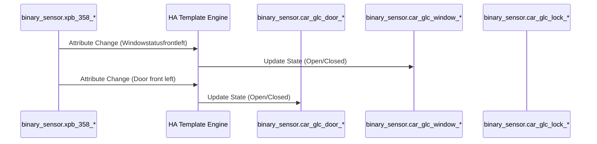

# Package: Car GLC

## Executive Summary
This package provides a comprehensive integration for a **Mercedes GLC**, breaking down complex attribute states from the integration (e.g., `binary_sensor.xpb_358_windows_closed`) into individual binary sensors for every door, window, and lock. This granular control allows for precise dashboard visualizations and animations.

## Architecture


## Backend Configuration
*(Snippet showing key sensors)*
```yaml
template:
  - binary_sensor:
      # --- Front Left Window ---
      - name: "Car GLC Window Front Left"
        unique_id: car_glc_window_front_left
        device_class: window
        state: >
          {{ state_attr('binary_sensor.xpb_358_windows_closed', 'Windowstatusfrontleft') != '2' }}

      # --- Door Open/Closed Sensors ---
      - name: "Car GLC Door Front Left"
        unique_id: car_glc_door_front_left
        device_class: door
        state: >
          {{ state_attr('sensor.xpb_358_lock', 'Door front left') != 'closed' }}

      # --- Lock Locked/Unlocked Sensors ---
      - name: "Car GLC Lock Front Left"
        unique_id: car_glc_lock_front_left
        device_class: lock
        state: >
          {{ state_attr('sensor.xpb_358_lock', 'Door lock front left') != 'locked' }}
```

## Frontend Connection
**Key Entities**:
- `binary_sensor.car_glc_door_*`
- `binary_sensor.car_glc_window_*`
- `binary_sensor.car_glc_lock_*`

**Dashboard Usage**:
Highly utilized in `dashboard_persons` and `dashboard_dev` for visual representations of the car. The dashboard uses complex CSS animations to blink parts of the car image when a door is open.

**Card Configuration (Snippet)**:
```json
// From lovelace.dashboard_persons
{
  "entity": "binary_sensor.car_glc_lock_front_right",
  "style": {
    "top": "34%",
    "left": "65%",
    "animation": "[[[\n  if (states['binary_sensor.car_glc_door_front_right'].state == 'off') {\n    return 'blink 1s ease infinite';\n  } else {\n    return 'none';\n  }\n]]]"
  }
}
```

### UI Simulation
<div style="border: 1px solid #444; border-radius: 12px; padding: 16px; width: 300px; background: #222; color: white; font-family: sans-serif; text-align: center;">
  <div style="position: relative; width: 100%; height: 150px; background: #1a1a1a; border-radius: 8px; display: flex; justify-content: center; align-items: center;">
    <span style="font-size: 80px;">🚗</span>
    <!-- Simulated Badges -->
    <div style="position: absolute; top: 20px; left: 20px; background: rgba(255,0,0,0.7); padding: 4px; border-radius: 4px; font-size: 10px;">DOOR OPEN</div>
    <div style="position: absolute; bottom: 10px; right: 10px; background: green; padding: 4px; border-radius: 4px; font-size: 10px;">LOCKED</div>
  </div>
  <h3 style="margin: 8px 0;">Mercedes GLC</h3>
  <div style="display: flex; gap: 8px; justify-content: center;">
    <button style="padding: 6px 12px; background: #333; color: white; border: none; border-radius: 4px;">Lock</button>
    <button style="padding: 6px 12px; background: #333; color: white; border: none; border-radius: 4px;">Unlock</button>
  </div>
</div>
