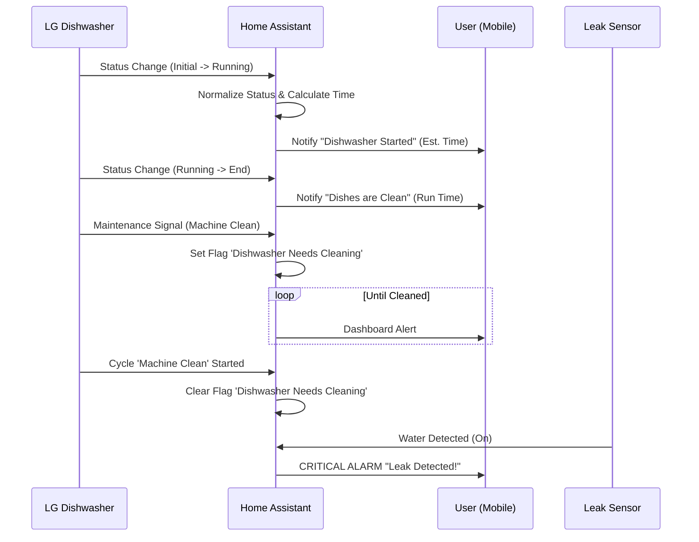

---
tags:
  - package
  - automated
version: 1.1.0
---

# Package: Dishwasher

**Version:** 1.1.0  
**Description:** Logic, sensors, flags, and automations for the LG Dishwasher. Handles normalization of LG ThinQ data, maintenance reminders, and leak detection.

<!-- START_IMAGE -->

<!-- END_IMAGE -->

## Executive Summary
<!-- START_SUMMARY -->
The Dishwasher package provides comprehensive integration for LG ThinQ dishwashers. It normalizes device states into user-friendly status messages (e.g., 'Running', 'Clean'), calculates human-readable remaining times, and manages maintenance schedules. Critical safety features include leak detection using an external sensor, triggering immediate alarms. This package ensures the dishwasher is not just a monitored appliance but an active participant in the smart home ecosystem.
<!-- END_SUMMARY -->

## Process Description (Non-Technical)
<!-- START_DETAILED -->
### How It Works
1. **Activity Monitoring**: The system automatically detects when the dishwasher is powered on or running. It updates the status to "Active", making it visible on your dashboards.
2. **Cycle Notifications**:
    *   **Started**: When you start a cycle, you'll receive a notification on your phone estimating when the dishes will be ready.
    *   **Finished**: Once the cycle is complete, a "Dishes are Clean" notification arrives, detailing how long the cycle took.
3. **Maintenance Reminders**: The system tracks when a "Machine Clean" cycle is recommended by the manufacturer and flags it on your dashboard until you run the cleaning cycle.
4. **Leak Protection**: Just like the smart water valve, this package monitors a dedicated leak sensor under the dishwasher. If water is detected, a critical alarm is triggered to prevent damage.
<!-- END_DETAILED -->

## Dashboard Connections
<!-- START_DASHBOARD -->
This package powers the following dashboard views:

* **[Home](../dashboards/main/home.md)**: *The Home dashboard serves as the central information hub. It features a large clock and family calendars, alongside detailed weather forecasts. Key home stats are highlighted, including real-time energy prices, power usage, and the status of major appliances like the dishwasher and washing machine. The view also provides a high-level overview of the entire house, displaying camera feeds and status summaries for all key rooms (Sauna, Bathroom, Bedroom, etc.) using 'Streamline' area cards.* (Uses 2 entities)
* **[Kitchen](../dashboards/main/kitchen.md)**: *This view offers comprehensive control over the Kitchen. It monitors critical appliances, showing the status of the fridge (door/leak), coffee machine, and detailed cycle information for the dishwasher. Lighting controls allow for general switching or individual bulb adjustments. A key feature is the visualization of zoned presence detection (Entrance, Table, Cooking) using FP2 sensors, enabling highly granular kitchen automations.* (Uses 6 entities)
<!-- END_DASHBOARD -->

## Architecture Diagram
<!-- START_MERMAID_DESC -->
The system operates on an event-driven model. When the `LG Dishwasher` updates its Internal State, Home Assistant immediately normalizes this into a uniform `Dishwasher Active` binary sensor. If the cycle is 'Running', the system calculates the estimated completion time and notifies the users. A parallel logic stream monitors the `Leak Sensor` continuously; if water is detected, it bypasses the standard notification queue and triggers an immediate 'Critical Alarm' to the mobile app, ensuring rapid response to potential flooding.
<!-- END_MERMAID_DESC -->

<!-- START_MERMAID -->

<!-- END_MERMAID -->

## Configuration (Source Code)
```yaml
# ------------------------------------------------------------------------------
# Package: Dishwasher
# Version: 1.1.0
# Description: Logic, sensors, flags, and automations for the LG Dishwasher. Handles normalization of LG ThinQ data, maintenance reminders, and leak detection.
# Dependencies:
#   - Integration: LG ThinQ (SmartThinQ LGE Sensors)
#   - Entity: binary_sensor.kitchen_dishwasher_leak_sensor_water_leak
#   - Script: script.notify_smart_master
# ------------------------------------------------------------------------------

# ==============================================================================
# 1. HELPERS
# ==============================================================================
input_boolean:
  # Flag: Tracks if the 'Machine Clean' cycle is due.
  # Logic:
  #   - Turned ON by automation when 'binary_sensor.dishwasher_machine_clean_reminder' goes high.
  #   - Turned OFF by automation when a 'machine_clean' cycle is actually started.
  dishwasher_needs_cleaning:
    name: "Dishwasher Needs Cleaning"
    icon: mdi:spray-bottle

# ==============================================================================
# 2. TEMPLATE SENSORS (Normalize the LG Data)
# ==============================================================================
template:
  - binary_sensor:
      - name: "Dishwasher Active"
        unique_id: dishwasher_active_normalized
        state: >
          {{ states('sensor.dishwasher_current_status') not in ['unavailable', 'unknown', 'initial', 'power_off'] }}
        icon: mdi:dishwasher

      - name: "Dishwasher Door Open"
        unique_id: dishwasher_door_normalized
        device_class: door
        state: >
          {{ is_state('binary_sensor.dishwasher_door', 'on') }}

  - sensor:
      - name: "Dishwasher Status Clean"
        unique_id: dishwasher_status_clean
        icon: mdi:dishwasher
        state: >
          
          
            Off
          
            {{ status | replace('_', ' ') | title }}
          

      - name: "Dishwasher Remaining Time Human"
        unique_id: dishwasher_remaining_time_human
        icon: mdi:timer-outline
        state: >
          
          
            --:--
          
            {# Calculate difference between finish time and now #}
            
            
              {# Convert seconds to H:MM #}
              {{ time_diff | timestamp_custom('%-H:%M', false) }}
            
              0:00
            
          

# ==============================================================================
# 3. AUTOMATIONS
# ==============================================================================
automation:
  # --- DISHWASHER STARTED ---
  # Notify when the dishwasher starts, with a wait for the time remaining sensor.
  - alias: "Notify: Dishwasher Started"
    id: notify_dishwasher_started_pkg
    description: Notify when dishwasher starts a cycle, waiting for time remaining to be available.
    trigger:
      - entity_id: sensor.dishwasher_current_status
        from: initial
        to: running
        platform: state
      - entity_id: sensor.dishwasher_current_status
        from: power_off
        to: running
        platform: state
    action:
      # Wait up to 2 minutes for a valid time from the sensor.
      - wait_for_trigger:
          - platform: template
            value_template: >
              {{ states('sensor.dishwasher_remaining_time_human') not in ['unknown', 'unavailable', '--:--'] }}
        timeout:
          minutes: 2
        continue_on_timeout: true

      - service: script.notify_smart_master
        data:
          category: info
          title: 💦 Dishwasher Started
          # Use a conditional message in case the wait timed out.
          message: >
            
            
              Cycle: {{ states('sensor.dishwasher_current_cycle') | replace('_', ' ') | title }}
              Ready in: {{ remaining }} hours.
            
              Dishwasher started. Time remaining not yet available.
            
          tag: dishwasher
          clickAction: /lovelace/kitchen
    mode: single

  # --- DISHWASHER DONE ---
  # Notify when dishwasher finishes. Triggers if door opens while status is 'end'.
  - alias: "Notify: Dishwasher Done"
    id: notify_dishwasher_done_pkg
    description: Notify when dishwasher finishes, including run time.
    trigger:
      - entity_id: sensor.dishwasher_current_status
        to: end
        id: cycle_end
        platform: state
      - entity_id: binary_sensor.dishwasher_door
        from: "off"
        to: "on"
        id: door_open
        platform: state
    condition:
      - condition: or
        conditions:
          - condition: trigger
            id: cycle_end
          - condition: and
            conditions:
              - condition: trigger
                id: door_open
              - condition: state
                entity_id: sensor.dishwasher_current_status
                state: end
    action:
      # Calculate run time, handling unknown values safely.
      - variables:
          run_time_raw: "{{ states('sensor.dishwasher_total_time') }}"
          run_time: |-
            
              {{ run_time_raw }} min
            
              Unknown time
            
      - service: script.notify_smart_master
        data:
          category: info
          title: ✨ Dishes are Clean
          message: "The cycle has finished. Total run time: {{ run_time }}."
          tag: dishwasher
          clickAction: app://com.lgeha.nuts
          actions:
            - action: URI
              title: Open LG App
              uri: app://com.lgeha.nuts
    mode: single

  # --- DISHWASHER MAINTENANCE ---
  # Alerts when machine clean is needed and resets the flag when a clean cycle is started.
  - alias: "Notify: Dishwasher Maintenance"
    id: notify_dishwasher_maintenance_pkg
    description: Alerts when machine clean is needed and resets when done.
    trigger:
      - entity_id: binary_sensor.dishwasher_machine_clean_reminder
        to: "on"
        id: needs_clean
        platform: state
      - entity_id: sensor.dishwasher_current_cycle
        to: machine_clean
        id: clean_cycle_started
        platform: state
    action:
      - choose:
          # Case 1: Reminder turns ON and we haven't acknowledged it yet.
          - conditions:
              - condition: trigger
                id: needs_clean
              - condition: state
                entity_id: input_boolean.dishwasher_needs_cleaning
                state: "off"
            sequence:
              - service: input_boolean.turn_on
                target:
                  entity_id: input_boolean.dishwasher_needs_cleaning
              - service: script.notify_smart_master
                data:
                  category: info
                  title: 🧼 Dishwasher Maintenance
                  message: The dishwasher needs a Machine Clean cycle.
                  tag: dishwasher_maintenance
                  sticky: true
          # Case 2: A 'machine_clean' cycle is started, so we reset the flag.
          - conditions:
              - condition: trigger
                id: clean_cycle_started
            sequence:
              - service: input_boolean.turn_off
                target:
                  entity_id: input_boolean.dishwasher_needs_cleaning
    mode: single

  # --- DISHWASHER LEAK DETECTION ---
  # Critical alarm if the external leak sensor detects water.
  - alias: "Notify: Dishwasher Leak"
    id: notify_dishwasher_leak_pkg
    description: Critical alarm triggered by the kitchen leak sensor.
    trigger:
      - platform: state
        entity_id: binary_sensor.kitchen_dishwasher_leak_sensor_water_leak
        to: "on"
    action:
      - service: script.notify_smart_master
        data:
          category: alarm
          title: "💧 Dishwasher Leak Detected!"
          message: "CRITICAL: Water detected under the dishwasher. Check immediately!"
          tag: dishwasher_leak
          critical: true
          sticky: true
          clickAction: /lovelace/kitchen
    mode: single
# ------------------------------------------------------------------------------
# Changelog
# ------------------------------------------------------------------------------
# 1.1.0 (2025-12-09): Added critical leak detection automation.
# 1.0.0 (2025-12-07): Initial package creation with status, time logic, and maintenance reminders.
# ------------------------------------------------------------------------------

```
