---
tags:
  - package
  - automated
---

# Package: Dishwasher

## Executive Summary
This package manages the integration and automation logic for the LG Dishwasher (via SmartThinQ). It normalizes raw sensor data into friendly states ("Active", "Clean"), calculates a human-readable "Time Remaining" value, and tracks maintenance requirements.

**Key Features:**
- **State Normalization**: Converts various machine states (e.g., `running`, `rinsing`, `drying`) into a simple binary `active` sensor.
- **Maintenance Tracking**: Uses an `input_boolean` to flag when a "Machine Clean" cycle is required, auto-resetting when the cycle is performed.
- **Smart Notifications**:
    - **Start**: Notifies when a cycle begins, including the estimated finish time.
    - **End**: Notifies when finished with total run time. Triggers immediately on cycle end or if the door is opened while in 'end' state.

## Architecture

```mermaid
sequenceDiagram
    participant LG as LG ThinQ Integration
    participant Pkg as Package Logic
    participant HA as Home Assistant
    participant User as User/Dashboard

    Note over LG, Pkg: State Normalization
    LG->>Pkg: Update sensor.dishwasher_current_status
    Pkg->>HA: Update binary_sensor.dishwasher_active (On/Off)
    Pkg->>HA: Update sensor.dishwasher_status_clean (Friendly Name)

    Note over LG, Pkg: Time Calculation
    LG->>Pkg: Update sensor.dishwasher_remaining_time
    Pkg->>HA: Update sensor.dishwasher_remaining_time_human (HH:MM)

    Note over Pkg, HA: Automation Flow
    rect rgb(20, 50, 20)
        LG->>Pkg: Status: Running
        Pkg->>HA: Notify "Dishwasher Started" (Wait for time calc)
    end
    
    rect rgb(20, 20, 50)
        LG->>Pkg: Status: End
        Pkg->>HA: Notify "Dishes are Clean" (with Run Time)
    end

    rect rgb(50, 20, 20)
        LG->>Pkg: Machine Clean Reminder
        Pkg->>HA: Turn On input_boolean.dishwasher_needs_cleaning
        Pkg->>HA: Notify "Maintenance Needed"
        User->>LG: Run "Machine Clean" Cycle
        LG->>Pkg: Cycle: machine_clean
        Pkg->>HA: Turn Off input_boolean.dishwasher_needs_cleaning
    end
```



## Backend Configuration

The specific logic and sensors are defined in `packages/dishwasher.yaml`.

```yaml
# Package: Dishwasher
# Description: Logic, Sensors, Flags, and Automations for the LG Dishwasher
#
# Dependencies:
#   - Integration: LG ThinQ (SmartThinQ LGE Sensors)
#   - Script: script.notify_smart_master (Notification System Package)

# ------------------------------------------------------------------------------
# 1. HELPERS
# ------------------------------------------------------------------------------
input_boolean:
  dishwasher_needs_cleaning:
    name: "Dishwasher Needs Cleaning"
    icon: mdi:spray-bottle

# ------------------------------------------------------------------------------
# 2. TEMPLATE SENSORS (Normalize the LG Data)
# ------------------------------------------------------------------------------
template:
  - binary_sensor:
      - name: "Dishwasher Active"
        unique_id: dishwasher_active_normalized
        state: >
          {{ states('sensor.dishwasher_current_status') not in ['unavailable', 'unknown', 'initial', 'power_off'] }}
        icon: mdi:dishwasher

      - name: "Dishwasher Door Open"
        unique_id: dishwasher_door_normalized
        device_class: door
        state: >
          {{ is_state('binary_sensor.dishwasher_door', 'on') }}

  - sensor:
      - name: "Dishwasher Status Clean"
        unique_id: dishwasher_status_clean
        icon: mdi:dishwasher
        state: >
          
          
            Off
          
            {{ status | replace('_', ' ') | title }}
          

      - name: "Dishwasher Remaining Time Human"
        unique_id: dishwasher_remaining_time_human
        icon: mdi:timer-outline
        state: >
          
          
            --:--
          
            {# Calculate difference between finish time and now #}
            
            
              {# Convert seconds to H:MM #}
              {{ time_diff | timestamp_custom('%-H:%M', false) }}
            
              0:00
            
          

# ------------------------------------------------------------------------------
# 3. AUTOMATIONS
# ------------------------------------------------------------------------------
automation:
  # --- DISHWASHER STARTED ---
  - alias: "Notify: Dishwasher Started"
    id: notify_dishwasher_started_pkg
    triggers:
      - entity_id: sensor.dishwasher_current_status
        from: initial
        to: running
        trigger: state
      - entity_id: sensor.dishwasher_current_status
        from: power_off
        to: running
        trigger: state
    actions:
      - wait_for_trigger:
          - trigger: template
            value_template: >
              {{ states('sensor.dishwasher_remaining_time_human') not in ['unknown', 'unavailable', '--:--'] }}
        timeout:
          minutes: 2
        continue_on_timeout: true

      - action: script.notify_smart_master
        data:
          category: info
          title: 💦 Dishwasher Started
          message: >
            
            
              Cycle: {{ states('sensor.dishwasher_current_cycle') | replace('_', ' ') | title }}
              Ready in: {{ remaining }} hours.
            
              Dishwasher started. Time remaining not yet available.
            
          tag: dishwasher
          clickAction: /lovelace/kitchen
    mode: single

  # --- DISHWASHER DONE ---
  - alias: "Notify: Dishwasher Done"
    id: notify_dishwasher_done_pkg
    triggers:
      - entity_id: sensor.dishwasher_current_status
        to: end
        id: cycle_end
        trigger: state
      - entity_id: binary_sensor.dishwasher_door
        from: "off"
        to: "on"
        id: door_open
        trigger: state
    conditions:
      - condition: or
        conditions:
          - condition: trigger
            id: cycle_end
          - condition: and
            conditions:
              - condition: trigger
                id: door_open
              - condition: state
                entity_id: sensor.dishwasher_current_status
                state: end
    actions:
      - variables:
          run_time_raw: "{{ states('sensor.dishwasher_total_time') }}"
          run_time: |-
            
              {{ run_time_raw }} min
            
              Unknown time
            
      - action: script.notify_smart_master
        data:
          category: info
          title: ✨ Dishes are Clean
          message: "The cycle has finished. Total run time: {{ run_time }}."
          tag: dishwasher
          clickAction: app://com.lgeha.nuts
          actions:
            - action: URI
              title: Open LG App
              uri: app://com.lgeha.nuts
    mode: single

  # --- DISHWASHER MAINTENANCE ---
  - alias: "Notify: Dishwasher Maintenance"
    id: notify_dishwasher_maintenance_pkg
    triggers:
      - entity_id: binary_sensor.dishwasher_machine_clean_reminder
        to: "on"
        id: needs_clean
        trigger: state
      - entity_id: sensor.dishwasher_current_cycle
        to: machine_clean
        id: clean_cycle_started
        trigger: state
    actions:
      - choose:
          - conditions:
              - condition: trigger
                id: needs_clean
              - condition: state
                entity_id: input_boolean.dishwasher_needs_cleaning
                state: "off"
            sequence:
              - action: input_boolean.turn_on
                target:
                  entity_id: input_boolean.dishwasher_needs_cleaning
              - action: script.notify_smart_master
                data:
                  category: info
                  title: 🧼 Dishwasher Maintenance
                  message: The dishwasher needs a Machine Clean cycle.
                  tag: dishwasher_maintenance
                  sticky: true
          - conditions:
              - condition: trigger
                id: clean_cycle_started
            sequence:
              - action: input_boolean.turn_off
                target:
                  entity_id: input_boolean.dishwasher_needs_cleaning
    mode: single
```

## Frontend Connection

**Key Entities**:
- `sensor.dishwasher_state`
- `binary_sensor.kitchen_dishwasher_leak_sensor_water_leak` (Integration provided)

**Dashboard Usage**:
The dishwasher is monitored in the Development dashboard (`dashboard_dev2`), primarily tracked within area cards (likely Kitchen).

**Card Configuration (Snippet)**:
This snippet shows how the leak sensor and state are integrated into grid/area cards.

```json
// From lovelace.dashboard_dev2
{
  "device_3": "sensor.dishwasher_state",
  "device_3_icon": "mdi:dishwasher",
  "device_3_state": "Running",
  "device_3_color": "blue",
  "device_4": "binary_sensor.kitchen_dishwasher_leak_sensor_water_leak",
  "device_4_icon": "mdi:dishwasher-alert",
  "device_4_state": "on",
  "device_4_color": "red",
  "device_4_animation": "blink"
}
```
