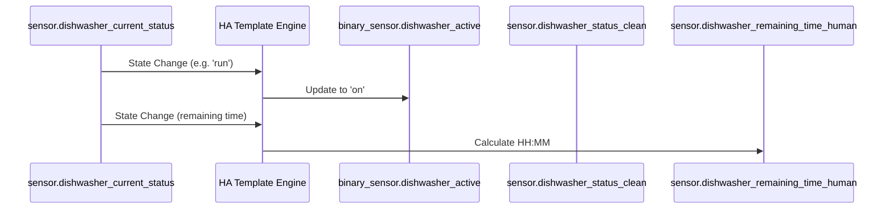

# Package: Dishwasher

## Executive Summary
This package manages the state of the LG Dishwasher. It normalizes various status strings into simple "Active" or "Clean" states and provides a human-readable "Remaining Time" sensor. It also includes an input boolean helper to track if the dishwasher needs cleaning.

## Architecture


## Backend Configuration
```yaml
template:
  - binary_sensor:
      - name: "Dishwasher Active"
        unique_id: dishwasher_active_normalized
        state: >
          {{ states('sensor.dishwasher_current_status') not in ['unavailable', 'unknown', 'initial', 'power_off'] }}
        icon: mdi:dishwasher

  - sensor:
      - name: "Dishwasher Status Clean"
        unique_id: dishwasher_status_clean
        icon: mdi:dishwasher
        state: >
          
          
            Off
          
            {{ status | replace('_', ' ') | title }}
          
```

## Frontend Connection
**Key Entities**:
- `binary_sensor.dishwasher_active_normalized`
- `sensor.dishwasher_status_clean`
- `binary_sensor.kitchen_dishwasher_leak_sensor_water_leak`

**Dashboard Usage**:
Used in `dashboard_demo` and `dashboard_dev2`. The leak sensor is prominently monitored.

**Card Configuration (Snippet)**:
```json
// From lovelace.dashboard_dev2
{
  "device_3": "sensor.dishwasher_state",
  "device_3_icon": "mdi:dishwasher",
  "device_4": "binary_sensor.kitchen_dishwasher_leak_sensor_water_leak",
  "device_4_icon": "mdi:dishwasher-alert"
}
```

### UI Simulation
<div style="border: 1px solid #444; border-radius: 12px; padding: 16px; width: 300px; background: #222; color: white; font-family: sans-serif;">
  <div style="display: flex; align-items: center; gap: 16px;">
    <div style="font-size: 32px; color: #3498db;">
      🛑 
    </div>
    <div style="flex-grow: 1;">
      <div style="font-weight: bold; font-size: 1.1em;">Dishwasher</div>
      <div style="color: #aaa;">Running - Rinse</div>
    </div>
    <div style="text-align: right;">
      <div style="font-weight: bold; font-size: 1.2em;">0:45</div>
      <div style="font-size: 0.8em; color: #888;">Remaining</div>
    </div>
  </div>
</div>
