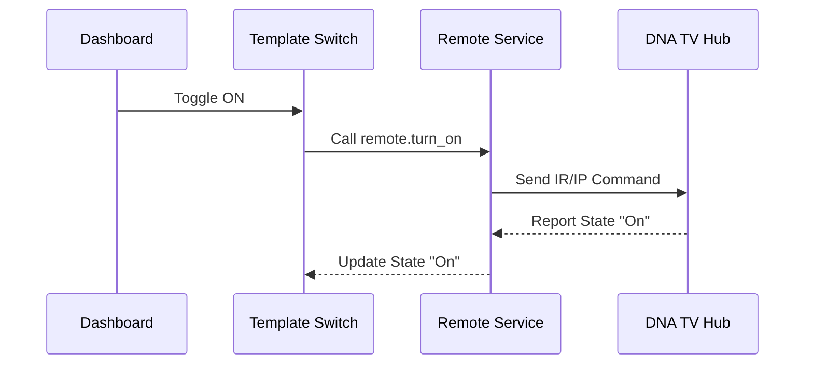

---
tags:
  - package
  - automated
version: 1.0.0
---

# Package: Dna Tv Hub

**Version:** 1.0.0  
**Description:** Template switch for DNA TV Hub remote control

<!-- START_IMAGE -->

<!-- END_IMAGE -->

## Executive Summary
<!-- START_SUMMARY -->
This package creates a simplified "Master Switch" for the DNA TV Hub, wrapping the underlying remote control commands into a single boolean entity. This allows the TV Hub to be treated like a standard appliance (On/Off) in dashboards and voice commands, abstrating the complexity of the remote service calls.
<!-- END_SUMMARY -->

## Process Description (Non-Technical)
<!-- START_DETAILED -->
1.  **Switch Action**: When you toggle the "DNA TV HUB" switch on the dashboard.
2.  **Service Call**: The system translates this into a `remote.turn_on` or `remote.turn_off` command sent to the specific hub device.
3.  **State Feedback**: The switch icon lights up based on the actual state reported by the device, establishing a two-way sync.
<!-- END_DETAILED -->

## Dashboard Connections
<!-- START_DASHBOARD -->
*No specific entities detected to link.*
<!-- END_DASHBOARD -->

## Architecture Diagram
<!-- START_MERMAID_DESC -->
The architecture is a simple wrapper pattern. The Template Switch sits between the User and the Remote entity. It intercepts the On/Off intent and routes it to the correct service call, while simultaneously reflecting the Remote's state back to the UI.
<!-- END_MERMAID_DESC -->

<!-- START_MERMAID -->

<!-- END_MERMAID -->

## Configuration (Source Code)
```yaml
# ------------------------------------------------------------------------------
# Package: DNA TV Hub
# Version: 1.0.0
# Description: Template switch for DNA TV Hub remote control
# Dependencies: remote.dna_tv_hub
# ------------------------------------------------------------------------------
template:
  - switch:
      - name: "DNA TV HUB"
        unique_id: dna_tv_hub
        icon: mdi:television
        state: "{{ is_state('remote.dna_tv_hub', 'on') }}"
        turn_on:
          service: remote.turn_on
          target:
            entity_id: remote.dna_tv_hubi
        turn_off:
          service: remote.turn_off
          target:
            entity_id: remote.dna_tv_hubi

```
