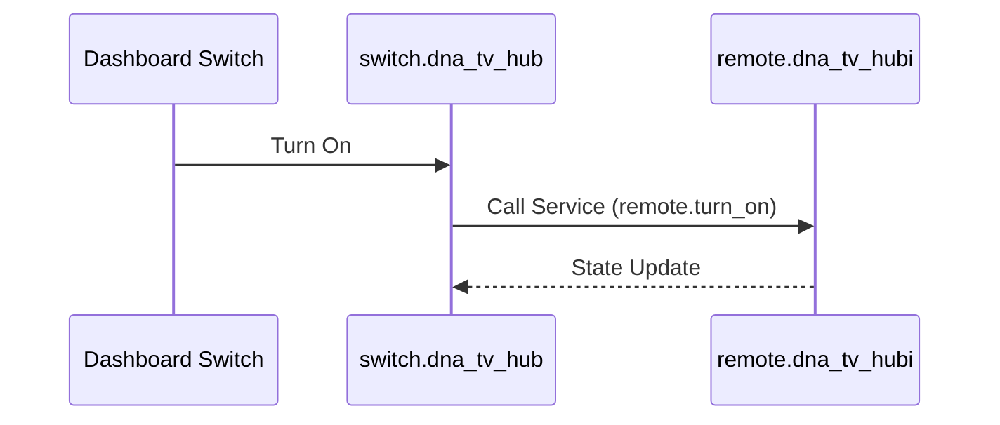

# Package: DNA TV Hub

## Executive Summary
This package provides a simple switch mechanism to control the DNA TV Hub power state. It wraps the `remote.dna_tv_hubi` service calls into a toggleable switch entity for easier dashboard integration (e.g., standard toggle buttons).

## Architecture


## Backend Configuration
```yaml
template:
  - switch:
      - name: "DNA TV HUB"
        unique_id: dna_tv_hub
        icon: mdi:television
        state: "{{ is_state('remote.dna_tv_hub', 'on') }}"
        turn_on:
          service: remote.turn_on
          target:
            entity_id: remote.dna_tv_hubi
        turn_off:
          service: remote.turn_off
          target:
            entity_id: remote.dna_tv_hubi
```

## Frontend Connection
**Key Entities**:
- `switch.dna_tv_hub`

**Dashboard Usage**:
No specific complex card configuration found. Likely used as a standard entity in an entities card or a button.

### UI Simulation
<div style="border: 1px solid #444; border-radius: 8px; padding: 12px; width: 250px; background: #222; color: white; font-family: sans-serif; display: flex; align-items: center; justify-content: space-between;">
  <div style="display: flex; align-items: center; gap: 12px;">
    <span style="font-size: 24px;">📺</span>
    <span>DNA TV Hub</span>
  </div>
  <div style="width: 40px; height: 20px; background: #4caf50; border-radius: 10px; position: relative;">
    <div style="width: 18px; height: 18px; background: white; border-radius: 50%; position: absolute; right: 1px; top: 1px;"></div>
  </div>
</div>
