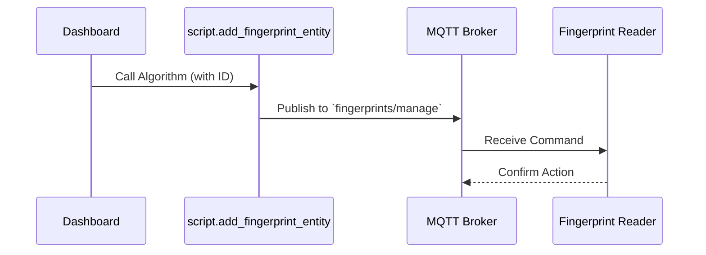

# Package: Fingerprint Management

## Executive Summary
This package allows for the dynamic management of fingerprint users via **MQTT**. It interacts with a fingerprint reader backend (likely ESPHome or similar generic MQTT device). It provides scripts to Add and Delete users by ID.

## Architecture


## Backend Configuration
*(Snippet)*
```yaml
# Package: Fingerprint Management
# Description: Managing fingerprint users via MQTT

input_text:
  fingerprint_mgmt_id:
    name: Fingerprint ID (ULP)
    icon: mdi:fingerprint

script:
  add_fingerprint_entity:
    alias: "Add Fingerprint User"
    icon: mdi:account-plus
    sequence:
      - service: mqtt.publish
        data:
          topic: "fingerprints/manage"
          payload: "{\"action\": \"add\", \"id\": \"{{ states('input_text.fingerprint_mgmt_id') }}\"}"

  delete_fingerprint_entity:
    alias: "Delete Fingerprint User"
    icon: mdi:account-remove
    sequence:
      - service: mqtt.publish
        data:
          topic: "fingerprints/manage"
          payload: "{\"action\": \"delete\", \"id\": \"{{ states('input_text.fingerprint_mgmt_id') }}\"}"
```

## Frontend Connection
**Key Entities**:
- `input_text.fingerprint_mgmt_id`
- `script.add_fingerprint_entity`
- `script.delete_fingerprint_entity`

**Dashboard Usage**:
Located in **Home Access** (`lovelace.home_access`). It features a dedicated input text field for the ID and buttons to trigger the add/delete scripts.

**Card Configuration (Snippet)**:
```json
{
  "heading": "Fingerprint Registry",
  "icon": "mdi:fingerprint",
  "content": "...",
  "type": "vertical-stack",
  "cards": [
    {
      "entity": "input_text.fingerprint_mgmt_id",
      "name": "Fingerprint ID (ULP)"
    },
    {
      "type": "horizontal-stack",
      "cards": [
        {
          "type": "button",
          "name": "Add",
          "icon": "mdi:account-plus",
          "tap_action": {
            "action": "call-service",
            "service": "script.add_fingerprint_entity"
          }
        },
        {
          "type": "button",
          "name": "Delete",
          "icon": "mdi:account-remove",
          "tap_action": {
            "action": "call-service",
            "service": "script.delete_fingerprint_entity"
          }
        }
      ]
    }
  ]
}
```

### UI Simulation
<div style="border: 1px solid #444; border-radius: 8px; padding: 16px; width: 300px; background: #222; color: white; font-family: sans-serif;">
  <h3>Fingerprint Registry</h3>
  <div style="margin-bottom: 12px;">
    <label style="font-size: 0.8em; color: #aaa;">Fingerprint ID</label>
    <input type="text" value="12" style="width: 100%; padding: 8px; background: #333; border: 1px solid #555; color: white; border-radius: 4px;">
  </div>
  <div style="display: flex; gap: 8px;">
    <button style="flex: 1; padding: 10px; background: #2e7d32; color: white; border: none; border-radius: 4px; cursor: pointer;">Add User</button>
    <button style="flex: 1; padding: 10px; background: #c62828; color: white; border: none; border-radius: 4px; cursor: pointer;">Delete</button>
  </div>
</div>
