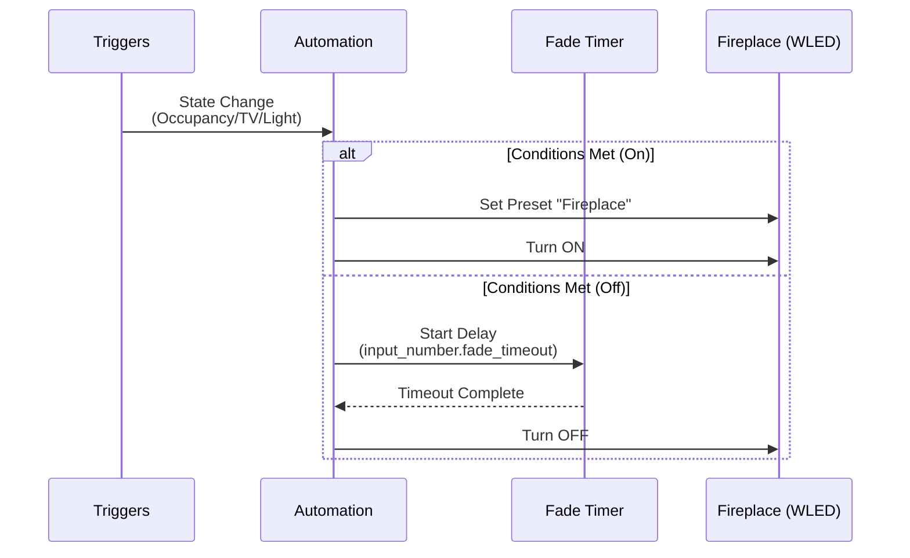

---
tags:
  - package
  - automated
version: 1.0.0
---

# Package: Fireplace Automation

**Version:** 1.0.0  
**Description:** Controls WLED Fireplace based on Occupancy, TV, and Light levels.

<!-- START_IMAGE -->

<!-- END_IMAGE -->

## Executive Summary
<!-- START_SUMMARY -->
This package automates the **Living Room Fireplace (WLED)** to provide a cozy ambiance. It strictly controls when the fireplace turns on (Occupied + Dark + TV Off) and ensures it turns off when these conditions are no longer met, with a configurable fade-out timer.
<!-- END_SUMMARY -->

## Process Description (Non-Technical)
<!-- START_DETAILED -->
The automation logic is designed to create a specific "mood" without requiring manual intervention.

### Turn ON Logic
The fireplace will **only** turn on if **ALL** of the following true:
1.  **Occupancy:** Someone is in the Living Room.
2.  **Activity:** The TV is **OFF** (to avoid distraction/reflection).
3.  **Ambience:** The room is **Dark** (Light sensor < 25 lx).
4.  **Lighting:** The Ceiling Light is either **OFF** or **DIM** (< 57% brightness).

### Turn OFF Logic
The fireplace will turn off if **ANY** of the start conditions fail:
*   Room becomes empty.
*   TV is turned ON.
*   Ceiling lights become bright.

*Note: There is a configurable **Fade Timeout** (Default: 5 min) to prevent rapid toggling if you briefly leave the room.*
<!-- END_DETAILED -->

## Dashboard Connections
<!-- START_DASHBOARD -->
This package powers the following dashboard views:

* **[Home](../dashboards/main/home.md)**: *The Home dashboard serves as the central information hub. It features a large clock and family calendars, alongside detailed weather forecasts. Key home stats are highlighted, including real-time energy prices, power usage, and the status of major appliances like the dishwasher and washing machine. The view also provides a high-level overview of the entire house, displaying camera feeds and status summaries for all key rooms (Sauna, Bathroom, Bedroom, etc.) using 'Streamline' area cards.* (Uses 1 entities)
* **[Living Room](../dashboards/main/living_room.md)**: *The Living Room dashboard is a media and comfort hub. It features in-depth environmental monitoring (Radon, VOCs, CO2) via Airthings Wave, displaying historical trends. Entertainment controls are central, with remotes for the TV and Soundbar, plus power management for the media wall. The view also includes specific controls for the fireplace, air purifier modes, and various lighting scenes, alongside standard occupancy settings.* (Uses 2 entities)
* **[Office](../dashboards/main/office.md)**: *The Office dashboard handles both workspace environment and IT infrastructure. It offers detailed environmental tracking (Airthings Wave) and lighting prompts. Key features include remote PC control (Audio, Power, Displays) and extensive server monitoring (Proxmox, Home Assistant OS stats, SSD usage). It also manages potential window covers and detailed power consumption for office equipment.* (Uses 1 entities)
* **[Room Management](../dashboards/room-management/room_management.md)**: *The Room Management dashboard serves as the administrative backend for the home's room logic. It allows users to initialize new rooms (creating necessary helper entities) or delete existing ones. It features a dynamic "Configured Rooms" section powered by `auto-entities`, which automatically lists all configured rooms and provides collapsible controls for their automation modes, occupancy sensors, and timeouts.* (Uses 1 entities)
<!-- END_DASHBOARD -->

## Architecture Diagram
<!-- START_MERMAID_DESC -->
The sequence diagram below visualizes the **Restart Mode** automation. Every time a trigger state changes (Occupancy, TV, Light), the automation evaluates the conditions. If the "ON" conditions are met, it activates the WLED preset immediately. If the "OFF" conditions are met, it starts a delay timer before turning the light off.
<!-- END_MERMAID_DESC -->

<!-- START_MERMAID -->

<!-- END_MERMAID -->

## Configuration (Source Code)
```yaml
# ------------------------------------------------------------------------------
# Package: Fireplace Automation
# Version: 1.0.0
# Description: Controls WLED Fireplace based on Occupancy, TV, and Light levels.
# Dependencies:
#   - Integration: WLED (light.fireplace)
#   - Binary Sensor: binary_sensor.area_living_room_occupancy
#   - Media Player: media_player.70pus9005_12_2
#   - Sensor: sensor.living_room_fp2_occupancy_light_sensor_light_level
# ------------------------------------------------------------------------------

# 1. Configuration Helpers
input_number:
  fireplace_fade_timeout:
    name: Fireplace Fade Timeout
    icon: mdi:timer-outline
    min: 0
    max: 1800
    step: 10
    unit_of_measurement: "s"
    mode: box
    initial: 300 # Default 5 minutes

# 2. Main Automation
automation:
  - id: fireplace_controller
    alias: "Control: Living Room Fireplace"
    description: "Controls WLED Fireplace based on Occupancy, TV, and Light levels."
    mode: restart # Restarts on new trigger (effectively resetting the off-timer)

    trigger:
      - platform: state
        entity_id:
          - binary_sensor.area_living_room_occupancy
          - media_player.70pus9005_12_2
          - light.living_room_ceiling_light
          # Trigger on illuminance changes too, in case it gets dark while occupied
          - sensor.living_room_fp2_occupancy_light_sensor_light_level

    action:
      - choose:
          # --- TURN ON SCENARIO ---
          - conditions:
              # 1. Room must be Occupied
              - condition: state
                entity_id: binary_sensor.area_living_room_occupancy
                state: "on"
              # 2. TV must be OFF
              - condition: state
                entity_id: media_player.70pus9005_12_2
                state: "off"
              # 3. Room must be Dark (< 25 lx)
              - condition: numeric_state
                entity_id: sensor.living_room_fp2_occupancy_light_sensor_light_level
                below: 25
              # 4. Ceiling Light must be OFF or DIM (< 145 brightness ~57%)
              - condition: or
                conditions:
                  - condition: state
                    entity_id: light.living_room_ceiling_light
                    state: "off"
                  - condition: numeric_state
                    entity_id: light.living_room_ceiling_light
                    attribute: brightness
                    below: 145
            sequence:
              # Set WLED to Fireplace preset
              - service: select.select_option
                target:
                  entity_id: select.fireplace_preset
                data:
                  option: fireplace
              # Turn On
              - service: light.turn_on
                target:
                  entity_id: light.fireplace

          # --- TURN OFF SCENARIO ---
          # Triggers if any condition for "ON" fails (Occupancy lost, TV On, Light Bright)
          # We use a broad 'else' logic or explicit conditions.
          # Explicit conditions allow us to filter out irrelevant triggers (like illuminance changing from 1 to 2)
          - conditions:
              - condition: or
                conditions:
                  # 1. Room Empty
                  - condition: state
                    entity_id: binary_sensor.area_living_room_occupancy
                    state: "off"
                  # 2. TV ON
                  - condition: state
                    entity_id: media_player.70pus9005_12_2
                    state: "on"
                  # 3. Lights Bright (Risk: if light is off, attribute check might fail or be false.
                  #    We only care if it IS on and bright)
                  - condition: and
                    conditions:
                      - condition: state
                        entity_id: light.living_room_ceiling_light
                        state: "on"
                      - condition: numeric_state
                        entity_id: light.living_room_ceiling_light
                        attribute: brightness
                        above: 144
            sequence:
              # Wait for the Fade Timeout
              - delay: "{{ states('input_number.fireplace_fade_timeout') | int(300) }}"
              # Turn Off
              - service: light.turn_off
                target:
                  entity_id: light.fireplace

```

## Related Project
> [!TIP] "Build Story"
> Want to see how the hardware was built? Check out the **[Virtual Fireplace Build Guide](../../articles/virtual-fireplace.md)**.
