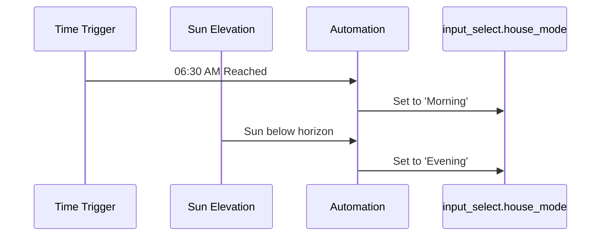

# Package: Home Time Modes

## Executive Summary
This package manages the "Mode" of the house (Morning, Day, Evening, Night) based on time of day and sun position. It uses `input_datetime` helpers to define boundaries (e.g., "Morning begins at 06:30") and automations to transition the `input_select.house_mode`.

## Architecture


## Backend Configuration
*(Snippet)*
```yaml
input_select:
  house_mode:
    name: House Mode
    options:
      - Morning
      - Day
      - Evening
      - Night
    icon: mdi:home-clock

input_datetime:
  morning_time:
    name: Morning Start Time
    has_date: false
    has_time: true
```

## Frontend Connection
**Key Entities**:
- `input_select.house_mode`
- `input_datetime.morning_time`

**Dashboard Usage**:
No specific dashboard card configuration was found in the scan. These settings are likely managed in a "System" or "Settings" view that relies on auto-entities or Entity cards, or they are purely backend logic.

### UI Simulation
<div style="border: 1px solid #444; border-radius: 8px; padding: 16px; width: 300px; background: #222; color: white; font-family: sans-serif;">
  <div style="display: flex; align-items: center; justify-content: space-between; margin-bottom: 12px;">
    <div style="display: flex; align-items: center; gap: 8px;">
      <span>🏠</span>
      <span>House Mode</span>
    </div>
    <select style="background: #333; color: white; border: 1px solid #555; padding: 4px; border-radius: 4px;">
      <option>Morning</option>
      <option selected>Day</option>
      <option>Evening</option>
      <option>Night</option>
    </select>
  </div>
</div>
