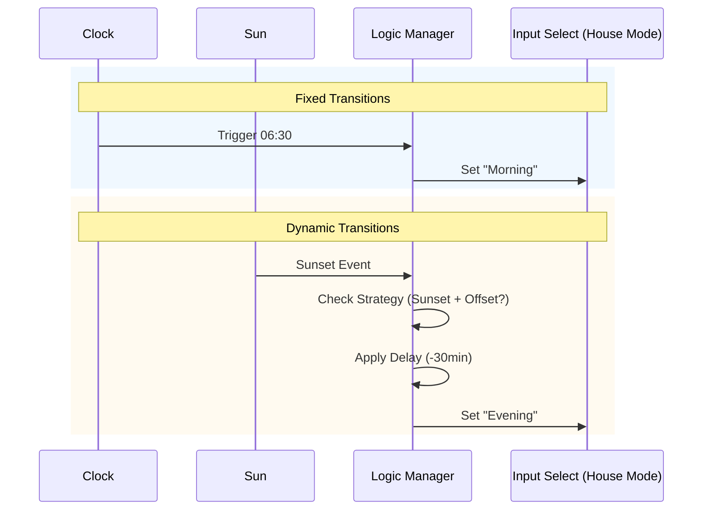

---
tags:
  - package
  - automated
version: 1.0.0
---

# Package: Home Time Modes

**Version:** 1.0.0  
**Description:** Parametric Time-of-Day Logic

<!-- START_IMAGE -->

<!-- END_IMAGE -->

## Executive Summary
<!-- START_SUMMARY -->
This package implements a robust "State Machine" for the home's time-of-day logic. Unlike simple time triggers, it defines discrete modes (Morning, Day, Evening, Night) and transitions between them based on a configurable mix of fixed times and dynamic solar events (Sunset). This central "Home Mode" is then used by all other automations (Lighting, Healing, Security) to determine behavior, ensuring synchronization across the entire smart home.
<!-- END_SUMMARY -->

## Process Description (Non-Technical)
<!-- START_DETAILED -->
1.  **Triggers**: The system watches the clock and the sun position.
2.  **Logic Check**:
    *   **Morning/Day/Night**: Switches at specific times you set in the dashboard (e.g., 06:30, 09:00, 23:00).
    *   **Evening**: Can be set to a fixed time (e.g., 18:00) OR dynamically follow the sunset (e.g., "Sunset minus 30 minutes" to draw blinds before it gets dark).
3.  **Action**: Updates the global "Home Time Mode" setting, which effectively tells the rest of the house what "phase" of the day it is.
<!-- END_DETAILED -->

## Dashboard Connections
<!-- START_DASHBOARD -->
*No linked dashboard views found (Automatic Scan).*
<!-- END_DASHBOARD -->

## Architecture Diagram
<!-- START_MERMAID_DESC -->
The core component is a single automation (`system_manager_home_time_modes`) acting as a central controller. It subscribes to multiple triggers (Time, Sun). When triggered, it evaluates a `Choose` block to determine the correct target state. The unique feature is the "Evening Strategy" logic, which branches to handle either fixed formatting or solar calculations with offsets before committing the state change to the `input_select.house_mode` entity.
<!-- END_MERMAID_DESC -->

<!-- START_MERMAID -->

<!-- END_MERMAID -->

## Configuration (Source Code)
```yaml
# ------------------------------------------------------------------------------
# Package: Home Time Modes
# Version: 1.0.0
# Description: Parametric Time-of-Day Logic
# Dependencies: input_datetime, sun.sun
# ------------------------------------------------------------------------------
# ------------------------------------------------------------------------------
# 1. SETTINGS (Editable from Dashboard)
# ------------------------------------------------------------------------------
input_datetime:
  mode_time_morning:
    name: "Morning Start Time"
    has_date: false
    has_time: true
    initial: "06:30"

  mode_time_day:
    name: "Day Start Time"
    has_date: false
    has_time: true
    initial: "09:00"

  mode_time_evening_fixed:
    name: "Evening Fixed Time"
    has_date: false
    has_time: true
    initial: "18:00"

  mode_time_night:
    name: "Night Start Time"
    has_date: false
    has_time: true
    initial: "23:00"

input_select:
  # RENAMED: Clearer distinction
  house_mode:
    name: "Home Time Mode"
    icon: mdi:home-clock
    options:
      - Morning
      - Day
      - Evening
      - Night

  mode_evening_strategy:
    name: "Evening Strategy"
    icon: mdi:weather-sunset
    options:
      - "Fixed Time"
      - "Sunset + Offset"

input_number:
  mode_evening_sun_offset:
    name: "Sunset Offset (Minutes)"
    icon: mdi:timer-sand
    min: -120
    max: 120
    step: 10
    unit_of_measurement: min
    mode: box

# ------------------------------------------------------------------------------
# 2. LOGIC
# ------------------------------------------------------------------------------
automation:
  - alias: "System: Manager Home Time Modes"
    id: system_manager_home_time_modes
    mode: restart
    trigger:
      # Trigger on Time Inputs
      - platform: time
        at: input_datetime.mode_time_morning
        id: "Morning"
      - platform: time
        at: input_datetime.mode_time_day
        id: "Day"
      - platform: time
        at: input_datetime.mode_time_night
        id: "Night"
      - platform: time
        at: input_datetime.mode_time_evening_fixed
        id: "Evening_Fixed"

      # Trigger on Sun
      - platform: sun
        event: sunset
        id: "Evening_Sun"

      # Failsafe
      - platform: time_pattern
        minutes: "/15"
        id: "Heartbeat"

    action:
      - choose:
          # --- MORNING ---
          - conditions:
              - condition: trigger
                id: "Morning"
            sequence:
              - service: input_select.select_option
                target:
                  entity_id: input_select.house_mode
                data: { option: "Morning" }

          # --- DAY ---
          - conditions:
              - condition: trigger
                id: "Day"
            sequence:
              - service: input_select.select_option
                target:
                  entity_id: input_select.house_mode
                data: { option: "Day" }

          # --- NIGHT ---
          - conditions:
              - condition: trigger
                id: "Night"
            sequence:
              - service: input_select.select_option
                target:
                  entity_id: input_select.house_mode
                data: { option: "Night" }

          # --- EVENING (Complex Logic) ---
          - conditions:
              - condition: or
                conditions:
                  # Fixed Strategy
                  - condition: and
                    conditions:
                      - condition: trigger
                        id: "Evening_Fixed"
                      - condition: state
                        entity_id: input_select.mode_evening_strategy
                        state: "Fixed Time"
                  # Sun Strategy
                  - condition: and
                    conditions:
                      - condition: trigger
                        id: "Evening_Sun"
                      - condition: state
                        entity_id: input_select.mode_evening_strategy
                        state: "Sunset + Offset"
            sequence:
              # Handle Offset
              - if:
                  - condition: state
                    entity_id: input_select.mode_evening_strategy
                    state: "Sunset + Offset"
                then:
                  - delay:
                      minutes: "{{ states('input_number.mode_evening_sun_offset') | int(0) }}"

              - service: input_select.select_option
                target:
                  entity_id: input_select.house_mode
                data: { option: "Evening" }

```
