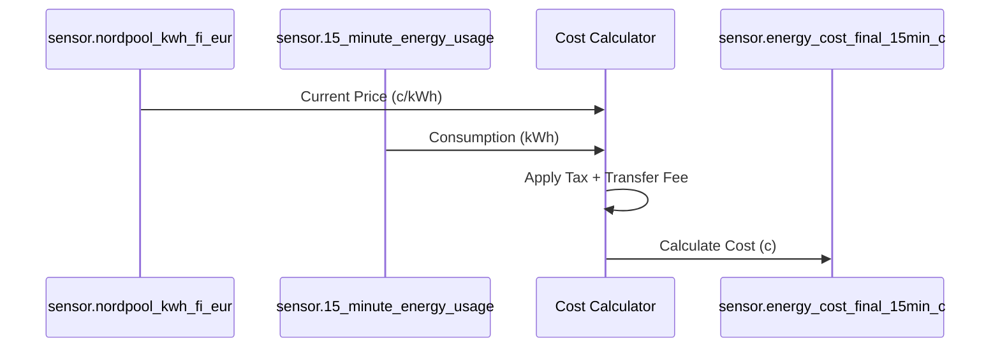

# Package: Nordpool Prices

## Executive Summary
This package is a sophisticated energy cost calculator. It fetches electricity prices from **Nordpool**, calculates taxes and transfer fees (using input numbers), and determines the 15-minute energy cost for the home. It also provides "Today/Tomorrow" average price sensors.

## Architecture


## Backend Configuration
*(Snippet)*
```yaml
template:
  - sensor:
      - name: "Current 15-Minute Electricity Price"
        unique_id: "current_15min_electricity_price"
        unit_of_measurement: "c/kWh"
        state: >
          {{ ... logic to find current price block ... }}

      - name: "Energy Cost Final 15min (c)"
        state: >
          
          ...
          {{ cost_c | round(2) }}
```

## Frontend Connection
**Key Entities**:
- `sensor.nordpool_kwh_fi_eur_...`
- `sensor.nordpool_today_mean_hi_limit`

**Dashboard Usage**:
Heavily featured in `dashboard_demo` and `dashboard_dev2`. It uses **ApexCharts** (implied by the complex graph attributes like `PRICEAVERAGE`, `PRICEMEAN`) to visualize price trends and limits.

**Card Configuration (Snippet)**:
```json
{
  "type": "custom:apexcharts-card",
  "series": [
    {
      "entity": "sensor.nordpool_kwh_fi_eur",
      "data_generator": "...",
      "color_threshold": [
        { "value": 0, "color": "green" },
        { "value": 10, "color": "orange" },
        { "value": 30, "color": "red" }
      ]
    }
  ]
}
```

### UI Simulation
<div style="border: 1px solid #444; border-radius: 12px; padding: 16px; width: 300px; background: #222; color: white; font-family: sans-serif;">
  <div style="font-size: 0.9em; color: #aaa; margin-bottom: 8px;">Electricity Price (c/kWh)</div>
  <div style="height: 100px; display: flex; align-items: flex-end; gap: 4px;">
    <div style="flex: 1; height: 30%; background: #4caf50; border-radius: 2px 2px 0 0;"></div>
    <div style="flex: 1; height: 45%; background: #4caf50; border-radius: 2px 2px 0 0;"></div>
    <div style="flex: 1; height: 80%; background: #ff9800; border-radius: 2px 2px 0 0;"></div> <!-- Current -->
    <div style="flex: 1; height: 60%; background: #ff9800; border-radius: 2px 2px 0 0;"></div>
    <div style="flex: 1; height: 20%; background: #4caf50; border-radius: 2px 2px 0 0;"></div>
  </div>
  <div style="margin-top: 8px; font-weight: bold; font-size: 1.2em;">
    14.5 c/kWh
  </div>
</div>
