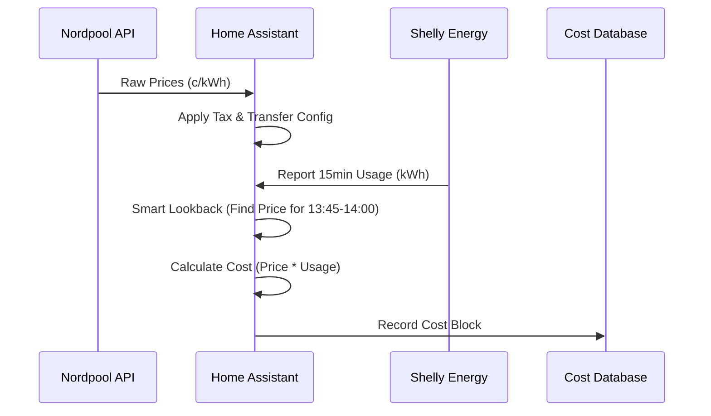

---
tags:
  - package
  - automated
version: 1.0.0
---

# Package: Nordpool Prices

**Version:** 1.0.0  
**Description:** Nordpool energy price calculations and logic

<!-- START_IMAGE -->

<!-- END_IMAGE -->

## Executive Summary
<!-- START_SUMMARY -->
This package handles the complex financial logic for electricity monitoring. It retrieves raw spot prices from Nordpool, applies configurable "Transfers Costs," "Taxes," and "VAT," and produces a "Final Real Cost" per kWh. It also synchronizes price data with energy usage (kWh) to calculate precise 15-minute cost blocks, enabling accurate daily cost tracking that matches the utility bill. It includes forecasting logic to confirm if tomorrow's price data is valid and sufficiently complete (32nd lowest/highest prices).
<!-- END_SUMMARY -->

## Process Description (Non-Technical)
<!-- START_DETAILED -->
1.  **Get Price**: Every hour, the system checks the current stock market price for electricity.
2.  **Add Fees**: It adds your specific transfer fees and taxes (configurable in dashboard) to get the "Plug Price."
3.  **Match Usage**: Every 15 minutes, it takes your home energy meter reading and multiplies it by the *exact* price for that 15-minute window.
4.  **Forecast**: It analyzes tomorrow's prices to find the cheapest windows, useful for scheduling the washing machine or car charging.
<!-- END_DETAILED -->

## Dashboard Connections
<!-- START_DASHBOARD -->
This package powers the following dashboard views:

* **[Bathroom](../dashboards/main/bathroom.md)**: *This view manages the bathroom environment. It features a 'Streamline' header card summarizing key states (temperature, washing machine status, occupancy). Lighting controls allow separate adjustments for the sauna, table, and ceiling. A major focus is the smart floor heating system (Aqara W500), which includes a thermostat control, historical temperature graphs, and a dedicated timer automation for overriding default heating schedules.* (Uses 1 entities)
* **[Electricity](../dashboards/main/electricity.md)**: *The Electricity dashboard is a detailed analytics hub for home energy. It features sophisticated charts tracking today's and tomorrow's hourly electricity prices (Nordpool), dynamically color-coded based on daily highs and lows. It also monitors daily energy consumption and real-time power usage via Shelly 3EM, providing cost estimates and historical usage trends.* (Uses 5 entities)
* **[Electricity Dev](../dashboards/main/electricity_dev.md)**: *This is a development view for the main Electricity dashboard, used for testing new chart configurations and layouts (Panel mode). It replicates the core pricing and usage visualizations but may contain experimental features or alternative display styles like vertical stacks.* (Uses 1 entities)
* **[Home](../dashboards/main/home.md)**: *The Home dashboard serves as the central information hub. It features a large clock and family calendars, alongside detailed weather forecasts. Key home stats are highlighted, including real-time energy prices, power usage, and the status of major appliances like the dishwasher and washing machine. The view also provides a high-level overview of the entire house, displaying camera feeds and status summaries for all key rooms (Sauna, Bathroom, Bedroom, etc.) using 'Streamline' area cards.* (Uses 2 entities)
<!-- END_DASHBOARD -->

## Architecture Diagram
<!-- START_MERMAID_DESC -->
The data flow is heavy on Template Sensors. The `nordpool` service fetches raw data. A Template Sensor (`electricity_prices`) enriches this with tax/fees. A crucial synchronous logical step happens every 15 minutes: The `Energy Cost Final` sensor triggers on energy meter resets, looks up the *historical* price for the just-finished block (15-min alignment), and computes the cost. This ensures that energy used at 13:59 is charged at the 13:00 price, not the 14:00 price.
<!-- END_MERMAID_DESC -->

<!-- START_MERMAID -->

<!-- END_MERMAID -->

## Configuration (Source Code)
```yaml
# ------------------------------------------------------------------------------
# Package: Nordpool Prices
# Version: 1.0.0
# Description: Nordpool energy price calculations and logic
# Dependencies: nordpool.get_prices_for_date, sensor.shelly_home_energy_15min
# ------------------------------------------------------------------------------
# ------------------------------------------------------------------------------
# 2. INPUT BOOLEANS (Flags & Maintenance)
# ------------------------------------------------------------------------------
input_boolean:
  # Energy Prices: Sent flag
  notify_flag_energy_tomorrow_sent:
    name: "Energy: Tomorrow Prices Sent"
    icon: mdi:checkbox-marked-circle-outline

template:
  - triggers:
      - platform: time_pattern
        minutes: "0"
      - platform: homeassistant
        event: start

    actions:
      - alias: "Fetch Today's Prices"
        service: nordpool.get_prices_for_date
        data:
          config_entry: 01K72AW80S016AZ3CPD6R2062J
          date: "{{ now().date() }}"
          areas: FI
          currency: EUR
        response_variable: today_price

      - alias: "Fetch Tomorrow's Prices"
        service: nordpool.get_prices_for_date
        data:
          config_entry: 01K72AW80S016AZ3CPD6R2062J
          date: "{{ now().date() + timedelta(days=1) }}"
          areas: FI
          currency: EUR
        response_variable: tomorrow_price

    sensor:
      - name: Electricity prices
        unique_id: electricity_prices
        unit_of_measurement: "c/kWh"
        icon: mdi:cash
        state: >
          
          
          

          
            
            
              
            
            
              
            
            {{min(data.prices)}}
          
            unavailable
          
        attributes:
          tomorrow_valid: >
            
            
              
                {{ true | bool }}
              
                {{ false | bool }}
              
            
              {{ false | bool }}
            
          data: >
            
            
            

            
            
              
                {% set local_start = as_datetime(state.start).astimezone().strftime('%Y-%m-%d %H:%M:%S') %}
                {% set local_end = as_datetime(state.end).astimezone().strftime('%Y-%m-%d %H:%M:%S') %}
                
              
              
                {% set local_start = as_datetime(state.start).astimezone().strftime('%Y-%m-%d %H:%M:%S') %}
                {% set local_end = as_datetime(state.end).astimezone().strftime('%Y-%m-%d %H:%M:%S') %}
                
              
              {{data.prices}}
            
              []
            
          tax: "1"
          additional_cost: "0"
          region: FI

  - sensor:
      - name: "Electricity Price (cents)"
        unique_id: electricity_price_cents
        unit_of_measurement: "c/kWh"
        state_class: measurement
        state: >
          {{ (states('sensor.electricity_prices') | float(0) * 100) | round(1) }}

  - sensor:
      - name: "Electricity Daily Average (cents)"
        unique_id: electricity_daily_average_cents
        unit_of_measurement: "c/kWh"
        state_class: measurement
        state: >
          {{ (states('sensor.nord_pool_fi_daily_average') | float(0) * 100) | round(1) }}

  - sensor:
      - name: "Electricity Today 32nd Lowest Price"
        unique_id: electricity_today_32nd_lowest
        unit_of_measurement: "c/kWh"
        availability: >
          
          
          
            {{ entries
               | selectattr('start', 'defined')
               | selectattr('start', 'string')
               | selectattr('start', 'search', today)
               | list
               | count >= 32 }}
          
            {{ false }}
          
        state: >
          
          
          
          
          {{ sorted[31] | round(2) }}

  - sensor:
      - name: "Electricity Today 32nd Highest Price"
        unique_id: electricity_today_32nd_highest
        unit_of_measurement: "c/kWh"
        availability: >
          
          
          
            {{ entries
               | selectattr('start', 'defined')
               | selectattr('start', 'string')
               | selectattr('start', 'search', today)
               | list
               | count >= 32 }}
          
            {{ false }}
          
        state: >
          
          
          
          
          {{ sorted[31] | round(2) }}

  - sensor:
      - name: "Electricity Tomorrow Valid"
        unique_id: electricity_tomorrow_valid
        state: >
          {{ state_attr('sensor.electricity_prices', 'tomorrow_valid') }}

  - sensor:
      - name: "Electricity Tomorrow 32nd Lowest Price"
        unique_id: electricity_tomorrow_32nd_lowest
        unit_of_measurement: "c/kWh"
        availability: >
          
          
          
            {{ entries
               | selectattr('start', 'defined')
               | selectattr('start', 'string')
               | selectattr('start', 'search', tomorrow)
               | list
               | count >= 32 }}
          
            {{ false }}
          
        state: >
          
          
          
          
          {{ sorted[31] | round(2) }}

  - sensor:
      - name: "Electricity Tomorrow 32nd Highest Price"
        unique_id: electricity_tomorrow_32nd_highest
        unit_of_measurement: "c/kWh"
        availability: >
          
          
          
            {{ entries
               | selectattr('start', 'defined')
               | selectattr('start', 'string')
               | selectattr('start', 'search', tomorrow)
               | list
               | count >= 32 }}
          
            {{ false }}
          
        state: >
          
          
          
          
          {{ sorted[31] | round(2) }}

  - sensor:
      - name: "Energy Cost 15min"
        unique_id: energy_cost_15min
        unit_of_measurement: "€"
        state_class: measurement
        state: >
          
          
          
          
          
          
          
          {{ cost_eur | round(3) }}
        attributes:
          energy_kWh: "{{ states('sensor.shelly_home_energy_15min') | float(0) | round(3) }}"
          spot_price_c_per_kWh: "{{ (states('sensor.nord_pool_fi_current_price') | float(0) * 100) | round(2) }}"
          transfer_fee_c_per_kWh: "{{ states('input_number.energy_transfer_fee') | float(0) | round(2) }}"
          energy_tax_c_per_kWh: "{{ states('input_number.energy_tax_c_kwh') | float(0) | round(2) }}"
          vat_pct: "{{ states('input_number.energy_vat') | float(0) | round(2) }}"
          subtotal_c_per_kWh: "{{ ((states('sensor.nord_pool_fi_current_price') | float(0) * 100) + states('input_number.energy_transfer_fee') | float(0) + states('input_number.energy_tax_c_kwh') | float(0)) | round(2) }}"
          cost_eur: "{{ ((states('sensor.shelly_home_energy_15min') | float(0) * ((states('sensor.nord_pool_fi_current_price') | float(0) * 100 + states('input_number.energy_transfer_fee') | float(0) + states('input_number.energy_tax_c_kwh') | float(0)) / 100)) * (1 + states('input_number.energy_vat') | float(0) / 100)) | round(3) }}"

  - sensor:
      - name: "Energy Cost 15min (c)"
        unique_id: energy_cost_15min_c
        unit_of_measurement: "c"
        state_class: measurement
        state: >
          
          
          
          
          
          
          
          {{ cost_c | round(2) }}
        attributes:
          energy_kWh: "{{ states('sensor.shelly_home_energy_15min') | float(0) | round(3) }}"
          spot_price_c_per_kWh: "{{ (states('sensor.nord_pool_fi_current_price') | float(0) * 100) | round(2) }}"
          transfer_fee_c_per_kWh: "{{ states('input_number.energy_transfer_fee') | float(0) | round(2) }}"
          energy_tax_c_per_kWh: "{{ states('input_number.energy_tax_c_kwh') | float(0) | round(2) }}"
          vat_pct: "{{ states('input_number.energy_vat') | float(0) | round(2) }}"
          subtotal_c_per_kWh: "{{ ((states('sensor.nord_pool_fi_current_price') | float(0) * 100) + states('input_number.energy_transfer_fee') | float(0) + states('input_number.energy_tax_c_kwh') | float(0)) | round(2) }}"
          cost_eur: "{{ ((states('sensor.shelly_home_energy_15min') | float(0) * ((states('sensor.nord_pool_fi_current_price') | float(0) * 100 + states('input_number.energy_transfer_fee') | float(0) + states('input_number.energy_tax_c_kwh') | float(0)) / 100)) * (1 + states('input_number.energy_vat') | float(0) / 100)) | round(3) }}"

  - trigger:
      - platform: state
        entity_id: sensor.shelly_home_energy_15min
        to: "0"
    sensor:
      - name: "Energy Cost Final 15min (c)"
        unique_id: energy_cost_final_15min_c
        unit_of_measurement: "c"

        state_class: measurement
        state: >
          
          
          
          
          {% set block = blocks | selectattr('start', 'equalto', aligned.strftime('%Y-%m-%d %H:%M:%S')) | list | first %}
          
          
          
          
          
          
          {{ cost_c | round(2) }}
        attributes:
          energy_kWh: "{{ trigger.from_state.state | float(0) | round(3) }}"
          spot_price_c_per_kWh: >
            
            
            
            {% set block = blocks | selectattr('start', 'equalto', aligned.strftime('%Y-%m-%d %H:%M:%S')) | list | first %}
            {{ block.price | float(0) * 100 | round(2) }}
          transfer_fee_c_per_kWh: "{{ states('input_number.energy_transfer_fee') | float(0) | round(2) }}"
          energy_tax_c_per_kWh: "{{ states('input_number.energy_tax_c_kwh') | float(0) | round(2) }}"
          vat_pct: "{{ states('input_number.energy_vat') | float(0) | round(2) }}"
          subtotal_c_per_kWh: >
            
            
            
            {% set block = blocks | selectattr('start', 'equalto', aligned.strftime('%Y-%m-%d %H:%M:%S')) | list | first %}
            
            
            
            {{ (price_c + transfer_c + tax_c) | round(2) }}
          cost_eur: >
            
            
            
            
            {% set block = blocks | selectattr('start', 'equalto', aligned.strftime('%Y-%m-%d %H:%M:%S')) | list | first %}
            
            
            
            
            
            
            {{ (cost_c / 100) | round(3) }}

  - sensor: # <-- CORRECTED: Use '- sensor:' inside the 'template:' block
      - name: "Current 15-Minute Electricity Price"
        unique_id: "current_15min_electricity_price"
        unit_of_measurement: "c/kWh"

        state_class: measurement
        state: >
          {# 1. Get the list of prices from the 'data' attribute #}
          
          

          {# 2. Find the entry where the current time is between 'start' and 'end' #}
          

          
            {# 3. Use the price value directly (it is already in cents/kWh) #}
            {{ current_price_item.price | float(0) | round(3) }}
          
            {# Fallback: If no block is found, use the main state, also in c/kWh #}
            {{ states('sensor.electricity_prices') | float(0) }}
          

  # The second sensor goes under the same top-level 'template:' key
  - sensor: # <-- CORRECTED: Use '- sensor:' for the second sensor as well
      - name: "15-Minute Energy Cost Block"
        unique_id: "15min_energy_cost_block_total"
        unit_of_measurement: "c"
        device_class: monetary
        state_class: total
        state: >
          {# Get the energy usage from the Utility Meter (Step 1: sensor.15_minute_energy_usage) #}
          
          {# Get the current price from the Template Sensor defined above #}
          

          {# Calculation: Energy (kWh) * Price (c/kWh) = Total Cost in Cents (c) #}
          {{ (usage * price) | float | round(2) }}

  - sensor:
      - name: "Tomorrow Average Electricity Price"
        # Unique ID for the sensor
        unique_id: tomorrow_average_electricity_price
        # Set the unit of measurement, copied from your existing sensor
        unit_of_measurement: "c/kWh"
        # Set the device class to 'monetary' so it's treated as a price

        # Set the state class for long-term statistics
        state_class: measurement
        # The 'icon' is optional, but this one fits
        icon: "mdi:chart-line"
        # This is where the magic happens
        availability: >
          
          
          
            
            {{ tomorrow_prices | count > 0 }}
          
            {{ false }}
          
        state: >
          
          
          
          {{ tomorrow_prices | average | round(3) }}

```
