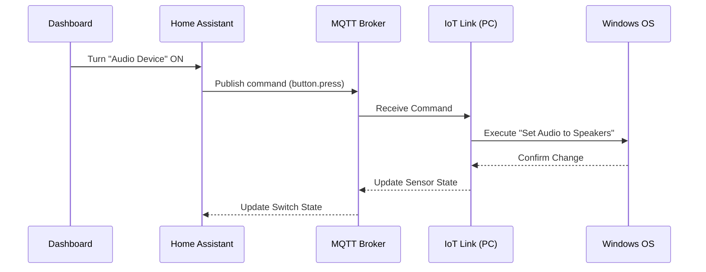

---
tags:
  - package
  - automated
version: 1.0.0
---

# Package: Office Pc

**Version:** 1.0.0  
**Description:** Office PC control (Audio, Displays, Power)

<!-- START_IMAGE -->

<!-- END_IMAGE -->

## Executive Summary
<!-- START_SUMMARY -->
This package provides a control interface for the Office PC, enabling "Smart Wake" capabilities and peripheral management. It uses Wake-on-LAN to power on the machine and a set of helper switches to control audio output (Headphones vs. Speakers), mute status, and monitor power. These switches trigger button presses on the local PC via an agent (IoT Link).
<!-- END_SUMMARY -->

## Process Description (Non-Technical)
<!-- START_DETAILED -->
1.  **Power On**: usage of the 'Power' switch sends a magic packet (WoL) to turn on the PC.
2.  **Audio Control**: Toggling the "Audio Device" switch sends a command to the PC to swap the default playback device between Speakers and Headphones.
3.  **Monitors**: The "Displays" switch allows you to remotely wake up or put the monitors to sleep without touching the mouse/keyboard.
<!-- END_DETAILED -->

## Dashboard Connections
<!-- START_DASHBOARD -->
This package powers the following dashboard views:

* **[Office](../dashboards/main/office.md)**: *The Office dashboard handles both workspace environment and IT infrastructure. It offers detailed environmental tracking (Airthings Wave) and lighting prompts. Key features include remote PC control (Audio, Power, Displays) and extensive server monitoring (Proxmox, Home Assistant OS stats, SSD usage). It also manages potential window covers and detailed power consumption for office equipment.* (Uses 3 entities)
<!-- END_DASHBOARD -->

## Architecture Diagram
<!-- START_MERMAID_DESC -->
The architecture bridges Home Assistant with the Windows OS. Commands initiated in the Dashboard (e.g., "Toggle Audio") flip a Template Switch in HA. This switch calls a `button.press` service, which talks to the MQTT-connected IoT Link agent installed on the PC. The agent then executes the local script/command to change the audio device or monitor state. State feedback travels back via MQTT sensors to update the Dashboard icon.
<!-- END_MERMAID_DESC -->

<!-- START_MERMAID -->

<!-- END_MERMAID -->

## Configuration (Source Code)
```yaml
# ------------------------------------------------------------------------------
# Package: Office PC
# Version: 1.0.0
# Description: Office PC control (Audio, Displays, Power)
# Dependencies: IoT Link (switch.officepc_*, button.officepc_*)
# ------------------------------------------------------------------------------
template:
  - switch:
      - name: "Office PC Audio Device"
        unique_id: officepc_audio_device
        icon: >
          
            mdi:speaker
          
            mdi:headphones
          
        state: "{{ is_state('sensor.officepc_audio_default_device', 'Speakers (Realtek High Definition Audio)') }}"
        turn_on:
          service: button.press
          target:
            entity_id: button.officepc_speakers
        turn_off:
          service: button.press
          target:
            entity_id: button.officepc_headphones

      - name: "Office PC Audio Mute"
        unique_id: officepc_audio_mute
        icon: >
          
            mdi:volume-mute
          
            mdi:volume-high
          
        state: "{{ is_state('sensor.officepc_audio_default_device_muted', 'True') }}"
        turn_on:
          service: button.press
          target:
            entity_id: button.officepc_mute
        turn_off:
          service: button.press
          target:
            entity_id: button.officepc_mute

      - name: "Office PC Displays"
        unique_id: officepc_displays
        icon: >
          
            mdi:monitor
          
            mdi:monitor-off
          
        state: "{{ is_state('sensor.officepc_monitorpowerstate', 'PowerOn') }}"
        turn_on:
          service: button.press
          target:
            entity_id: button.officepc_monitorwake
        turn_off:
          service: button.press
          target:
            entity_id: button.officepc_monitorsleep

switch:
  - platform: wake_on_lan
    name: "Office PC Power"
    mac: 24:4B:FE:B7:52:DD
    host: 10.0.0.140
    turn_off:
      service: button.press
      target:
        entity_id: button.officepc_sleep

```
