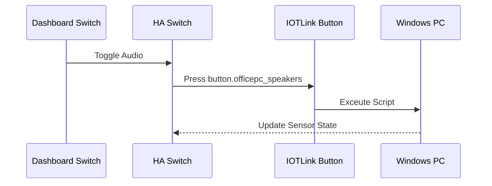

# Package: Office PC

## Executive Summary
This package controls the Office PC's peripheral state using `Wake-on-LAN` for power and a set of **Template Switches** that wrap button entities (likely from an agent like *IOTLink* or similar running on the PC). It allows toggling Audio Output (Speakers vs. Headphones), Muting, and Monitor Power via the Home Assistant dashboard.

## Architecture


## Backend Configuration
*(Snippet)*
```yaml
switch:
  - platform: wake_on_lan
    name: "Office PC Power"
    mac: 24:4B:FE:B7:52:DD
    host: 10.0.0.140
    turn_off:
      service: button.press
      target:
        entity_id: button.officepc_sleep

template:
  - switch:
      - name: "Office PC Audio Device"
        unique_id: officepc_audio_device
        state: "{{ is_state('sensor.officepc_audio_default_device', 'Speakers (Realtek High Definition Audio)') }}"
        turn_on:
          service: button.press
          target:
            entity_id: button.officepc_speakers
        turn_off:
          service: button.press
          target:
            entity_id: button.officepc_headphones
```

## Frontend Connection
**Key Entities**:
- `switch.office_pc_power`
- `switch.officepc_audio_device`
- `switch.officepc_audio_mute`
- `switch.officepc_displays`

**Dashboard Usage**:
These switches are arranged in a grid in `dashboard_dev` (lines 1514+), allowing for a quick control panel for the workstation.

### UI Simulation
<div style="border: 1px solid #444; border-radius: 12px; padding: 16px; width: 300px; background: #222; color: white; font-family: sans-serif;">
  <h3>🖥️ Office Station</h3>
  <div style="display: grid; grid-template-columns: 1fr 1fr; gap: 12px;">
    
    <!-- Power -->
    <div style="background: #333; padding: 12px; border-radius: 8px; text-align: center;">
      <div style="font-size: 24px; margin-bottom: 4px; color: #4caf50;">⚡</div>
      <div style="font-weight: bold;">Power</div>
      <div style="font-size: 0.8em; color: #aaa;">On</div>
    </div>

    <!-- Audio Output -->
    <div style="background: #333; padding: 12px; border-radius: 8px; text-align: center;">
      <div style="font-size: 24px; margin-bottom: 4px;">🎧</div>
      <div style="font-weight: bold;">Audio</div>
      <div style="font-size: 0.8em; color: #aaa;">Headphones</div>
    </div>

    <!-- Monitors -->
    <div style="background: #333; padding: 12px; border-radius: 8px; text-align: center;">
      <div style="font-size: 24px; margin-bottom: 4px; color: #4caf50;">🖥️</div>
      <div style="font-weight: bold;">Displays</div>
      <div style="font-size: 0.8em; color: #aaa;">Awake</div>
    </div>

    <!-- Mute -->
    <div style="background: #333; padding: 12px; border-radius: 8px; text-align: center;">
      <div style="font-size: 24px; margin-bottom: 4px; color: #aaa;">🔊</div>
      <div style="font-weight: bold;">Mute</div>
      <div style="font-size: 0.8em; color: #aaa;">Off</div>
    </div>
  </div>
</div>
