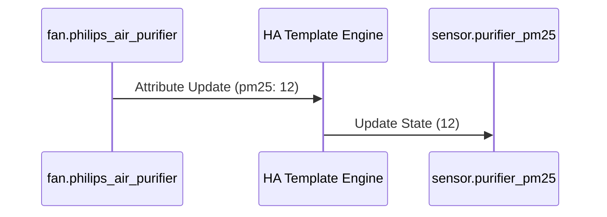

# Package: Philips Air Purifier

## Executive Summary
This package exposes the key metrics from the Philips Air Purifier (integrated via `fan.philips_air_purifier`) as individual **Template Sensors**. It extracts attributes like PM2.5, Allergen Index, and Filter Life (Pre/Carbon/HEPA) into standard sensors for easier history tracking and dashboard display.

## Architecture


## Backend Configuration
```yaml
template:
  - sensor:
      - name: "Purifier PM 2.5"
        unique_id: purifier_pm25
        unit_of_measurement: "µg/m³"
        device_class: pm25
        icon: mdi:blur
        state: >
          {{ state_attr('fan.philips_air_purifier', 'pm25') }}

      - name: "Purifier HEPA Filter"
        unique_id: purifier_hepa_filter
        unit_of_measurement: "hours"
        icon: mdi:air-filter
        state: >
          {{ state_attr('fan.philips_air_purifier', 'hepa_filter') }}
```

## Frontend Connection
**Key Entities**:
- `sensor.purifier_pm25`
- `sensor.purifier_allergen_index`
- `sensor.purifier_hepa_filter`

**Dashboard Usage**:
Displayed in `dashboard_demo` and `dashboard_dev2`. The generated dashboard config shows a list of these sensors, often grouped with the fan entity control.

### UI Simulation
<div style="border: 1px solid #444; border-radius: 12px; padding: 16px; width: 300px; background: #222; color: white; font-family: sans-serif;">
  <div style="display: flex; align-items: center; justify-content: space-between; margin-bottom: 16px;">
    <div style="display: flex; align-items: center; gap: 12px;">
      <div style="width: 40px; height: 40px; background: #3498db; border-radius: 50%; display: flex; align-items: center; justify-content: center; font-size: 20px;">🌀</div>
      <div>
        <div style="font-weight: bold;">Air Purifier</div>
        <div style="font-size: 0.8em; color: #aaa;">Speed 1</div>
      </div>
    </div>
    <div style="color: #4caf50; font-weight: bold;">Clean</div>
  </div>
  
  <div style="display: flex; justify-content: space-around; background: #333; padding: 12px; border-radius: 8px;">
    <div style="text-align: center;">
      <div style="font-size: 1.2em; font-weight: bold;">12</div>
      <div style="font-size: 0.7em; color: #aaa;">PM2.5</div>
    </div>
    <div style="width: 1px; background: #555;"></div>
    <div style="text-align: center;">
      <div style="font-size: 1.2em; font-weight: bold;">3</div>
      <div style="font-size: 0.7em; color: #aaa;">Allergen</div>
    </div>
    <div style="width: 1px; background: #555;"></div>
    <div style="text-align: center;">
      <div style="font-size: 1.2em; font-weight: bold;">94%</div>
      <div style="font-size: 0.7em; color: #aaa;">Filter</div>
    </div>
  </div>
</div>
