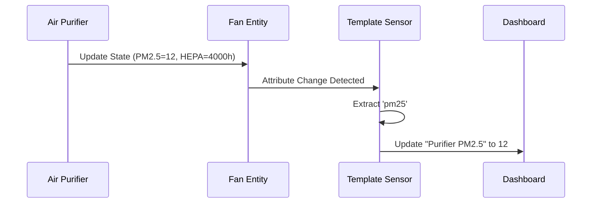

---
tags:
  - package
  - automated
version: 1.0.0
---

# Package: Philips Air Purifier

**Version:** 1.0.0  
**Description:** Normalizes Philips Air Purifier attributes (PM2.5, Filters)

<!-- START_IMAGE -->

<!-- END_IMAGE -->

## Executive Summary
<!-- START_SUMMARY -->
This package enhances the integration of the Philips Air Purifier by extracting hidden attributes from the main fan entity. It creates individual sensors for PM2.5 levels, Allergen Index, and the remaining life of Pre/Carbon/HEPA filters. This "Flattening" of attributes makes it significantly easier to display these metrics on dashboards or use them as triggers for other automations (e.g., "Order new filter").
<!-- END_SUMMARY -->

## Process Description (Non-Technical)
<!-- START_DETAILED -->
1.  **Listen**: The system watches the main Air Purifier connection.
2.  **Extract**: When the purifier reports "PM2.5: 14", this package copies that number to a new standalone sensor `sensor.purifier_pm_2_5`.
3.  **Display**: This allows you to drag-and-drop the PM2.5 value onto a graph card, which isn't possible when it's hidden inside the fan's settings.
<!-- END_DETAILED -->

## Integration Dependencies
<!-- START_DEPENDENCIES -->
*   **Philips AirPurifier (CoAP/Miot)**: The base integration providing the `fan` entity.
<!-- END_DEPENDENCIES -->

## Dashboard Connections
<!-- START_DASHBOARD -->
*No specific entities detected to link.*
<!-- END_DASHBOARD -->

## Architecture Diagram
<!-- START_MERMAID_DESC -->
This is a pure data transformation layer. The `fan.philips_air_purifier` entity acts as a complex object containing multiple data points. The Template Sensors defined here subscribe to state changes of that parent object and map specific attributes (`pm25`, `hepa_filter`) to the state of new, single-purpose entities.
<!-- END_MERMAID_DESC -->

<!-- START_MERMAID -->

<!-- END_MERMAID -->

## Configuration (Source Code)
```yaml
# ------------------------------------------------------------------------------
# Package: Philips Air Purifier
# Version: 1.0.0
# Description: Normalizes Philips Air Purifier attributes (PM2.5, Filters)
# Dependencies: fan.philips_air_purifier
# ------------------------------------------------------------------------------
template:
  - sensor:
      - name: "Purifier PM 2.5"
        unique_id: purifier_pm25
        unit_of_measurement: "μg/m³"
        device_class: pm25
        icon: mdi:blur
        state: >
          {{ state_attr('fan.philips_air_purifier', 'pm25') }}

      - name: "Purifier Allergen Index"
        unique_id: purifier_allergen_index
        unit_of_measurement: ""
        icon: mdi:sprout
        state: >
          {{ state_attr('fan.philips_air_purifier', 'allergen_index') }}

      - name: "Purifier Pre Filter"
        unique_id: purifier_pre_filter
        unit_of_measurement: "hours"
        icon: mdi:air-filter
        state: >
          {{ state_attr('fan.philips_air_purifier', 'pre_filter') }}

      - name: "Purifier Carbon Filter"
        unique_id: purifier_carbon_filter
        unit_of_measurement: "hours"
        icon: mdi:air-filter
        state: >
          {{ state_attr('fan.philips_air_purifier', 'carbon_filter') }}

      - name: "Purifier HEPA Filter"
        unique_id: purifier_hepa_filter
        unit_of_measurement: "hours"
        icon: mdi:air-filter
        state: >
          {{ state_attr('fan.philips_air_purifier', 'hepa_filter') }}

```
