---
tags:
  - package
  - automated
version: 1.0.0
---

# Package: Room Automation

**Version:** 1.0.0  
**Description:** Dynamic creation of room lighting settings via MQTT

<!-- START_IMAGE -->

<!-- END_IMAGE -->

## Executive Summary
<!-- START_SUMMARY -->
The **Room Automation** package provides a standardized, scalable framework for managing room states (e.g., Occupied, Idle, Sleep) and automation parameters (e.g., lighting delays, lux thresholds) dynamically. It utilizes **MQTT discovery** to generate entities for each room on-the-fly, allowing for decentralized configuration without restarting Home Assistant. Admin users can "initialize" a room from a dashboard, which triggers scripts to publish MQTT configuration payloads, creating a suite of helpers (timers, selects, sensors) specific to that room. It effectively acts as a "factory" for room controllers.
<!-- END_SUMMARY -->

## Process Description (Non-Technical)
<!-- START_DETAILED -->
This system allows you to turn any "Area" in your home into a Smart Room without writing code. 
1.  **Creation:** You select a room (like "Kitchen") from a list in the Settings Dashboard. 
2.  **Generation:** The system instantly creates a set of controls for that room, including:
    *   **Mode Selector:** Choose how the room behaves (e.g., "Presence Control" vs. "Manual").
    *   **Timers:** Set how long lights stay on after you leave.
    *   **Sensors:** Link motion sensors and light sensors to the room.
3.  **Operation:** Once created, these controls appear in your dashboards, letting you tweak settings like "turn off lights after 5 minutes" individually for every room.
<!-- END_DETAILED -->

## Dashboard Connections
<!-- START_DASHBOARD -->
This package powers the following dashboard views:

* **[Living Room](../dashboards/main/living_room.md)** (Uses 1 entities)
* **[Management](../dashboards/notification-center/management.md)**: *This dashboard acts as the administrative backend for the Smart Notification System. It is divided into four key sections: **User Management** for onboarding and offboarding notification recipients; **Category Management** for creating and deleting system-wide notification channels; **Delivery Settings** for defining global rules (e.g., presence-based delivery); and **Subscription Management**, allowing individual users to toggle their subscriptions to specific notification categories. Additionally, it provides an overview of all automations tagged with notification labels.* (Uses 1 entities)
* **[Settings](../dashboards/room-management/settings.md)** (Uses 4 entities)
<!-- END_DASHBOARD -->

## Architecture Diagram
<!-- START_MERMAID_DESC -->
The sequence diagram below illustrates the "Room Initialization" process. When a user selects a room (e.g., "Kitchen") and clicks "Initialize", the `create_room_settings` script is triggered. This script iterates through a predefined list of required entities (Mode Select, Idle Timer, Occupancy Sensor, etc.) and publishes **MQTT Configuration Payloads** to the `homeassistant/` discovery topic. Home Assistant's MQTT integration detects these payloads and dynamically duplicates the "Room Controller" entity structure for the new room. Finally, the script sets default values (e.g., 120s delay) via retained MQTT messages, ensuring the room is ready for immediate use.

```mermaid
sequenceDiagram
    participant Admin as 👤 Admin
    participant Dash as 📱 Dashboard (Settings)
    participant Script as 📜 Script: create_room_settings
    participant MQTT as 📡 MQTT Broker
    participant HA as 🏠 Home Assistant (Discovery)

    Admin->>Dash: Selects "Kitchen" & Clicks Initialize
    Dash->>Script: Run(room_slug="kitchen")
    
    rect rgb(20, 20, 20)
    note right of Script: Entity Generation Loop
    Script->>MQTT: Publish config: select.room_kitchen_mode
    MQTT-->>HA: Discovery: New Entity (select.room_kitchen_mode)
    Script->>MQTT: Publish config: number.room_kitchen_idle
    MQTT-->>HA: Discovery: New Entity (number.room_kitchen_idle)
    Script->>MQTT: Publish config: binary_sensor.room_kitchen_occupancy
    MQTT-->>HA: Discovery: New Entity (binary_sensor...occupancy)
    end

    rect rgb(30, 30, 50)
    note right of Script: Default Values
    Script->>MQTT: Publish state: mode = "presence-control"
    Script->>MQTT: Publish state: delay = 120s
    end
    
    HA-->>Dash: UI Updates with new Kitchen Controls
```

<!-- END_MERMAID_DESC -->

<!-- START_MERMAID -->

<!-- END_MERMAID -->

## Configuration (Source Code)
```yaml
# ------------------------------------------------------------------------------
# Package: Room Automation Management
# Version: 1.0.0
# Description: Dynamic creation of room lighting settings via MQTT
# Dependencies: MQTT, input_text.room_mgmt_name, automation.system_populate_room_list
# ------------------------------------------------------------------------------

# ------------------------------------------------------------------------------
# 1. GLOBAL CUSTOMIZATION (Force Text Boxes)
# ------------------------------------------------------------------------------
homeassistant:
  customize_glob:
    "number.*_presence_idle_time":
      mode: box
    "number.*_lights_presence_delay":
      mode: box

# ------------------------------------------------------------------------------
# 2. HELPERS (Dashboard Inputs)
# ------------------------------------------------------------------------------
input_text:
  room_mgmt_name:
    name: "Room Name"
    icon: mdi:door-open
  room_mgmt_slug:
    name: "Room ID (slug)"
    icon: mdi:identifier

input_select:
  # SOURCE: Native Home Assistant Areas
  room_mgmt_create_select:
    name: "Select Area to Initialize"
    icon: mdi:map-plus
    options:
      - "unknown"

  # SOURCE: Existing Created Rooms
  room_mgmt_delete_select:
    name: "Select Room to Delete"
    icon: mdi:delete-sweep
    options:
      - "unknown"

# ------------------------------------------------------------------------------
# 3. SCRIPTS
# ------------------------------------------------------------------------------
script:
  # --- CREATE ROOM SETTINGS ---
  create_room_settings:
    alias: "System: Create Room Settings"
    icon: mdi:home-plus
    mode: single
    sequence:
      - variables:
          # Get the selected Area ID (slug) directly from the dropdown
          room_slug: "{{ states('input_select.room_mgmt_create_select') }}"
          # Use the Area Name as the Friendly Name (Title Case)
          room_name: "{{ area_name(room_slug) }}"

      # 1. Create Automation Mode Selector (Select)
      - service: mqtt.publish
        data:
          retain: true
          topic: "homeassistant/select/room_{{ room_slug }}_mode/config"
          payload: >-
            {
              "name": "{{ room_name }} Automation Mode",
              "object_id": "room_{{ room_slug }}_automation_mode",
              "unique_id": "room_select_{{ room_slug }}_mode_v4",
              "icon": "mdi:home-lightning-bolt-outline",
              "options": ["presence-control", "absence-detection", "manual-control", "schedule-mode"],
              "command_topic": "room/{{ room_slug }}/mode/set",
              "state_topic": "room/{{ room_slug }}/mode/state",
              "availability_topic": "room/{{ room_slug }}/availability",
              "payload_available": "online",
              "device": {
                "identifiers": ["room_settings_{{ room_slug }}"],
                "name": "{{ room_name }} Settings",
                "manufacturer": "Home Assistant",
                "model": "Room Controller"
              }
            }
      # Set default if new
      - if:
          - condition: template
            value_template: "{{ states('select.room_' ~ room_slug ~ '_automation_mode') in ['unknown', 'unavailable', 'none'] }}"
        then:
          - service: mqtt.publish
            data:
              retain: true
              topic: "room/{{ room_slug }}/mode/state"
              payload: "presence-control"

      # 2. Create Idle Time Slider (Number)
      - service: mqtt.publish
        data:
          retain: true
          topic: "homeassistant/number/room_{{ room_slug }}_idle/config"
          payload: >-
            {
              "name": "{{ room_name }} Presence Idle Time",
              "object_id": "room_{{ room_slug }}_presence_idle_time",
              "unique_id": "room_number_{{ room_slug }}_idle_v4",
              "icon": "mdi:timer-sand",
              "min": 0,
              "max": 1800,
              "step": 1,
              "unit_of_measurement": "s",
              "command_topic": "room/{{ room_slug }}/idle/set",
              "state_topic": "room/{{ room_slug }}/idle/state",
              "availability_topic": "room/{{ room_slug }}/availability",
              "device": { "identifiers": ["room_settings_{{ room_slug }}"], "via_device": "room_settings_{{ room_slug }}" }
            }
      # Default Value
      - if:
          - condition: template
            value_template: "{{ states('number.room_' ~ room_slug ~ '_presence_idle_time') in ['unknown', 'unavailable', 'none'] }}"
        then:
          - service: mqtt.publish
            data:
              retain: true
              topic: "room/{{ room_slug }}/idle/state"
              payload: "15"

      # 3. Create Delay Time (Number)
      - service: mqtt.publish
        data:
          retain: true
          topic: "homeassistant/number/room_{{ room_slug }}_delay/config"
          payload: >-
            {
              "name": "{{ room_name }} Lights Presence Delay",
              "object_id": "room_{{ room_slug }}_lights_presence_delay",
              "unique_id": "room_number_{{ room_slug }}_delay_v4",
              "icon": "mdi:lightbulb-clock",
              "min": 0,
              "max": 100000,
              "step": 1,
              "unit_of_measurement": "s",
              "command_topic": "room/{{ room_slug }}/delay/set",
              "state_topic": "room/{{ room_slug }}/delay/state",
              "availability_topic": "room/{{ room_slug }}/availability",
              "device": { "identifiers": ["room_settings_{{ room_slug }}"], "via_device": "room_settings_{{ room_slug }}" }
            }
      - if:
          - condition: template
            value_template: "{{ states('number.room_' ~ room_slug ~ '_lights_presence_delay') in ['unknown', 'unavailable', 'none'] }}"
        then:
          - service: mqtt.publish
            data:
              retain: true
              topic: "room/{{ room_slug }}/delay/state"
              payload: "120"

      # 4. Create Timer Display (Timestamp Sensor)
      - service: mqtt.publish
        data:
          retain: true
          topic: "homeassistant/sensor/room_{{ room_slug }}_timer/config"
          payload: >-
            {
              "name": "{{ room_name }} Timer",
              "object_id": "room_{{ room_slug }}_timer",
              "unique_id": "room_sensor_{{ room_slug }}_timer_v4",
              "icon": "mdi:progress-clock",
              "device_class": "timestamp",
              "state_topic": "room/{{ room_slug }}/timer/state",
              "json_attributes_topic": "room/{{ room_slug }}/timer/attributes",
              "availability_topic": "room/{{ room_slug }}/availability",
              "device": { "identifiers": ["room_settings_{{ room_slug }}"] }
            }

      # 5. Create Room State (Select)
      - service: mqtt.publish
        data:
          retain: true
          topic: "homeassistant/select/room_{{ room_slug }}_state/config"
          payload: >-
            {
              "name": "{{ room_name }} State",
              "object_id": "room_{{ room_slug }}_state",
              "unique_id": "room_select_state_v4_{{ room_slug }}",
              "icon": "mdi:eye-outline",
              "options": ["Occupied", "Idle", "Absence", "Sleep"],
              "command_topic": "room/{{ room_slug }}/state/set",
              "state_topic": "room/{{ room_slug }}/state/state",
              "availability_topic": "room/{{ room_slug }}/availability",
              "payload_available": "online",
              "device": { "identifiers": ["room_settings_{{ room_slug }}"] }
            }
      - service: mqtt.publish
        data:
          retain: true
          topic: "room/{{ room_slug }}/state/state"
          payload: "Absence"

      # 6. Create Occupancy (Binary Sensor)
      - service: mqtt.publish
        data:
          retain: true
          topic: "homeassistant/binary_sensor/room_{{ room_slug }}_occupancy/config"
          payload: >-
            {
              "name": "{{ room_name }} Occupancy",
              "object_id": "room_{{ room_slug }}_occupancy",
              "unique_id": "room_occupancy_v4_{{ room_slug }}",
              "icon": "mdi:motion-sensor",
              "device_class": "occupancy",
              "state_topic": "room/{{ room_slug }}/occupancy/state",
              "payload_on": "ON",
              "payload_off": "OFF",
              "availability_topic": "room/{{ room_slug }}/availability",
              "payload_available": "online",
              "device": { "identifiers": ["room_settings_{{ room_slug }}"] }
            }
      - service: mqtt.publish
        data:
          retain: true
          topic: "room/{{ room_slug }}/occupancy/state"
          payload: "OFF"

      # 7. Create Lux Sensor Input (Text)
      - service: mqtt.publish
        data:
          retain: true
          topic: "homeassistant/text/room_{{ room_slug }}_lux_sensor/config"
          payload: >-
            {
              "name": "{{ room_name }} Lux Sensor Entity",
              "object_id": "room_{{ room_slug }}_lux_sensor",
              "unique_id": "room_text_lux_sensor_v4_{{ room_slug }}",
              "icon": "mdi:brightness-6",
              "command_topic": "room/{{ room_slug }}/lux_sensor/set",
              "state_topic": "room/{{ room_slug }}/lux_sensor/state",
              "availability_topic": "room/{{ room_slug }}/availability",
              "device": { "identifiers": ["room_settings_{{ room_slug }}"] }
            }

      # 8. Create Lux Threshold (Number)
      - service: mqtt.publish
        data:
          retain: true
          topic: "homeassistant/number/room_{{ room_slug }}_lux_threshold/config"
          payload: >-
            {
              "name": "{{ room_name }} Lux Threshold",
              "object_id": "room_{{ room_slug }}_lux_threshold",
              "unique_id": "room_number_lux_threshold_v4_{{ room_slug }}",
              "icon": "mdi:brightness-percent",
              "min": 0,
              "max": 2000,
              "step": 5,
              "unit_of_measurement": "lx",
              "command_topic": "room/{{ room_slug }}/lux_threshold/set",
              "state_topic": "room/{{ room_slug }}/lux_threshold/state",
              "availability_topic": "room/{{ room_slug }}/availability",
              "device": { "identifiers": ["room_settings_{{ room_slug }}"] }
            }
      - if:
          - condition: template
            value_template: "{{ states('number.room_' ~ room_slug ~ '_lux_threshold') in ['unknown', 'unavailable', 'none'] }}"
        then:
          - service: mqtt.publish
            data:
              retain: true
              topic: "room/{{ room_slug }}/lux_threshold/state"
              payload: "50"

      # 9. Create Bed Sensor (Text)
      - service: mqtt.publish
        data:
          retain: true
          topic: "homeassistant/text/room_{{ room_slug }}_bed_sensor/config"
          payload: >-
            {
              "name": "{{ room_name }} Bed Sensor ID",
              "object_id": "room_{{ room_slug }}_bed_sensor",
              "unique_id": "room_text_bed_sensor_v4_{{ room_slug }}",
              "icon": "mdi:bed",
              "command_topic": "room/{{ room_slug }}/bed_sensor/set",
              "state_topic": "room/{{ room_slug }}/bed_sensor/state",
              "availability_topic": "room/{{ room_slug }}/availability",
              "device": { "identifiers": ["room_settings_{{ room_slug }}"] }
            }

      # 10. Create Sleep Entry Delay (Number)
      - service: mqtt.publish
        data:
          retain: true
          topic: "homeassistant/number/room_{{ room_slug }}_sleep_entry_delay/config"
          payload: >-
            {
              "name": "{{ room_name }} Sleep Entry Delay",
              "object_id": "room_{{ room_slug }}_sleep_entry_delay",
              "unique_id": "room_number_sleep_entry_delay_v4_{{ room_slug }}",
              "icon": "mdi:bed-clock",
              "min": 0, "max": 3600, "step": 15, "unit_of_measurement": "s",
              "command_topic": "room/{{ room_slug }}/sleep_entry_delay/set",
              "state_topic": "room/{{ room_slug }}/sleep_entry_delay/state",
              "availability_topic": "room/{{ room_slug }}/availability",
              "device": { "identifiers": ["room_settings_{{ room_slug }}"] }
            }
      - if:
          - condition: template
            value_template: "{{ states('number.room_' ~ room_slug ~ '_sleep_entry_delay') in ['unknown', 'unavailable', 'none'] }}"
        then:
          - service: mqtt.publish
            data:
              retain: true
              topic: "room/{{ room_slug }}/sleep_entry_delay/state"
              payload: "300"

      # 11. Create Sleep Exit Delay (Number)
      - service: mqtt.publish
        data:
          retain: true
          topic: "homeassistant/number/room_{{ room_slug }}_sleep_exit_delay/config"
          payload: >-
            {
              "name": "{{ room_name }} Sleep Exit Delay",
              "object_id": "room_{{ room_slug }}_sleep_exit_delay",
              "unique_id": "room_number_sleep_exit_delay_v4_{{ room_slug }}",
              "icon": "mdi:run-fast",
              "min": 0, "max": 3600, "step": 15, "unit_of_measurement": "s",
              "command_topic": "room/{{ room_slug }}/sleep_exit_delay/set",
              "state_topic": "room/{{ room_slug }}/sleep_exit_delay/state",
              "availability_topic": "room/{{ room_slug }}/availability",
              "device": { "identifiers": ["room_settings_{{ room_slug }}"] }
            }
      - if:
          - condition: template
            value_template: "{{ states('number.room_' ~ room_slug ~ '_sleep_exit_delay') in ['unknown', 'unavailable', 'none'] }}"
        then:
          - service: mqtt.publish
            data:
              retain: true
              topic: "room/{{ room_slug }}/sleep_exit_delay/state"
              payload: "60"

      # 12. Set Online & Refresh Lists
      - service: mqtt.publish
        data:
          retain: true
          topic: "room/{{ room_slug }}/availability"
          payload: "online"

      - service: automation.trigger
        target:
          entity_id: automation.system_populate_room_list
        data:
          skip_condition: true

  # --- DELETE ROOM SETTINGS ---
  delete_room_settings:
    alias: "System: Delete Room Settings"
    icon: mdi:home-remove
    mode: single
    sequence:
      - variables:
          raw_slug: "{{ states('input_select.room_mgmt_delete_select') }}"
          # SAFETY: If slug starts with 'room_', strip it to get the clean ID
          room_slug: "{{ raw_slug | replace('room_', '') if raw_slug.startswith('room_') else raw_slug }}"

      # Clear Config Topics
      - service: mqtt.publish
        data:
          retain: true
          topic: "homeassistant/select/room_{{ room_slug }}_mode/config"
          payload: ""
      - service: mqtt.publish
        data:
          retain: true
          topic: "homeassistant/number/room_{{ room_slug }}_idle/config"
          payload: ""
      - service: mqtt.publish
        data:
          retain: true
          topic: "homeassistant/number/room_{{ room_slug }}_delay/config"
          payload: ""
      - service: mqtt.publish
        data:
          retain: true
          topic: "homeassistant/sensor/room_{{ room_slug }}_timer/config"
          payload: ""
      - service: mqtt.publish
        data:
          retain: true
          topic: "homeassistant/select/room_{{ room_slug }}_state/config"
          payload: ""
      - service: mqtt.publish
        data:
          retain: true
          topic: "homeassistant/binary_sensor/room_{{ room_slug }}_occupancy/config"
          payload: ""
      - service: mqtt.publish
        data:
          retain: true
          topic: "homeassistant/text/room_{{ room_slug }}_lux_sensor/config"
          payload: ""
      - service: mqtt.publish
        data:
          retain: true
          topic: "homeassistant/number/room_{{ room_slug }}_lux_threshold/config"
          payload: ""
      - service: mqtt.publish
        data:
          retain: true
          topic: "homeassistant/text/room_{{ room_slug }}_bed_sensor/config"
          payload: ""
      - service: mqtt.publish
        data:
          retain: true
          topic: "homeassistant/number/room_{{ room_slug }}_sleep_entry_delay/config"
          payload: ""
      - service: mqtt.publish
        data:
          retain: true
          topic: "homeassistant/number/room_{{ room_slug }}_sleep_exit_delay/config"
          payload: ""

      # Set Offline
      - service: mqtt.publish
        data:
          retain: true
          topic: "room/{{ room_slug }}/availability"
          payload: "offline"

      # Refresh Lists
      - delay: "00:00:02"
      - service: automation.trigger
        target:
          entity_id: automation.system_populate_room_list
        data:
          skip_condition: true

  # ... (Helper Scripts set_room_timer, etc. remain the same) ...
  set_room_timer:
    alias: "System: Set Room Timer"
    mode: parallel
    fields:
      room_slug:
        description: "Room Slug (e.g. bathroom)"
        required: true
    sequence:
      - variables:
          seconds: "{{ states('number.' ~ room_slug ~ '_lights_presence_delay') | int(0) }}"
      - service: mqtt.publish
        data:
          topic: "room/{{ room_slug }}/timer/attributes"
          payload: >-
            { "duration": "{{ seconds }}" }
          retain: true
      - service: mqtt.publish
        data:
          topic: "room/{{ room_slug }}/timer/state"
          payload: "{{ (now() + timedelta(seconds=seconds)).isoformat() }}"
          retain: true

  cancel_room_timer:
    alias: "System: Cancel Room Timer"
    mode: parallel
    fields:
      room_slug:
        description: "Room Slug"
        required: true
    sequence:
      - service: mqtt.publish
        data:
          topic: "room/{{ room_slug }}/timer/attributes"
          payload: "{}"
          retain: true
      - service: mqtt.publish
        data:
          topic: "room/{{ room_slug }}/timer/state"
          payload: "unknown"
          retain: true

  set_room_state:
    alias: "System: Set Room State"
    mode: parallel
    fields:
      room_slug:
        description: "Room Slug"
        required: true
      state:
        description: "Occupied, Idle, or Absence"
        required: true
    sequence:
      - service: mqtt.publish
        data:
          topic: "room/{{ room_slug }}/state/set"
          payload: "{{ state }}"
          retain: true

  set_room_occupancy:
    alias: "System: Set Room Occupancy"
    mode: parallel
    fields:
      room_slug:
        description: "Room Slug"
        required: true
      occupied:
        description: "True (ON) or False (OFF)"
        required: true
    sequence:
      - service: mqtt.publish
        data:
          topic: "room/{{ room_slug }}/occupancy/state"
          payload: "{{ 'ON' if occupied else 'OFF' }}"
          retain: true

# ------------------------------------------------------------------------------
# 4. AUTOMATIONS
# ------------------------------------------------------------------------------
automation:
  # Keeps the MQTT Selects/Numbers in sync (State Persistence)
  - alias: "System: Room MQTT Persistence"
    id: system_room_mqtt_persistence
    mode: parallel
    trigger:
      - platform: mqtt
        topic: "room/#"
    condition:
      - condition: template
        value_template: "{{ trigger.topic.endswith('/set') }}"
    action:
      - service: mqtt.publish
        data:
          topic: "{{ trigger.topic[:-4] }}/state"
          payload: "{{ trigger.payload }}"
          retain: true

  - alias: "System: Populate Room Lists"
    id: system_populate_room_list
    trigger:
      - platform: homeassistant
        event: start
      - platform: time_pattern
        hours: "/1"
    action:
      # 1. Populate 'Create' dropdown with Native Areas
      - service: input_select.set_options
        target:
          entity_id: input_select.room_mgmt_create_select
        data:
          options: >
            {# Get list of all area IDs #}
            {{ areas() | sort | list }}

      # 2. Populate 'Delete' dropdown with Existing Rooms
      - service: input_select.set_options
        target:
          entity_id: input_select.room_mgmt_delete_select
        data:
          # UPDATED: Fixed populate logic to properly strip prefixes
          options: >
            
            
            
               {# Extract slug. Handles "select.bathroom_automation_mode" or "select.room_bathroom_automation_mode" #}
               
               
               
            
            {{ (ns.rooms + ['unknown']) | unique | sort }}

```
