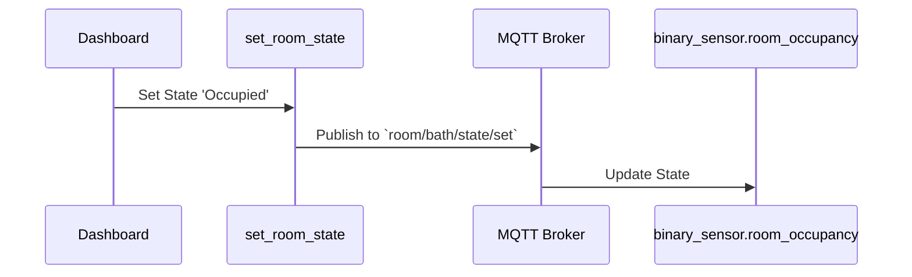

# Package: Room Automation

## Executive Summary
This is a highly advanced, **MQTT-driven** room automation framework. It allows for the dynamic creation of room configurations (via scripts and MQTT auto-discovery) rather than hardcoding YAML for every room. It manages room states (Occupied, Idle, Absence) based on timers, motion, and door constraints.

## Architecture


## Backend Configuration
*(Snippet)*
```yaml
# Room Automation Framework
script:
  create_room_settings:
    alias: "System: Create Room Settings"
    sequence:
      - service: mqtt.publish
        data:
          topic: "homeassistant/select/room_{{ room_slug }}_mode/config"
          payload: >-
            {
              "name": "{{ room_name }} Automation Mode",
              "command_topic": "room/{{ room_slug }}/mode/set",
              "options": ["Automatic", "Manual", "Disabled"]
              ...
            }
  
  set_room_state:
    alias: "System: Set Room State"
    fields:
      room_slug: { required: true }
      state: { required: true }
    sequence:
      - service: mqtt.publish
        topic: "room/{{ room_slug }}/state/set"
        payload: "{{ state }}"
```

## Frontend Connection
**Key Entities**:
- `input_select.room_mgmt_create_select`
- `binary_sensor.room_*_occupancy`

**Dashboard Usage**:
The `lovelace.room_management` dashboard is purpose-built for this package. It provides interfaces to:
1. Create new rooms (selecting from Areas).
2. Configure timeouts (Idle delay, sleep entry).
3. Delete rooms.

### UI Simulation
<div style="border: 1px solid #444; border-radius: 12px; padding: 16px; width: 300px; background: #222; color: white; font-family: sans-serif;">
  <h3>🛠️ Room Manager</h3>
  <div style="margin-bottom: 12px;">
    <div style="font-size: 0.8em; color: #aaa;">Select Room</div>
    <select style="width: 100%; padding: 8px; background: #333; color: white; border: 1px solid #555; border-radius: 4px;">
      <option>Bathroom</option>
      <option>Kitchen</option>
      <option>Living Room</option>
    </select>
  </div>
  <div style="display: grid; grid-template-columns: 1fr 1fr; gap: 8px;">
    <div style="text-align: center; background: #333; padding: 8px; border-radius: 4px;">
      <div style="font-size: 0.7em;">Idle Delay</div>
      <div style="font-weight: bold;">5 min</div>
    </div>
    <div style="text-align: center; background: #333; padding: 8px; border-radius: 4px;">
      <div style="font-size: 0.7em;">Mode</div>
      <div style="font-weight: bold; color: #4caf50;">Auto</div>
    </div>
  </div>
</div>
