---
tags:
  - package
  - automated
version: 1.2.0
---

# Package: Room Manager

**Version:** 1.2.0  
**Description:** Dynamic creation of room settings via MQTT

<!-- START_IMAGE -->

<!-- END_IMAGE -->

## Executive Summary
<!-- START_SUMMARY -->
The **Room Automation Manager** is a dynamic configuration engine that enables the decentralized creation of smart room controllers. Unlike static YAML configuration, this package allows administrators to "initialize" a room directly from the dashboard. This triggers a script that publishes **MQTT Discovery** payloads to Home Assistant, effectively factory-generating a standardized suite of entities for that room (Automation Mode, Idle Timers, Occupancy Sensors, etc.) without requiring a system restart. It acts as a "Room Controller Factory," ensuring every smart room has a consistent interface and logic structure.
<!-- END_SUMMARY -->

## Process Description (Non-Technical)
<!-- START_DETAILED -->
This system allows you to turn any standard "Area" in your home into a fully functional Smart Room with a single click.
1.  **Select & Initialize:** Go to the **Room Management** dashboard, pick a room (e.g., "Kitchen") from the list, and click "Initialize".
2.  **Automatic Creation:** The system instantly builds a "Control Panel" for that room behind the scenes. It creates:
    *   **Mode Switch:** To set the room to "Automatic", "Manual", or "Guest Mode".
    *   **Timers:** Dials to set how long lights stay on (e.g., 5 minutes).
    *   **Sensor Links:** Dropdown menus to choose which Motion Sensor and Bed Sensor belongs to this room.
3.  **Instant Control:** New controls appear immediately. You can now tweak the "Kitchen" settings without ever touching a code file. If you delete the room, all these controls vanish cleanly.
<!-- END_DETAILED -->

## Dashboard Connections
<!-- START_DASHBOARD -->
*   **[Room Management](../dashboards/room-management/room_management.md)**: The primary admin interface. Used to Create (Initialize) and Delete rooms. It also lists all active rooms and their configuration state.
*   **[Settings (System)](../dashboards/main/settings.md)**: Displays the global list of active rooms and their current modes (Occupied/Idle).

### Embedded Card: Configured Rooms List
The following `auto-entities` configuration is used to dynamically list all rooms:

```yaml
type: custom:auto-entities
show_empty: true
card:
  type: entities
  show_header_toggle: false
filter:
  template: |
    
    
    
    
      {# Extract base id and normalize to room_key #}
      
      
      
        
      
        
      
      

      {# Entity IDs #}
      
      
      
      
      
      
      
      
      
      

      
      
      {# 1. Mode #}
      

      {# 2. Switch #}
      
        
      

      {# 3. State #}
      
        
      

      {# 4. Occupancy #}
      
        
      

      {# 5. Occupancy Source #}
      
        
      

      {# 6. Timer Bar (Conditional Row) #}
      
         
      

      {# 7. Config Numbers #}
      
        
      
      
        
      

      {# 8. Bed Sensor & Sleep Timers (Conditional) #}
      
        
        
        {# Sleep Entry Delay #}
        
          
        

        {# Sleep Exit Delay #}
        
          
        
      

      {# Create the Group #}
      
      
    
    
    {{ ns.rows | to_json }}
```
<!-- END_DASHBOARD -->

## Architecture Diagram
<!-- START_MERMAID_DESC -->
The sequence diagram below illustrates the **Room Initialization Flow**. When a user clicks "Initialize" for a specific room (e.g., "Kitchen"), the `create_room_settings` script triggers. It loops through a definition of required entities (Automation Mode, Idle Timer, Occupancy Sensor Link) and publishes **MQTT Configuration Payloads** to the `homeassistant/` discovery topic. Home Assistant detects these payloads and dynamically creates the entities in its registry. Finally, the script publishes default state values (retained) to ensure the new controls are immediately usable.

```mermaid
sequenceDiagram
    participant User as 👤 Admin (Dashboard)
    participant Script as 📜 Script: create_room
    participant MQTT as 📡 MQTT Broker
    participant HA as 🏠 Home Assistant (Discovery)

    User->>Script: Run(room_slug="kitchen")
    activate Script
    
    rect rgb(20, 20, 20)
        note right of Script: 1. Entity Construction Loop
        Script->>MQTT: Publish config: select.room_kitchen_mode
        MQTT-->>HA: Discovery: New Entity (select...mode)
        Script->>MQTT: Publish config: number.room_kitchen_idle
        MQTT-->>HA: Discovery: New Entity (number...idle)
        Script->>MQTT: Publish config: binary_sensor.room_kitchen_occupancy
        MQTT-->>HA: Discovery: New Entity (binary_sensor...occupancy)
    end

    rect rgb(30, 30, 50)
        note right of Script: 2. Default State Injection (Retained)
        Script->>MQTT: Publish state: mode = "presence-control"
        Script->>MQTT: Publish state: idle_time = 120s
        Script->>MQTT: Publish state: occupancy = OFF
    end
    
    deactivate Script
    HA-->>User: UI Updates (New Controls Appear)
```

<!-- END_MERMAID_DESC -->

<!-- START_MERMAID -->

<!-- END_MERMAID -->

## Configuration (Source Code)
```yaml
# Package: Room Automation Manager
# Version: 1.2.0
# Description: Dynamic creation of room settings via MQTT
# Dependencies: MQTT, input_text.room_mgmt_name, automation.system_populate_room_list
# ------------------------------------------------------------------------------

# ------------------------------------------------------------------------------
# 1. GLOBAL CUSTOMIZATION (Force Text Boxes)
# ------------------------------------------------------------------------------
homeassistant:
  customize_glob:
    "number.*_presence_idle_time":
      mode: box
    "number.*_lights_presence_delay":
      mode: box
    "number.*_sleep_entry_delay":
      mode: box
    "number.*_sleep_exit_delay":
      mode: box

# ------------------------------------------------------------------------------
# 2. HELPERS (Dashboard Inputs)
# ------------------------------------------------------------------------------
input_text:
  room_mgmt_name:
    name: "Room Name"
    icon: mdi:door-open
  room_mgmt_slug:
    name: "Room ID (slug)"
    icon: mdi:identifier

input_select:
  # SOURCE: Native Home Assistant Areas
  room_mgmt_create_select:
    name: "Select Area to Initialize"
    icon: mdi:map-plus
    options:
      - "unknown"

  # SOURCE: Existing Created Rooms
  room_mgmt_delete_select:
    name: "Select Room to Delete"
    icon: mdi:delete-sweep
    options:
      - "unknown"

# ------------------------------------------------------------------------------
# 3. SCRIPTS
# ------------------------------------------------------------------------------
script:
  # --- CREATE ROOM SETTINGS ---
  create_room_settings:
    alias: "System: Create Room Settings"
    icon: mdi:home-plus
    mode: single
    sequence:
      - variables:
          # Get the selected Area ID (slug) directly from the dropdown
          room_slug: "{{ states('input_select.room_mgmt_create_select') }}"
          # Use the Area Name as the Friendly Name (Title Case)
          room_name: "{{ area_name(room_slug) }}"

      # 1. Create Automation Mode Selector (Select)
      - service: mqtt.publish
        data:
          retain: true
          topic: "homeassistant/select/room_{{ room_slug }}_mode/config"
          payload: >-
            {
              "name": "{{ room_name }} Automation Mode",
              "object_id": "room_{{ room_slug }}_automation_mode",
              "unique_id": "room_select_{{ room_slug }}_mode_v4",
              "icon": "mdi:home-lightning-bolt-outline",
              "options": ["presence-control", "absence-detection", "manual-control", "schedule-mode"],
              "command_topic": "room/{{ room_slug }}/mode/set",
              "state_topic": "room/{{ room_slug }}/mode/state",
              "availability_topic": "room/{{ room_slug }}/availability",
              "payload_available": "online",
              "device": {
                "identifiers": ["room_settings_{{ room_slug }}"],
                "name": "{{ room_name }} Settings",
                "manufacturer": "Home Assistant",
                "model": "Room Controller"
              }
            }
      # Set default if new
      - if:
          - condition: template
            value_template: "{{ states('select.room_' ~ room_slug ~ '_automation_mode') in ['unknown', 'unavailable', 'none'] }}"
        then:
          - service: mqtt.publish
            data:
              retain: true
              topic: "room/{{ room_slug }}/mode/state"
              payload: "presence-control"
      - delay: "00:00:00.050"

      # 1.1 Create Automation Master Switch (Switch)
      - service: mqtt.publish
        data:
          retain: true
          topic: "homeassistant/switch/room_{{ room_slug }}_automation/config"
          payload: >-
            {
              "name": "{{ room_name }} Automation",
              "object_id": "room_{{ room_slug }}_automation",
              "unique_id": "room_switch_{{ room_slug }}_automation_v1",
              "icon": "mdi:robot",
              "command_topic": "room/{{ room_slug }}/automation/set",
              "state_topic": "room/{{ room_slug }}/automation/state",
              "availability_topic": "room/{{ room_slug }}/availability",
              "payload_on": "ON",
              "payload_off": "OFF",
              "device": { "identifiers": ["room_settings_{{ room_slug }}"] }
            }
      # Default to ON if new
      - if:
          - condition: template
            value_template: "{{ states('switch.room_' ~ room_slug ~ '_automation') in ['unknown', 'unavailable', 'none'] }}"
        then:
          - service: mqtt.publish
            data:
              retain: true
              topic: "room/{{ room_slug }}/automation/state"
              payload: "ON"
      - delay: "00:00:00.050"

      # 2. Create Idle Time Slider (Number)
      - service: mqtt.publish
        data:
          retain: true
          topic: "homeassistant/number/room_{{ room_slug }}_idle/config"
          payload: >-
            {
              "name": "{{ room_name }} Presence Idle Time",
              "object_id": "room_{{ room_slug }}_presence_idle_time",
              "unique_id": "room_number_{{ room_slug }}_idle_v5",
              "device_class": "duration",
              "icon": "mdi:timer-sand",
              "min": 0,
              "max": 1800,
              "step": 1,
              "unit_of_measurement": "s",
              "command_topic": "room/{{ room_slug }}/idle/set",
              "state_topic": "room/{{ room_slug }}/idle/state",
              "availability_topic": "room/{{ room_slug }}/availability",
              "device": { "identifiers": ["room_settings_{{ room_slug }}"] }
            }
      # Default Value
      - if:
          - condition: template
            value_template: "{{ states('number.room_' ~ room_slug ~ '_presence_idle_time') in ['unknown', 'unavailable', 'none'] }}"
        then:
          - service: mqtt.publish
            data:
              retain: true
              topic: "room/{{ room_slug }}/idle/state"
              payload: "15"
      - delay: "00:00:00.050"

      # 3. Create Delay Time (Number)
      - service: mqtt.publish
        data:
          retain: true
          topic: "homeassistant/number/room_{{ room_slug }}_delay/config"
          payload: >-
            {
              "name": "{{ room_name }} Lights Presence Delay",
              "object_id": "room_{{ room_slug }}_lights_presence_delay",
              "unique_id": "room_number_{{ room_slug }}_delay_v5",
              "device_class": "duration",
              "icon": "mdi:lightbulb-clock",
              "min": 0,
              "max": 3600,
              "step": 1,
              "unit_of_measurement": "s",
              "command_topic": "room/{{ room_slug }}/delay/set",
              "state_topic": "room/{{ room_slug }}/delay/state",
              "availability_topic": "room/{{ room_slug }}/availability",
              "device": { "identifiers": ["room_settings_{{ room_slug }}"] }
            }
      - if:
          - condition: template
            value_template: "{{ states('number.room_' ~ room_slug ~ '_lights_presence_delay') in ['unknown', 'unavailable', 'none'] }}"
        then:
          - service: mqtt.publish
            data:
              retain: true
              topic: "room/{{ room_slug }}/delay/state"
              payload: "120"
      - delay: "00:00:00.050"

      # 4. Create Timer Display (Timestamp Sensor)
      - service: mqtt.publish
        data:
          retain: true
          topic: "homeassistant/sensor/room_{{ room_slug }}_timer/config"
          payload: >-
            {
              "name": "{{ room_name }} Timer",
              "object_id": "room_{{ room_slug }}_timer",
              "unique_id": "room_sensor_{{ room_slug }}_timer_v4",
              "icon": "mdi:progress-clock",
              "device_class": "timestamp",
              "value_template": "{{ '{{' }} value if value not in ['unknown', 'unavailable', ''] else None {{ '}}' }}",
              "state_topic": "room/{{ room_slug }}/timer/state",
              "json_attributes_topic": "room/{{ room_slug }}/timer/attributes",
              "availability_topic": "room/{{ room_slug }}/availability",
              "device": { "identifiers": ["room_settings_{{ room_slug }}"] }
            }
      - delay: "00:00:00.050"
      # 5. Create Room State (Select)
      - service: mqtt.publish
        data:
          retain: true
          topic: "homeassistant/select/room_{{ room_slug }}_state/config"
          payload: >-
            {
              "name": "{{ room_name }} State",
              "object_id": "room_{{ room_slug }}_state",
              "unique_id": "room_select_state_v4_{{ room_slug }}",
              "icon": "mdi:eye-outline",
              "options": ["Occupied", "Idle", "Absence", "Sleep"],
              "command_topic": "room/{{ room_slug }}/state/set",
              "state_topic": "room/{{ room_slug }}/state/state",
              "availability_topic": "room/{{ room_slug }}/availability",
              "payload_available": "online",
              "device": { "identifiers": ["room_settings_{{ room_slug }}"] }
            }
      - service: mqtt.publish
        data:
          retain: true
          topic: "room/{{ room_slug }}/state/state"
          payload: "Absence"
      - delay: "00:00:00.050"

      # 6. Create Occupancy (Binary Sensor)
      - service: mqtt.publish
        data:
          retain: true
          topic: "homeassistant/binary_sensor/room_{{ room_slug }}_occupancy/config"
          payload: >-
            {
              "name": "{{ room_name }} Occupancy",
              "object_id": "room_{{ room_slug }}_occupancy",
              "unique_id": "room_occupancy_v4_{{ room_slug }}",
              "icon": "mdi:motion-sensor",
              "device_class": "occupancy",
              "state_topic": "room/{{ room_slug }}/occupancy/state",
              "payload_on": "ON",
              "payload_off": "OFF",
              "availability_topic": "room/{{ room_slug }}/availability",
              "payload_available": "online",
              "device": { "identifiers": ["room_settings_{{ room_slug }}"] }
            }
      - service: mqtt.publish
        data:
          retain: true
          topic: "room/{{ room_slug }}/occupancy/state"
          payload: "OFF"
      - delay: "00:00:00.050"

      # 9. Create Bed Sensor (Select)
      - service: mqtt.publish
        data:
          retain: true
          topic: "homeassistant/select/room_{{ room_slug }}_bed_sensor/config"
          payload: >-
            {
              "name": "{{ room_name }} Bed Sensor ID",
              "object_id": "room_{{ room_slug }}_bed_sensor",
              "unique_id": "room_select_bed_sensor_v4_{{ room_slug }}",
              "icon": "mdi:bed",
              "options": ["-Select-"],
              "command_topic": "room/{{ room_slug }}/bed_sensor/set",
              "state_topic": "room/{{ room_slug }}/bed_sensor/state",
              "availability_topic": "room/{{ room_slug }}/availability",
              "device": { "identifiers": ["room_settings_{{ room_slug }}"] }
            }
      - delay: "00:00:00.050"
      # 10. Create Sleep Entry Delay (Number)
      - service: mqtt.publish
        data:
          retain: true
          topic: "homeassistant/number/room_{{ room_slug }}_sleep_entry_delay/config"
          payload: >-
            {
              "name": "{{ room_name }} Sleep Entry Delay",
              "object_id": "room_{{ room_slug }}_sleep_entry_delay",
              "unique_id": "room_number_sleep_entry_delay_v4_{{ room_slug }}",
              "icon": "mdi:bed-clock",
              "min": 0, "max": 3600, "step": 15, "unit_of_measurement": "s",
              "command_topic": "room/{{ room_slug }}/sleep_entry_delay/set",
              "state_topic": "room/{{ room_slug }}/sleep_entry_delay/state",
              "availability_topic": "room/{{ room_slug }}/availability",
              "device": { "identifiers": ["room_settings_{{ room_slug }}"] }
            }
      - if:
          - condition: template
            value_template: "{{ states('number.room_' ~ room_slug ~ '_sleep_entry_delay') in ['unknown', 'unavailable', 'none'] }}"
        then:
          - service: mqtt.publish
            data:
              retain: true
              topic: "room/{{ room_slug }}/sleep_entry_delay/state"
              payload: "300"
      - delay: "00:00:00.050"

      # 11. Create Sleep Exit Delay (Number)
      - service: mqtt.publish
        data:
          retain: true
          topic: "homeassistant/number/room_{{ room_slug }}_sleep_exit_delay/config"
          payload: >-
            {
              "name": "{{ room_name }} Sleep Exit Delay",
              "object_id": "room_{{ room_slug }}_sleep_exit_delay",
              "unique_id": "room_number_sleep_exit_delay_v4_{{ room_slug }}",
              "icon": "mdi:run-fast",
              "min": 0, "max": 3600, "step": 15, "unit_of_measurement": "s",
              "command_topic": "room/{{ room_slug }}/sleep_exit_delay/set",
              "state_topic": "room/{{ room_slug }}/sleep_exit_delay/state",
              "availability_topic": "room/{{ room_slug }}/availability",
              "device": { "identifiers": ["room_settings_{{ room_slug }}"] }
            }
      - if:
          - condition: template
            value_template: "{{ states('number.room_' ~ room_slug ~ '_sleep_exit_delay') in ['unknown', 'unavailable', 'none'] }}"
        then:
          - service: mqtt.publish
            data:
              retain: true
              topic: "room/{{ room_slug }}/sleep_exit_delay/state"
              payload: "60"
      - delay: "00:00:00.050"

      # 12. Set Online & Refresh Lists
      - service: mqtt.publish
        data:
          retain: true
          topic: "room/{{ room_slug }}/availability"
          payload: "online"

      # 13. Create Occupancy Source (Select)
      - service: mqtt.publish
        data:
          retain: true
          topic: "homeassistant/select/room_{{ room_slug }}_occupancy_source/config"
          payload: >-
            {
              "name": "{{ room_name }} Occupancy Sensor",
              "object_id": "room_{{ room_slug }}_occupancy_source",
              "unique_id": "room_select_occ_source_v1_{{ room_slug }}",
              "icon": "mdi:motion-sensor-off",
              "options": ["-Select-"],
              "command_topic": "room/{{ room_slug }}/occupancy_source/set",
              "state_topic": "room/{{ room_slug }}/occupancy_source/state",
              "availability_topic": "room/{{ room_slug }}/availability",
              "device": { "identifiers": ["room_settings_{{ room_slug }}"] }
            }
      - delay: "00:00:00.050"
      # Trigger Refresh to populate options
      - service: script.refresh_room_options

  # --- DELETE ROOM SETTINGS ---
  delete_room_settings:
    alias: "System: Delete Room Settings"
    icon: mdi:home-remove
    mode: single
    sequence:
      - variables:
          raw_slug: "{{ states('input_select.room_mgmt_delete_select') }}"
          # SAFETY: If slug starts with 'room_', strip it to get the clean ID
          room_slug: "{{ raw_slug | replace('room_', '') if raw_slug.startswith('room_') else raw_slug }}"

      # Clear Config Topics
      - service: mqtt.publish
        data:
          retain: true
          topic: "homeassistant/select/room_{{ room_slug }}_mode/config"
          payload: ""
      - service: mqtt.publish
        data:
          retain: true
          topic: "homeassistant/number/room_{{ room_slug }}_idle/config"
          payload: ""
      - service: mqtt.publish
        data:
          retain: true
          topic: "homeassistant/number/room_{{ room_slug }}_delay/config"
          payload: ""
      - service: mqtt.publish
        data:
          retain: true
          topic: "homeassistant/sensor/room_{{ room_slug }}_timer/config"
          payload: ""
      - service: mqtt.publish
        data:
          retain: true
          topic: "homeassistant/select/room_{{ room_slug }}_state/config"
          payload: ""
      - service: mqtt.publish
        data:
          retain: true
          topic: "homeassistant/binary_sensor/room_{{ room_slug }}_occupancy/config"
          payload: ""
      - service: mqtt.publish
        data:
          retain: true
          topic: "homeassistant/switch/room_{{ room_slug }}_automation/config"
          payload: ""
      # Cleanup New Bed Sensor Select
      - service: mqtt.publish
        data:
          retain: true
          topic: "homeassistant/select/room_{{ room_slug }}_bed_sensor/config"
          payload: ""

      # RESTORED: Cleanup for deprecated entities to remove legacy retained messages
      - service: mqtt.publish
        data:
          retain: true
          topic: "homeassistant/text/room_{{ room_slug }}_lux_sensor/config"
          payload: ""
      - service: mqtt.publish
        data:
          retain: true
          topic: "homeassistant/number/room_{{ room_slug }}_lux_threshold/config"
          payload: ""
      - service: mqtt.publish
        data:
          retain: true
          topic: "homeassistant/select/room_{{ room_slug }}_light_target/config"
          payload: ""
      # END RESTORED

      - service: mqtt.publish
        data:
          retain: true
          topic: "homeassistant/text/room_{{ room_slug }}_bed_sensor/config"
          payload: ""
      - service: mqtt.publish
        data:
          retain: true
          topic: "homeassistant/number/room_{{ room_slug }}_sleep_exit_delay/config"
          payload: ""
      - service: mqtt.publish
        data:
          retain: true
          topic: "homeassistant/select/room_{{ room_slug }}_occupancy_source/config"
          payload: ""

      # Set Offline
      - service: mqtt.publish
        data:
          retain: true
          topic: "room/{{ room_slug }}/availability"
          payload: "offline"

      # Refresh Lists
      # PURGE LEGACY TEXT BED SENSORS (Fixes MQTT Warnings)
      - repeat:
          for_each: "{{ room_slugs }}"
          sequence:
            - service: mqtt.publish
              data:
                retain: true
                topic: "homeassistant/text/room_{{ repeat.item }}_bed_sensor/config"
                payload: ""

      # Refresh Lists

      - delay: "00:00:02"
      - service: automation.trigger
        target:
          entity_id: automation.system_populate_room_list
        data:
          skip_condition: true

  # --- REFRESH OPTIONS FOR SELECTS ---
  refresh_room_options:
    alias: "System: Refresh Room Options"
    mode: single
    sequence:
      - variables:
          # FILTER: Binary Sensors (Occupancy/Presence/Motion OR 'presence'/'occupancy' in name)
          sensor_list: >-
            
            
               
               
               
                 
               
            
            {{ ns.items | sort | list }}

          # FILTER: Bed Sensors (Must have 'bed' AND ('occupancy' OR 'presence') in name/id)
          bed_sensor_list: >-
            
            
               
               
                 
               
            
            {{ ns.items | sort | list }}

          # Find all active room slugs
          room_slugs: >-
            
            
            
               
               
               
                  
               
                  
               
               
            
            {{ ns.rooms | unique | list }}

      # Loop through each room and update its config topic with new options
      - repeat:
          for_each: "{{ room_slugs }}"
          sequence:
            # 1. Update Occupancy Source Options
            - service: mqtt.publish
              data:
                topic: "homeassistant/select/room_{{ repeat.item }}_occupancy_source/config"
                retain: true
                payload: >-
                  {
                    "name": "{{ area_name(repeat.item) | default(repeat.item) }} Occupancy Sensor",
                    "object_id": "room_{{ repeat.item }}_occupancy_source",
                    "unique_id": "room_select_occ_source_v1_{{ repeat.item }}",
                    "icon": "mdi:motion-sensor-off",
                    "options": {{ sensor_list | to_json }},
                    "command_topic": "room/{{ repeat.item }}/occupancy_source/set",
                    "state_topic": "room/{{ repeat.item }}/occupancy_source/state",
                    "availability_topic": "room/{{ repeat.item }}/availability",
                    "device": { "identifiers": ["room_settings_{{ repeat.item }}"] }
                  }

            # 2. Update Bed Sensor Options
            - service: mqtt.publish
              data:
                topic: "homeassistant/select/room_{{ repeat.item }}_bed_sensor/config"
                retain: true
                payload: >-
                  {
                    "name": "{{ area_name(repeat.item) | default(repeat.item) }} Bed Sensor ID",
                    "object_id": "room_{{ repeat.item }}_bed_sensor",
                    "unique_id": "room_select_bed_sensor_v4_{{ repeat.item }}",
                    "icon": "mdi:bed",
                    "options": {{ bed_sensor_list | to_json }},
                    "command_topic": "room/{{ repeat.item }}/bed_sensor/set",
                    "state_topic": "room/{{ repeat.item }}/bed_sensor/state",
                    "availability_topic": "room/{{ repeat.item }}/availability",
                    "device": { "identifiers": ["room_settings_{{ repeat.item }}"] }
                  }

  # ... (Helper Scripts set_room_timer, etc. remain the same) ...
  set_room_timer:
    alias: "System: Set Room Timer"
    mode: parallel
    fields:
      room_slug:
        description: "Room Slug (e.g. bathroom)"
        required: true
    sequence:
      - variables:
          seconds: "{{ states('number.' ~ room_slug ~ '_lights_presence_delay') | int(0) }}"
      - service: mqtt.publish
        data:
          topic: "room/{{ room_slug }}/timer/attributes"
          payload: >-
            { "duration": "{{ seconds }}" }
          retain: true
      - service: mqtt.publish
        data:
          topic: "room/{{ room_slug }}/timer/state"
          payload: "{{ (now() + timedelta(seconds=seconds)).isoformat() }}"
          retain: true

  cancel_room_timer:
    alias: "System: Cancel Room Timer"
    mode: parallel
    fields:
      room_slug:
        description: "Room Slug"
        required: true
    sequence:
      - service: mqtt.publish
        data:
          topic: "room/{{ room_slug }}/timer/attributes"
          payload: "{}"
          retain: true
      - service: mqtt.publish
        data:
          topic: "room/{{ room_slug }}/timer/state"
          payload: "unknown"
          retain: true

  set_room_state:
    alias: "System: Set Room State"
    mode: parallel
    fields:
      room_slug:
        description: "Room Slug"
        required: true
      state:
        description: "Occupied, Idle, or Absence"
        required: true
    sequence:
      - service: mqtt.publish
        data:
          topic: "room/{{ room_slug }}/state/set"
          payload: "{{ state }}"
          retain: true

  set_room_occupancy:
    alias: "System: Set Room Occupancy"
    mode: parallel
    fields:
      room_slug:
        description: "Room Slug"
        required: true
      occupied:
        description: "True (ON) or False (OFF)"
        required: true
    sequence:
      - service: mqtt.publish
        data:
          topic: "room/{{ room_slug }}/occupancy/state"
          payload: "{{ 'ON' if occupied else 'OFF' }}"
          retain: true

# ------------------------------------------------------------------------------
# 4. AUTOMATIONS
# ------------------------------------------------------------------------------
automation:
  # Keeps the MQTT Selects/Numbers in sync (State Persistence)
  - alias: "System: Room MQTT Persistence"
    id: system_room_mqtt_persistence
    mode: parallel
    trigger:
      - platform: mqtt
        topic: "room/#"
    condition:
      - condition: template
        value_template: "{{ trigger.topic.endswith('/set') }}"
    action:
      - service: mqtt.publish
        data:
          topic: "{{ trigger.topic[:-4] }}/state"
          payload: "{{ trigger.payload }}"
          retain: true

  - alias: "System: Populate Room Lists"
    id: system_populate_room_list
    trigger:
      - platform: homeassistant
        event: start
      - platform: time_pattern
        hours: "/1"
    action:
      # Define room_slugs for use in cleanup loop
      - variables:
          room_slugs: >-
            
            
            
               
               
               
                  
               
                  
               
               
            
            {{ ns.rooms | unique | list }}

      # 1. Populate 'Create' dropdown with Native Areas
      - service: input_select.set_options
        target:
          entity_id: input_select.room_mgmt_create_select
        data:
          options: >
            {# Get list of all area IDs #}
            {{ (['unknown'] + areas() | sort | list) }}

      # 2. Populate 'Delete' dropdown with Existing Rooms
      - service: input_select.set_options
        target:
          entity_id: input_select.room_mgmt_delete_select
        data:
          # UPDATED: Fixed populate logic to properly strip prefixes
          options: >
            
            
            
               {# Extract slug. Handles "select.bathroom_automation_mode" or "select.room_bathroom_automation_mode" #}
               
               
               
                  
               
                  
               
               
            
            {{ (['unknown'] + ns.rooms | unique | list) }}
      # 3. Purge Legacy Text Bed Sensors (Fixes MQTT Warnings)
      - repeat:
          for_each: "{{ room_slugs }}"
          sequence:
            - service: mqtt.publish
              data:
                retain: true
                topic: "homeassistant/text/room_{{ repeat.item }}_bed_sensor/config"
                payload: ""

      - service: script.refresh_room_options
