---
tags:
  - package
  - automated
version: 1.2.0
---

# Package: Room Manager

**Version:** 1.2.0  
**Description:** Dynamic creation of room settings via MQTT

<!-- START_IMAGE -->

<!-- END_IMAGE -->

## Executive Summary
<!-- START_SUMMARY -->
> ⚠️ **Update Required:** Analysis for v1.0.0. Code is v1.2.0.

The **Room Automation** package provides a standardized, scalable framework for managing room states (e.g., Occupied, Idle, Sleep) and automation parameters (e.g., lighting delays, lux thresholds) dynamically. It utilizes **MQTT discovery** to generate entities for each room on-the-fly, allowing for decentralized configuration without restarting Home Assistant. Admin users can "initialize" a room from a dashboard, which triggers scripts to publish MQTT configuration payloads, creating a suite of helpers (timers, selects, sensors) specific to that room. It effectively acts as a "factory" for room controllers.
<!-- END_SUMMARY -->

## Process Description (Non-Technical)
<!-- START_DETAILED -->
> ⚠️ **Update Required:** Analysis for v1.0.0. Code is v1.2.0.

This system allows you to turn any "Area" in your home into a Smart Room without writing code. 
1.  **Creation:** You select a room (like "Kitchen") from a list in the Settings Dashboard. 
2.  **Generation:** The system instantly creates a set of controls for that room, including:
    *   **Mode Selector:** Choose how the room behaves (e.g., "Presence Control" vs. "Manual").
    *   **Timers:** Set how long lights stay on after you leave.
    *   **Sensors:** Link motion sensors and light sensors to the room.
3.  **Operation:** Once created, these controls appear in your dashboards, letting you tweak settings like "turn off lights after 5 minutes" individually for every room.
<!-- END_DETAILED -->

## Dashboard Connections
<!-- START_DASHBOARD -->
This package powers the following dashboard views:

* **[Living Room](../dashboards/main/living_room.md)**: *The Living Room dashboard is a media and comfort hub. It features in-depth environmental monitoring (Radon, VOCs, CO2) via Airthings Wave, displaying historical trends. Entertainment controls are central, with remotes for the TV and Soundbar, plus power management for the media wall. The view also includes specific controls for the fireplace, air purifier modes, and various lighting scenes, alongside standard occupancy settings.* (Uses 1 entities)
* **[Notifications Management](../dashboards/notification-center/notifications_management.md)**: *The Notification Center dashboard provides a comprehensive interface for managing the smart home's notification system. Administrators can add or remove users for mobile app notifications and define notification categories (e.g., 'Garage', 'Electricity'). The view allows for granular control over subscriptions, enabling individual users to opt-in or out of specific notification types, and includes tools to map and monitor notification-related automations.* (Uses 1 entities)
* **[Room Management](../dashboards/room-management/room_management.md)**: *The Room Management dashboard serves as the administrative backend for the home's room logic. It allows users to initialize new rooms (creating necessary helper entities) or delete existing ones. It features a dynamic "Configured Rooms" section powered by `auto-entities`, which automatically lists all configured rooms and provides collapsible controls for their automation modes, occupancy sensors, and timeouts.* (Uses 4 entities)
<!-- END_DASHBOARD -->

## Architecture Diagram
<!-- START_MERMAID_DESC -->
> ⚠️ **Update Required:** Analysis for v1.0.0. Code is v1.2.0.

The sequence diagram below illustrates the "Room Initialization" process. When a user selects a room (e.g., "Kitchen") and clicks "Initialize", the `create_room_settings` script is triggered. This script iterates through a predefined list of required entities (Mode Select, Idle Timer, Occupancy Sensor, etc.) and publishes **MQTT Configuration Payloads** to the `homeassistant/` discovery topic. Home Assistant's MQTT integration detects these payloads and dynamically duplicates the "Room Controller" entity structure for the new room. Finally, the script sets default values (e.g., 120s delay) via retained MQTT messages, ensuring the room is ready for immediate use.
<!-- END_MERMAID_DESC -->

<!-- START_MERMAID -->
> ⚠️ **Update Required:** Analysis for v1.0.0. Code is v1.2.0.


<!-- END_MERMAID -->

```mermaid
sequenceDiagram
    participant Admin as 👤 Admin
    participant Dash as 📱 Dashboard (Settings)
    participant Script as 📜 Script: create_room_settings
    participant MQTT as 📡 MQTT Broker
    participant HA as 🏠 Home Assistant (Discovery)

    Admin->>Dash: Selects "Kitchen" & Clicks Initialize
    Dash->>Script: Run(room_slug="kitchen")
    
    rect rgb(20, 20, 20)
    note right of Script: Entity Generation Loop
    Script->>MQTT: Publish config: select.room_kitchen_mode
    MQTT-->>HA: Discovery: New Entity (select.room_kitchen_mode)
    Script->>MQTT: Publish config: number.room_kitchen_idle
    MQTT-->>HA: Discovery: New Entity (number.room_kitchen_idle)
    Script->>MQTT: Publish config: binary_sensor.room_kitchen_occupancy
    MQTT-->>HA: Discovery: New Entity (binary_sensor...occupancy)
    end

    rect rgb(30, 30, 50)
    note right of Script: Default Values
    Script->>MQTT: Publish state: mode = "presence-control"
    Script->>MQTT: Publish state: delay = 120s
    end
    
    HA-->>Dash: UI Updates with new Kitchen Controls
```

## Configuration (Source Code)
```yaml
# Package: Room Automation Manager
# Version: 1.2.0
# Description: Dynamic creation of room settings via MQTT
# Dependencies: MQTT, input_text.room_mgmt_name, automation.system_populate_room_list
# ------------------------------------------------------------------------------

# ------------------------------------------------------------------------------
# 1. GLOBAL CUSTOMIZATION (Force Text Boxes)
# ------------------------------------------------------------------------------
homeassistant:
  customize_glob:
    "number.*_presence_idle_time":
      mode: box
    "number.*_lights_presence_delay":
      mode: box
    "number.*_sleep_entry_delay":
      mode: box
    "number.*_sleep_exit_delay":
      mode: box

# ------------------------------------------------------------------------------
# 2. HELPERS (Dashboard Inputs)
# ------------------------------------------------------------------------------
input_text:
  room_mgmt_name:
    name: "Room Name"
    icon: mdi:door-open
  room_mgmt_slug:
    name: "Room ID (slug)"
    icon: mdi:identifier

input_select:
  # SOURCE: Native Home Assistant Areas
  room_mgmt_create_select:
    name: "Select Area to Initialize"
    icon: mdi:map-plus
    options:
      - "unknown"

  # SOURCE: Existing Created Rooms
  room_mgmt_delete_select:
    name: "Select Room to Delete"
    icon: mdi:delete-sweep
    options:
      - "unknown"

# ------------------------------------------------------------------------------
# 3. SCRIPTS
# ------------------------------------------------------------------------------
script:
  # --- CREATE ROOM SETTINGS ---
  create_room_settings:
    alias: "System: Create Room Settings"
    icon: mdi:home-plus
    mode: single
    sequence:
      - variables:
          # Get the selected Area ID (slug) directly from the dropdown
          room_slug: "{{ states('input_select.room_mgmt_create_select') }}"
          # Use the Area Name as the Friendly Name (Title Case)
          room_name: "{{ area_name(room_slug) }}"

      # 1. Create Automation Mode Selector (Select)
      - service: mqtt.publish
        data:
          retain: true
          topic: "homeassistant/select/room_{{ room_slug }}_mode/config"
          payload: >-
            {
              "name": "{{ room_name }} Automation Mode",
              "object_id": "room_{{ room_slug }}_automation_mode",
              "unique_id": "room_select_{{ room_slug }}_mode_v4",
              "icon": "mdi:home-lightning-bolt-outline",
              "options": ["presence-control", "absence-detection", "manual-control", "schedule-mode"],
              "command_topic": "room/{{ room_slug }}/mode/set",
              "state_topic": "room/{{ room_slug }}/mode/state",
              "availability_topic": "room/{{ room_slug }}/availability",
              "payload_available": "online",
              "device": {
                "identifiers": ["room_settings_{{ room_slug }}"],
                "name": "{{ room_name }} Settings",
                "manufacturer": "Home Assistant",
                "model": "Room Controller"
              }
            }
      # Set default if new
      - if:
          - condition: template
            value_template: "{{ states('select.room_' ~ room_slug ~ '_automation_mode') in ['unknown', 'unavailable', 'none'] }}"
        then:
          - service: mqtt.publish
            data:
              retain: true
              topic: "room/{{ room_slug }}/mode/state"
              payload: "presence-control"
      - delay: "00:00:00.050"

      # 1.1 Create Automation Master Switch (Switch)
      - service: mqtt.publish
        data:
          retain: true
          topic: "homeassistant/switch/room_{{ room_slug }}_automation/config"
          payload: >-
            {
              "name": "{{ room_name }} Automation",
              "object_id": "room_{{ room_slug }}_automation",
              "unique_id": "room_switch_{{ room_slug }}_automation_v1",
              "icon": "mdi:robot",
              "command_topic": "room/{{ room_slug }}/automation/set",
              "state_topic": "room/{{ room_slug }}/automation/state",
              "availability_topic": "room/{{ room_slug }}/availability",
              "payload_on": "ON",
              "payload_off": "OFF",
              "device": { "identifiers": ["room_settings_{{ room_slug }}"] }
            }
      # Default to ON if new
      - if:
          - condition: template
            value_template: "{{ states('switch.room_' ~ room_slug ~ '_automation') in ['unknown', 'unavailable', 'none'] }}"
        then:
          - service: mqtt.publish
            data:
              retain: true
              topic: "room/{{ room_slug }}/automation/state"
              payload: "ON"
      - delay: "00:00:00.050"

      # 2. Create Idle Time Slider (Number)
      - service: mqtt.publish
        data:
          retain: true
          topic: "homeassistant/number/room_{{ room_slug }}_idle/config"
          payload: >-
            {
              "name": "{{ room_name }} Presence Idle Time",
              "object_id": "room_{{ room_slug }}_presence_idle_time",
              "unique_id": "room_number_{{ room_slug }}_idle_v5",
              "device_class": "duration",
              "icon": "mdi:timer-sand",
              "min": 0,
              "max": 1800,
              "step": 1,
              "unit_of_measurement": "s",
              "command_topic": "room/{{ room_slug }}/idle/set",
              "state_topic": "room/{{ room_slug }}/idle/state",
              "availability_topic": "room/{{ room_slug }}/availability",
              "device": { "identifiers": ["room_settings_{{ room_slug }}"] }
            }
      # Default Value
      - if:
          - condition: template
            value_template: "{{ states('number.room_' ~ room_slug ~ '_presence_idle_time') in ['unknown', 'unavailable', 'none'] }}"
        then:
          - service: mqtt.publish
            data:
              retain: true
              topic: "room/{{ room_slug }}/idle/state"
              payload: "15"
      - delay: "00:00:00.050"

      # 3. Create Delay Time (Number)
      - service: mqtt.publish
        data:
          retain: true
          topic: "homeassistant/number/room_{{ room_slug }}_delay/config"
          payload: >-
            {
              "name": "{{ room_name }} Lights Presence Delay",
              "object_id": "room_{{ room_slug }}_lights_presence_delay",
              "unique_id": "room_number_{{ room_slug }}_delay_v5",
              "device_class": "duration",
              "icon": "mdi:lightbulb-clock",
              "min": 0,
              "max": 3600,
              "step": 1,
              "unit_of_measurement": "s",
              "command_topic": "room/{{ room_slug }}/delay/set",
              "state_topic": "room/{{ room_slug }}/delay/state",
              "availability_topic": "room/{{ room_slug }}/availability",
              "device": { "identifiers": ["room_settings_{{ room_slug }}"] }
            }
      - if:
          - condition: template
            value_template: "{{ states('number.room_' ~ room_slug ~ '_lights_presence_delay') in ['unknown', 'unavailable', 'none'] }}"
        then:
          - service: mqtt.publish
            data:
              retain: true
              topic: "room/{{ room_slug }}/delay/state"
              payload: "120"
      - delay: "00:00:00.050"

      # 4. Create Timer Display (Timestamp Sensor)
      - service: mqtt.publish
        data:
          retain: true
          topic: "homeassistant/sensor/room_{{ room_slug }}_timer/config"
          payload: >-
            {
              "name": "{{ room_name }} Timer",
              "object_id": "room_{{ room_slug }}_timer",
              "unique_id": "room_sensor_{{ room_slug }}_timer_v4",
              "icon": "mdi:progress-clock",
              "device_class": "timestamp",
              "value_template": "{{ '{{' }} value if value not in ['unknown', 'unavailable', ''] else None {{ '}}' }}",
              "state_topic": "room/{{ room_slug }}/timer/state",
              "json_attributes_topic": "room/{{ room_slug }}/timer/attributes",
              "availability_topic": "room/{{ room_slug }}/availability",
              "device": { "identifiers": ["room_settings_{{ room_slug }}"] }
            }
      - delay: "00:00:00.050"
      # 5. Create Room State (Select)
      - service: mqtt.publish
        data:
          retain: true
          topic: "homeassistant/select/room_{{ room_slug }}_state/config"
          payload: >-
            {
              "name": "{{ room_name }} State",
              "object_id": "room_{{ room_slug }}_state",
              "unique_id": "room_select_state_v4_{{ room_slug }}",
              "icon": "mdi:eye-outline",
              "options": ["Occupied", "Idle", "Absence", "Sleep"],
              "command_topic": "room/{{ room_slug }}/state/set",
              "state_topic": "room/{{ room_slug }}/state/state",
              "availability_topic": "room/{{ room_slug }}/availability",
              "payload_available": "online",
              "device": { "identifiers": ["room_settings_{{ room_slug }}"] }
            }
      - service: mqtt.publish
        data:
          retain: true
          topic: "room/{{ room_slug }}/state/state"
          payload: "Absence"
      - delay: "00:00:00.050"

      # 6. Create Occupancy (Binary Sensor)
      - service: mqtt.publish
        data:
          retain: true
          topic: "homeassistant/binary_sensor/room_{{ room_slug }}_occupancy/config"
          payload: >-
            {
              "name": "{{ room_name }} Occupancy",
              "object_id": "room_{{ room_slug }}_occupancy",
              "unique_id": "room_occupancy_v4_{{ room_slug }}",
              "icon": "mdi:motion-sensor",
              "device_class": "occupancy",
              "state_topic": "room/{{ room_slug }}/occupancy/state",
              "payload_on": "ON",
              "payload_off": "OFF",
              "availability_topic": "room/{{ room_slug }}/availability",
              "payload_available": "online",
              "device": { "identifiers": ["room_settings_{{ room_slug }}"] }
            }
      - service: mqtt.publish
        data:
          retain: true
          topic: "room/{{ room_slug }}/occupancy/state"
          payload: "OFF"
      - delay: "00:00:00.050"

      # 9. Create Bed Sensor (Select)
      - service: mqtt.publish
        data:
          retain: true
          topic: "homeassistant/select/room_{{ room_slug }}_bed_sensor/config"
          payload: >-
            {
              "name": "{{ room_name }} Bed Sensor ID",
              "object_id": "room_{{ room_slug }}_bed_sensor",
              "unique_id": "room_select_bed_sensor_v4_{{ room_slug }}",
              "icon": "mdi:bed",
              "options": ["-Select-"],
              "command_topic": "room/{{ room_slug }}/bed_sensor/set",
              "state_topic": "room/{{ room_slug }}/bed_sensor/state",
              "availability_topic": "room/{{ room_slug }}/availability",
              "device": { "identifiers": ["room_settings_{{ room_slug }}"] }
            }
      - delay: "00:00:00.050"
      # 10. Create Sleep Entry Delay (Number)
      - service: mqtt.publish
        data:
          retain: true
          topic: "homeassistant/number/room_{{ room_slug }}_sleep_entry_delay/config"
          payload: >-
            {
              "name": "{{ room_name }} Sleep Entry Delay",
              "object_id": "room_{{ room_slug }}_sleep_entry_delay",
              "unique_id": "room_number_sleep_entry_delay_v4_{{ room_slug }}",
              "icon": "mdi:bed-clock",
              "min": 0, "max": 3600, "step": 15, "unit_of_measurement": "s",
              "command_topic": "room/{{ room_slug }}/sleep_entry_delay/set",
              "state_topic": "room/{{ room_slug }}/sleep_entry_delay/state",
              "availability_topic": "room/{{ room_slug }}/availability",
              "device": { "identifiers": ["room_settings_{{ room_slug }}"] }
            }
      - if:
          - condition: template
            value_template: "{{ states('number.room_' ~ room_slug ~ '_sleep_entry_delay') in ['unknown', 'unavailable', 'none'] }}"
        then:
          - service: mqtt.publish
            data:
              retain: true
              topic: "room/{{ room_slug }}/sleep_entry_delay/state"
              payload: "300"
      - delay: "00:00:00.050"

      # 11. Create Sleep Exit Delay (Number)
      - service: mqtt.publish
        data:
          retain: true
          topic: "homeassistant/number/room_{{ room_slug }}_sleep_exit_delay/config"
          payload: >-
            {
              "name": "{{ room_name }} Sleep Exit Delay",
              "object_id": "room_{{ room_slug }}_sleep_exit_delay",
              "unique_id": "room_number_sleep_exit_delay_v4_{{ room_slug }}",
              "icon": "mdi:run-fast",
              "min": 0, "max": 3600, "step": 15, "unit_of_measurement": "s",
              "command_topic": "room/{{ room_slug }}/sleep_exit_delay/set",
              "state_topic": "room/{{ room_slug }}/sleep_exit_delay/state",
              "availability_topic": "room/{{ room_slug }}/availability",
              "device": { "identifiers": ["room_settings_{{ room_slug }}"] }
            }
      - if:
          - condition: template
            value_template: "{{ states('number.room_' ~ room_slug ~ '_sleep_exit_delay') in ['unknown', 'unavailable', 'none'] }}"
        then:
          - service: mqtt.publish
            data:
              retain: true
              topic: "room/{{ room_slug }}/sleep_exit_delay/state"
              payload: "60"
      - delay: "00:00:00.050"

      # 12. Set Online & Refresh Lists
      - service: mqtt.publish
        data:
          retain: true
          topic: "room/{{ room_slug }}/availability"
          payload: "online"

      # 13. Create Occupancy Source (Select)
      - service: mqtt.publish
        data:
          retain: true
          topic: "homeassistant/select/room_{{ room_slug }}_occupancy_source/config"
          payload: >-
            {
              "name": "{{ room_name }} Occupancy Sensor",
              "object_id": "room_{{ room_slug }}_occupancy_source",
              "unique_id": "room_select_occ_source_v1_{{ room_slug }}",
              "icon": "mdi:motion-sensor-off",
              "options": ["-Select-"],
              "command_topic": "room/{{ room_slug }}/occupancy_source/set",
              "state_topic": "room/{{ room_slug }}/occupancy_source/state",
              "availability_topic": "room/{{ room_slug }}/availability",
              "device": { "identifiers": ["room_settings_{{ room_slug }}"] }
            }
      - delay: "00:00:00.050"
      # Trigger Refresh to populate options
      - service: script.refresh_room_options

  # --- DELETE ROOM SETTINGS ---
  delete_room_settings:
    alias: "System: Delete Room Settings"
    icon: mdi:home-remove
    mode: single
    sequence:
      - variables:
          raw_slug: "{{ states('input_select.room_mgmt_delete_select') }}"
          # SAFETY: If slug starts with 'room_', strip it to get the clean ID
          room_slug: "{{ raw_slug | replace('room_', '') if raw_slug.startswith('room_') else raw_slug }}"

      # Clear Config Topics
      - service: mqtt.publish
        data:
          retain: true
          topic: "homeassistant/select/room_{{ room_slug }}_mode/config"
          payload: ""
      - service: mqtt.publish
        data:
          retain: true
          topic: "homeassistant/number/room_{{ room_slug }}_idle/config"
          payload: ""
      - service: mqtt.publish
        data:
          retain: true
          topic: "homeassistant/number/room_{{ room_slug }}_delay/config"
          payload: ""
      - service: mqtt.publish
        data:
          retain: true
          topic: "homeassistant/sensor/room_{{ room_slug }}_timer/config"
          payload: ""
      - service: mqtt.publish
        data:
          retain: true
          topic: "homeassistant/select/room_{{ room_slug }}_state/config"
          payload: ""
      - service: mqtt.publish
        data:
          retain: true
          topic: "homeassistant/binary_sensor/room_{{ room_slug }}_occupancy/config"
          payload: ""
      - service: mqtt.publish
        data:
          retain: true
          topic: "homeassistant/switch/room_{{ room_slug }}_automation/config"
          payload: ""
      # Cleanup New Bed Sensor Select
      - service: mqtt.publish
        data:
          retain: true
          topic: "homeassistant/select/room_{{ room_slug }}_bed_sensor/config"
          payload: ""

      # RESTORED: Cleanup for deprecated entities to remove legacy retained messages
      - service: mqtt.publish
        data:
          retain: true
          topic: "homeassistant/text/room_{{ room_slug }}_lux_sensor/config"
          payload: ""
      - service: mqtt.publish
        data:
          retain: true
          topic: "homeassistant/number/room_{{ room_slug }}_lux_threshold/config"
          payload: ""
      - service: mqtt.publish
        data:
          retain: true
          topic: "homeassistant/select/room_{{ room_slug }}_light_target/config"
          payload: ""
      # END RESTORED

      - service: mqtt.publish
        data:
          retain: true
          topic: "homeassistant/text/room_{{ room_slug }}_bed_sensor/config"
          payload: ""
      - service: mqtt.publish
        data:
          retain: true
          topic: "homeassistant/number/room_{{ room_slug }}_sleep_exit_delay/config"
          payload: ""
      - service: mqtt.publish
        data:
          retain: true
          topic: "homeassistant/select/room_{{ room_slug }}_occupancy_source/config"
          payload: ""

      # Set Offline
      - service: mqtt.publish
        data:
          retain: true
          topic: "room/{{ room_slug }}/availability"
          payload: "offline"

      # Refresh Lists
      # PURGE LEGACY TEXT BED SENSORS (Fixes MQTT Warnings)
      - repeat:
          for_each: "{{ room_slugs }}"
          sequence:
            - service: mqtt.publish
              data:
                retain: true
                topic: "homeassistant/text/room_{{ repeat.item }}_bed_sensor/config"
                payload: ""

      # Refresh Lists

      - delay: "00:00:02"
      - service: automation.trigger
        target:
          entity_id: automation.system_populate_room_list
        data:
          skip_condition: true

  # --- REFRESH OPTIONS FOR SELECTS ---
  refresh_room_options:
    alias: "System: Refresh Room Options"
    mode: single
    sequence:
      - variables:
          # FILTER: Binary Sensors (Occupancy/Presence/Motion OR 'presence'/'occupancy' in name)
          sensor_list: >-
            
            
               
               
               
                 
               
            
            {{ ns.items | sort | list }}

          # FILTER: Bed Sensors (Must have 'bed' AND ('occupancy' OR 'presence') in name/id)
          bed_sensor_list: >-
            
            
               
               
                 
               
            
            {{ ns.items | sort | list }}

          # Find all active room slugs
          room_slugs: >-
            
            
            
               
               
               
                  
               
                  
               
               
            
            {{ ns.rooms | unique | list }}

      # Loop through each room and update its config topic with new options
      - repeat:
          for_each: "{{ room_slugs }}"
          sequence:
            # 1. Update Occupancy Source Options
            - service: mqtt.publish
              data:
                topic: "homeassistant/select/room_{{ repeat.item }}_occupancy_source/config"
                retain: true
                payload: >-
                  {
                    "name": "{{ area_name(repeat.item) | default(repeat.item) }} Occupancy Sensor",
                    "object_id": "room_{{ repeat.item }}_occupancy_source",
                    "unique_id": "room_select_occ_source_v1_{{ repeat.item }}",
                    "icon": "mdi:motion-sensor-off",
                    "options": {{ sensor_list | to_json }},
                    "command_topic": "room/{{ repeat.item }}/occupancy_source/set",
                    "state_topic": "room/{{ repeat.item }}/occupancy_source/state",
                    "availability_topic": "room/{{ repeat.item }}/availability",
                    "device": { "identifiers": ["room_settings_{{ repeat.item }}"] }
                  }

            # 2. Update Bed Sensor Options
            - service: mqtt.publish
              data:
                topic: "homeassistant/select/room_{{ repeat.item }}_bed_sensor/config"
                retain: true
                payload: >-
                  {
                    "name": "{{ area_name(repeat.item) | default(repeat.item) }} Bed Sensor ID",
                    "object_id": "room_{{ repeat.item }}_bed_sensor",
                    "unique_id": "room_select_bed_sensor_v4_{{ repeat.item }}",
                    "icon": "mdi:bed",
                    "options": {{ bed_sensor_list | to_json }},
                    "command_topic": "room/{{ repeat.item }}/bed_sensor/set",
                    "state_topic": "room/{{ repeat.item }}/bed_sensor/state",
                    "availability_topic": "room/{{ repeat.item }}/availability",
                    "device": { "identifiers": ["room_settings_{{ repeat.item }}"] }
                  }

  # ... (Helper Scripts set_room_timer, etc. remain the same) ...
  set_room_timer:
    alias: "System: Set Room Timer"
    mode: parallel
    fields:
      room_slug:
        description: "Room Slug (e.g. bathroom)"
        required: true
    sequence:
      - variables:
          seconds: "{{ states('number.' ~ room_slug ~ '_lights_presence_delay') | int(0) }}"
      - service: mqtt.publish
        data:
          topic: "room/{{ room_slug }}/timer/attributes"
          payload: >-
            { "duration": "{{ seconds }}" }
          retain: true
      - service: mqtt.publish
        data:
          topic: "room/{{ room_slug }}/timer/state"
          payload: "{{ (now() + timedelta(seconds=seconds)).isoformat() }}"
          retain: true

  cancel_room_timer:
    alias: "System: Cancel Room Timer"
    mode: parallel
    fields:
      room_slug:
        description: "Room Slug"
        required: true
    sequence:
      - service: mqtt.publish
        data:
          topic: "room/{{ room_slug }}/timer/attributes"
          payload: "{}"
          retain: true
      - service: mqtt.publish
        data:
          topic: "room/{{ room_slug }}/timer/state"
          payload: "unknown"
          retain: true

  set_room_state:
    alias: "System: Set Room State"
    mode: parallel
    fields:
      room_slug:
        description: "Room Slug"
        required: true
      state:
        description: "Occupied, Idle, or Absence"
        required: true
    sequence:
      - service: mqtt.publish
        data:
          topic: "room/{{ room_slug }}/state/set"
          payload: "{{ state }}"
          retain: true

  set_room_occupancy:
    alias: "System: Set Room Occupancy"
    mode: parallel
    fields:
      room_slug:
        description: "Room Slug"
        required: true
      occupied:
        description: "True (ON) or False (OFF)"
        required: true
    sequence:
      - service: mqtt.publish
        data:
          topic: "room/{{ room_slug }}/occupancy/state"
          payload: "{{ 'ON' if occupied else 'OFF' }}"
          retain: true

# ------------------------------------------------------------------------------
# 4. AUTOMATIONS
# ------------------------------------------------------------------------------
automation:
  # Keeps the MQTT Selects/Numbers in sync (State Persistence)
  - alias: "System: Room MQTT Persistence"
    id: system_room_mqtt_persistence
    mode: parallel
    trigger:
      - platform: mqtt
        topic: "room/#"
    condition:
      - condition: template
        value_template: "{{ trigger.topic.endswith('/set') }}"
    action:
      - service: mqtt.publish
        data:
          topic: "{{ trigger.topic[:-4] }}/state"
          payload: "{{ trigger.payload }}"
          retain: true

  - alias: "System: Populate Room Lists"
    id: system_populate_room_list
    trigger:
      - platform: homeassistant
        event: start
      - platform: time_pattern
        hours: "/1"
    action:
      # Define room_slugs for use in cleanup loop
      - variables:
          room_slugs: >-
            
            
            
               
               
               
                  
               
                  
               
               
            
            {{ ns.rooms | unique | list }}

      # 1. Populate 'Create' dropdown with Native Areas
      - service: input_select.set_options
        target:
          entity_id: input_select.room_mgmt_create_select
        data:
          options: >
            {# Get list of all area IDs #}
            {{ (['unknown'] + areas() | sort | list) }}

      # 2. Populate 'Delete' dropdown with Existing Rooms
      - service: input_select.set_options
        target:
          entity_id: input_select.room_mgmt_delete_select
        data:
          # UPDATED: Fixed populate logic to properly strip prefixes
          options: >
            
            
            
               {# Extract slug. Handles "select.bathroom_automation_mode" or "select.room_bathroom_automation_mode" #}
               
               
               
                  
               
                  
               
               
            
            {{ (['unknown'] + ns.rooms | unique | list) }}
      # 3. Purge Legacy Text Bed Sensors (Fixes MQTT Warnings)
      - repeat:
          for_each: "{{ room_slugs }}"
          sequence:
            - service: mqtt.publish
              data:
                retain: true
                topic: "homeassistant/text/room_{{ repeat.item }}_bed_sensor/config"
                payload: ""

      - service: script.refresh_room_options

```
