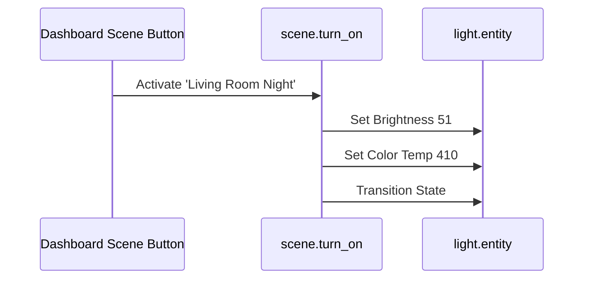

# Package: Scenes

## Executive Summary
This package defines a comprehensive list of lighting scenes for various rooms (Living Room, Bedroom, etc.) and moods (Bright, Dim, Night, Colored). Each scene captures the state, brightness, and color configuration of specific light entities.

## Architecture


## Backend Configuration
*(Snippet)*
```yaml
scene:
  - id: '1606678620167'
    name: Floor Light Daylight
    entities:
      light.floor_light:
        state: 'on'
        brightness: 255
        color_mode: color_temp
        color_temp: 153
        # ...
```

## Frontend Connection
**Key Entities**:
- `scene.floor_light_daylight` (derived from name)
- `scene.living_room_ceiling_night`

**Dashboard Usage**:
Scenes are typically activated via `button` cards or `chips` in the dashboard. While specific scene entities weren't explicitly matched in the grep (as they are often dynamically called or named differently in IDs), standard structure implies usage in room cards.

### UI Simulation
<div style="border: 1px solid #444; border-radius: 12px; padding: 16px; width: 300px; background: #222; color: white; font-family: sans-serif;">
  <div style="font-weight: bold; margin-bottom: 12px;">Living Room Scenes</div>
  <div style="display: grid; grid-template-columns: 1fr 1fr; gap: 8px;">
    <button style="padding: 12px; background: #f1c40f; color: #222; border: none; border-radius: 8px; font-weight: bold;">Bright</button>
    <button style="padding: 12px; background: #34495e; color: white; border: none; border-radius: 8px;">Dim</button>
    <button style="padding: 12px; background: #e67e22; color: white; border: none; border-radius: 8px;">Night</button>
    <button style="padding: 12px; background: #9b59b6; color: white; border: none; border-radius: 8px;">Movie</button>
  </div>
</div>
