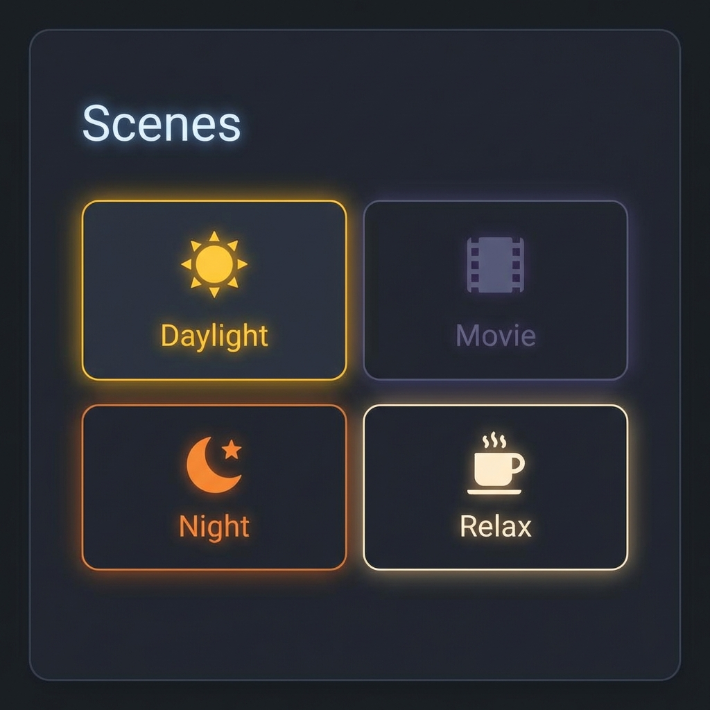

---
tags:
  - package
  - automated
version: 1.0.0
---

# Package: Scenes

**Version:** 1.0.0  
**Description:** Definitions for various lighting scenes (Daylight, Night, Movie, etc.)

<!-- START_IMAGE -->

<!-- END_IMAGE -->

## Executive Summary
<!-- START_SUMMARY -->
> ⚠️ **Update Required:** Analysis for v0.0.0. Code is v1.0.0.

*No executive summary generated yet.*
<!-- END_SUMMARY -->

## Process Description (Non-Technical)
<!-- START_DETAILED -->
> ⚠️ **Update Required:** Analysis for v0.0.0. Code is v1.0.0.

*No detailed non-technical description generated yet.*
<!-- END_DETAILED -->

## Dashboard Connections
<!-- START_DASHBOARD -->
This package powers the following dashboard views:

* **[Bedroom](../dashboards/main/bedroom.md)** (Uses 2 entities)
* **[Hallway](../dashboards/main/hallway.md)** (Uses 1 entities)
* **[Kitchen](../dashboards/main/kitchen.md)** (Uses 1 entities)
* **[Living Room](../dashboards/main/living_room.md)** (Uses 2 entities)
* **[Office](../dashboards/main/office.md)** (Uses 3 entities)
* **[Stairs](../dashboards/main/stairs.md)** (Uses 1 entities)
<!-- END_DASHBOARD -->

## Architecture Diagram
<!-- START_MERMAID_DESC -->
> ⚠️ **Update Required:** Analysis for v0.0.0. Code is v1.0.0.

*No architecture explanation generated yet.*
<!-- END_MERMAID_DESC -->

<!-- START_MERMAID -->
> ⚠️ **Update Required:** Analysis for v0.0.0. Code is v1.0.0.

*No architecture diagram generated yet.*
<!-- END_MERMAID -->

## Configuration (Source Code)
```yaml
# ------------------------------------------------------------------------------
# Package: Scenes
# Version: 1.0.0
# Description: Definitions for various lighting scenes (Daylight, Night, Movie, etc.)
# Dependencies: light.* entities
# ------------------------------------------------------------------------------
scene:
  - id: "1581424717324"
    name: Daylight Scene
    entities:
      light.ikea_hallway_1:
        state: "off"
      light.ikea_hallway_2:
        state: "off"
      light.kitchen_ikea_1:
        state: "on"
        brightness: 254
        color_temp: 250
      light.kitchen_ikea_2:
        state: "on"
        brightness: 254
        color_temp: 250
      light.kitchen_ikea_3:
        state: "on"
        brightness: 254
        color_temp: 250
      light.kitchen_sink:
        state: "on"
        brightness: 254
        color_temp: 153
        effect: none
      light.livingroom_light:
        state: "on"
        brightness: 254
        color_temp: 153
        effect: none
      light.stairs_light:
        state: "on"
        brightness: 254
        color_temp: 153
        effect: none

  - id: "1581434276374"
    name: Early Morning Scene
    icon: mdi:weather-sunset-up
    entities:
      light.kitchen_sink:
        state: "on"
        brightness: 128
        color_temp: 153
        effect: none
      light.livingroom_light:
        state: "on"
        brightness: 64
        color_temp: 153
        effect: none

  - id: "1581486599024"
    name: TV Scene
    entities:
      light.ikea_hallway_1:
        state: "off"
      light.ikea_hallway_2:
        state: "off"
      light.livingroom_light:
        state: "on"
        brightness: 46
        color_temp: 333
        effect: none
      light.stairs_light:
        state: "on"
        brightness: 51
        color_temp: 333
        effect: none

  - id: "1581525515761"
    name: Bedroom Mood
    entities:
      light.bedroom_bed_light:
        state: "on"
        brightness: 255
        color_mode: xy
        hs_color: [300.414, 56.863]
        rgb_color: [255, 110, 254]
        xy_color: [0.373, 0.19]
      light.bedroom_ceiling_light:
        state: "off"
    metadata:
      light.bedroom_bed_light:
        entity_only: true
      light.bedroom_ceiling_light:
        entity_only: true

  - id: "1581525625146"
    name: Bedroom Relax
    entities:
      light.bedroom_bed_light:
        state: "on"
        brightness: 255
        color_mode: xy
        hs_color: [30.207, 56.863]
        rgb_color: [255, 183, 110]
        xy_color: [0.491, 0.39]
      light.bedroom_ceiling_light:
        state: "off"
    metadata:
      light.bedroom_bed_light:
        entity_only: true
      light.bedroom_ceiling_light:
        entity_only: true

  - id: "1606678546699"
    name: Floor Light Bright
    entities:
      light.floor_light:
        state: "on"
        brightness: 255
        color_mode: color_temp
        color_temp: 250
        hs_color: [26.812, 34.87]
        rgb_color: [255, 205, 166]
        xy_color: [0.421, 0.364]
    metadata: {}

  - id: "1606678620167"
    name: Floor Light Daylight
    entities:
      light.floor_light:
        state: "on"
        brightness: 255
        color_mode: color_temp
        color_temp: 153
        hs_color: [54.768, 1.6]
        rgb_color: [255, 254, 250]
        xy_color: [0.326, 0.333]

  - id: "1607802679221"
    name: Bedroom Bed Bright
    entities:
      light.bedroom_bed_light:
        state: "on"
        brightness: 255
        color_mode: color_temp
        color_temp: 153
        hs_color: [54.768, 1.6]
        rgb_color: [255, 254, 250]
        xy_color: [0.326, 0.333]
      light.bedroom_ceiling_light:
        state: "off"
    metadata:
      light.bedroom_bed_light:
        entity_only: true
      light.bedroom_ceiling_light:
        entity_only: true

  - id: "1664968673604"
    name: Floor Light Blue
    entities:
      light.floor_light:
        state: "on"
        brightness: 255
        color_mode: xy
        hs_color: [210.364, 96.863]
        rgb_color: [8, 130, 255]
        xy_color: [0.141, 0.137]

  - id: "1664974178898"
    name: Floor Light Night
    entities:
      light.floor_light:
        state: "on"
        brightness: 76
        color_mode: color_temp
        color_temp: 400
        hs_color: [28.874, 72.522]
        rgb_color: [255, 159, 70]
        xy_color: [0.546, 0.389]

  - id: "1664974204685"
    name: Floor Light Pink
    entities:
      light.floor_light:
        state: "on"
        brightness: 255
        color_mode: xy
        hs_color: [299.754, 95.686]
        rgb_color: [254, 11, 255]
        xy_color: [0.385, 0.155]

  - id: "1664974379307"
    name: Living Room Ceiling Bright
    entities:
      light.living_room_ceiling_light:
        state: "on"
        brightness: 255
        color_mode: color_temp
        color_temp: 210
        hs_color: [26.815, 22.59]
        rgb_color: [255, 223, 197]
        xy_color: [0.382, 0.353]
    metadata:
      light.living_room_ceiling_light:
        entity_only: true

  - id: "1664974407957"
    name: Living Room Ceiling Daylight
    entities:
      light.living_room_ceiling_light:
        state: "on"
        brightness: 255
        color_mode: color_temp
        color_temp: 153
        hs_color: [54.768, 1.6]
        rgb_color: [255, 254, 250]
        xy_color: [0.326, 0.333]
    metadata:
      light.living_room_ceiling_light:
        entity_only: true

  - id: "1664974436190"
    name: Living Room Ceiling Night
    entities:
      light.living_room_ceiling_light:
        state: "on"
        brightness: 51
        color_mode: color_temp
        color_temp: 410
        hs_color: [29.04, 74.777]
        rgb_color: [255, 156, 64]
        xy_color: [0.554, 0.389]
    metadata:
      light.living_room_ceiling_light:
        entity_only: true

  - id: "1664974470333"
    name: Living Room Ceiling Dim
    entities:
      light.living_room_ceiling_light:
        state: "on"
        brightness: 64
        color_mode: color_temp
        color_temp: 210
        hs_color: [26.815, 22.59]
        rgb_color: [255, 223, 197]
        xy_color: [0.382, 0.353]
    metadata:
      light.living_room_ceiling_light:
        entity_only: true

  - id: "1664974508232"
    name: Living Room Ceiling Mood
    entities:
      light.living_room_ceiling_light:
        state: "on"
        brightness: 255
        color_mode: xy
        hs_color: [300.331, 70.98]
        rgb_color: [255, 74, 254]
        xy_color: [0.38, 0.17]
    metadata:
      light.living_room_ceiling_light:
        entity_only: true

  - id: "1665121007096"
    name: Daughter Bed Dim
    entities:
      light.Daughter_bed_light:
        state: "on"
        brightness: 127
        color_mode: color_temp
        color_temp: 200
        hs_color: [27.001, 19.243]
        rgb_color: [255, 228, 205]
        xy_color: [0.372, 0.35]

  - id: "1665121039862"
    name: Daughter Bed Daylight
    entities:
      light.Daughter_bed_light:
        state: "on"
        brightness: 255
        color_mode: color_temp
        color_temp: 153
        hs_color: [54.768, 1.6]
        rgb_color: [255, 254, 250]
        xy_color: [0.326, 0.333]

  - id: "1665121075215"
    name: Daughter Bed Pink
    entities:
      light.Daughter_bed_light:
        state: "on"
        brightness: 255
        color_mode: xy
        hs_color: [300.331, 70.98]
        rgb_color: [255, 74, 254]
        xy_color: [0.38, 0.17]

  - id: "1665121117806"
    name: Daughter Bed Relax
    entities:
      light.Daughter_bed_light:
        state: "on"
        brightness: 51
        color_mode: xy
        hs_color: [30, 43.137]
        rgb_color: [255, 200, 145]
        xy_color: [0.443, 0.379]

  - id: "1665121500547"
    name: Bedroom Bright
    entities:
      light.bedroom_ceiling_light:
        state: "on"
        brightness: 255
        color_mode: color_temp
      light.bedroom_bed_light:
        state: "on"
        brightness: 255
        color_mode: color_temp
        color_temp: 200
        hs_color: [27.001, 19.243]
        rgb_color: [255, 228, 205]
        xy_color: [0.372, 0.35]

  - id: "1666102359369"
    name: Guest-2 Dim
    entities:
      light.Guest-2_ceiling_light:
        state: "on"
        brightness: 64
        color_mode: color_temp
        color_temp: 250
        hs_color: [26.812, 34.87]
        rgb_color: [255, 205, 166]
        xy_color: [0.421, 0.364]
    metadata:
      light.Guest-2_ceiling_light:
        entity_only: true

  - id: "1666102385906"
    name: Guest-2 Bright
    entities:
      light.Guest-2_ceiling_light:
        state: "on"
        brightness: 255
        color_mode: color_temp
        color_temp: 250
        hs_color: [26.812, 34.87]
        rgb_color: [255, 205, 166]
        xy_color: [0.421, 0.364]
    metadata:
      light.Guest-2_ceiling_light:
        entity_only: true

  - id: "1666102425014"
    name: Guest-2 Night
    entities:
      light.Guest-2_ceiling_light:
        state: "on"
        brightness: 13
        color_mode: color_temp
        color_temp: 454
        hs_color: [29.79, 84.553]
        rgb_color: [255, 146, 39]
        xy_color: [0.579, 0.388]
    metadata:
      light.Guest-2_ceiling_light:
        entity_only: true

```
