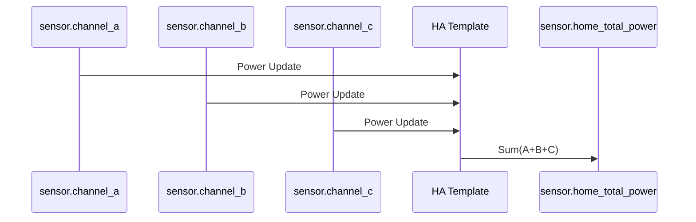

# Package: Shelly 3EM

## Executive Summary
This package aggregates data from the Shelly 3EM energy meter phases. It calculates the **Total Home Power** (W) and **Total Energy** (kWh) by summing the three individual phases. It also provides a 15-minute energy calculation, likely used for the electricity cost analysis in the Nordpool package.

## Architecture


## Backend Configuration
```yaml
template:
  - sensor:
      - name: "Home Total Power"
        unique_id: home_total_power
        unit_of_measurement: "W"
        device_class: power
        state_class: measurement
        state: >
          {{ states('sensor.home_energy_shelly_3em_channel_a_power') | float(0)
            + states('sensor.home_energy_shelly_3em_channel_b_power') | float(0)
            + states('sensor.home_energy_shelly_3em_channel_c_power') | float(0) }}

      - name: "Home Total 3EM Energy"
        unique_id: home_total_3em_energy
        unit_of_measurement: "kWh"
        device_class: energy
        state_class: total_increasing
        state: >
          {{ states('sensor.home_energy_shelly_3em_channel_a_energy') | float(0)
            + states('sensor.home_energy_shelly_3em_channel_b_energy') | float(0)
            + states('sensor.home_energy_shelly_3em_channel_c_energy') | float(0) }}
```

## Frontend Connection
**Key Entities**:
- `sensor.home_total_power`
- `sensor.home_total_3em_energy`

**Dashboard Usage**:
These sensors are foundational for the Energy Dashboard and custom power graphs seen in `dashboard_demo` (alongside Nordpool data).

### UI Simulation
<div style="border: 1px solid #444; border-radius: 50%; width: 150px; height: 150px; background: #222; color: white; font-family: sans-serif; display: flex; flex-direction: column; align-items: center; justify-content: center; margin: 0 auto; border: 4px solid #4caf50;">
  <div style="font-size: 0.8em; color: #aaa;">Current Power</div>
  <div style="font-size: 1.8em; font-weight: bold;">2.4 kW</div>
  <div style="font-size: 0.8em; color: #aaa; margin-top: 4px;">12.5 kWh Today</div>
</div>
