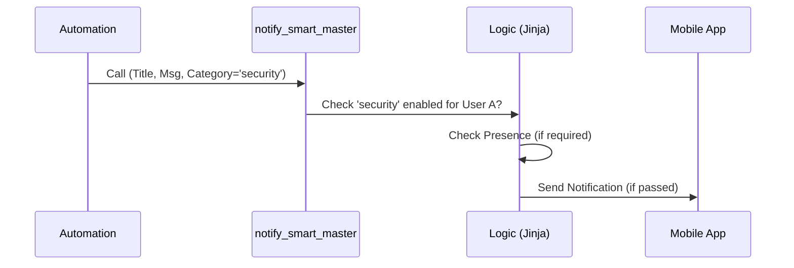

# Package: Smart Notifications

## Executive Summary
This is a complex "Master Router" for notifications. It decouples the "Trigger" (something happened) from the "Destination" (my phone, your phone). It allows users to manage their own notification subscriptions via the UI (toggle categories on/off) and selects the appropriate device service. It uses MQTT for state persistence of these preferences.

## Architecture


## Backend Configuration
*(Snippet)*
```yaml
script:
  notify_smart_master:
    alias: "Notify: Master Router"
    fields:
      category: { description: "Notification Category" }
      # ...
    sequence:
      - repeat:
          for_each: >-
            {{ states.switch 
               | selectattr('entity_id', 'search', '.' ~ category ~ '_notification_')
               | selectattr('state', 'eq', 'on')
               | map(attribute='entity_id')
               | list }}
          sequence:
             # Logic to send notification to each subscribed user
```

## Frontend Connection
**Key Entities**:
- `script.notify_smart_master`
- `input_select.notify_mgmt_person_select`

**Dashboard Usage**:
Implied usage in a **Notification Center** view (`lovelace.notification_center`). The system automatically populates input selects for Users and Services, allowing a management UI to be built (likely using the `auto-entities` card or similar dynamic lists).

### UI Simulation
<div style="border: 1px solid #444; border-radius: 12px; padding: 16px; width: 300px; background: #222; color: white; font-family: sans-serif;">
  <h3>🔔 Notification Settings</h3>
  <div style="margin-top: 12px;">
    <div style="display: flex; justify-content: space-between; align-items: center; padding: 8px 0; border-bottom: 1px solid #333;">
      <span>Security Alerts</span>
      <div style="width: 34px; height: 20px; background: #4caf50; border-radius: 10px; position: relative;"><div style="width: 16px; height: 16px; background: white; border-radius: 50%; position: absolute; right: 2px; top: 2px;"></div></div>
    </div>
    <div style="display: flex; justify-content: space-between; align-items: center; padding: 8px 0; border-bottom: 1px solid #333;">
      <span>Laundry</span>
      <div style="width: 34px; height: 20px; background: #7f8c8d; border-radius: 10px; position: relative;"><div style="width: 16px; height: 16px; background: white; border-radius: 50%; position: absolute; left: 2px; top: 2px;"></div></div>
    </div>
    <div style="display: flex; justify-content: space-between; align-items: center; padding: 8px 0;">
      <span>System Info</span>
      <div style="width: 34px; height: 20px; background: #4caf50; border-radius: 10px; position: relative;"><div style="width: 16px; height: 16px; background: white; border-radius: 50%; position: absolute; right: 2px; top: 2px;"></div></div>
    </div>
  </div>
</div>
