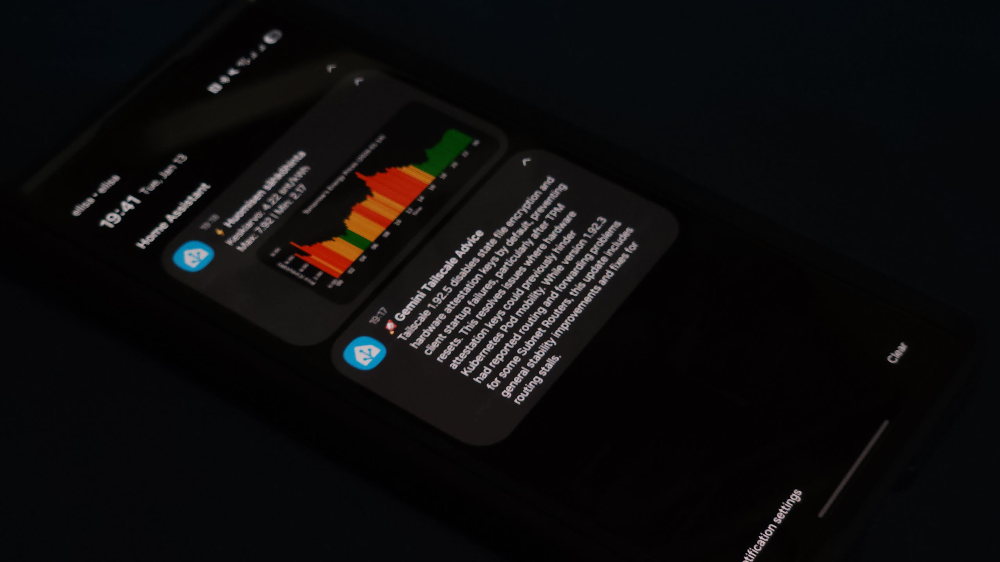
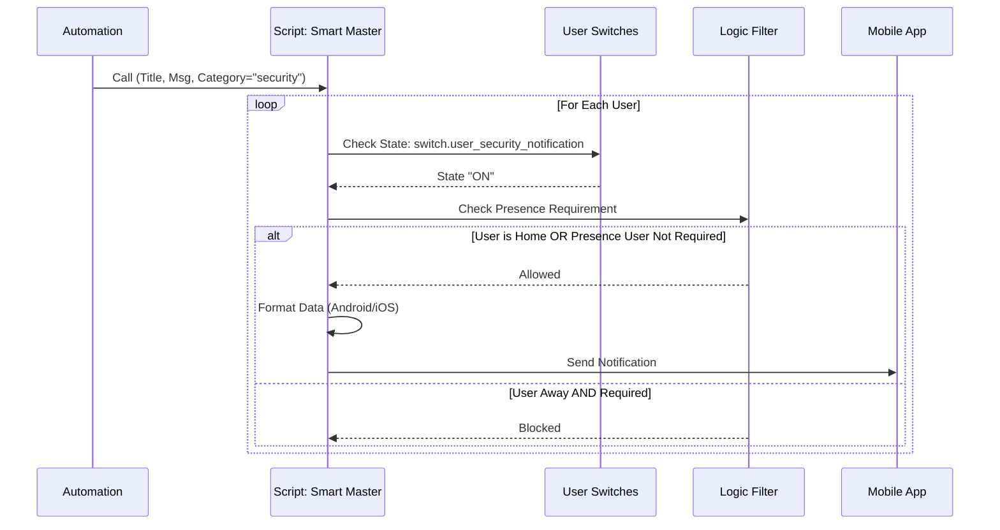

---
tags:
  - package
  - automated
version: 1.0.0
---

# Package: Smart Notifications

**Version:** 1.0.0  
**Description:** Helpers and logic for the dynamic notification router

<!-- START_IMAGE -->

<!-- END_IMAGE -->

## Executive Summary
<!-- START_SUMMARY -->
The **Smart Notifications** package is a dynamic, user-centric routing engine for Home Assistant. Unlike static notification groups, this system allows users to manage their own subscriptions to different notification categories (e.g., Security, System, Info) directly from the dashboard. It abstracts the complexity of device management, automatically handling device services (Android/iOS) and presence detection, ensuring alerts are delivered only when relevant and desired.
<!-- END_SUMMARY -->

## Process Description (Non-Technical)
<!-- START_DETAILED -->
The system operates on a "Publish-Subscribe" model adapted for a smart home:

1.  **User Onboarding**: An administrator selects a Home Assistant `person` entity and "initializes" them. The system automatically generates a suite of configuration "helpers" (switches) for every notification category defined in the system.
2.  **Preference Management**: Users interact with a dashboard calling these switches. If a user wants to mute "Security" alerts but keep "Energy" alerts, they simply toggle the respective switches.
3.  **Smart Routing**: When an automation needs to send a notification, it calls the `notify_smart_master` script with a `category` (e.g., `security`) and the message.
4.  **Delivery Logic**: The router iterates through all registered users. For each user, it checks:
    *   **Subscription**: Is the switch for this category ON?
    *   **Presence**: If the alert is "local only" or the user is away (and presence checks are enabled), the message is suppressed.
    *   **Platform**: It formats the message specifically for the user's defined device type (iOS vs Android), handling critical alerts and actionable notifications appropriate to the platform.
<!-- END_DETAILED -->

## Dashboard Connections
<!-- START_DASHBOARD -->
This package powers the following dashboard views:

* **[System](../dashboards/admin-system/system.md)**: *This view provides deep insights into the Proxmox 'Halo' virtualization node. It features real-time resource monitoring (CPU, RAM) using `mini-graph-card`, and critical power controls (Reboot, Shutdown) protected by confirmation dialogs. It also offers bulk management for guest VMs/containers and tracks system update status, ensuring the infrastructure host is healthy and up-to-date.* (Uses 1 entities)
* **[Room Management](../dashboards/area-automations/room_management.md)** (Uses 2 entities)
* **[Room Management](../dashboards/area-manager/room_management.md)** (Uses 2 entities)
* **[Living Room](../dashboards/main/living_room.md)**: *The Living Room dashboard is a media and comfort hub. It features in-depth environmental monitoring (Radon, VOCs, CO2) via Airthings Wave, displaying historical trends. Entertainment controls are central, with remotes for the TV and Soundbar, plus power management for the media wall. The view also includes specific controls for the fireplace, air purifier modes, and various lighting scenes, alongside standard occupancy settings.* (Uses 1 entities)
* **[Notifications Management](../dashboards/notification-center/notifications_management.md)**: *The Notification Center dashboard provides a comprehensive interface for managing the smart home's notification system. Administrators can add or remove users for mobile app notifications and define notification categories (e.g., 'Garage', 'Electricity'). The view allows for granular control over subscriptions, enabling individual users to opt-in or out of specific notification types, and includes tools to map and monitor notification-related automations.* (Uses 9 entities)
* **[Room Management](../dashboards/room-management/room_management.md)**: *The Room Management dashboard serves as the administrative backend for the home's room logic. It allows users to initialize new rooms (creating necessary helper entities) or delete existing ones. It features a dynamic "Configured Rooms" section powered by `auto-entities`, which automatically lists all configured rooms and provides collapsible controls for their automation modes, occupancy sensors, and timeouts.* (Uses 3 entities)
* **[Smart Speakers Manager](../dashboards/smart-speakers/smart_speakers_manager.md)** (Uses 2 entities)
<!-- END_DASHBOARD -->

## Architecture Diagram
<!-- START_MERMAID_DESC -->
When a notification request triggers the `notify_smart_master` router, the system begins a parallel evaluation for every registered user. It retrieves the user's specific settings—checking if they have subscribed to the message's `category`, verifying if a 'Presence Check' is required, and determining their current device platform (iOS or Android). Only if the subscription is active and the presence criteria are met does the router format the payload (adjusting for platform-specifics like critical volume or click actions) and dispatch it to the specific mobile app service.
<!-- END_MERMAID_DESC -->

<!-- START_MERMAID -->

<!-- END_MERMAID -->

## Configuration (Source Code)
```yaml
# ------------------------------------------------------------------------------
# Package: Smart Notification System
# Version: 1.0.0
# Description: Helpers and logic for the dynamic notification router
# Dependencies: notify.*, input_select.notify_mgmt_service, script.notify_smart_master
# ------------------------------------------------------------------------------

# ------------------------------------------------------------------------------
# 1. HELPERS (Input Text, Select)
# ------------------------------------------------------------------------------
input_text:
  # RETAINED: Only retained helpers for categories and deletion IDs
  ## MASTER LIST FOR THE CATEGORIES
  notify_mgmt_categories:
    name: "Categories (comma-separated)"
    initial: "info,system,security,alarm,doorbell"

  # TO BE REMOVED
  notify_delete_category:
    name: "Category to Delete"
    icon: mdi:archive-remove

  notify_add_category:
    name: "New Category Name"
    icon: mdi:playlist-plus

input_select:
  # Dropdown for selecting a category to delete
  notify_delete_category:
    name: "Category to Delete"
    icon: mdi:archive-remove
    options:
      - "-select-"

  # Dropdown populated with existing Home Assistant Persons
  notify_mgmt_person_select:
    name: "Select Person to Initialize"
    icon: mdi:account-circle
    options:
      - "-select-" # Placeholder before population

  # List of the Notify services for devices
  notify_mgmt_service:
    name: "Notify Service"
    icon: mdi:cellphone-message
    options:
      - "-select-"

  # Dropdown for mobile platform
  notify_mgmt_platform:
    name: "Platform"
    options:
      - android
      - ios
    icon: mdi:apple-ios

  # Dropdown for deleting users
  notify_mgmt_delete_user_select:
    name: "Select User to Delete"
    icon: mdi:account-remove
    options:
      - "-select-"

# ------------------------------------------------------------------------------
# 2. INPUT BOOLEANS (Flags & Maintenance)
# ------------------------------------------------------------------------------
input_boolean:

  # Global Category Settings (Generated dynamically, but good to have base logic ready)
  # Note: Individual category switches are MQTT switches now, not input_booleans.

  # Removed: notify_flag_person_list_refresh (Not used, we trigger automation directly)

# ... (Rest of the file remains the same)

# ------------------------------------------------------------------------------
# 3. SCRIPTS & AUTOMATIONS (Logic)
# ------------------------------------------------------------------------------
script:
  # --- CREATE USER (Pulls Name and ID from Person Entity) ---
  create_notify_user:
    alias: "System: Create Notification User"
    icon: mdi:account-plus
    mode: single
    sequence:
      - variables:
          # Get selected person name (e.g., "Evis")
          user_name: "{{ states('input_select.notify_mgmt_person_select') }}"
          # CRITICAL: Create slug (e.g., "Evis" -> "Evis")
          user_slug: "{{ user_name | slugify }}"
          # Ensure we link back to the native HA person entity
          person_entity: "person.{{ user_name | slugify }}"

          notify_service: "{{ states('input_select.notify_mgmt_service') }}"
          platform: "{{ states('input_select.notify_mgmt_platform') }}"
          categories: "{{ states('input_text.notify_mgmt_categories') }}"

      - repeat:
          for_each: "{{ categories.split(',') | map('trim') | list }}"
          sequence:
            # A. Create User Switch
            - service: mqtt.publish
              data:
                retain: true
                topic: "homeassistant/switch/notify_{{ user_slug }}_{{ repeat.item }}/config"
                payload: >-
                  {
                    "name": "{{ repeat.item|capitalize }} Notification",
                    "default_entity_id": "switch.{{ repeat.item }}_notification_{{ user_slug }}",
                    "unique_id": "notify_switch_{{ user_slug }}_{{ repeat.item }}",
                    "icon": "mdi:bell-ring",
                    "command_topic": "notify/{{ user_slug }}/{{ repeat.item }}/set",
                    "state_topic": "notify/{{ user_slug }}/{{ repeat.item }}/state",
                    "availability_topic": "notify/{{ user_slug }}/availability",
                    "payload_available": "online",
                    "json_attributes_topic": "notify/{{ user_slug }}/attributes",
                    "device": {
                      "identifiers": ["notify_user_{{ user_slug }}"],
                      "name": "{{ user_name }} |",
                      "manufacturer": "Home Assistant",
                      "model": "Notification Profile"
                    }
                  }
            - service: mqtt.publish
              data:
                retain: true
                topic: "notify/{{ user_slug }}/attributes"
                payload: >-
                  { "user_slug": "{{ user_slug }}", "linked_person": "{{ person_entity }}" }

            - if:
                - condition: template
                  value_template: >-
                    {{ states('switch.' ~ repeat.item ~ '_notification_' ~ user_slug) in ['unknown', 'unavailable', 'none'] }}
              then:
                - service: mqtt.publish
                  data:
                    retain: true
                    topic: "notify/{{ user_slug }}/{{ repeat.item }}/state"
                    payload: "ON"

            # B. Create GLOBAL CATEGORY SETTING Switch (Unchanged)
            - service: mqtt.publish
              data:
                retain: true
                topic: "homeassistant/switch/notify_category_{{ repeat.item }}_local/config"
                payload: >-
                  {
                    "name": "Notify {{ repeat.item|capitalize }}: When Home",
                    "name": "Notify {{ repeat.item|capitalize }}: When Home",
                    "unique_id": "notify_category_{{ repeat.item }}_local",
                    "icon": "mdi:home-account",
                    "command_topic": "notify/settings/{{ repeat.item }}/local_only/set",
                    "state_topic": "notify/settings/{{ repeat.item }}/local_only/state",
                    "device": {
                      "identifiers": ["notify_system_settings"],
                      "name": "Cat |",
                      "manufacturer": "Home Assistant",
                      "model": "Global Rules"
                    }
                  }

            - if:
                - condition: template
                  value_template: >-
                    {{ states('switch.notify_category_' ~ repeat.item ~ '_local') in ['unknown', 'unavailable', 'none'] }}
              then:
                - service: mqtt.publish
                  data:
                    retain: true
                    topic: "notify/settings/{{ repeat.item }}/local_only/state"
                    payload: "OFF"

      # C. Create Helpers
      - service: mqtt.publish
        data:
          retain: true
          topic: "homeassistant/text/notify_{{ user_slug }}_service/config"
          payload: >-
            {
              "name": "{{ user_name }} Notify Service",
              "name": "{{ user_name }} Notify Service",
              "unique_id": "notify_service_{{ user_slug }}",
              "icon": "mdi:cellphone",
              "command_topic": "notify/{{ user_slug }}/service/set",
              "state_topic": "notify/{{ user_slug }}/service/state",
              "availability_topic": "notify/{{ user_slug }}/availability",
              "device": { "identifiers": ["notify_user_{{ user_slug }}"] }
            }
      - service: mqtt.publish
        data:
          retain: true
          topic: "notify/{{ user_slug }}/service/state"
          payload: "{{ notify_service }}"

      - service: mqtt.publish
        data:
          retain: true
          topic: "homeassistant/select/notify_{{ user_slug }}_platform/config"
          payload: >-
            {
              "name": "{{ user_name }} Phone Platform",
              "name": "{{ user_name }} Phone Platform",
              "unique_id": "notify_platform_{{ user_slug }}",
              "icon": "mdi:apple-ios",
              "options": ["android", "ios"],
              "command_topic": "notify/{{ user_slug }}/platform/set",
              "state_topic": "notify/{{ user_slug }}/platform/state",
              "availability_topic": "notify/{{ user_slug }}/availability",
              "device": { "identifiers": ["notify_user_{{ user_slug }}"] }
            }
      - service: mqtt.publish
        data:
          retain: true
          topic: "notify/{{ user_slug }}/platform/state"
          payload: "{{ platform }}"

      - service: mqtt.publish
        data:
          retain: true
          topic: "notify/{{ user_slug }}/availability"
          payload: "online"

      # Refresh Lists
      - delay: "00:00:02"
      - service: automation.trigger
        target:
          entity_id: automation.system_populate_notify_services
        data:
          skip_condition: true

      # Reset Dropdowns
      - service: input_select.select_option
        target:
          entity_id:
            - input_select.notify_mgmt_person_select
            - input_select.notify_mgmt_service
        data:
          option: "-select-"

  # --- DELETE USER (Updated to use Dropdown) ---
  delete_notify_user:
    alias: "System: Delete Notification User"
    icon: mdi:account-remove
    mode: single
    sequence:
      - variables:
          # Get slug from dropdown
          user_slug: "{{ states('input_select.notify_mgmt_delete_user_select') }}"
          categories: "{{ states('input_text.notify_mgmt_categories') }}"

      - repeat:
          for_each: "{{ categories.split(',') | map('trim') | list }}"
          sequence:
            - service: mqtt.publish
              data:
                retain: true
                topic: "homeassistant/switch/notify_{{ user_slug }}_{{ repeat.item }}/config"
                payload: ""

      # Delete Helpers
      - service: mqtt.publish
        data:
          retain: true
          topic: "homeassistant/text/notify_{{ user_slug }}_service/config"
          payload: ""
      - service: mqtt.publish
        data:
          retain: true
          topic: "homeassistant/select/notify_{{ user_slug }}_platform/config"
          payload: ""

      # Set Offline
      - service: mqtt.publish
        data:
          retain: true
          topic: "notify/{{ user_slug }}/availability"
          payload: "offline"

      # Refresh Lists
      - delay: "00:00:02"
      - service: automation.trigger
        target:
          entity_id: automation.system_populate_notify_services
        data:
          skip_condition: true

      # Reset Dropdown
      - service: input_select.select_option
        target:
          entity_id: input_select.notify_mgmt_delete_user_select
        data:
          option: "-select-"

  # --- DELETE CATEGORY ---
  delete_notify_category_global:
    alias: "System: Delete Notification Category"
    icon: mdi:archive-remove
    mode: single
    sequence:
      - variables:
          # NOW USES THE INPUT SELECT
          category: "{{ states('input_select.notify_delete_category') | trim | lower }}"
          current_list: "{{ states('input_text.notify_mgmt_categories') }}"

      # Prevent deleting if 'select' is chosen or empty
      - condition: template
        value_template: "{{ category not in ['-select-', 'select', 'unknown', 'unavailable', ''] }}"

      # Remove from Master List (Text Input)
      - service: input_text.set_value
        target:
          entity_id: input_text.notify_mgmt_categories
        data:
          value: >-
            {{ current_list.split(',') 
               | map('trim') 
               | reject('eq', category) 
               | join(',') }}

      # Remove Global Switch Config
      - service: mqtt.publish
        data:
          retain: true
          topic: "homeassistant/switch/notify_category_{{ category }}_local/config"
          payload: ""

      # Remove User Switches for this category
      - repeat:
          for_each: >-
            {{ states.switch 
               | selectattr('entity_id', 'search', '^switch\.' ~ category ~ '_notification_')
               | map(attribute='attributes.user_slug') 
               | reject('undefined')
               | unique 
               | list }}
          sequence:
            - service: mqtt.publish
              data:
                retain: true
                topic: "homeassistant/switch/notify_{{ repeat.item }}_{{ category }}/config"
                payload: ""

      # Refresh Lists (updates dropdowns immediately)
      - delay: "00:00:01"
      - service: automation.trigger
        target:
          entity_id: automation.system_populate_notify_services
        data:
          skip_condition: true

      # Reset dropdown to safe default
      - service: input_select.select_option
        target:
          entity_id: input_select.notify_delete_category
        data:
          option: "-select-"

  # --- ADD NEW CATEGORY (Global + All Users) ---
  add_notify_category_global:
    alias: "System: Add Notification Category"
    icon: mdi:playlist-plus
    mode: single
    sequence:
      - variables:
          new_category: "{{ states('input_text.notify_add_category') | trim | lower }}"
          current_list: "{{ states('input_text.notify_mgmt_categories') }}"

      # 1. Update Master List (if not exists)
      - if:
          - condition: template
            value_template: "{{ new_category not in current_list.split(',') }}"
        then:
          - service: input_text.set_value
            target:
              entity_id: input_text.notify_mgmt_categories
            data:
              value: "{{ current_list ~ ',' ~ new_category if current_list|length > 0 else new_category }}"

      # 2. Create Global Setting Switch
      - service: mqtt.publish
        data:
          retain: true
          topic: "homeassistant/switch/notify_category_{{ new_category }}_local/config"
          payload: >-
            {
              "name": "Notify {{ new_category|capitalize }}: When Home",
              "default_entity_id": "switch.notify_category_{{ new_category }}_local",
              "unique_id": "notify_category_{{ new_category }}_local",
              "icon": "mdi:home-account",
              "command_topic": "notify/settings/{{ new_category }}/local_only/set",
              "state_topic": "notify/settings/{{ new_category }}/local_only/state",
              "device": {
                "identifiers": ["notify_system_settings"],
                "name": "Cat |",
                "manufacturer": "Home Assistant",
                "model": "Global Rules"
              }
            }
      # Init to OFF
      - service: mqtt.publish
        data:
          retain: true
          topic: "notify/settings/{{ new_category }}/local_only/state"
          payload: "OFF"

      # 3. Add Switch to ALL Existing Users
      - repeat:
          for_each: >-
            {{ states.text 
               | selectattr('entity_id', 'search', '^text\.notify_service_') 
               | map(attribute='object_id') 
               | map('replace', 'notify_service_', '') 
               | list }}
          sequence:
            - variables:
                user_slug: "{{ repeat.item }}"

            # Create the switch for this user
            - service: mqtt.publish
              data:
                retain: true
                topic: "homeassistant/switch/notify_{{ user_slug }}_{{ new_category }}/config"
                payload: >-
                  {
                    "name": "{{ new_category|capitalize }} Notification",
                    "object_id": "{{ new_category }}_notification_{{ user_slug }}",
                    "default_entity_id": "switch.{{ new_category }}_notification_{{ user_slug }}",
                    "unique_id": "notify_switch_{{ user_slug }}_{{ new_category }}",
                    "icon": "mdi:bell-ring",
                    "command_topic": "notify/{{ user_slug }}/{{ new_category }}/set",
                    "state_topic": "notify/{{ user_slug }}/{{ new_category }}/state",
                    "availability_topic": "notify/{{ user_slug }}/availability",
                    "payload_available": "online",
                    "json_attributes_topic": "notify/{{ user_slug }}/attributes",
                    "device": {
                      "identifiers": ["notify_user_{{ user_slug }}"],
                      "manufacturer": "Home Assistant",
                      "model": "Notification Profile"
                    }
                  }
            # Set State ON
            - service: mqtt.publish
              data:
                retain: true
                topic: "notify/{{ user_slug }}/{{ new_category }}/state"
                payload: "ON"

      # 4. Add Switch to ALL Smart Speakers
      - variables:
          all_speakers: >-
            {{ states.switch 
               | selectattr('attributes.speaker_slug', 'defined')
               | map(attribute='attributes.speaker_slug')
               | unique
               | list }}
      - repeat:
          for_each: "{{ all_speakers }}"
          sequence:
            - service: mqtt.publish
              data:
                retain: true
                topic: "homeassistant/switch/speaker_{{ repeat.item }}_notify_{{ new_category }}/config"
                payload: >-
                  {{
                    {
                      "name": new_category | title,
                      "default_entity_id": "switch.speaker_" ~ repeat.item ~ "_notify_" ~ new_category,
                      "unique_id": "speaker_notif_" ~ repeat.item ~ "_" ~ new_category ~ "_v4",
                      "icon": "mdi:bell-ring",
                      "command_topic": "speaker/" ~ repeat.item ~ "/notify_" ~ new_category ~ "/set",
                      "state_topic": "speaker/" ~ repeat.item ~ "/notify_" ~ new_category ~ "/state",
                      "payload_on": "ON",
                      "payload_off": "OFF",
                      "device": { "identifiers": ["smart_speaker_" ~ repeat.item] }
                    } | to_json
                  }}
            # Default to ON
            - service: mqtt.publish
              data:
                retain: true
                topic: "speaker/{{ repeat.item }}/notify_{{ new_category }}/state"
                payload: "ON"

      # Refresh Lists
      - delay: "00:00:01"
      - service: automation.trigger
        target:
          entity_id: automation.system_populate_notify_services
        data:
          skip_condition: true

  # --- MASTER ROUTER (Unchanged) ---
  notify_smart_master:
    alias: "Notify: Master Router"
    icon: mdi:message-badge-outline
    mode: parallel
    fields:
      category:
        description: "Notification Category"
        default: "info"
      title:
        description: "Title"
      message:
        description: "Body"
      image:
        description: "Image Path"
      tag:
        description: "Grouping tag"
      actions:
        description: "List of buttons"
      clickAction:
        description: "Link click"
      sticky:
        description: "Sticky"
      critical:
        description: "Critical alert"
      presence_only:
        description: "Override: Force check presence"
        default: null
      source_room:
        description: "Slug of the room where event originated (for suppression)"
        default: null
      room:
        description: "Override: Specific room to target (bypass occupancy)"
        default: null
    sequence:
      - variables:
          global_presence_setting: >-
            {{ states('switch.notify_category_' ~ category | default('info') ~ '_local') == 'on' }}
          use_presence_check: >-
            
            {{ pres if pres is not none else global_presence_setting }}
      - repeat:
          for_each: >-
            {{ states.switch 
               | selectattr('entity_id', 'search', '\.' ~ category | default('info') ~ '_notification_')
               | selectattr('state', 'eq', 'on')
               | map(attribute='entity_id')
               | list }}
          sequence:
            - variables:
                match_id: "{{ repeat.item }}"
                # Fallback: Extract from Entity ID
                slug_from_id: >-
                  {{ repeat.item 
                     | replace('switch.', '') 
                     | replace(category | default('info') ~ '_notify_', '') 
                     | replace('_notification', '') }}
                user_slug: "{{ state_attr(repeat.item, 'user_slug') | default(slug_from_id, true) }}"
                # Fetch Service
                target_service: "{{ states('text.notify_service_' ~ user_slug) }}"
                # Fetch Linked Person for Presence Check
                linked_person: "{{ state_attr(repeat.item, 'linked_person') }}"

            - service: system_log.write
              data:
                message: "DEBUG MOBILE {{ user_slug }} | Service: {{ target_service }} | Match: {{ match_id }}"
                level: warning
            - if:
                - condition: template
                  value_template: >-
                    {{ 
                      target_service is not none and target_service not in ['unknown', 'unavailable', '']
                      and (
                        use_presence_check == false 
                        or (linked_person is not none and is_state(linked_person, 'home'))
                      )
                    }}
              then:
                - service: "{{ target_service }}"
                  data:
                    title: "{{ title | default('Notification') }}"
                    message: "{{ message }}"
                    data:
                      tag: "{{ tag | default('') }}"
                      image: "{{ image | default('') }}"
                      sticky: "{{ sticky | default(false) }}"
                      push:
                        sound:
                          name: "default"
                          critical: "{{ 1 if critical | default(false) else 0 }}"
                          volume: "{{ 1.0 if critical | default(false) else 0.5 }}"
                      ttl: "{{ 0 if critical | default(false) else 0 }}"
                      priority: "{{ 'high' if critical | default(false) else 'normal' }}"
                      clickAction: >-
                        
                        
                          unifi-protect://
                        
                          {{ clk }}
                        
                      actions: "{{ actions | default([]) }}"

      # --- 2. SMART SPEAKER ROUTING ---
      - variables:
          # Define Priority based on Critical flag or Category
          # Categories 'alarm', 'security', 'doorbell', 'smoke' are inherently Critical
          is_critical: >-
            {{ critical | default(false) or category in ['alarm', 'security', 'doorbell', 'smoke'] }}

      - repeat:
          # Find all speakers subscribed to this category
          for_each: >-
            {{ states.switch 
               | selectattr('entity_id', 'search', '^switch\.speaker_.*_notify_' ~ category | default('info'))
               | selectattr('state', 'eq', 'on')
               | map(attribute='entity_id')
               | list }}
          sequence:
            - variables:
                # Extract Slug: switch.speaker_{slug}_notify_{category}
                config_entity: "{{ repeat.item }}"
                # Regex to pull slug
                speaker_slug: >-
                  {{ config_entity 
                     | replace('switch.speaker_', '') 
                     | replace('_notify_' ~ category | default('info'), '') }}

                # Get Config Entity (now attached to Quiet Mode Switch)
                speaker_config_entity: "switch.speaker_{{ speaker_slug }}_quiet_mode"

                # Attributes are on the switch now
                # Attributes are on the switch now
                media_player: "{{ state_attr(speaker_config_entity, 'entity_id') }}"
                # Get Linked Areas
                linked_areas: "{{ state_attr(media_player, 'linked_areas') | default([]) }}"

                # Status Tests
                dnd_switch: "{{ speaker_config_entity | default('') }}"
                # Check if Quiet Mode is ON
                is_dnd_active: "{{ is_state(dnd_switch, 'on') }}"

                # Room State Checks (Sleep/DND)
                # We check if ANY linked room is in a restrictive state
                is_room_quiet: >-
                  
                  
                    
                    
                      
                    
                  
                  {{ ns.quiet }}

                # Occupancy Check
                is_occupied: >-
                  
                  
                  
                    {# Debug Sensor Logic #}
                    
                    
                    
                    
                    
                    {# Logic #}
                    
                      
                    
                  
                  {{ ns.occupied }}

                # Extended Debug Info
                debug_occ_trace: >-
                  
                  
                  
                     
                     
                     
                  
                  {{ ns.log | join(', ') }}

                # Source Suppression Check
                # If source_room is provided, and matches a linked room, and I am in that room?
                # Design: "If source_room is Occupied, start simple: If source matches linked room, suppress"
                # Actually User said: "coffee ready... you in kitchen... silence"
                # So: If source_room is in linked_rooms AND binary_sensor.room_{source_room}_occupancy is ON -> Suppress
                is_at_source: >-
                  
                    true
                  
                    false
                  

                # Targeted Override: If 'room' var is passed, force speak in that room (bypass occupancy)
                # Targeted Override: Check if my linked rooms match the requested targets
                is_targeted: >-
                  
                     
                     
                     
                       
                         
                       
                     
                     {{ ns.match }}
                  
                     false
                  

            - service: system_log.write
              data:
                message: >-
                  DEBUG SPEAKER {{ speaker_slug }} | 
                  Media: {{ media_player }} | 
                  Targeted: {{ is_targeted }} | 
                  Room: {{ room }} |
                  Linked: {{ linked_rooms }} |
                  Occ: {{ is_occupied }} | 
                  DND: {{ is_dnd_active }} | 
                  Quiet: {{ is_room_quiet }}
                level: warning

            # LOGIC GATE
            - if:
                - condition: template
                  value_template: >-
                    
                    

                    {# Logic Gate: Exclusive Targeting vs Occupancy #}
                    

                    
                       {# If targeting is active, ONLY allow targeted speakers #}
                       
                    
                       {# Standard Mode: Play if Critical OR Occupied #}
                       
                    

                    
                    {{ allow_priority and allow_occupancy and allow_source }}
              then:
                - service: system_log.write
                  data:
                    message: "DEBUG: Speaking to {{ media_player }} (Method: Cloud Say). Msg: {{ message }}"
                    level: warning
                - service: tts.cloud_say
                  target:
                    entity_id: "{{ media_player }}"
                  data:
                    message: "{{ message }}"
                    # Optionally add chimes for critical?
                    options:
                      voice: "Katherine" # Customize as needed

  # --- DEBUG DIAGNOSTICS ---
  debug_notify_diagnostics:
    alias: "System: Debug Notification Targets"
    icon: mdi:bug
    fields:
      category:
        description: "Category to test"
        default: "info"
    sequence:
      - variables:
          cat: "{{ category | default('info') }}"
          # 1. Dump ALL Switches that look related
          all_switches: >-
            {{ states.switch | map(attribute='entity_id') | select('search', 'notify|speaker') | list }}

          # 2. Test Mobile Regex
          mobile_regex: "_{{ cat }}_notification"
          mobile_matches: >-
            {{ states.switch 
               | selectattr('entity_id', 'search', mobile_regex)
               | map(attribute='entity_id') | list }}

          # 3. Test Speaker Regex
          speaker_regex: "^switch\\.speaker_.*_notify_{{ cat }}"
          speaker_matches: >-
            {{ states.switch 
               | selectattr('entity_id', 'search', speaker_regex)
               | map(attribute='entity_id') | list }}

      - service: system_log.write
        data:
          level: warning
          message: >-
            DEBUG DIAGNOSTICS (Category: {{ cat }})
            --------------------------------------------------
            Regex Mobile: '{{ mobile_regex }}' -> Found: {{ mobile_matches }}
            Regex Speaker: '{{ speaker_regex }}' -> Found: {{ speaker_matches }}
            --------------------------------------------------
            ALL CANDIDATES: {{ all_switches }}

      - service: system_log.write
        data:
          level: warning
          message: >-
            DEBUG DIAGNOSTICS (Category: {{ cat }})
            --------------------------------------------------
            Regex Mobile: '{{ mobile_regex }}' -> Found: {{ mobile_matches }}
            Regex Speaker: '{{ speaker_regex }}' -> Found: {{ speaker_matches }}
            --------------------------------------------------
            ALL CANDIDATES: {{ all_switches }}

  # --- PURGE GHOSTS ---
  purge_notification_ghosts:
    alias: "System: Purge Legacy Notification Ghosts"
    icon: mdi:ghost-off
    mode: single
    sequence:
      - variables:
          categories: "{{ states('input_text.notify_mgmt_categories').split(',') | map('trim') | list + ['action', 'doorbell', 'doorbell2', 'network'] }}"
          users: >-
            {{ states.text 
               | selectattr('entity_id', 'search', '^text\.notify_service_') 
               | map(attribute='object_id') 
               | map('replace', 'notify_service_', '') 
               | list }}

      - repeat:
          for_each: "{{ users }}"
          sequence:
            - variables:
                user: "{{ repeat.item }}"
            - repeat:
                for_each: "{{ categories }}"
                sequence:
                  - variables:
                      cat: "{{ repeat.item }}"

                  # PATTERN 1: switch.Evis_garden_notification
                  # Topic: homeassistant/switch/Evis_garden_notification/config (Guess)
                  - service: mqtt.publish
                    data:
                      retain: true
                      topic: "homeassistant/switch/{{ user }}_{{ cat }}_notification/config"
                      payload: ""

                  # PATTERN 2: switch.Evis_garden_notify
                  - service: mqtt.publish
                    data:
                      retain: true
                      topic: "homeassistant/switch/{{ user }}_{{ cat }}_notify/config"
                      payload: ""

                  # PATTERN 3: switch.notify_garden_Evis (Old Flipped)
                  - service: mqtt.publish
                    data:
                      retain: true
                      topic: "homeassistant/switch/notify_{{ cat }}_{{ user }}/config"
                      payload: ""

                  # PATTERN 4: switch.notify_Evis_garden (Legacy Loop)
                  - service: mqtt.publish
                    data:
                      retain: true
                      topic: "homeassistant/switch/notify_{{ user }}_{{ cat }}/config"
                      # Wait! Pattern 4 IS THE CURRENT CORRECT TOPIC.
                      # DO NOT DELETE THIS unless object_id matches bad pattern?
                      # We cannot target object_id here, only topic.
                      # IF the ghost shares the topic with the new entity, deleting it kills the new entity too.
                      # BUT create_notify_user will restore it.
                      # Safer to NOT touch Pattern 4.
                      payload: "" # SKIP THIS ONE

automation:
  - alias: "System: Populate Notify Services"
    id: populate_notify_services_auto
    trigger:
      - platform: homeassistant
        event: start
      - platform: time_pattern
        hours: "/1"
    action:
      # Use this to populate the new person selector list
      - service: input_select.set_options
        target:
          entity_id: input_select.notify_mgmt_person_select
        data:
          options: >
            
            {{ ['-select-'] + person_names + ['Guest'] }} # Always include 'Guest' option

      - service: input_select.set_options
        target:
          entity_id: input_select.notify_mgmt_service
        data:
          options: >
            
            
            
              
              
              
                
                
              
            
            {{ (['-select-'] + ns.services + ['notify.mobile_app_unknown']) | unique | sort }}

      # 3. Populate Delete User list
      # Scans for existing 'text.notify_service_*' entities to find valid user slugs
      - service: input_select.set_options
        target:
          entity_id: input_select.notify_mgmt_delete_user_select
        data:
          options: >
            
            
            
               
               
            
            {{ (['-select-'] + ns.users + ['unknown']) | unique | sort }}

      # 4. Populate Delete Category List (NEW)
      - service: input_select.set_options
        target:
          entity_id: input_select.notify_delete_category
        data:
          options: >
            
            {{ ['-select-'] + cats }}

  - alias: "System: MQTT State Persistence"
    id: system_mqtt_state_persistence
    mode: parallel
    trigger:
      - platform: mqtt
        topic: "notify/#"
    condition:
      - condition: template
        value_template: "{{ trigger.topic.endswith('/set') }}"
    action:
      - service: mqtt.publish
        data:
          topic: "{{ trigger.topic[:-4] }}/state"
          payload: "{{ trigger.payload }}"
          retain: true

```
