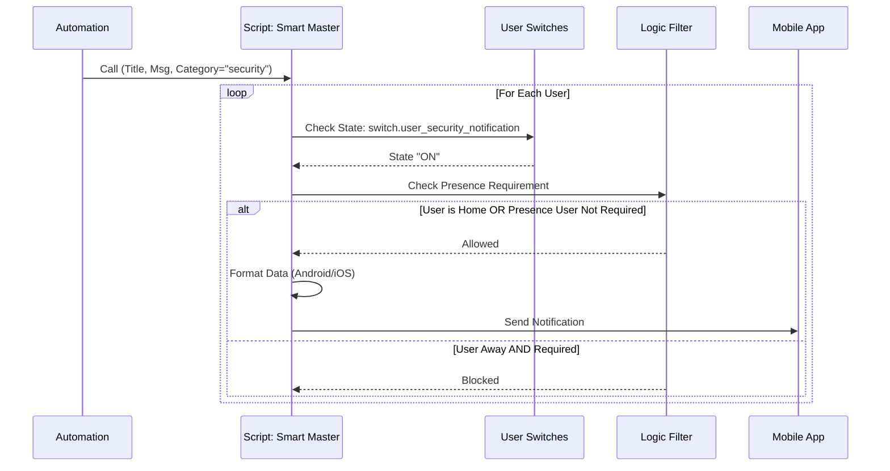

---
tags:
  - package
  - automated
version: 1.0.0
---

# Package: Smart Notifications

**Version:** 1.0.0  
**Description:** Helpers and logic for the dynamic notification router

<!-- START_IMAGE -->

<!-- END_IMAGE -->

## Executive Summary
<!-- START_SUMMARY -->
The **Smart Notifications** package is a dynamic, user-centric routing engine for Home Assistant. Unlike static notification groups, this system allows users to manage their own subscriptions to different notification categories (e.g., Security, System, Info) directly from the dashboard. It abstracts the complexity of device management, automatically handling device services (Android/iOS) and presence detection, ensuring alerts are delivered only when relevant and desired.
<!-- END_SUMMARY -->

## Process Description (Non-Technical)
<!-- START_DETAILED -->
The system operates on a "Publish-Subscribe" model adapted for a smart home:

1.  **User Onboarding**: An administrator selects a Home Assistant `person` entity and "initializes" them. The system automatically generates a suite of configuration "helpers" (switches) for every notification category defined in the system.
2.  **Preference Management**: Users interact with a dashboard calling these switches. If a user wants to mute "Security" alerts but keep "Energy" alerts, they simply toggle the respective switches.
3.  **Smart Routing**: When an automation needs to send a notification, it calls the `notify_smart_master` script with a `category` (e.g., `security`) and the message.
4.  **Delivery Logic**: The router iterates through all registered users. For each user, it checks:
    *   **Subscription**: Is the switch for this category ON?
    *   **Presence**: If the alert is "local only" or the user is away (and presence checks are enabled), the message is suppressed.
    *   **Platform**: It formats the message specifically for the user's defined device type (iOS vs Android), handling critical alerts and actionable notifications appropriate to the platform.
<!-- END_DETAILED -->

## Dashboard Connections
<!-- START_DASHBOARD -->
This package powers the following dashboard views:

* **[Fingerprints](../dashboards/home-access/fingerprints.md)** (Uses 1 entities)
* **[Living Room](../dashboards/main/living_room.md)** (Uses 1 entities)
* **[Management](../dashboards/notification-center/management.md)**: *This dashboard acts as the administrative backend for the Smart Notification System. It is divided into four key sections: **User Management** for onboarding and offboarding notification recipients; **Category Management** for creating and deleting system-wide notification channels; **Delivery Settings** for defining global rules (e.g., presence-based delivery); and **Subscription Management**, allowing individual users to toggle their subscriptions to specific notification categories. Additionally, it provides an overview of all automations tagged with notification labels.* (Uses 9 entities)
* **[Settings](../dashboards/room-management/settings.md)** (Uses 1 entities)
<!-- END_DASHBOARD -->

## Architecture Diagram
<!-- START_MERMAID_DESC -->
When a notification request triggers the `notify_smart_master` router, the system begins a parallel evaluation for every registered user. It retrieves the user's specific settings—checking if they have subscribed to the message's `category`, verifying if a 'Presence Check' is required, and determining their current device platform (iOS or Android). Only if the subscription is active and the presence criteria are met does the router format the payload (adjusting for platform-specifics like critical volume or click actions) and dispatch it to the specific mobile app service.
<!-- END_MERMAID_DESC -->

<!-- START_MERMAID -->

<!-- END_MERMAID -->

## Configuration (Source Code)
```yaml
# ------------------------------------------------------------------------------
# Package: Smart Notification System
# Version: 1.0.0
# Description: Helpers and logic for the dynamic notification router
# Dependencies: notify.*, input_select.notify_mgmt_service, script.notify_smart_master
# ------------------------------------------------------------------------------

# ------------------------------------------------------------------------------
# 1. HELPERS (Input Text, Select)
# ------------------------------------------------------------------------------
input_text:
  # RETAINED: Only retained helpers for categories and deletion IDs
  ## MASTER LIST FOR THE CATEGORIES
  notify_mgmt_categories:
    name: "Categories (comma-separated)"
    initial: "info,system,security,alarm"

  # TO BE REMOVED
  notify_delete_category:
    name: "Category to Delete"
    icon: mdi:archive-remove

  notify_add_category:
    name: "New Category Name"
    icon: mdi:playlist-plus

input_select:
  # Dropdown for selecting a category to delete
  notify_delete_category:
    name: "Category to Delete"
    icon: mdi:archive-remove
    options:
      - "-select-"

  # Dropdown populated with existing Home Assistant Persons
  notify_mgmt_person_select:
    name: "Select Person to Initialize"
    icon: mdi:account-circle
    options:
      - "-select-" # Placeholder before population

  # List of the Notify services for devices
  notify_mgmt_service:
    name: "Notify Service"
    icon: mdi:cellphone-message
    options:
      - "-select-"

  # Dropdown for mobile platform
  notify_mgmt_platform:
    name: "Platform"
    options:
      - android
      - ios
    icon: mdi:apple-ios

  # Dropdown for deleting users
  notify_mgmt_delete_user_select:
    name: "Select User to Delete"
    icon: mdi:account-remove
    options:
      - "-select-"

# ------------------------------------------------------------------------------
# 2. INPUT BOOLEANS (Flags & Maintenance)
# ------------------------------------------------------------------------------
input_boolean:
  # Energy Prices: Sent flag
  notify_flag_energy_tomorrow_sent:
    name: "Energy: Tomorrow Prices Sent"
    icon: mdi:checkbox-marked-circle-outline

  # Global Category Settings (Generated dynamically, but good to have base logic ready)
  # Note: Individual category switches are MQTT switches now, not input_booleans.

  # Removed: notify_flag_person_list_refresh (Not used, we trigger automation directly)

# ... (Rest of the file remains the same)

# ------------------------------------------------------------------------------
# 3. SCRIPTS & AUTOMATIONS (Logic)
# ------------------------------------------------------------------------------
script:
  # --- CREATE USER (Pulls Name and ID from Person Entity) ---
  create_notify_user:
    alias: "System: Create Notification User"
    icon: mdi:account-plus
    mode: single
    sequence:
      - variables:
          # Get selected person name (e.g., "Evis")
          user_name: "{{ states('input_select.notify_mgmt_person_select') }}"
          # CRITICAL: Create slug (e.g., "Evis" -> "Evis")
          user_slug: "{{ user_name | slugify }}"
          # Ensure we link back to the native HA person entity
          person_entity: "person.{{ user_name | slugify }}"

          notify_service: "{{ states('input_select.notify_mgmt_service') }}"
          platform: "{{ states('input_select.notify_mgmt_platform') }}"
          categories: "{{ states('input_text.notify_mgmt_categories') }}"

      - repeat:
          for_each: "{{ categories.split(',') | map('trim') | list }}"
          sequence:
            # A. Create User Switch
            - service: mqtt.publish
              data:
                retain: true
                topic: "homeassistant/switch/notify_{{ user_slug }}_{{ repeat.item }}/config"
                payload: >-
                  {
                    "name": "{{ repeat.item|capitalize }} Notification",
                    "object_id": "{{ repeat.item }}_notification_{{ user_slug }}",
                    "unique_id": "notify_switch_{{ user_slug }}_{{ repeat.item }}",
                    "icon": "mdi:bell-ring",
                    "command_topic": "notify/{{ user_slug }}/{{ repeat.item }}/set",
                    "state_topic": "notify/{{ user_slug }}/{{ repeat.item }}/state",
                    "availability_topic": "notify/{{ user_slug }}/availability",
                    "payload_available": "online",
                    "json_attributes_topic": "notify/{{ user_slug }}/attributes",
                    "device": {
                      "identifiers": ["notify_user_{{ user_slug }}"],
                      "name": "{{ user_name }} |",
                      "manufacturer": "Home Assistant",
                      "model": "Notification Profile"
                    }
                  }
            - service: mqtt.publish
              data:
                retain: true
                topic: "notify/{{ user_slug }}/attributes"
                payload: >-
                  { "user_slug": "{{ user_slug }}", "linked_person": "{{ person_entity }}" }

            - if:
                - condition: template
                  value_template: >-
                    {{ states('switch.' ~ repeat.item ~ '_notification_' ~ user_slug) in ['unknown', 'unavailable', 'none'] }}
              then:
                - service: mqtt.publish
                  data:
                    retain: true
                    topic: "notify/{{ user_slug }}/{{ repeat.item }}/state"
                    payload: "ON"

            # B. Create GLOBAL CATEGORY SETTING Switch (Unchanged)
            - service: mqtt.publish
              data:
                retain: true
                topic: "homeassistant/switch/notify_category_{{ repeat.item }}_local/config"
                payload: >-
                  {
                    "name": "Notify {{ repeat.item|capitalize }}: When Home",
                    "object_id": "notify_category_{{ repeat.item }}_local",
                    "unique_id": "notify_category_{{ repeat.item }}_local",
                    "icon": "mdi:home-account",
                    "command_topic": "notify/settings/{{ repeat.item }}/local_only/set",
                    "state_topic": "notify/settings/{{ repeat.item }}/local_only/state",
                    "device": {
                      "identifiers": ["notify_system_settings"],
                      "name": "Cat |",
                      "manufacturer": "Home Assistant",
                      "model": "Global Rules"
                    }
                  }

            - if:
                - condition: template
                  value_template: >-
                    {{ states('switch.notify_category_' ~ repeat.item ~ '_local') in ['unknown', 'unavailable', 'none'] }}
              then:
                - service: mqtt.publish
                  data:
                    retain: true
                    topic: "notify/settings/{{ repeat.item }}/local_only/state"
                    payload: "OFF"

      # C. Create Helpers
      - service: mqtt.publish
        data:
          retain: true
          topic: "homeassistant/text/notify_{{ user_slug }}_service/config"
          payload: >-
            {
              "name": "{{ user_name }} Notify Service",
              "object_id": "notify_service_{{ user_slug }}",
              "unique_id": "notify_service_{{ user_slug }}",
              "icon": "mdi:cellphone",
              "command_topic": "notify/{{ user_slug }}/service/set",
              "state_topic": "notify/{{ user_slug }}/service/state",
              "availability_topic": "notify/{{ user_slug }}/availability",
              "device": { "identifiers": ["notify_user_{{ user_slug }}"] }
            }
      - service: mqtt.publish
        data:
          retain: true
          topic: "notify/{{ user_slug }}/service/state"
          payload: "{{ notify_service }}"

      - service: mqtt.publish
        data:
          retain: true
          topic: "homeassistant/select/notify_{{ user_slug }}_platform/config"
          payload: >-
            {
              "name": "{{ user_name }} Phone Platform",
              "object_id": "notify_platform_{{ user_slug }}",
              "unique_id": "notify_platform_{{ user_slug }}",
              "icon": "mdi:apple-ios",
              "options": ["android", "ios"],
              "command_topic": "notify/{{ user_slug }}/platform/set",
              "state_topic": "notify/{{ user_slug }}/platform/state",
              "availability_topic": "notify/{{ user_slug }}/availability",
              "device": { "identifiers": ["notify_user_{{ user_slug }}"] }
            }
      - service: mqtt.publish
        data:
          retain: true
          topic: "notify/{{ user_slug }}/platform/state"
          payload: "{{ platform }}"

      - service: mqtt.publish
        data:
          retain: true
          topic: "notify/{{ user_slug }}/availability"
          payload: "online"

      # Refresh Lists
      - delay: "00:00:02"
      - service: automation.trigger
        target:
          entity_id: automation.system_populate_notify_services
        data:
          skip_condition: true

      # Reset Dropdowns
      - service: input_select.select_option
        target:
          entity_id:
            - input_select.notify_mgmt_person_select
            - input_select.notify_mgmt_service
        data:
          option: "-select-"

  # --- DELETE USER (Updated to use Dropdown) ---
  delete_notify_user:
    alias: "System: Delete Notification User"
    icon: mdi:account-remove
    mode: single
    sequence:
      - variables:
          # Get slug from dropdown
          user_slug: "{{ states('input_select.notify_mgmt_delete_user_select') }}"
          categories: "{{ states('input_text.notify_mgmt_categories') }}"

      - repeat:
          for_each: "{{ categories.split(',') | map('trim') | list }}"
          sequence:
            - service: mqtt.publish
              data:
                retain: true
                topic: "homeassistant/switch/notify_{{ user_slug }}_{{ repeat.item }}/config"
                payload: ""

      # Delete Helpers
      - service: mqtt.publish
        data:
          retain: true
          topic: "homeassistant/text/notify_{{ user_slug }}_service/config"
          payload: ""
      - service: mqtt.publish
        data:
          retain: true
          topic: "homeassistant/select/notify_{{ user_slug }}_platform/config"
          payload: ""

      # Set Offline
      - service: mqtt.publish
        data:
          retain: true
          topic: "notify/{{ user_slug }}/availability"
          payload: "offline"

      # Refresh Lists
      - delay: "00:00:02"
      - service: automation.trigger
        target:
          entity_id: automation.system_populate_notify_services
        data:
          skip_condition: true

      # Reset Dropdown
      - service: input_select.select_option
        target:
          entity_id: input_select.notify_mgmt_delete_user_select
        data:
          option: "-select-"

  # --- DELETE CATEGORY ---
  delete_notify_category_global:
    alias: "System: Delete Notification Category"
    icon: mdi:archive-remove
    mode: single
    sequence:
      - variables:
          # NOW USES THE INPUT SELECT
          category: "{{ states('input_select.notify_delete_category') | trim | lower }}"
          current_list: "{{ states('input_text.notify_mgmt_categories') }}"

      # Prevent deleting if 'select' is chosen or empty
      - condition: template
        value_template: "{{ category not in ['-select-', 'select', 'unknown', 'unavailable', ''] }}"

      # Remove from Master List (Text Input)
      - service: input_text.set_value
        target:
          entity_id: input_text.notify_mgmt_categories
        data:
          value: >-
            {{ current_list.split(',') 
               | map('trim') 
               | reject('eq', category) 
               | join(',') }}

      # Remove Global Switch Config
      - service: mqtt.publish
        data:
          retain: true
          topic: "homeassistant/switch/notify_category_{{ category }}_local/config"
          payload: ""

      # Remove User Switches for this category
      - repeat:
          for_each: >-
            {{ states.switch 
               | selectattr('entity_id', 'search', '^switch\.' ~ category ~ '_notification_')
               | map(attribute='attributes.user_slug') 
               | reject('undefined')
               | unique 
               | list }}
          sequence:
            - service: mqtt.publish
              data:
                retain: true
                topic: "homeassistant/switch/notify_{{ repeat.item }}_{{ category }}/config"
                payload: ""

      # Refresh Lists (updates dropdowns immediately)
      - delay: "00:00:01"
      - service: automation.trigger
        target:
          entity_id: automation.system_populate_notify_services
        data:
          skip_condition: true

      # Reset dropdown to safe default
      - service: input_select.select_option
        target:
          entity_id: input_select.notify_delete_category
        data:
          option: "-select-"

  # --- ADD NEW CATEGORY (Global + All Users) ---
  add_notify_category_global:
    alias: "System: Add Notification Category"
    icon: mdi:playlist-plus
    mode: single
    sequence:
      - variables:
          new_category: "{{ states('input_text.notify_add_category') | trim | lower }}"
          current_list: "{{ states('input_text.notify_mgmt_categories') }}"

      # 1. Update Master List (if not exists)
      - if:
          - condition: template
            value_template: "{{ new_category not in current_list.split(',') }}"
        then:
          - service: input_text.set_value
            target:
              entity_id: input_text.notify_mgmt_categories
            data:
              value: "{{ current_list ~ ',' ~ new_category if current_list|length > 0 else new_category }}"

      # 2. Create Global Setting Switch
      - service: mqtt.publish
        data:
          retain: true
          topic: "homeassistant/switch/notify_category_{{ new_category }}_local/config"
          payload: >-
            {
              "name": "Notify {{ new_category|capitalize }}: When Home",
              "object_id": "notify_category_{{ new_category }}_local",
              "unique_id": "notify_category_{{ new_category }}_local",
              "icon": "mdi:home-account",
              "command_topic": "notify/settings/{{ new_category }}/local_only/set",
              "state_topic": "notify/settings/{{ new_category }}/local_only/state",
              "device": {
                "identifiers": ["notify_system_settings"],
                "name": "Cat |",
                "manufacturer": "Home Assistant",
                "model": "Global Rules"
              }
            }
      # Init to OFF
      - service: mqtt.publish
        data:
          retain: true
          topic: "notify/settings/{{ new_category }}/local_only/state"
          payload: "OFF"

      # 3. Add Switch to ALL Existing Users
      #    We find users by looking for their 'notify_service_' helper entities
      - repeat:
          for_each: >-
            {{ states.text 
               | selectattr('entity_id', 'search', '^text\.notify_service_') 
               | map(attribute='object_id') 
               | map('replace', 'notify_service_', '') 
               | list }}
          sequence:
            - variables:
                user_slug: "{{ repeat.item }}"
                # We need the user's friendly name to name the switch nicely.
                # We can grab it from the existing 'notify_service' entity name (e.g. "Evis Notify Service")
                user_friendly_name: >-
                  {{ state_attr('text.notify_service_' ~ user_slug, 'friendly_name') | replace(' Notify Service', '') }}

            # Create the switch for this user
            - service: mqtt.publish
              data:
                retain: true
                topic: "homeassistant/switch/notify_{{ user_slug }}_{{ new_category }}/config"
                payload: >-
                  {
                    "name": "{{ new_category|capitalize }} Notification",
                    "object_id": "{{ new_category }}_notification_{{ user_slug }}",
                    "unique_id": "notify_switch_{{ user_slug }}_{{ new_category }}",
                    "icon": "mdi:bell-ring",
                    "command_topic": "notify/{{ user_slug }}/{{ new_category }}/set",
                    "state_topic": "notify/{{ user_slug }}/{{ new_category }}/state",
                    "availability_topic": "notify/{{ user_slug }}/availability",
                    "payload_available": "online",
                    "json_attributes_topic": "notify/{{ user_slug }}/attributes",
                    "device": {
                      "identifiers": ["notify_user_{{ user_slug }}"],
                      "manufacturer": "Home Assistant",
                      "model": "Notification Profile"
                    }
                  }
            # Set State ON
            - service: mqtt.publish
              data:
                retain: true
                topic: "notify/{{ user_slug }}/{{ new_category }}/state"
                payload: "ON"

      # Refresh Lists (to update delete dropdown with new category)
      - delay: "00:00:01"
      - service: automation.trigger
        target:
          entity_id: automation.system_populate_notify_services
        data:
          skip_condition: true

  # --- MASTER ROUTER (Unchanged) ---
  notify_smart_master:
    alias: "Notify: Master Router"
    icon: mdi:message-badge-outline
    mode: parallel
    fields:
      category:
        description: "Notification Category"
        default: "info"
      title:
        description: "Title"
      message:
        description: "Body"
      image:
        description: "Image Path"
      tag:
        description: "Grouping tag"
      actions:
        description: "List of buttons"
      clickAction:
        description: "Link click"
      sticky:
        description: "Sticky"
      critical:
        description: "Critical alert"
      presence_only:
        description: "Override: Force check presence"
        default: null
    sequence:
      - variables:
          global_presence_setting: >-
            {{ states('switch.notify_category_' ~ category ~ '_local') == 'on' }}
          use_presence_check: >-
            {{ presence_only if presence_only is not none else global_presence_setting }}
      - repeat:
          for_each: >-
            {{ states.switch 
               | selectattr('entity_id', 'search', '.' ~ category ~ '_notification_')
               | selectattr('state', 'eq', 'on')
               | map(attribute='entity_id')
               | list }}
          sequence:
            - variables:
                user_slug: "{{ state_attr(repeat.item, 'user_slug') }}"
                linked_person: "{{ state_attr(repeat.item, 'linked_person') }}"
                target_service: "{{ states('text.notify_service_' ~ user_slug) }}"
                target_platform: "{{ states('select.notify_platform_' ~ user_slug) | default('android') }}"
            - if:
                - condition: template
                  value_template: >-
                    {{ 
                      target_service is not none and target_service not in ['unknown', 'unavailable', '']
                      and (
                        use_presence_check == false 
                        or (linked_person is not none and is_state(linked_person, 'home'))
                      )
                    }}
              then:
                - service: "{{ target_service }}"
                  data:
                    title: "{{ title }}"
                    message: "{{ message }}"
                    data:
                      tag: "{{ tag }}"
                      image: "{{ image }}"
                      sticky: "{{ sticky }}"
                      push:
                        sound:
                          name: "default"
                          critical: "{{ 1 if critical else 0 }}"
                          volume: "{{ 1.0 if critical else 0.5 }}"
                      ttl: "{{ 0 if critical else 0 }}"
                      priority: "{{ 'high' if critical else 'normal' }}"
                      clickAction: >-
                        
                          unifi-protect://
                        
                          {{ clickAction }}
                        
                      actions: "{{ actions }}"

# ------------------------------------------------------------------------------
# 3. AUTOMATIONS
# ------------------------------------------------------------------------------
automation:
  - alias: "System: Populate Notify Services"
    id: populate_notify_services_auto
    trigger:
      - platform: homeassistant
        event: start
      - platform: time_pattern
        hours: "/1"
    action:
      # Use this to populate the new person selector list
      - service: input_select.set_options
        target:
          entity_id: input_select.notify_mgmt_person_select
        data:
          options: >
            
            {{ person_names + ['Guest'] }} # Always include 'Guest' option

      - service: input_select.set_options
        target:
          entity_id: input_select.notify_mgmt_service
        data:
          options: >
            
            
            
              
              
              
                
                
              
            
            {{ (ns.services + ['notify.mobile_app_unknown']) | unique | sort }}

      # 3. Populate Delete User list
      # Scans for existing 'text.notify_service_*' entities to find valid user slugs
      - service: input_select.set_options
        target:
          entity_id: input_select.notify_mgmt_delete_user_select
        data:
          options: >
            
            
            
               
               
            
            {{ (ns.users + ['unknown']) | unique | sort }}

      # 4. Populate Delete Category List (NEW)
      - service: input_select.set_options
        target:
          entity_id: input_select.notify_delete_category
        data:
          options: >
            
            {{ ['-select-'] + cats }}

  - alias: "System: MQTT State Persistence"
    id: system_mqtt_state_persistence
    mode: parallel
    trigger:
      - platform: mqtt
        topic: "notify/#"
    condition:
      - condition: template
        value_template: "{{ trigger.topic.endswith('/set') }}"
    action:
      - service: mqtt.publish
        data:
          topic: "{{ trigger.topic[:-4] }}/state"
          payload: "{{ trigger.payload }}"
          retain: true

```
