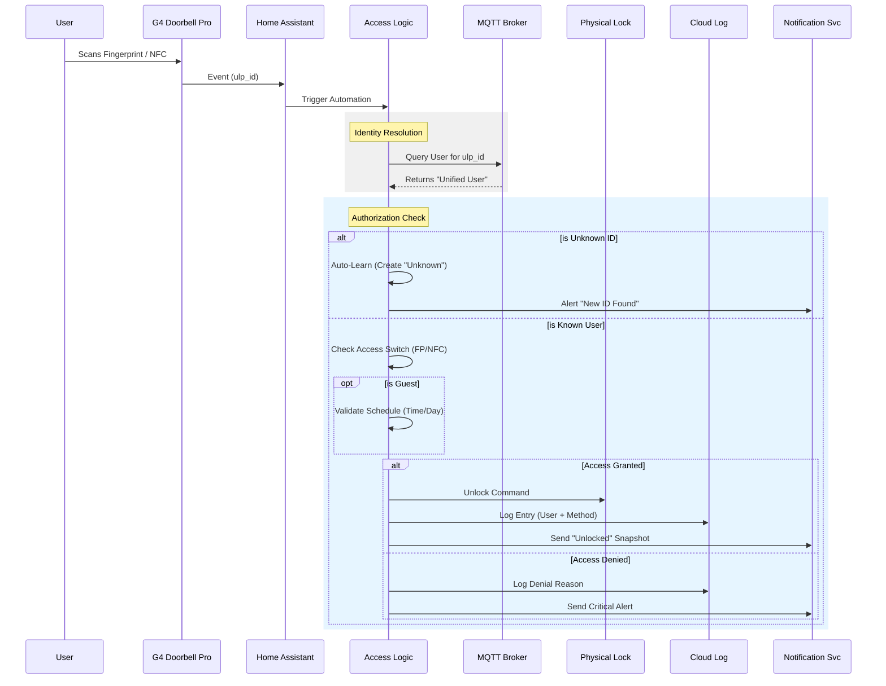

---
tags:
  - package
  - automated
version: 1.1.0
---

# Package: Unifi Access

**Version:** 1.1.0  
**Description:** Unified management for G4 Doorbell Pro Fingerprint & NFC.

<!-- START_IMAGE -->

<!-- END_IMAGE -->

## Executive Summary
<!-- START_SUMMARY -->
This package provides a comprehensive, unified access control system for the UniFi G4 Doorbell Pro, integrating both Fingerprint and NFC authentication. It abstracts physical credentials (fingerprints/tags) into a single "Unified User" identity, allowing centralized management. Key features include granular access control (enabling/disabling specific credentials per user), a unified weekly schedule for guest access, real-time logging to the cloud entity for security auditing, and automated "auto-learn" functionality for on-boarding new credentials.
<!-- END_SUMMARY -->

## Process Description (Non-Technical)
<!-- START_DETAILED -->
1.  **Credential Scan**: When a user scans a fingerprint or NFC tag, the system captures the unique ID (`ulp_id`).
2.  **Identity Resolution**: The system looks up the "Unified User" assigned to that ID.
    *   **New ID**: If unknown, it's automatically added to the system as "Unknown" for easy assignment later.
    *   **Known User**: The system checks the specific access switch for that method (e.g., "FP Access: Dad" or "NFC Access: Mom").
3.  **Authorization**:
    *   **Standard Users**: Access is granted if their specific switch is ON.
    *   **Guests**: Access is granted ONLY if their switch is ON **AND** the current time/day matches the allowed Guest Schedule.
4.  **Action**: If authorized, the door unlocks, a snapshot is taken, and the event is logged. If denied, a notification is sent.
<!-- END_DETAILED -->

## Integration Dependencies
<!-- START_DEPENDENCIES -->
*   **UniFi Protect**: Required for G4 Doorbell Pro fingerprint (`event.front_door_fingerprint`) and NFC (`event.front_door_nfc`) events.
*   **MQTT**: Used for persistent state management of User/Access switches (`unifi_access/...` topics).
*   **Yale Access**: Provides the physical lock control (`lock.front_door_lock`) and cloud logging entity (`lock.front_door_lock_cloud`).
<!-- END_DEPENDENCIES -->

## Dashboard Connections
<!-- START_DASHBOARD -->
This package powers the following dashboard views:

* **[Home Access](../dashboards/home-access/home-access-center.md)**: The primary interface for managing users, assignments, and schedules.
* **[Front Door](../dashboards/main/front-door.md)**: Displays the access log and live camera feeds.
<!-- END_DASHBOARD -->

## Architecture Diagram
<!-- START_MERMAID_DESC -->
The diagram illustrates the unified access flow. When a physical credential (fingerprint or NFC) is presented at the G4 Doorbell, an event is triggered in Home Assistant. The `unifi_access` package processes this event by resolving the unique ID (`ulp_id`) to a "Unified User". It then evaluates permissions: checking the specific method's access switch (e.g., NFC Access) and, for "Guest" users, validating the request against the unified weekly schedule. If authorized, the system commands the physical lock to open and logs the entry to the Cloud logging entity for persistent tracking. Both successful entries and denied attempts utilize the `notify.smart_master` service to alert administrators.
<!-- END_MERMAID_DESC -->

<!-- START_MERMAID -->

<!-- END_MERMAID -->

## Configuration (Source Code)
```yaml
# ------------------------------------------------------------------------------
# Package: Unifi Unified Access Control
# Version: 1.1.0
# Description: Unified management for G4 Doorbell Pro Fingerprint & NFC.
#              - Shared Identity: 'select.unifi_user_ID'
#              - Separate Access: 'switch.fp_access_USER' & 'switch.nfc_access_USER'
#              - Unified Schedule: 'input_datetime.guest_access_...'
# ------------------------------------------------------------------------------

# ------------------------------------------------------------------------------
# 1. HELPERS & SCHEDULES
# ------------------------------------------------------------------------------
input_select:
  unifi_delete_id:
    name: "Select ID to Delete"
    icon: mdi:delete-empty
    options: ["-select-"]

# --- UNIFIED GUEST SCHEDULE ---
input_datetime:
  guest_access_start:
    name: "Guest Access Start"
    has_date: false
    has_time: true
    icon: mdi:clock-start
    initial: "09:00"
  guest_access_end:
    name: "Guest Access End"
    has_date: false
    has_time: true
    icon: mdi:clock-end
    initial: "21:00"

input_boolean:
  guest_access_mon:
    name: "Mon"
    icon: mdi:calendar
  guest_access_tue:
    name: "Tue"
    icon: mdi:calendar
  guest_access_wed:
    name: "Wed"
    icon: mdi:calendar
  guest_access_thu:
    name: "Thu"
    icon: mdi:calendar
  guest_access_fri:
    name: "Fri"
    icon: mdi:calendar
  guest_access_sat:
    name: "Sat"
    icon: mdi:calendar
  guest_access_sun:
    name: "Sun"
    icon: mdi:calendar

# ------------------------------------------------------------------------------
# 2. AUTOMATIONS
# ------------------------------------------------------------------------------
automation:
  # --- LOGIC 1: FINGERPRINT ENTRY ---
  - alias: "Access: Fingerprint Entry Logic"
    id: access_fingerprint_entry_logic
    mode: single
    trigger:
      - event_type: state_changed
        event_data:
          entity_id: event.front_door_fingerprint
        trigger: event
    variables:
      raw_id: >-
        {{ trigger.event.data.new_state.attributes.ulp_id | default('unknown') }}
      slug_id: "{{ raw_id | replace('-', '_') | lower }}"
      # SHARED IDENTITY ENTITY
      assigned_user: "{{ states('select.unifi_user_' ~ slug_id) }}"
      # FP ACCESS SWITCH
      user_switch: "switch.fp_access_{{ assigned_user | slugify }}"
    action:
      - target:
          entity_id: camera.g4_doorbell_pro_poe_high_resolution_channel
        data:
          filename: /config/www/front_door_unlock_snapshot.jpg
        action: camera.snapshot

      - choose:
          # ROLE 1: GUEST
          - conditions:
              - condition: template
                value_template: "{{ 'guest' in assigned_user | lower }}"
            sequence:
              - if:
                  - condition: template
                    value_template: >
                      {# FAIL CLOSED: Switch MUST be ON #}
                      
                      {# SCHEDULE CHECK (UNIFIED) #}
                      {% set current_day = now().strftime('%a')|lower %}
                      
                      {% set current_time = now().strftime('%H:%M:%S') %}
                      
                      
                      

                      {{ access_enabled and is_day_allowed and is_time_allowed }}
                then:
                  - action: lock.unlock
                    target:
                      entity_id: lock.front_door_lock
                  - action: script.notify_smart_master
                    data:
                      category: security
                      title: 🔓 Guest Entry (Fingerprint)
                      message: "Guest entered via Fingerprint."
                      image: /local/front_door_unlock_snapshot.jpg?t={{ now().timestamp() }}
                      tag: door_lock
                else:
                  - action: script.notify_smart_master
                    data:
                      category: security
                      title: ⛔ Access Denied (Fingerprint)
                      message: >
                        
                          Guest FP access manually DISABLED.
                        
                          Guest outside allowed schedule.
                        
                      critical: true
                      image: /local/front_door_unlock_snapshot.jpg?t={{ now().timestamp() }}
                      tag: door_lock_denied

          # ROLE 2: STANDARD USER
          - conditions:
              - condition: template
                value_template: >
                  {{ assigned_user not in ['unknown', 'unavailable', 'none', 'Unknown', '-Unassigned-', '-unassigned-', 'Guest'] }}
            sequence:
              - if:
                  - condition: template
                    # FAIL CLOSED: Switch MUST be ON
                    value_template: "{{ is_state(user_switch, 'on') }}"
                then:
                  - action: lock.unlock
                    target:
                      entity_id: lock.front_door_lock
                  - action: logbook.log
                    data:
                      name: "Front Door Access"
                      message: "🔓 Guest {{ assigned_user }} entered via Fingerprint."
                      entity_id: lock.front_door_lock_cloud
                  - action: logbook.log
                    data:
                      name: "Front Door Access"
                      message: "🔓 {{ assigned_user }} unlocked via Fingerprint."
                      entity_id: lock.front_door_lock_cloud
                  - action: script.notify_smart_master
                    data:
                      category: security
                      title: 🔓 Front Door Unlocked
                      message: "Unlocked by: {{ assigned_user }}"
                      image: /local/front_door_unlock_snapshot.jpg?t={{ now().timestamp() }}
                      tag: door_lock
                else:
                  - action: logbook.log
                    data:
                      name: "Front Door Access"
                      message: "⛔ Guest Access Denied (Fingerprint): {{ assigned_user }}."
                      entity_id: lock.front_door_lock_cloud
                  - action: logbook.log
                    data:
                      name: "Front Door Access"
                      message: "⛔ Access Disabled (Fingerprint): {{ assigned_user }}."
                      entity_id: lock.front_door_lock_cloud
                  - action: script.notify_smart_master
                    data:
                      category: security
                      title: ⛔ Access Disabled
                      message: "Fingerprint valid, but {{ assigned_user }}'s access is switched OFF."
                      critical: true
                      image: /local/front_door_unlock_snapshot.jpg?t={{ now().timestamp() }}
                      tag: door_lock_denied

          # ROLE 3: AUTO-LEARN
          - conditions:
              - condition: template
                value_template: "{{ raw_id != 'unknown' and raw_id != '' }}"
            sequence:
              - action: script.add_unifi_user_entity
                data:
                  ulp_id: "{{ raw_id }}"
                  current_user: Unknown
              - action: script.notify_smart_master
                data:
                  category: system
                  title: 🖐️ New Fingerprint ID
                  message: "ID: {{ raw_id }}\nAdded to User Management as 'Unknown'."
                  image: /local/front_door_unlock_snapshot.jpg?t={{ now().timestamp() }}
                  tag: door_lock_unknown
                  clickAction: /lovelace/access-control

  # --- LOGIC 2: NFC ENTRY ---
  - alias: "Access: NFC Entry Logic"
    id: access_nfc_entry_logic
    mode: single
    trigger:
      - event_type: state_changed
        event_data:
          entity_id: event.front_door_nfc
        trigger: event
    variables:
      raw_id: >-
        {{ trigger.event.data.new_state.attributes.ulp_id | default('unknown') }}
      slug_id: "{{ raw_id | replace('-', '_') | lower }}"
      # SHARED IDENTITY ENTITY
      assigned_user: "{{ states('select.unifi_user_' ~ slug_id) }}"
      # NFC ACCESS SWITCH
      user_switch: "switch.nfc_access_{{ assigned_user | slugify }}"
    action:
      - target:
          entity_id: camera.g4_doorbell_pro_poe_high_resolution_channel
        data:
          filename: /config/www/front_door_nfc_snapshot.jpg
        action: camera.snapshot

      - choose:
          # ROLE 1: GUEST
          - conditions:
              - condition: template
                value_template: "{{ 'guest' in assigned_user | lower }}"
            sequence:
              - if:
                  - condition: template
                    value_template: >
                      {# FAIL CLOSED: Switch MUST be ON #}
                      
                      {# SCHEDULE CHECK (UNIFIED) #}
                      {% set current_day = now().strftime('%a')|lower %}
                      
                      {% set current_time = now().strftime('%H:%M:%S') %}
                      
                      
                      

                      {{ access_enabled and is_day_allowed and is_time_allowed }}
                then:
                  - action: lock.unlock
                    target:
                      entity_id: lock.front_door_lock
                  - action: logbook.log
                    data:
                      name: "Front Door Access"
                      message: "🔓 Guest {{ assigned_user }} entered via NFC."
                      entity_id: lock.front_door_lock_cloud
                  - action: script.notify_smart_master
                    data:
                      category: security
                      title: 🔓 Guest Entry (NFC)
                      message: "Guest entered via NFC."
                      image: /local/front_door_nfc_snapshot.jpg?t={{ now().timestamp() }}
                      tag: door_lock
                else:
                  - action: logbook.log
                    data:
                      name: "Front Door Access"
                      message: "⛔ Guest Access Denied (NFC): {{ assigned_user }}."
                      entity_id: lock.front_door_lock_cloud
                  - action: script.notify_smart_master
                    data:
                      category: security
                      title: ⛔ Access Denied (NFC)
                      message: >
                        
                          Guest NFC access manually DISABLED.
                        
                          Guest outside allowed schedule.
                        
                      critical: true
                      image: /local/front_door_nfc_snapshot.jpg?t={{ now().timestamp() }}
                      tag: door_lock_denied

          # ROLE 2: STANDARD USER
          - conditions:
              - condition: template
                value_template: >
                  {{ assigned_user not in ['unknown', 'unavailable', 'none', 'Unknown', '-Unassigned-', '-unassigned-', 'Guest'] }}
            sequence:
              - if:
                  - condition: template
                    # FAIL CLOSED
                    value_template: "{{ is_state(user_switch, 'on') }}"
                then:
                  - action: lock.unlock
                    target:
                      entity_id: lock.front_door_lock
                  - action: logbook.log
                    data:
                      name: "Front Door Access"
                      message: "🔓 {{ assigned_user }} unlocked via NFC."
                      entity_id: lock.front_door_lock_cloud
                  - action: script.notify_smart_master
                    data:
                      category: security
                      title: 🔓 Front Door Unlocked (NFC)
                      message: "Unlocked by: {{ assigned_user }}"
                      image: /local/front_door_nfc_snapshot.jpg?t={{ now().timestamp() }}
                      tag: door_lock
                else:
                  - action: logbook.log
                    data:
                      name: "Front Door Access"
                      message: "⛔ Access Disabled (NFC): {{ assigned_user }}."
                      entity_id: lock.front_door_lock_cloud
                  - action: script.notify_smart_master
                    data:
                      category: security
                      title: ⛔ Access Disabled
                      message: "NFC valid, but {{ assigned_user }}'s NFC access is switched OFF."
                      critical: true
                      image: /local/front_door_nfc_snapshot.jpg?t={{ now().timestamp() }}
                      tag: door_lock_denied

          # ROLE 3: AUTO-LEARN
          - conditions:
              - condition: template
                value_template: "{{ raw_id != 'unknown' and raw_id != '' }}"
            sequence:
              - action: script.add_unifi_user_entity
                data:
                  ulp_id: "{{ raw_id }}"
                  current_user: Unknown
              - action: script.notify_smart_master
                data:
                  category: system
                  title: 🏷️ New NFC ID
                  message: "ID: {{ raw_id }}\nAdded to User Management as 'Unknown'."
                  image: /local/front_door_nfc_snapshot.jpg?t={{ now().timestamp() }}
                  tag: door_lock_unknown
                  clickAction: /lovelace/access-control

  # --- SYSTEM PERSISTENCE (Universal) ---
  - alias: "System: Unifi Access MQTT Persistence"
    id: system_unifi_access_mqtt_persistence
    mode: parallel
    trigger:
      - platform: mqtt
        topic: "unifi_access/+/user/set"
      - platform: mqtt
        topic: "unifi_access/access/+/set"
      - platform: mqtt
        topic: "fingerprint/access/+/set" # Legacy/Compatibility
      - platform: mqtt
        topic: "nfc/access/+/set" # Legacy/Compatibility
    action:
      - service: mqtt.publish
        data:
          topic: "{{ trigger.topic | replace('/set', '/state') }}"
          payload: "{{ trigger.payload }}"
          retain: true

  # --- AUTO-CREATE SWITCHES ON ASSIGNMENT CHANGE ---
  - alias: "System: Unifi User Assignment Update"
    id: system_unifi_user_assignment_update
    mode: parallel
    trigger:
      - platform: mqtt
        topic: "unifi_access/+/user/set"
    action:
      - variables:
          slug: "{{ trigger.topic.split('/')[1] }}"
          entity_id: "select.unifi_user_{{ slug }}"
      - delay: "00:00:00:200"
      - service: script.add_unifi_user_entity
        data:
          ulp_id: "{{ state_attr(entity_id, 'ulp_id') | default(slug) }}"
          current_user: "{{ trigger.payload }}"
      - delay: "00:00:00:200"
      - service: script.cleanup_unused_unifi_switches

# ------------------------------------------------------------------------------
# 3. SCRIPTS
# ------------------------------------------------------------------------------
script:
  # --- ADD / UPDATE USER & CREATE BOTH SWITCHES ---
  add_unifi_user_entity:
    alias: "System: Add Unifi User"
    mode: parallel
    fields:
      ulp_id:
        description: "The Unifi ID (Member ID)"
        required: true
      current_user:
        description: "Current assigned user"
        default: "-unassigned-"
    sequence:
      - variables:
          slug: "{{ ulp_id | replace('-', '_') | lower }}"
          user_list: >-
            
            
              
            
            {{ ns.users | unique | sort | list }}

          # Clean Name
          clean_current_user: >-
            
            
            
               {{ parts[0] }}
            
               {{ step1 }}
            

      # --- 1. PUBLISH SHARED IDENTITY SELECT ---
      - service: mqtt.publish
        data:
          retain: true
          topic: "homeassistant/select/unifi_user_{{ slug }}/config"
          payload: >-
            {
              "name": "Unifi User {{ ulp_id[:4] }}...",
              "object_id": "unifi_user_{{ slug }}",
              "unique_id": "unifi_user_{{ slug }}",
              "icon": "mdi:account-key",
              "options": {{ user_list | to_json }},
              "command_topic": "unifi_access/{{ slug }}/user/set",
              "state_topic": "unifi_access/{{ slug }}/user/state",
              "availability_topic": "unifi_access/{{ slug }}/availability",
              "payload_available": "online",
              "json_attributes_topic": "unifi_access/{{ slug }}/attributes",
              "device": {
                "identifiers": ["unifi_access_manager"],
                "name": "Unifi Access DB",
                "manufacturer": "Home Assistant",
                "model": "Unified ID DB"
              }
            }
      - service: mqtt.publish
        data:
          retain: true
          topic: "unifi_access/{{ slug }}/attributes"
          payload: >-
            { "ulp_id": "{{ ulp_id }}" }

      # --- 2. UPDATE STATE ---
      - if:
          - condition: template
            value_template: >-
              {{ states('select.unifi_user_' ~ slug) != clean_current_user }}
        then:
          - service: mqtt.publish
            data:
              retain: true
              topic: "unifi_access/{{ slug }}/user/state"
              payload: "{{ clean_current_user }}"

      # --- 3. CREATE SWITCHES (FP & NFC) ---
      - variables:
          user_slug: "{{ clean_current_user | slugify }}"

      - if:
          - condition: template
            value_template: "{{ clean_current_user not in ['-Unassigned-', 'Unknown', 'unknown'] }}"
        then:
          # --- SWITCH 1: FINGERPRINT ACCESS ---
          - service: mqtt.publish
            data:
              retain: true
              topic: "homeassistant/switch/fp_access_{{ user_slug }}/config"
              payload: >-
                {
                  "name": "FP Access: {{ clean_current_user }}",
                  "object_id": "fp_access_{{ user_slug }}",
                  "unique_id": "fp_access_switch_{{ user_slug }}",
                  "icon": "mdi:fingerprint",
                  "command_topic": "fingerprint/access/{{ user_slug }}/set",
                  "state_topic": "fingerprint/access/{{ user_slug }}/state",
                  "device": { "identifiers": ["unifi_access_manager"] }
                }
          # Init FP ON
          - if:
              - condition: template
                value_template: "{{ states('switch.fp_access_' ~ user_slug) in ['unknown', 'unavailable', 'none'] }}"
            then:
              - service: mqtt.publish
                data:
                  retain: true
                  topic: "fingerprint/access/{{ user_slug }}/state"
                  payload: "ON"

          # --- SWITCH 2: NFC ACCESS ---
          - service: mqtt.publish
            data:
              retain: true
              topic: "homeassistant/switch/nfc_access_{{ user_slug }}/config"
              payload: >-
                {
                  "name": "NFC Access: {{ clean_current_user }}",
                  "object_id": "nfc_access_{{ user_slug }}",
                  "unique_id": "nfc_access_switch_{{ user_slug }}",
                  "icon": "mdi:tag-check",
                  "command_topic": "nfc/access/{{ user_slug }}/set",
                  "state_topic": "nfc/access/{{ user_slug }}/state",
                  "device": { "identifiers": ["unifi_access_manager"] }
                }
          # Init NFC ON
          - if:
              - condition: template
                value_template: "{{ states('switch.nfc_access_' ~ user_slug) in ['unknown', 'unavailable', 'none'] }}"
            then:
              - service: mqtt.publish
                data:
                  retain: true
                  topic: "nfc/access/{{ user_slug }}/state"
                  payload: "ON"

      # --- 4. SET ONLINE ---
      - service: mqtt.publish
        data:
          retain: true
          topic: "unifi_access/{{ slug }}/availability"
          payload: "online"

  # --- REFRESH ALL USERS ---
  refresh_unifi_users:
    alias: "System: Refresh Unifi Users"
    mode: single
    sequence:
      - repeat:
          for_each: >-
            {{ states.select | selectattr('entity_id', 'search', '^select\\.unifi_user_') | list }}
          sequence:
            - service: script.add_unifi_user_entity
              data:
                ulp_id: "{{ state_attr(repeat.item.entity_id, 'ulp_id') }}"
                current_user: "{{ repeat.item.state }}"
      - service: script.cleanup_unused_unifi_switches

  # --- CLEANUP ORPHANED SWITCHES (FP & NFC) ---
  cleanup_unused_unifi_switches:
    alias: "System: Cleanup Unused Unifi Switches"
    mode: single
    sequence:
      - variables:
          active_user_slugs: >-
            
            
               
                 
               
            
            {{ ns.slugs | unique | list }}

          # Find all existing switches
          fp_switches: "{{ states.switch | selectattr('entity_id', 'search', '^switch\\.fp_access_') | map(attribute='entity_id') | list }}"
          nfc_switches: "{{ states.switch | selectattr('entity_id', 'search', '^switch\\.nfc_access_') | map(attribute='entity_id') | list }}"

      # Cleanup FP Switches
      - repeat:
          for_each: "{{ fp_switches }}"
          sequence:
            - variables:
                switch_slug: "{{ repeat.item.replace('switch.fp_access_', '') }}"
            - if:
                - condition: template
                  value_template: "{{ switch_slug not in active_user_slugs }}"
              then:
                - service: mqtt.publish
                  data:
                    topic: "homeassistant/switch/fp_access_{{ switch_slug }}/config"
                    payload: ""
                    retain: true
                - service: mqtt.publish
                  data:
                    topic: "fingerprint/access/{{ switch_slug }}/state"
                    payload: ""
                    retain: true

      # Cleanup NFC Switches
      - repeat:
          for_each: "{{ nfc_switches }}"
          sequence:
            - variables:
                switch_slug: "{{ repeat.item.replace('switch.nfc_access_', '') }}"
            - if:
                - condition: template
                  value_template: "{{ switch_slug not in active_user_slugs }}"
              then:
                - service: mqtt.publish
                  data:
                    topic: "homeassistant/switch/nfc_access_{{ switch_slug }}/config"
                    payload: ""
                    retain: true
                - service: mqtt.publish
                  data:
                    topic: "nfc/access/{{ switch_slug }}/state"
                    payload: ""
                    retain: true

```
