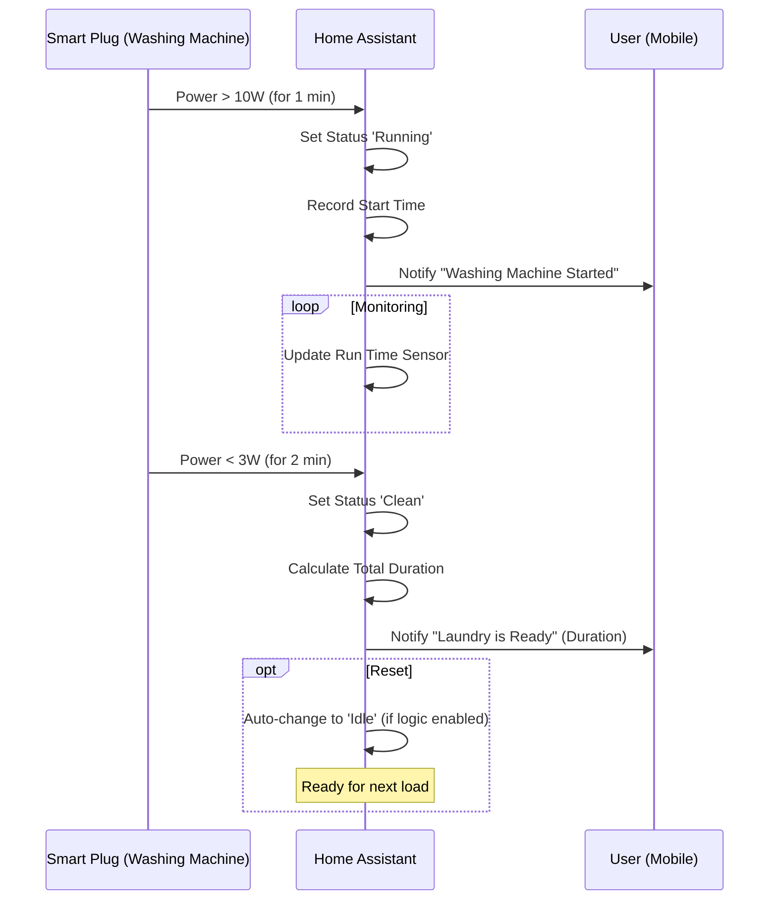

---
tags:
  - package
  - automated
version: 1.0.0
---

# Package: Washing Machine

**Version:** 1.0.0  
**Description:** Logic for Washing Machine state tracking, run time calculation, and notifications.

<!-- START_IMAGE -->

<!-- END_IMAGE -->

## Executive Summary
<!-- START_SUMMARY -->
The Washing Machine package provides intelligent state tracking for any washing machine connected to a smart plug with power monitoring. It uses power consumption data to automatically detect when a cycle starts and finishes. The system tracks the exact run time of each load and sends actionable notifications to users, ensuring laundry is never left forgotten in the machine. It abstracts complex power fluctuations into simple statuses like "Idle", "Running", and "Clean".
<!-- END_SUMMARY -->

## Process Description (Non-Technical)
<!-- START_DETAILED -->
### How It Works
1.  **Auto-Detection**: The system monitors the electricity usage of the washing machine smart plug.
2.  **Cycle Start**: When power usage exceeds **10W** for more than 1 minute, the system marks the machine as "Running" and records the start time.
3.  **Notifications**:
    *   **Started**: A notification confirms the cycle has begun.
    *   **Finished**: When power drops below **3W** for 2 minutes, the system marks the laundry as "Clean" and sends a notification including the total cycle duration (e.g., "1 hr 45 min").
4.  **Continuous Status**: The system maintains a live "Run Time" sensor, so you can always see how long the current load has been washing.
<!-- END_DETAILED -->

## Dashboard Connections
<!-- START_DASHBOARD -->
This package powers the following dashboard views:

* **[System](../dashboards/admin-system/system.md)**: *This view provides deep insights into the Proxmox 'Halo' virtualization node. It features real-time resource monitoring (CPU, RAM) using `mini-graph-card`, and critical power controls (Reboot, Shutdown) protected by confirmation dialogs. It also offers bulk management for guest VMs/containers and tracks system update status, ensuring the infrastructure host is healthy and up-to-date.* (Uses 1 entities)
* **[Home](../dashboards/main/home.md)**: *The Home dashboard serves as the central information hub. It features a large clock and family calendars, alongside detailed weather forecasts. Key home stats are highlighted, including real-time energy prices, power usage, and the status of major appliances like the dishwasher and washing machine. The view also provides a high-level overview of the entire house, displaying camera feeds and status summaries for all key rooms (Sauna, Bathroom, Bedroom, etc.) using 'Streamline' area cards.* (Uses 1 entities)
<!-- END_DASHBOARD -->

## Architecture Diagram
<!-- START_MERMAID_DESC -->
The architecture relies on a state machine driven by numeric state triggers from the power sensor. High power draw triggers the `Running` state and initializes the start timer. Low power draw triggers the `Clean` state and calculates the final duration. A generic reset mechanism or a subsequent high power event transitions the system back to `Idle` or directly to `Running` for the next load.
<!-- END_MERMAID_DESC -->

<!-- START_MERMAID -->

<!-- END_MERMAID -->

## Configuration (Source Code)
```yaml
# ------------------------------------------------------------------------------
# Package: Washing Machine
# Version: 1.0.0
# Description: Logic for Washing Machine state tracking, run time calculation, and notifications.
# Dependencies:
#   - Sensor: sensor.washing_machine_plug_power
#   - Script: script.notify_smart_master
# ------------------------------------------------------------------------------

# ------------------------------------------------------------------------------
# 1. HELPERS
# ------------------------------------------------------------------------------
input_select:
  washing_machine_status:
    name: "Washing Machine Status"
    icon: mdi:washing-machine
    options:
      - Idle
      - Running
      - Clean
    initial: Idle

input_datetime:
  washing_machine_start_time:
    name: "Washing Machine Start Time"
    has_date: true
    has_time: true

# ------------------------------------------------------------------------------
# 2. SENSORS
# ------------------------------------------------------------------------------
template:
  - sensor:
      - name: "Washing Machine Run Time"
        unique_id: washing_machine_run_time
        icon: mdi:timer-outline
        state: >
          
             
             
               {{ (now() - start).total_seconds() | timestamp_custom('%-H:%M', false) }}
             
               0:00
             
          
             0:00
          

# ------------------------------------------------------------------------------
# 3. AUTOMATIONS
# ------------------------------------------------------------------------------
automation:
  # --- START DETECTED ---
  - alias: "Notify: Washing Machine Started"
    id: notify_washing_machine_started
    trigger:
      - platform: numeric_state
        entity_id: sensor.washing_machine_plug_power
        above: 10
        for: "00:01:00"
    condition:
      - condition: state
        entity_id: input_select.washing_machine_status
        state:
          - "Idle"
          - "Clean"
    action:
      - service: input_select.select_option
        target:
          entity_id: input_select.washing_machine_status
        data:
          option: "Running"
      - service: input_datetime.set_datetime
        target:
          entity_id: input_datetime.washing_machine_start_time
        data:
          timestamp: "{{ now().timestamp() }}"
      - service: script.notify_smart_master
        data:
          category: info
          title: 🧺 Washing Machine Started
          message: "The cycle has started."
          tag: washing_machine
          clickAction: /lovelace/utility
    mode: single

  # --- FINISH DETECTED ---
  - alias: "Notify: Washing Machine Finished"
    id: notify_washing_machine_finished
    trigger:
      - platform: numeric_state
        entity_id: sensor.washing_machine_plug_power
        below: 5
        for: "00:02:00"
    condition:
      - condition: state
        entity_id: input_select.washing_machine_status
        state: "Running"
    action:
      - service: input_select.select_option
        target:
          entity_id: input_select.washing_machine_status
        data:
          option: "Clean"

      # Calculate Final Duration
      - variables:
          start_time: "{{ states('input_datetime.washing_machine_start_time') | as_datetime }}"
          duration_str: >-
            
               {{ (now() - start_time).total_seconds() | timestamp_custom('%-H hr %-M min', false) }}
            
               unknown time
            

      - service: script.notify_smart_master
        data:
          category: info
          title: ✨ Laundry is Ready
          message: "Cycle finished. Duration: {{ duration_str }}."
          tag: washing_machine
          clickAction: /lovelace/utility
    mode: single

  # --- RESET TO IDLE ---
  # Optional: Reset to Idle manually or when power drops after door opening/unloading logic (if sensor avail).
  # For now, we auto-reset to Idle if power stays low for a long time OR if it restarts.
  # Simplest approach: "Clean" transitions back to "Running" if power spikes (handled above if we remove condition),
  # OR we add a manual reset / auto-reset after X hours.
  # Let's add a simple "Reset to Idle" if it stays "Clean" for 15 mins (assuming unloaded?)
  # OR just let the next Start trigger reset it?
  # BETTER: The "Start" automation requires state to be "Idle".
  # So we need a transition Clean -> Idle.
  # Transition: If Clean AND Power < 1W for 15 mins?
  # Or just allow Start to trigger from "Clean" too?
  # Let's Modify Start automation to NOT block on "Idle".

  - alias: "System: Washing Machine Reset"
    id: system_washing_machine_reset
    trigger:
      # If we want to automatically mark it as 'Idle' after some time
      - platform: state
        entity_id: input_select.washing_machine_status
        to: "Clean"
        for: "01:00:00" # Auto-reset after 1 hour if not unloaded
    action:
      - service: input_select.select_option
        target:
          entity_id: input_select.washing_machine_status
        data:
          option: "Idle"
    mode: single
  # ------------------------------------------------------------------------------
  # 4. OVERRIDES
  # ------------------------------------------------------------------------------
  # Allow "Start" to trigger even if status is "Clean" (forgot to unload)
  # See modification in Automation 1 Check: currently checks for "Idle".
  # Let's change Automation 1 condition to be status != Running.

  - alias: "System: Washing Machine Recovery"
    id: system_washing_machine_recovery
    trigger:
      - platform: homeassistant
        event: start
      - platform: event
        event_type: automation_reloaded
    action:
      # If Power > 10W and Status is Idle/Clean -> Set Running
      - if:
          - condition: numeric_state
            entity_id: sensor.washing_machine_plug_power
            above: 10
          - condition: not
            conditions:
              - condition: state
                entity_id: input_select.washing_machine_status
                state: "Running"
        then:
          - service: input_select.select_option
            target:
              entity_id: input_select.washing_machine_status
            data:
              option: "Running"
          - service: input_datetime.set_datetime
            target:
              entity_id: input_datetime.washing_machine_start_time
            data:
              timestamp: "{{ now().timestamp() }}"
          - service: script.notify_smart_master
            data:
              category: info
              title: ♻️ System Recovery
              message: "Washing machine resumed from power state."
              tag: washing_machine

      # If Power < 5W and Status is Running -> Set Clean
      - if:
          - condition: numeric_state
            entity_id: sensor.washing_machine_plug_power
            below: 5
          - condition: state
            entity_id: input_select.washing_machine_status
            state: "Running"
        then:
          - service: input_select.select_option
            target:
              entity_id: input_select.washing_machine_status
            data:
              option: "Clean"

```
