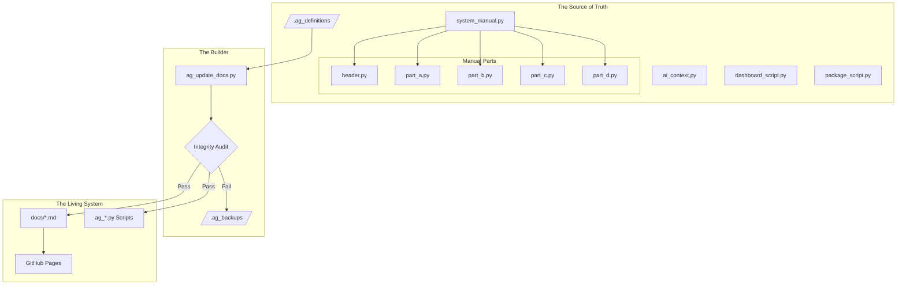

---
tags:
  - meta
  - architecture
  - manual
---

# Documentation System Architecture

**Philosophy:** "Everything as Code"
**Status:** Self-Validating & Modular
**Version:** 2.1 (Clarified Manual Steps)

## 1. The Core Concept
Unlike traditional wikis where documentation is written manually and eventually goes stale, **EvisHomeLab** uses an **Agentic CMDB** approach.

The documentation is not just text; it is the output of an **Orchestration Engine**. We treat documentation updates exactly like software deployments: **Source -> Build -> Deploy**.

### The "Russian Doll" Architecture
To prevent data loss and ensure consistency, we separate **Logic** from **Content**.

## 2. The Toolchain

### A. The Orchestrator (`ag_update_docs.py`)
This is the master script located in the root.
* **Function:** It reads the blueprints from `.ag_definitions/`, validates content integrity (checking for missing sections), creates a timestamped backup in `.ag_backups/`, and then overwrites the live files.
* **Modular Import:** It dynamically adds the hidden definition folder to the system path to load the content modules.

### B. The Privacy Engine (`ag_regenerate_dashboards.py`)
A specialized tool for the Lovelace Dashboards.
* **Source:** `.storage/lovelace` (Main) and `.storage/lovelace_dashboards` (Extra).
* **Output:** Creates a folder structure `docs/smart-home/dashboards/[slug]/[view].md`.
* **Intelligence:** * **State-Aware:** Preserves manually written summaries between runs.
    * **Auto-Link:** Scans package entities and links them to the dashboard view.
    * **Privacy:** Redacts personal names (e.g., Jukka -> Evis) using Regex.
    * **Screenshots:** It generates the *Markdown Link* (e.g. ``) automatically, but **the actual screenshot must be taken manually** and placed in the assets folder.

### C. The Package Manager (`ag_update_package.py`)
A hybrid tool for documenting YAML packages.
* **Phase 1 (The Stamper):** Reads the YAML file, extracts `# Version:` and `# Description:` headers, and creates the Markdown file structure with specific **Intelligence Slots**.
* **Phase 2 (The Agent):** The AI Architect fills these slots (`<!-- PACKAGE_SUMMARY_SLOT -->`) with deep analysis and diagrams.
* **Auto-Link:** It scans dashboard documentation to find where the package's entities are used and creates back-links.

## 3. The Workflow (How we work)

We do not edit `setup_guide.md` or the tool scripts directly. We edit the **Definition**.

| Goal | Action |
| :--- | :--- |
| **Update Manual** | Edit `.ag_definitions/manual_parts/*.py` $\rightarrow$ Run `python ag_update_docs.py` |
| **Update Privacy Rules** | Edit `.ag_definitions/ai_context.py` $\rightarrow$ Run `python ag_update_docs.py` |
| **Update Dashboard Docs** | **1. Capture Screenshots** (Manual) **2. Run:** `python ag_regenerate_dashboards.py` |
| **New Package** | Run `python ag_update_package.py [name]` $\rightarrow$ Ask Agent to analyze. |

## 4. Safety Features

1.  **Hidden Definitions:** The actual content lives in `.ag_definitions/` (hidden), keeping the root directory clean.
2.  **Backups:** Every time the Orchestrator runs, it saves the old version to `.ag_backups/filename.timestamp.bak`. It keeps a rolling history of the last 5 versions.
3.  **Self-Validation:** The Orchestrator scans its own input for a `VALIDATION_CHECKLIST`. If the input is missing critical sections (like "Troubleshooting"), it refuses to build.
